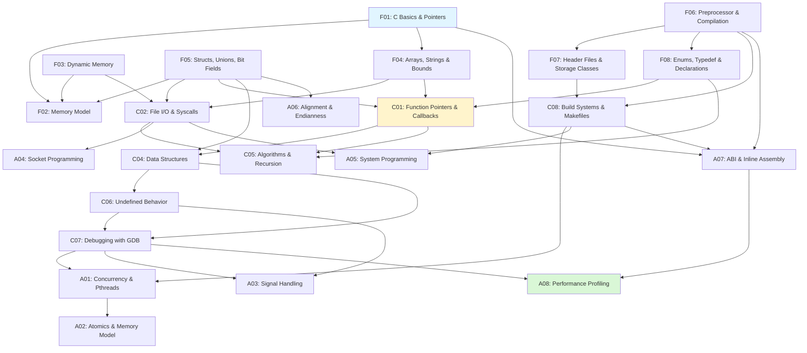

# C

> [!summary] Scope
> Complete C programming reference from basics through OS-level development: pointers, memory model, data structures, algorithms, concurrency, system programming, and build systems.

## Learning Path

## Foundations

| File | Topics | OS-relevance |
|------|--------|:------------:|
| **F01** [[C/01_Foundations/01_C_Basics_and_Pointers]] | Type system, operators, control flow, pointers deep dive (arithmetic, pointers-to-pointers, void*, function pointers), const correctness | Memory access |
| **F02** [[C/01_Foundations/02_Memory_Model_and_Allocation]] | Process segments, stack frames, heap, virtual memory, ASLR, page tables | **Kernel layout** |
| **F03** [[C/01_Foundations/03_Dynamic_Memory]] | malloc/calloc/realloc/free internals, custom arena allocator, pool allocator, alignment, debugging | **Custom allocators** |
| **F04** [[C/01_Foundations/04_Arrays_Strings_and_Bounds]] | Array decay, <string.h> full API, safe strings, memcpy/memmove/memset, buffer overflows | Bounds checking |
| **F05** [[C/01_Foundations/05_Structs_Unions_and_Bit_Fields]] | Padding, alignment, struct reordering, unions, type punning, bit fields, packed attributes | **Device registers, packed headers** |
| **F06** [[C/01_Foundations/06_Preprocessor_and_Compilation]] | 4-stage pipeline, macros, #/##, conditional compilation, X-macros, compiler flags, freestanding | **-ffreestanding, boot code** |
| **F07** [[C/01_Foundations/07_Header_Files_Modules_and_Storage_Classes]] | Translation units, static, extern, volatile, linkage, thread-local storage | **Kernel module structure** |
| **F08** [[C/01_Foundations/08_Enums_Typedef_and_Complex_Declarations]] | Enum types, typedef, function pointer types, right-left rule for declarations | ABI types |
| **F09** [[C/01_Foundations/09_Variadic_Functions_and_stdarg]] | `va_list`, `va_start`, `va_arg`, `va_end`, `va_copy`, `vprintf` family, how va_arg works at ABI level, forwarding, type safety | Custom logging, printf-like APIs |
| **F10** [[C/01_Foundations/10_Standard_Library_Utilities]] | `stddef.h` (`offsetof`), `stdint.h`/`inttypes.h` (exact-width types, PRI/SCN macros), `stdbool.h`, `stdalign.h`, `stdnoreturn.h`, `limits.h`, `float.h`, `stdckdint.h` (C23) | Portable data types |
| **F11** [[C/01_Foundations/11_Generic_and_Type_Generic_Programming]] | `_Generic` selection (C11), type dispatch patterns, `typeof` (C23/GNU), `__auto_type`, `<tgmath.h>` internals, `_Generic` vs C++ templates | Type-safe macros |
| **F12** [[C/01_Foundations/12_Character_Handling_Wide_Strings_and_Locale]] | `ctype.h` (classification tables, `unsigned char` cast requirement), `wchar.h`/`wctype.h`, `uchar.h` (C11 Unicode), `locale.h` (`setlocale`, `localeconv`, `strcoll`) | Locale-aware text processing |
| **F13** [[C/01_Foundations/13_Math_Complex_Time_and_FP_Control]] | `math.h` (trig/exp/log/round/erf/gamma), floating-point pitfalls (cancellation, Kahan sum, comparison), `fenv.h` (rounding modes, FP exceptions), `complex.h`, `time.h` (`clock_gettime`, `timespec`, `strftime`, `nanosleep`, POSIX timers) | Scientific computing, timing |

## Core

| File | Topics | OS-relevance |
|------|--------|:------------:|
| **C01** [[C/02_Core/01_Function_Pointers_Callbacks_and_vtables]] | Function pointers, qsort callbacks, vtable OOP in C, struct embedding inheritance, kernel file_operations | **Device driver vtables** |
| **C02** [[C/02_Core/02_File_IO_and_POSIX_System_Calls]] | File descriptors, stdio vs POSIX, buffering modes, mmap, directories, stat | **System call table** |
| **C03** [[C/02_Core/03_Error_Handling]] | Return codes, errno, goto cleanup pattern, assertions, setjmp/longjmp | Kernel error patterns |
| **C04** [[C/02_Core/04_Data_Structures_in_C]] | Linked lists (singly, doubly, kernel list_head), hash tables, BST, stacks/queues, generic containers | **Kernel list_head, RB-tree** |
| **C05** [[C/02_Core/05_Algorithms_and_Recursion]] | Recursion, tail recursion, binary search, sorting (merge, quick, insertion), complexity | Kernel sorting |
| **C06** [[C/02_Core/06_Undefined_Behavior_and_Memory_Safety]] | UB sources, strict aliasing, integer overflow, sequence points, defensive patterns, sanitizers | **Kernel -fno-strict-aliasing** |
| **C07** [[C/02_Core/07_Debugging_with_GDB]] | Breakpoints, memory inspection, stack navigation, core dumps, multi-process debugging, reverse-debug | **kgdb, qemu+gdb** |
| **C08** [[C/02_Core/08_Build_Systems_and_Makefiles]] | Makefiles, static/shared libraries, CMake, linker scripts, cross-compilation | **Kernel kbuild, linker scripts** |

## Advanced

| File | Topics | OS-relevance |
|------|--------|:------------:|
| **A01** [[C/03_Advanced/01_Concurrency_with_Pthreads]] | Thread create/join, mutex types, condition variables (spurious wakeup), RW locks, deadlock prevention, thread pool | **Wait queues, completion vars** |
| **A02** [[C/03_Advanced/02_C11_Atomics_and_Memory_Model]] | Atomic types/ops, memory ordering (relaxed → seq_cst), lock-free stack/ring buffer, CAS, fences, ABA problem | **Spinlocks, RCU** |
| **A03** [[C/03_Advanced/03_Signal_Handling]] | signal vs sigaction, signal masks, async-signal-safe functions, self-pipe trick, real-time signals | **Signal delivery in kernel** |
| **A04** [[C/03_Advanced/04_Socket_Programming]] | TCP/UDP client-server, non-blocking I/O, select/poll/epoll, event loop, SIGPIPE | **Kernel network stack** |
| **A05** [[C/03_Advanced/05_System_Programming]] | fork, exec, wait, zombie/orphan processes, pipes, pipeline (ls | wc), daemonization | **fork/exec in kernel** |
| **A06** [[C/03_Advanced/06_Memory_Alignment_and_Endianness]] | Alignment requirements, struct padding, control alignment (alignas, packed), endianness detection/swap, unaligned access | **Device register layout** |
| **A07** [[C/03_Advanced/07_Inline_Assembly_ABI_and_Calling_Conventions]] | Inline asm format/constraints, syscall via asm, System V ABI (registers, stack frame), red zone, linker scripts, ELF format | **syscall entry, context switch, IRQ handlers** |
| **A08** [[C/03_Advanced/08_Performance_Profiling_and_Optimization]] | perf profiling, cache-friendly code (SoA vs AoS), false sharing, GCC builtins (prefetch, popcount, overflow), PGO | **perf in kernel** |
| **A09** [[C/03_Advanced/09_GNU_C_Extensions_and_Compiler_Attributes]] | `__attribute__` comprehensive (packed, aligned, constructor, destructor, weak, alias, section, visibility, format, cleanup, cold/hot, target_clones), `typeof`, `alloca`, VLAs, `__builtin` functions, `#pragma` | Kernel `__attribute__`, section placement |
| **A10** [[C/03_Advanced/10_C11_Threads_and_Threads_H]] | C11 `<threads.h>`: `thrd_t`, `mtx_t` (plain/recursive/timed), `cnd_t`, `tss_t`, `call_once`, comparison table vs pthreads, availability `__STDC_NO_THREADS__` | Portable threading without POSIX |
| **A11** [[C/03_Advanced/11_C_Standard_Evolution]] | C89→C99→C11→C17→C23: per-standard feature tables, C23 keywords (`bool`, `typeof`, `nullptr`, `auto`, `_BitInt`), `#embed`, attributes `[[nodiscard]]`, deprecated/removed features, compiler flags `-std=` | Modern C adoption |

## Playbooks

| File | Topics |
|------|--------|
| **P01** [[C/04_Playbooks/01_Debug_Segfaults_and_Invalid_Memory_Access]] | Page fault → SIGSEGV flow, GDB crash analysis, core dump debugging, root cause patterns (NULL deref, overflow, UAF, stack overflow) |
| **P02** [[C/04_Playbooks/02_Use_Sanitizers_ASan_UBSan_TSan]] | ASan (buffer overflow, UAF), UBSan (signed overflow, shift), TSan (data races), MSan, CI integration |
| **P03** [[C/04_Playbooks/03_Valgrind_Leaks_and_Heap_Corruption]] | Memcheck (invalid access, leaks), Cachegrind (cache misses), Massif (heap timeline), Helgrind (races), suppression files |
| **P04** [[C/04_Playbooks/04_Static_Analysis_and_Production_Readiness]] | cppcheck, clang-tidy, GCC -fanalyzer, coding standards, production checklist, CI pipeline |

## Projects

| File | Topics |
|------|--------|
| **Pr01** [[C/05_Projects/01_Build_a_Memory_Arena_Allocator]] | Bump allocator, stack allocator with markers, pool allocator with free list, scoped allocation patterns |
| **Pr02** [[C/05_Projects/02_HTTP_Server_Minimal]] | epoll event loop, TCP server, HTTP request parsing, file serving, response formatting |
| **Pr03** [[C/05_Projects/03_Tiny_Shell_Parser_and_Executor]] | Tokenization, pipeline parsing, fork/exec, pipe management, I/O redirection, builtins |

## Build Systems

| File | Topics |
|------|--------|
| **B01** [[C/06_Build_Systems/01_CMake_Deep_Dive]] | CMake syntax, targets/properties, find_package, toolchains, CTest, CPack, generator expressions, FetchContent, cross-compilation |
| **B02** [[C/06_Build_Systems/02_Make_Deep_Dive]] | GNU Make rules, pattern rules, automatic variables, functions, VPATH, multi-directory builds, auto-dependency generation |

## Cross-Links

- [[C/06_Build_Systems/01_CMake_Deep_Dive]] for complete CMake reference
- [[C/06_Build_Systems/02_Make_Deep_Dive]] for GNU Make deep dive
- [[C/02_Core/04_Data_Structures_in_C]] for kernel list_head, hash tables, trees
- [[C/02_Core/06_Undefined_Behavior_and_Memory_Safety]] for UB and sanitizers
- [[C/02_Core/07_Debugging_with_GDB]] for core dump analysis
- [[C/02_Core/08_Build_Systems_and_Makefiles]] for basic Makefiles and linker scripts
- [[C/03_Advanced/01_Concurrency_with_Pthreads]] for multithreading
- [[C/03_Advanced/02_C11_Atomics_and_Memory_Model]] for atomic operations
- [[C/03_Advanced/07_Inline_Assembly_ABI_and_Calling_Conventions]] for low-level control
- [[C/01_Foundations/09_Variadic_Functions_and_stdarg]] for variadic functions and vprintf family
- [[C/01_Foundations/10_Standard_Library_Utilities]] for stdint.h, inttypes.h, type limits
- [[C/01_Foundations/11_Generic_and_Type_Generic_Programming]] for _Generic type dispatch
- [[C/01_Foundations/12_Character_Handling_Wide_Strings_and_Locale]] for ctype, wchar, locale
- [[C/01_Foundations/13_Math_Complex_Time_and_FP_Control]] for math.h, time.h, fenv.h, complex.h
- [[C/03_Advanced/09_GNU_C_Extensions_and_Compiler_Attributes]] for __attribute__ and builtins
- [[C/03_Advanced/10_C11_Threads_and_Threads_H]] for C11 threads vs pthreads
- [[C/03_Advanced/11_C_Standard_Evolution]] for C89–C23 feature tables
- [[DSA/DataStructures]] for algorithm and data structure concepts

## References

- [cppreference.com — C reference](https://en.cppreference.com/w/c)
- [GCC documentation](https://gcc.gnu.org/onlinedocs/)
- [POSIX specification](https://pubs.opengroup.org/onlinepubs/9699919799/)
- [OSDev Wiki](https://wiki.osdev.org/)
