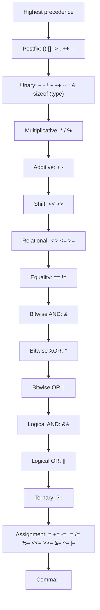
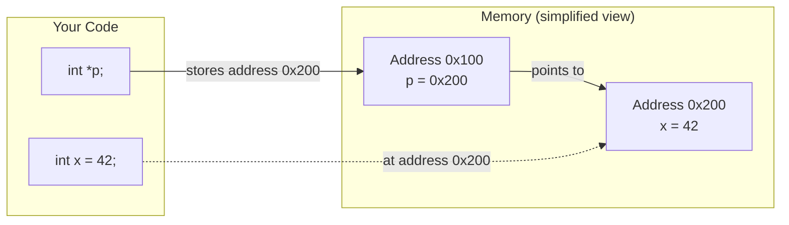

# C Basics and Pointers Deep Dive

> [!summary] Goal
> Master the C type system, operators, control flow, and most importantly — pointers at every level: pointer arithmetic, pointers to pointers, void pointers, function pointers, and const correctness. This is the foundation for everything else in C.

## Table of Contents

1. [Data Types and Type System](#data-types-and-type-system)
2. [Operators and Precedence](#operators-and-precedence)
3. [Control Flow](#control-flow)
4. [Functions and Prototypes](#functions-and-prototypes)
5. [Pointers Deep Dive](#pointers-deep-dive)
6. [Const Correctness](#const-correctness)
7. [Pitfalls](#pitfalls)

---

## Data Types and Type System

### Integer types

| Type | Size (bytes) | Format specifier | Range (signed) | Range (unsigned) |
|------|:------------:|:----------------:|:---------------:|:----------------:|
| `char` | 1 | `%c` / `%hhd` | -128 to 127 | 0 to 255 |
| `short` | 2 | `%hd` | -32,768 to 32,767 | 0 to 65,535 |
| `int` | 4 | `%d` / `%i` | -2³¹ to 2³¹-1 | 0 to 2³²-1 |
| `long` | 4 or 8 | `%ld` | platform-dependent | 0 to ... |
| `long long` | 8 | `%lld` | -2⁶³ to 2⁶³-1 | 0 to 2⁶⁴-1 |
| `size_t` | 8 (64-bit) | `%zu` | — | 0 to 2⁶⁴-1 |

### Exact-width types (C99, `<stdint.h>`)

```c
#include <stdint.h>

int8_t     // exactly 8 bits, signed
uint8_t    // exactly 8 bits, unsigned
int16_t    // exactly 16 bits
uint32_t   // exactly 32 bits
int64_t    // exactly 64 bits
intptr_t   // signed integer large enough to hold a pointer
uintptr_t  // unsigned version of intptr_t
```

> [!info] Exact-width types
> Standard types like `int` and `long` vary by platform (32-bit vs 64-bit). For portable code, especially OS development, always use `<stdint.h>` types to guarantee the exact size across platforms.

### Floating-point types

| Type | Size | Precision | Format specifier |
|------|:----:|:---------:|:----------------:|
| `float` | 4 bytes | ~6-7 decimal digits | `%f` |
| `double` | 8 bytes | ~15-16 decimal digits | `%lf` |
| `long double` | 10/16 bytes | varies | `%Lf` |

### Type qualifiers

```c
const int x = 5;          // Cannot be modified after initialization
volatile int reg;         // Value may change outside program control (hardware register)
restrict int *p;          // Pointer that is the ONLY reference to its data (optimization hint)
```

---

## Operators and Precedence



| Category | Operators | Associativity |
|----------|-----------|:------------:|
| **Postfix** | `()` `[]` `->` `.` `++` `--` | Left-to-right |
| **Unary** | `+` `-` `!` `~` `++` `--` `*` `&` `sizeof` `(type)` | Right-to-left |
| **Multiplicative** | `*` `/` `%` | Left-to-right |
| **Additive** | `+` `-` | Left-to-right |
| **Shift** | `<<` `>>` | Left-to-right |
| **Relational** | `<` `>` `<=` `>=` | Left-to-right |
| **Equality** | `==` `!=` | Left-to-right |
| **Bitwise AND** | `&` | Left-to-right |
| **Bitwise XOR** | `^` | Left-to-right |
| **Bitwise OR** | `|` | Left-to-right |
| **Logical AND** | `&&` | Left-to-right |
| **Logical OR** | `||` | Left-to-right |
| **Ternary** | `? :` | Right-to-left |
| **Assignment** | `=` `+=` `-=` etc. | Right-to-left |
| **Comma** | `,` | Left-to-right |

---

## Control Flow

```c
// if / else if / else
if (condition) {
    // ...
} else if (other) {
    // ...
} else {
    // ...
}

// switch
switch (value) {
    case 1: /* ... */ break;
    case 2: /* ... */ break;
    default: /* ... */ break;
}

// loops
for (int i = 0; i < n; i++) { /* ... */ }
while (condition) { /* ... */ }
do { /* ... */ } while (condition);

// jump
break;      // Exit innermost loop or switch
continue;   // Skip to next iteration
goto label; // Jump to label (use sparingly)
return;     // Exit function
```

> [!warning] `goto` is not evil
> In C, `goto` is the only way to do deterministic cleanup from multiple failure points in a function. The Linux kernel uses `goto` extensively for error handling. Use it for forward jumps to cleanup blocks — never backward.

---

## Functions and Prototypes

```c
// Function prototype (declaration) — tells the compiler about the function
int add(int a, int b);

// Function definition — provides the implementation
int add(int a, int b) {
    return a + b;
}

// Function with no parameters
int get_value(void);    // Use `void` explicitly — not empty parentheses

// Function returning a pointer
int *find_max(int *arr, int n);

// Static function — only visible within this file
static int helper(int x) {
    return x * 2;
}

// Inline function — hint to compiler to inline the call
static inline int max(int a, int b) {
    return a > b ? a : b;
}
```

### Parameter passing

C is **pass-by-value** only. To modify a variable in a caller, pass a pointer:

```c
void swap(int *a, int *b) {
    int temp = *a;
    *a = *b;
    *b = temp;
}
```

---

## Pointers Deep Dive

> [!info] Pointer
> A pointer is a variable that stores a **memory address**. The size of a pointer is platform-dependent (8 bytes on 64-bit, 4 bytes on 32-bit). `sizeof(any_pointer)` always returns the same value regardless of the pointed-to type.

### Pointer syntax and operations

```c
int x = 42;
int *p = &x;       // p stores the address of x
int **pp = &p;     // pp stores the address of p (pointer-to-pointer)

*p = 10;           // Write through p: x is now 10
int y = *p;        // Read through p: y is 10
**pp = 5;          // Write through pp: x is now 5
```



### Pointer arithmetic

Pointer arithmetic is scaled by the size of the pointed-to type:

```c
int arr[5] = {10, 20, 30, 40, 50};
int *p = arr;           // Points to arr[0]

p + 1;                  // Advances by sizeof(int) = 4 bytes → arr[1]
p + 5;                  // Goes past the end → arr[5] (out of bounds!)
*(p + 2) = 99;          // arr[2] = 99
p[2] = 100;             // Equivalent: arr[2] = 100
```

| Expression | Value | Notes |
|------------|:-----:|-------|
| `arr` | `0x100` | Array decays to pointer to first element |
| `arr + 1` | `0x104` | Advances by sizeof(int) = 4 bytes |
| `*(arr + 1)` | `20` | Dereference → arr[1] |
| `arr[1]` | `20` | Equivalent to `*(arr + 1)` |
| `&arr[0]` | `0x100` | Address of first element |
| `&arr` | `0x100` | Address of whole array (same value, different type) |

### Pointers to pointers

```c
// Useful for: modifying a pointer in a function, 2D arrays, linked list operations

void allocate_int(int **p) {
    *p = malloc(sizeof(int));  // Modifies the caller's pointer
    **p = 42;
}

int *ptr = NULL;
allocate_int(&ptr);
printf("%d\n", *ptr);  // 42
free(ptr);
```

### Void pointers

```c
void *malloc(size_t size);    // Returns void* — generic pointer

void *ptr = malloc(100);
int *ip = (int *)ptr;         // Must cast to use
free(ptr);                    // free() takes void* (no cast needed)

// Arithmetic on void* is NOT allowed in standard C
// (GCC extension allows it as sizeof(char) arithmetic)
```

> [!info] void pointer
> A `void *` can hold the address of any data type. It cannot be dereferenced directly (the compiler doesn't know the type size). It must be cast to a concrete pointer type before indirection. Used for generic interfaces like `malloc`, `qsort`, `memcpy`.

### NULL pointers

```c
int *p = NULL;                // Points to nothing
int *q = 0;                   // NULL is defined as ((void*)0)

if (p == NULL) { /* safe */ }
if (!p) { /* equivalent */ }

// Dereferencing NULL → undefined behavior (usually segfault)
// *p = 5;  // CRASH!
```

### Function pointers

```c
// Declaration: return_type (*name)(parameter_types)
int (*op)(int, int);         // Pointer to a function that takes two ints and returns an int

// Assign
op = add;                    // Function name decays to pointer
op = &add;                   // Same — & is redundant

// Call
int result = op(3, 4);       // Calls add(3, 4)
result = (*op)(3, 4);        // Equivalent, * is redundant

// Array of function pointers
int (*operations[])(int, int) = {add, subtract, multiply};

// Function pointer as parameter
void sort(int *arr, int n, int (*compare)(const void*, const void*));

// qsort example
int cmp(const void *a, const void *b) {
    return *(int*)a - *(int*)b;
}
qsort(arr, n, sizeof(int), cmp);
```

### Function pointer typedef

```c
// Makes complex declarations readable
typedef int (*comparator_fn)(const void *, const void *);

void sort(int *arr, int n, comparator_fn cmp);
```

---

## Const Correctness

> [!info] Const correctness
> Using `const` tells the compiler that data shouldn't be modified. It enables compiler optimizations, documents intent, and catches bugs. In C, `const` data can technically be modified via a cast (unlike C++), but doing so is undefined behavior if the original object was declared `const`.

```c
// Read the declaration from right to left:

const int *p;         // p is a pointer to const int (the int can't change)
int const *p;         // Same as above

int * const p;        // p is a const pointer to int (the pointer can't change)
                       // Must be initialized at declaration

const int * const p;  // p is a const pointer to const int (neither can change)

// Function parameters — best practices
void process(const int *data, int n);  // Promise not to modify the data
void store(int * restrict data, int n); // Tells compiler: no other pointer aliases this
```

| Declaration | `*p = 5`? | `p = &x`? |
|-------------|:---------:|:---------:|
| `int *p` | ✅ Yes | ✅ Yes |
| `const int *p` | ❌ No | ✅ Yes |
| `int * const p` | ✅ Yes | ❌ No |
| `const int * const p` | ❌ No | ❌ No |

---

## Pitfalls

### Pointer arithmetic type scaling confusion

```c
int arr[5];
int *p = arr;
p + 1;                    // Advances by 4 bytes (sizeof(int))

// Wrong: treating void* as byte-sized
void *vp = arr;
// vp++;                  // ERROR: arithmetic on void*
(char*)vp + 1;            // OK: advances by 1 byte
```

### Function pointer with wrong signature

```c
int (*fp)(int) = &add;            // OK: (int, int) → (int) — WRONG signature
// Compiler warns or silently truncates arguments!
```

Always match the exact parameter count and types.

### Dereferencing NULL or uninitialized pointers

```c
int *p;            // Uninitialized — points to garbage!
*p = 5;            // BOOM

int *q = NULL;
*q = 5;            // BOOM (segfault)

// Always initialize:
int *r = NULL;     // Or point to valid memory
if (r) { *r = 5; } // Check before dereference
```

### Confusing `const int *p` with `int * const p`

Read declarations right-to-left: "p is a pointer to const int" vs "p is a const pointer to int." One prevents modifying the pointed-to value; the other prevents reassigning the pointer itself.

### Not using `restrict` on pointers that don't alias

The compiler cannot optimize when pointers may alias. Adding `restrict` tells the compiler the pointer is the only reference:

```c
void copy(int * restrict dest, const int * restrict src, int n) {
    for (int i = 0; i < n; i++) dest[i] = src[i];
}
```

---

> [!question]- Interview Questions
>
> **Q: What is the difference between `int* p` and `int *p`?**
> A: There's no difference — whitespace is irrelevant. `int* p` emphasizes that p is a pointer to int; `int *p` emphasizes that `*p` is an int. Both mean the same thing. Be careful with multiple declarations: `int* p, q` declares p as a pointer and q as an int — write `int *p, *q` to get two pointers.
>
> **Q: How does pointer arithmetic work?**
> A: Adding N to a pointer advances it by N × sizeof(pointed-to-type). `int *p; p + 1` advances by 4 bytes. `char *c; c + 1` advances by 1 byte. This is why `void*` doesn't support arithmetic — the compiler doesn't know the element size.
>
> **Q: What does it mean that arrays "decay" to pointers?**
> A: In most contexts, the name of an array evaluates to a pointer to its first element. `int arr[5]; int *p = arr;` — `arr` decays to `&arr[0]`. The exceptions are `sizeof(arr)` (returns the full array size) and `&arr` (returns a pointer to the whole array, type `int(*)[5]`).
>
> **Q: What is a function pointer and give an example of its use?**
> A: A function pointer stores the address of a function. Example: `qsort` takes a `comparator_fn` parameter — you pass the comparison function to customize sorting behavior. Function pointers enable callbacks, event handlers, and polymorphic behavior in C.
>
> **Q: Explain const correctness with pointer declarations.**
> A: `const int *p` — the pointed-to int cannot be modified (but p can point elsewhere). `int * const p` — p cannot be reassigned (but the int can be modified). `const int * const p` — neither can change. Read declarations right-to-left: "p is a const pointer to const int."

---

## Cross-Links

- [[C/01_Foundations/02_Memory_Model_and_Allocation]] for stack vs heap and malloc
- [[C/01_Foundations/04_Arrays_Strings_and_Bounds]] for array decay and string handling
- [[C/02_Core/01_Function_Pointers_Callbacks_and_vtables]] for function pointers deep dive
- [[C/01_Foundations/08_Enums_Typedef_and_Complex_Declarations]] for reading complex type declarations
- [[C/01_Foundations/06_Preprocessor_and_Compilation]] for compilation model
