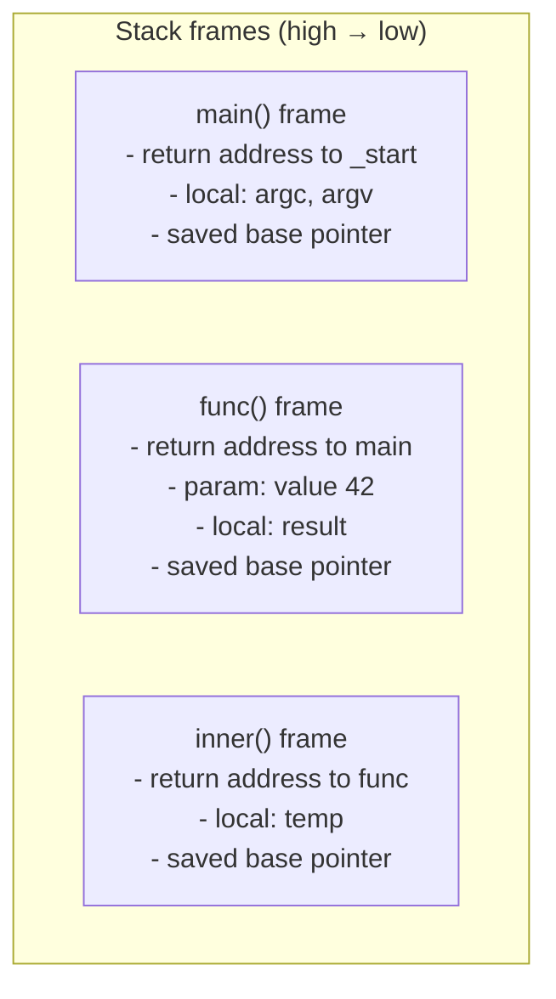
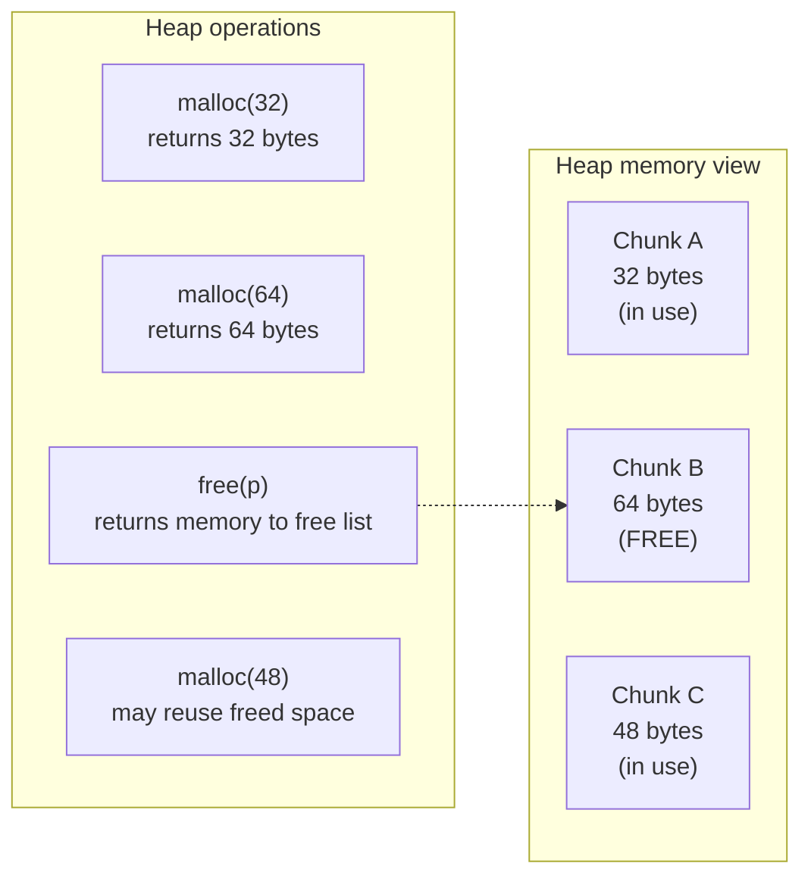
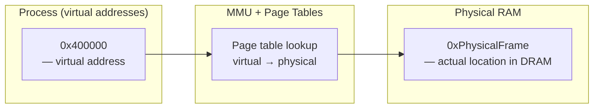

# Memory Model: Process Layout, Stack, and Heap

> [!summary] Goal
> Understand how a C program's memory is organized: the segments (text, data, BSS, heap, stack), how the stack works for function calls, how the heap is managed, and the virtual memory concepts essential for OS development.

## Table of Contents

1. [Process Memory Layout](#process-memory-layout)
2. [The Stack](#the-stack)
3. [The Heap](#the-heap)
4. [Stack vs Heap Comparison](#stack-vs-heap-comparison)
5. [Virtual Memory Concepts](#virtual-memory-concepts)
6. [Pitfalls](#pitfalls)

---

## Process Memory Layout

```mermaid
flowchart TD
    subgraph High["High addresses (0x7FFFF...)"]
        STACK["STACK (grows down)<br/>Local variables, function frames, return addresses"]
        ARROW1["↓ grows down"]
    end
    subgraph Middle[""]
        HOLE["Memory-mapped region<br/>Shared libraries (libc.so), mmap, file mappings"]
    end
    subgraph Low["Low addresses (0x00400...)"]
        ARROW2["↑ grows up"]
        HEAP["HEAP (grows up)<br/>Dynamic allocation: malloc, calloc, realloc"]
        BSS[".BSS (uninitialized data)<br/>Global/static vars initialized to 0"]
        DATA[".DATA (initialized data)<br/>Global/static vars with initial values"]
        TEXT[".TEXT (code)<br/>Program instructions (read-only)"]
    end
```

| Segment | Contents | Read/Write? | Contains |
|---------|----------|:-----------:|----------|
| **Text (code)** | Executable machine instructions | Read-only | Program code, string literals, `const` globals |
| **Data** | Initialized global/static variables | Read-Write | `int x = 5;` — the value `5` is stored here |
| **BSS** | Uninitialized global/static variables | Read-Write | `int y;` — zero-initialized at startup |
| **Heap** | Dynamic allocations | Read-Write | `malloc()`-ed memory |
| **Stack** | Function call frames | Read-Write | Local variables, parameters, return addresses |
| **MMAP** | Shared libraries, large allocations | Read-Write | `libc.so`, `mmap()`'d files |

> [!info] BSS segment
> BSS stands for "Block Started by Symbol." Variables declared without an initializer are placed here. They're zero-initialized when the program loads. This avoids storing zeros in the executable file — only the count and size of BSS data is stored, making executables smaller.

### Inspecting the memory layout

```bash
# Check text, data, bss sizes of a compiled program
size a.out

# Output example:
#    text    data     bss     dec     hex filename
#   18205    1696     664   20565    5055 a.out

# View memory map of a running process
cat /proc/$$/maps    # Current shell
```

```c
// Check address ranges at runtime
#include <stdio.h>
#include <stdlib.h>

int global_init = 42;         // .data
int global_uninit;            // .bss
static int static_var = 0;    // .bss (zero)

int main(void) {
    int local = 5;            // stack
    int *heap = malloc(100);  // heap
    
    printf("Text  (main)   : %p\n", main);
    printf("Data  (init)   : %p\n", &global_init);
    printf("BSS   (uninit) : %p\n", &global_uninit);
    printf("Heap  (malloc) : %p\n", heap);
    printf("Stack (local)  : %p\n", &local);
    
    free(heap);
    return 0;
}
```

---

## The Stack

The stack grows **downward** (from high to low addresses). Each function call creates a **stack frame**.



### Stack frame anatomy

When `func()` is called from `main()`:

```c
int func(int x) {
    int result = x * 2;
    return result;
}

int main(void) {
    int v = func(42);
    return 0;
}
```

```mermaid
sequenceDiagram
    participant MAIN as main()
    participant CALL as call instruction
    participant FUNC as func(x=42)
    participant RET as return

    MAIN->>CALL: push arg 42
    MAIN->>CALL: call func (push return address)
    CALL->>FUNC: push old base pointer (rbp)
    Note over FUNC: allocate locals (result)
    FUNC->>FUNC: compute result = 84
    FUNC->>RET: store return value in RAX
    RET->>MAIN: mov rsp, rbp; pop rbp; ret
    MAIN->>MAIN: clean up arg (pop or adjust rsp)
```

### Stack properties

| Property | Description |
|----------|-------------|
| **Size** | Fixed at process start (typically 8 MB on Linux; `ulimit -s`) |
| **Growth** | Downward (from high to low addresses) |
| **Allocation speed** | Fast — just decrement stack pointer (`rsp`) |
| **Lifetime** | Automatic — freed on function return |
| **Contents** | Local variables, function parameters, return addresses, saved registers |

> [!info] Stack overflow
> When the stack exceeds its fixed size (e.g., infinite recursion, large local array), the program crashes with a segfault. On Linux, the guard page at the bottom of the stack triggers SIGSEGV. Check with `ulimit -s`. Deep recursion is dangerous — use iteration or the heap.

---

## The Heap

The heap grows **upward** (from low to high addresses). Managed explicitly via `malloc`/`free`/`calloc`/`realloc`.



```c
#include <stdlib.h>

// Allocation
int *arr = malloc(10 * sizeof(int));   // Uninitialized
int *arr2 = calloc(10, sizeof(int));   // Zero-initialized

// Resize
arr = realloc(arr, 20 * sizeof(int));  // May move to new location

// Deallocation
free(arr);

// Common pattern: allocate + zero
int *data = calloc(100, sizeof(int));

// Common pattern: allocate + copy
int *copy = malloc(n * sizeof(int));
memcpy(copy, original, n * sizeof(int));
```

---

## Stack vs Heap Comparison

| Aspect | Stack | Heap |
|--------|:----:|:----:|
| **Allocation speed** | Instant (RSP decrement) | Slow (free list search) |
| **Deallocation** | Automatic (on return) | Manual (`free()` required) |
| **Size limit** | Fixed (8 MB typical) | Large (physical memory + swap) |
| **Lifetime** | Function scope | Until freed or program end |
| **Fragmentation** | None (perfect nesting) | Can fragment over time |
| **Thread safety** | Each thread has its own | Must synchronize |
| **Typical size** | KB to low MB | MB to GB |
| **Control** | Compiler-managed | Programmer-managed |
| **Flexibility** | Fixed at compile time | Dynamic at runtime |

### When to use which

```c
// ✅ Stack (prefer this when possible)
void process(void) {
    int buffer[256];         // Small, known size, short lifetime
    struct point p = {1, 2}; // Small struct
    // No free() needed!
}

// ✅ Heap (when you need dynamic sizing or long lifetime)
void process_big(int n) {
    int *buffer = malloc(n * sizeof(int)); // Size known only at runtime
    // ... use buffer ...
    free(buffer);                          // MUST free
}

// ✅ Heap (large allocations that would overflow the stack)
void process_large(void) {
    int *huge = malloc(10 * 1024 * 1024); // 10 MB — way too large for stack
    // ... use huge ...
    free(huge);
}
```

---

## Virtual Memory Concepts

> [!info] Virtual memory
> Each process sees a **virtual address space** (e.g., 0x0 to 0x7FFFFFFFFFFFFF on x86-64). The MMU (Memory Management Unit) translates virtual addresses to physical addresses using **page tables**. This gives each process the illusion of having the entire address space to itself.



### Key virtual memory concepts for C programmers

| Concept | What it means for you |
|---------|----------------------|
| **Page** | Memory is divided into 4 KB pages. `malloc`'d memory is allocated in page increments |
| **Page fault** | Accessing an unmapped page triggers SIGSEGV (your segfault) |
| **ASLR** | Address Space Layout Randomization — stack/heap/mmap addresses randomize on each run for security |
| **Guard page** | A single unmapped page below the stack to detect overflow |
| **Copy-on-Write** | `fork()` makes both parent and child share the same physical pages until one writes |

```bash
# Check system page size
getconf PAGE_SIZE
# Usually 4096 (4 KB)

# Check ASLR status
cat /proc/sys/kernel/randomize_va_space
# 0 = disabled, 1 = randomize, 2 = full randomization
```

### Why virtual memory matters for OS development

```text
When writing an OS kernel, YOU are responsible for:
  1. Setting up page tables for each process
  2. Handling page faults (swap in/out, copy-on-write)
  3. Managing the kernel's address space vs user space
  4. Configuring ASLR for user processes
  5. Implementing mmap, brk (malloc uses brk)
  6. Setting up the initial process memory layout
```

---

## Pitfalls

### Stack overflow from large local arrays

```c
// ❌ BAD: 10 MB on the stack — overflow!
void bad(void) {
    int huge[10 * 1024 * 1024 / sizeof(int)];  // ~10 MB
}

// ✅ GOOD: use heap for large allocations
void good(void) {
    int *huge = malloc(10 * 1024 * 1024);
    // ...
    free(huge);
}
```

### Heap fragmentation

Repeated malloc/free of varying sizes creates fragmentation — the heap has free chunks that are too small to satisfy new allocations. Mitigate by: (a) using a custom arena allocator, (b) batching allocations of the same size, (c) using `realloc` carefully.

### Using stack addresses after function returns

```c
int *bad(void) {
    int x = 42;
    return &x;     // ❌ Returns address of stack variable — x no longer exists!
}
// Using the returned pointer = undefined behavior (dangling pointer)

int *good(void) {
    int *p = malloc(sizeof(int));
    *p = 42;
    return p;      // ✅ Heap memory survives the return
}
```

### Assuming heap and stack are contiguous

Heap and stack grow toward each other in the virtual address space. If they collide, the program crashes. This is extremely rare on 64-bit systems (huge address space) but was a real concern on 32-bit.

---

> [!question]- Interview Questions
>
> **Q: Describe the memory layout of a C process.**
> A: From low to high addresses: Text segment (read-only code), Data segment (initialized globals), BSS segment (uninitialized, zeroed globals), Heap (grows up), Memory-mapped region (libs, mmap), Stack (grows down). The OS loads the program and sets up these segments when the process starts.
>
> **Q: What is the difference between stack and heap allocation?**
> A: Stack allocation is instant (just moves the stack pointer), automatically freed on function return, size-limited (~8 MB), and per-thread. Heap allocation is slower (needs free list management), must be explicitly freed, can be much larger, and needs synchronization in threaded code.
>
> **Q: What happens when the stack overflows?**
> A: The stack guard page is accessed → page fault → kernel sends SIGSEGV → default handler terminates the process. Common causes: infinite recursion, very large local arrays (int buf[1<<20]). On Linux, check `ulimit -s` and consider switching to heap allocation.
>
> **Q: What does `ulimit -s` control?**
> A: The maximum stack size in KB. Default is typically 8192 (8 MB). `ulimit -s unlimited` disables the limit (not recommended). If you need more than 8 MB of local data, use heap allocation instead.
>
> **Q: How does virtual memory relate to pointers?**
> A: Every pointer you work with in C is a virtual address. The MMU translates it to a physical address transparently. This means: (1) each process has its own address space, (2) a pointer from one process is meaningless in another, (3) physical memory can be discontiguous while appearing contiguous to the process.

---

## Cross-Links

- [[C/01_Foundations/01_C_Basics_and_Pointers]] for pointer fundamentals
- [[C/01_Foundations/03_Dynamic_Memory]] for malloc/free deep dive and custom allocators
- [[C/01_Foundations/05_Structs_Unions_and_Bit_Fields]] for struct memory layout and padding
- [[C/03_Advanced/06_Memory_Alignment_and_Endianness]] for alignment requirements
- [[C/02_Core/04_Data_Structures_in_C]] for stack/queue/heap implementations
