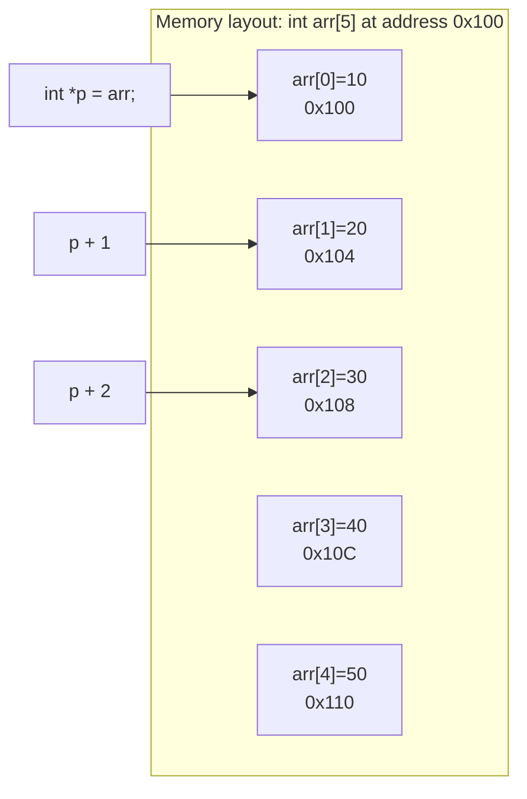
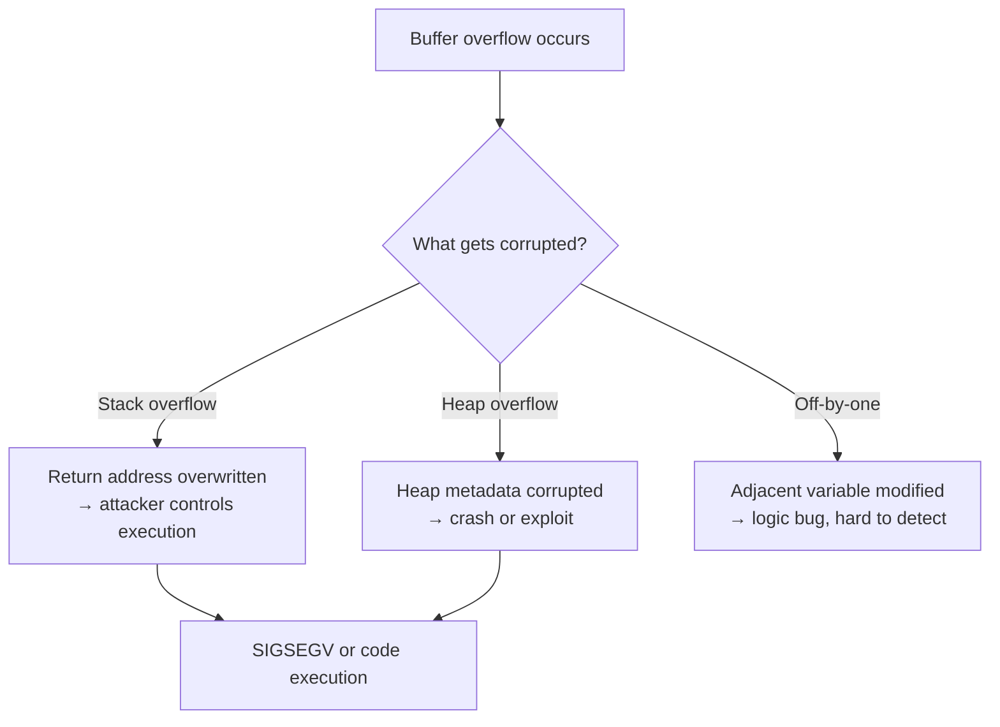

# Arrays, Strings, and Bounds

> [!summary] Goal
> Master C arrays (decay, multi-dimensional, pointer equivalence), the full `<string.h>` API, and safe string handling. Understand buffer overflows — the most common C security vulnerability.

## Table of Contents

1. [Array Fundamentals](#array-fundamentals)
2. [Array Decay and Pointer Equivalence](#array-decay-and-pointer-equivalence)
3. [Multi-dimensional Arrays](#multi-dimensional-arrays)
4. [String Library (`<string.h>`)](#string-library)
5. [Safe String Handling](#safe-string-handling)
6. [Memory Operations: memcpy, memmove, memset](#memory-operations-memcpy-memmove-memset)
7. [Buffer Overflows](#buffer-overflows)
8. [Pitfalls](#pitfalls)

---

## Array Fundamentals

```c
// Declaration and initialization
int arr[5];                    // Uninitialized (garbage values)
int arr[5] = {1, 2, 3, 4, 5};  // Full initialization
int arr[5] = {1, 2, 3};        // Remaining elements are zero-initialized
int arr[] = {1, 2, 3};         // Compiler infers size: int arr[3]

// Access
arr[0] = 10;                   // Index from 0
*(arr + 1) = 20;               // Pointer arithmetic equivalent

// sizeof with arrays
sizeof(arr);                   // Returns total bytes: 5 * sizeof(int) = 20
sizeof(arr) / sizeof(arr[0]);  // Number of elements: 5
```

### Array initialization rules

| Declaration | Effect |
|-------------|--------|
| `int a[5] = {1,2,3,4,5};` | All elements explicitly set |
| `int a[5] = {1,2,3};` | First 3 set, last 2 zeroed |
| `int a[5] = {0};` | All elements zero (common idiom) |
| `int a[5] = {};` | All elements zero (GCC extension, same as {0}) |
| `int a[5];` | **No initialization** — stack garbage! |

---

## Array Decay and Pointer Equivalence

> [!info] Array decay
> In most contexts, the name of an array evaluates to a **pointer to its first element**. This is "decay." It means arrays cannot be passed by value to functions, and `sizeof(arr)` in a function parameter returns the pointer size, not the array size.

```c
int arr[5] = {10, 20, 30, 40, 50};

// arr "decays" to a pointer to the first element
int *p = arr;       // Equivalent to int *p = &arr[0];

// These are identical:
arr[2] == *(arr + 2);     // true
p[2] == *(p + 2);         // true
2[arr] == *(2 + arr);     // true (yes, this is legal C!)

// Exceptions — contexts where arr does NOT decay:
sizeof(arr);              // Returns 5 * sizeof(int) = 20 (NOT pointer size)
&arr;                     // Returns int(*)[5] (pointer to array of 5 ints)
```

### Array decay in function parameters

```c
// These declarations are EQUIVALENT — both receive a pointer, not an array:
void process(int arr[5]);    // 5 is ignored by the compiler!
void process(int arr[]);     // Size doesn't matter
void process(int *arr);      // This is what the compiler actually sees

void process(int arr[]) {
    // sizeof(arr) here is sizeof(int*) = 8, NOT the array size!
    // You MUST pass the size separately:
}

// Correct pattern
void process(int *arr, size_t n) {
    for (size_t i = 0; i < n; i++) {
        arr[i] *= 2;
    }
}
```

### Pointer arithmetic with arrays



```c
int arr[5] = {10, 20, 30, 40, 50};
int *p = arr;

// Pointer arithmetic
p + 0;    // Address of arr[0] (0x100)
p + 2;    // Address of arr[2] (0x100 + 2*4 = 0x108)
p - p;    // 0: difference in elements, not bytes

// Relationship: arr[i] == *(arr + i) == *(p + i) == p[i]

// Quick iteration
for (int *p = arr; p < arr + 5; p++) {
    *p *= 2;  // Double each element
}
```

---

## Multi-dimensional Arrays

```c
// 2D array — contiguous in memory (row-major)
int matrix[3][4] = {
    {1,  2,  3,  4},
    {5,  6,  7,  8},
    {9, 10, 11, 12}
};

// Access
matrix[1][2] = 42;       // Row 1, column 2

// Memory layout
// All 12 elements are contiguous: row0 → row1 → row2
// matrix[1][2] is at address: matrix + (1 * 4 + 2) * sizeof(int)

// Passing to functions
void print_matrix(int m[][4], int rows) {
    for (int i = 0; i < rows; i++) {
        for (int j = 0; j < 4; j++) {
            printf("%d ", m[i][j]);
        }
        printf("\n");
    }
}
// Note: the second dimension MUST be known (compiler needs it for indexing)

// Contiguous allocation on heap (preferred for 2D)
int *heap_mat = malloc(rows * cols * sizeof(int));
heap_mat[row * cols + col] = value;  // Manual indexing
free(heap_mat);

// Array of pointers (non-contiguous, more overhead)
int **jagged = malloc(rows * sizeof(int*));
for (int i = 0; i < rows; i++) {
    jagged[i] = malloc(cols * sizeof(int));
}
```

---

## String Library (`<string.h>`)

> [!info] C strings
> A C string is a null-terminated array of `char`. The terminator `'\0'` (NUL byte, value 0) marks the end. All `<string.h>` functions rely on this — they don't know about the array size, only the terminator position.

### String length and copy

```c
#include <string.h>

size_t strlen(const char *s);       // Length excluding terminator
char *strcpy(char *dest, const char *src);   // Copy src to dest (UNSAFE)
char *strncpy(char *dest, const char *src, size_t n);  // Copy with limit

char *strcat(char *dest, const char *src);   // Append (UNSAFE)
char *strncat(char *dest, const char *src, size_t n); // Append with limit

int strcmp(const char *s1, const char *s2);  // Compare
int strncmp(const char *s1, const char *s2, size_t n);  // Compare first n

// Safe alternatives (not standard but common)
size_t strlcpy(char *dest, const char *src, size_t size);  // BSD, safer
size_t strlcat(char *dest, const char *src, size_t size);  // BSD, safer
```

### String search

```c
char *strchr(const char *s, int c);          // Find first occurrence of c
char *strrchr(const char *s, int c);         // Find last occurrence of c
char *strstr(const char *haystack, const char *needle);  // Find substring
char *strpbrk(const char *s, const char *accept);  // Find first matching char
size_t strspn(const char *s, const char *accept);   // Span of matching chars
size_t strcspn(const char *s, const char *reject);  // Span of non-matching

// Tokenization
char *strtok(char *str, const char *delim);  // Split into tokens (DESTRUCTIVE!)
char *strtok_r(char *str, const char *delim, char **saveptr);  // Reentrant version
```

### strtok example

```c
char line[] = "hello,world,this,c";
char *token;
char *rest = line;

while ((token = strtok_r(rest, ",", &rest))) {
    printf("Token: %s\n", token);
}
// Output:
// Token: hello
// Token: world
// Token: this
// Token: c
```

### String formatting

```c
#include <stdio.h>

char buf[256];
int n = snprintf(buf, sizeof(buf), "Value: %d, Name: %s", 42, "Alice");
// snprintf returns the number of bytes that WOULD have been written
// (excluding terminator) if the buffer was large enough
// If n >= sizeof(buf), the output was truncated
```

---

## Safe String Handling

### The problem with strcpy and strcat

```c
char dest[10];
char *src = "This string is way too long for dest";

strcpy(dest, src);   // ❌ BUFFER OVERFLOW! Writes past end of dest
strcat(dest, src);   // ❌ Same problem
```

### Safer alternatives

```c
// strncpy — copies at most n chars, pads with zeros
char dest[10];
strncpy(dest, "hello world", sizeof(dest));
// dest = {'h','e','l','l','o',' ','w','o','r','\0'}
// NOTE: if src is >= n, dest is NOT null-terminated!

// Safe pattern
char dest[10] = {0};
strncpy(dest, "hello world", sizeof(dest) - 1);
// dest[9] stays 0 (from initialization) — always null-terminated

// snprintf — always null-terminates
char dest[10];
snprintf(dest, sizeof(dest), "%s", "hello world");
// dest = "hello wor" — truncated, but SAFE (null-terminated)
```

### String length comparison

| Function | Counts | Stops at | Buffer-safe? |
|----------|--------|----------|:-----------:|
| `strlen(s)` | Characters | `'\0'` | No (crashes if no terminator) |
| `strcpy(d, s)` | — | `'\0'` in src | ❌ No |
| `strncpy(d, s, n)` | n chars | `'\0'` in src | ⚠️ Partial (may not null-terminate) |
| `snprintf(d, n, "%s", s)` | n-1 chars | `'\0'` in src | ✅ Yes (always null-terminates) |
| `strlcpy(d, s, n)` | n-1 chars | `'\0'` in src | ✅ Yes (BSD, not standard) |

---

## Memory Operations: memcpy, memmove, memset

```c
#include <string.h>

void *memset(void *s, int c, size_t n);     // Fill n bytes with c
void *memcpy(void *dest, const void *src, size_t n);  // Copy n bytes (no overlap!)
void *memmove(void *dest, const void *src, size_t n); // Copy n bytes (handles overlap)
int memcmp(const void *s1, const void *s2, size_t n); // Compare n bytes

// memset — zero memory
int arr[100];
memset(arr, 0, sizeof(arr));    // Zero the entire array

// memcpy — copy (FAST but UNDEFINED if src and dest overlap)
struct point *copy = malloc(sizeof(struct point));
memcpy(copy, &original, sizeof(struct point));

// memmove — copy (SAFE with overlapping regions)
// If dest > src, copies from end to start; if dest < src, copies from start
char str[] = "hello world";
memmove(str + 6, str, 5);       // "hello hello" — memcpy would be UB here!
```

> [!info] memcpy vs memmove
> `memcpy` is faster but requires the source and destination to **not overlap**. `memmove` handles overlap correctly but may be slightly slower. When in doubt, use `memmove`. The compiler often optimizes `memmove` to `memcpy` when it can prove no overlap.

---

## Buffer Overflows

> [!warning] Buffer overflow
> Writing past the end of an array corrupts adjacent memory. This is the **most common security vulnerability** in C. It can overwrite function return addresses (control-flow hijacking), corrupt heap metadata, or read sensitive data.



```c
// Classic stack buffer overflow
void vulnerable(char *input) {
    char buf[64];
    strcpy(buf, input);   // ❌ If input > 63 chars, overflows buf
}                         // Attacker can overwrite the return address

// Protection: use bounds-checked functions
void safe(char *input, size_t len) {
    char buf[64];
    if (len >= sizeof(buf)) {
        fprintf(stderr, "Input too long\n");
        return;
    }
    strncpy(buf, input, sizeof(buf) - 1);
    buf[sizeof(buf) - 1] = '\0';
}
```

### Compiler overflow protections

```bash
# Stack canaries
gcc -fstack-protector-strong program.c   # Recommended
# Places a "canary" value between local variables and the return address.
# If the canary is corrupted, the program aborts before returning.

# ASLR (Address Space Layout Randomization)
# Automatic on Linux — randomizes stack/heap addresses
# Makes overflow exploits harder

# Non-executable stack
gcc -z noexecstack program.c
# Prevents executing code placed on the stack
```

---

## Pitfalls

### Off-by-one errors

```c
int arr[5];
for (int i = 0; i <= 5; i++) {   // ❌ Should be i < 5
    arr[i] = i;                   // Overwrites arr[5] which doesn't exist
}
```

### Forgetting null terminator

```c
char buf[3] = {'a', 'b', 'c'};    // ❌ NOT a string! No null terminator
printf("%s", buf);                 // Reads past buf until it finds a 0 byte — UB!
```

### sizeof on decayed array

```c
void process(int arr[]) {
    size_t n = sizeof(arr) / sizeof(arr[0]);  // ❌ WRONG: sizeof(arr) = sizeof(int*)
}
```

### memcpy with overlapping regions

```c
char s[] = "123456789";
memcpy(s + 2, s, 6);     // ❌ UB — src and dest overlap!
memmove(s + 2, s, 6);    // ✅ Correct — handles overlap
```

### strtok modifies the original string

```c
char *s = "hello,world";     // String literal — read-only!
strtok(s, ",");              // ❌ Attempts to modify read-only memory → crash
```

---

> [!question]- Interview Questions
>
> **Q: What does it mean that arrays "decay" to pointers in C?**
> A: In most expressions, the name of an array evaluates to a pointer to its first element. This means: (a) you can assign an array to a pointer (`int *p = arr`), (b) array parameters in functions are actually pointer parameters (`void f(int arr[])` is really `void f(int *arr)`), (c) `sizeof(arr)` in a function returns pointer size, not array size. The exceptions are `sizeof(arr)`, `&arr`, and `sizeof` on an actual array definition.
>
> **Q: What is the difference between `char *s` and `char s[]`?**
> A: `char s[] = "hello"` creates an array on the stack (modifiable, size is part of the type). `char *s = "hello"` creates a pointer to a string literal (read-only, modifying it is UB). `sizeof` on the array returns 6 (including terminator); on the pointer returns 8 (pointer size).
>
> **Q: How does `strlen` work?**
> A: It scans memory byte by byte starting at the given address, incrementing a counter, until it finds a zero byte (`'\0'`). It does NOT know the buffer size — it just reads until it finds a terminator. If the string is not null-terminated, `strlen` will read past the buffer until it happens to find a zero byte (undefined behavior).
>
> **Q: What is the difference between `memcpy` and `memmove`?**
> A: Both copy n bytes from src to dest. `memcpy` assumes no overlap between src and dest (undefined behavior if they overlap). `memmove` handles overlap correctly by checking the relative positions and copying in the appropriate direction (forward or backward). `memcpy` can be slightly faster; `memmove` is safer. Use `memmove` when you're not sure about overlap.
>
> **Q: How do you safely copy a string into a fixed-size buffer?**
> A: Use `snprintf(dest, size, "%s", src)` — it always null-terminates and returns the number of bytes that would have been written. If the return value >= size, the output was truncated. Or use `strlcpy` (BSD, not standard C). Never use `strcpy` or `sprintf` without length limits.

---

## Cross-Links

- [[C/01_Foundations/01_C_Basics_and_Pointers]] for pointer arithmetic fundamentals
- [[C/01_Foundations/02_Memory_Model_and_Allocation]] for stack buffer overflows
- [[C/02_Core/06_Undefined_Behavior_and_Memory_Safety]] for array bounds UB
- [[C/04_Playbooks/01_Debug_Segfaults_and_Invalid_Memory_Access]] for buffer overflow debugging
- [[C/04_Playbooks/02_Use_Sanitizers_ASan_UBSan_TSan]] for ASan buffer overflow detection
