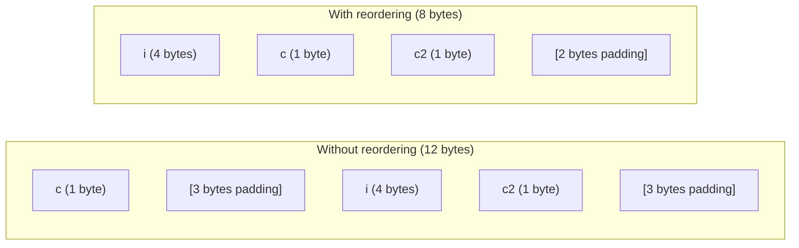

# Structures, Unions, and Bit Fields

> [!summary] Goal
> Master C structures (padding, alignment, flexible arrays), unions (type punning, tagged variants), and bit fields (hardware registers, flags). Understand the memory layout of compound types essential for OS development, networking, and device drivers.

## Table of Contents

1. [Structures](#structures)
2. [Structure Padding and Alignment](#structure-padding-and-alignment)
3. [Struct Reordering Optimization](#struct-reordering-optimization)
4. [Flexible Array Members](#flexible-array-members)
5. [Unions](#unions)
6. [Bit Fields](#bit-fields)
7. [Packed Structs and __attribute__](#packed-structs-and-attribute)
8. [Pitfalls](#pitfalls)

---

## Structures

> [!info] Structure
> A `struct` is a composite data type that groups variables of different types under a single name. Members are stored in memory in declaration order, but the compiler may insert **padding** between members for alignment.

```c
// Basic struct
struct Point {
    int x;
    int y;
};

// Declare and initialize
struct Point p1;                    // Uninitialized (garbage)
struct Point p2 = {10, 20};         // Initialize in order
struct Point p3 = {.x = 10, .y = 20}; // Designated initializers (C99)
struct Point p4 = {0};              // All zero

// Access
p1.x = 5;
p1.y = p1.x + 3;

// Heap allocation
struct Point *hp = malloc(sizeof(struct Point));
hp->x = 10;                         // Arrow operator for pointer access
hp->y = 20;
free(hp);

// Typedef — avoids writing "struct" everywhere
typedef struct {
    int x;
    int y;
} Point2D;

Point2D pt = {1, 2};
```

### struct initialization

```c
// Designated initializers (C99) — clear, order-independent
typedef struct {
    int id;
    char name[64];
    double balance;
    int flags;
} Account;

Account a = {
    .id = 42,
    .name = "Alice",
    .balance = 100.50,
    .flags = 0
};

// Partial designated init — unmentioned fields are zero-initialized
Account b = {
    .id = 43,
    .name = "Bob"
};
// b.balance = 0, b.flags = 0
```

---

## Structure Padding and Alignment

> [!info] Alignment
> Every data type has an **alignment requirement**: its address must be a multiple of its size (e.g., `int` must be at a multiple of 4, `double` at a multiple of 8). The compiler inserts **padding** between struct members and at the end of the struct to satisfy alignment.



```c
// Example: understanding padding
typedef struct {
    char c;     // 1 byte at offset 0
    // 3 bytes padding (to align int to 4)
    int i;      // 4 bytes at offset 4
    char c2;    // 1 byte at offset 8
    // 3 bytes padding (to make struct size multiple of 4)
} Bad;          // Total: 12 bytes (7 data + 5 padding)

typedef struct {
    int i;      // 4 bytes at offset 0
    char c;     // 1 byte at offset 4
    char c2;    // 1 byte at offset 5
    // 2 bytes padding (to make struct size multiple of 4)
} Good;         // Total: 8 bytes (6 data + 2 padding)

printf("Bad  size: %zu\n", sizeof(Bad));   // 12
printf("Good size: %zu\n", sizeof(Good));  // 8
```

### The padding rules

| Type | Alignment requirement (x86-64) | Size |
|------|:-----------------------------:|:----:|
| `char` | 1 | 1 |
| `short` | 2 | 2 |
| `int` | 4 | 4 |
| `long` | 8 | 8 |
| `long long` | 8 | 8 |
| `float` | 4 | 4 |
| `double` | 8 | 8 |
| `void*` | 8 | 8 |
| `struct` | Max of member alignments | Sum + padding + trailing padding |

```c
#include <stddef.h>
offsetof(struct Bad, c);    // 0
offsetof(struct Bad, i);    // 4 (3 bytes of padding before it)
offsetof(struct Bad, c2);   // 8
```

---

## Struct Reordering Optimization

```c
// ❌ BAD ORDER — wastes space
typedef struct {
    char a;      // 1 + 7 padding
    double b;    // 8
    char c;      // 1 + 3 padding
    int d;       // 4
    char e;      // 1 + 7 padding (for alignment of struct)
} BadOrdered;    // 32 bytes, 16 bytes of padding!

// ✅ GOOD ORDER — largest members first, smallest last
typedef struct {
    double b;    // 8
    int d;       // 4
    char a;      // 1
    char c;      // 1
    char e;      // 1
    // 1 byte padding (to make total multiple of largest alignment = 8)
} GoodOrdered;   // 16 bytes, only 1 byte of padding
```

### Rule of thumb

```text
Order struct members from largest alignment requirement to smallest:
  1. Pointers, long, double (8 bytes)
  2. int, float, long (4 bytes)
  3. short (2 bytes)
  4. char, bool (1 byte)
```

---

## Flexible Array Members (C99)

> [!info] Flexible array member
> A struct with a **trailing array of unknown size**. The array must be the last member, and the struct must have at least one other named member. The actual size is determined at allocation time.

```c
// Header with variable-length data
typedef struct {
    size_t length;
    int data[];           // Flexible array member — no size!
} Array;

// Allocation: struct header + array data
Array *arr = malloc(sizeof(Array) + 10 * sizeof(int));
arr->length = 10;
for (int i = 0; i < 10; i++) arr->data[i] = i * 2;

// printf("sizeof(Array) = %zu\n", sizeof(Array));  // Typically just sizeof(size_t)

// Resize
Array *bigger = realloc(arr, sizeof(Array) + 20 * sizeof(int));
bigger->length = 20;

free(bigger);

// Common use: network packets, file headers with variable payloads
typedef struct {
    uint16_t type;
    uint16_t length;
    uint8_t  payload[];    // Variable length data
} Packet;
```

---

## Unions

> [!info] Union
> A `union` stores all its members at the **same memory address**. The size is the size of the largest member. Writing to one member overwrites all others. Useful for: saving memory, type punning, and tagged variants.

```c
// Basic union — all members share the same memory
typedef union {
    int i;
    float f;
    unsigned char bytes[4];
} Number;

Number n;
n.f = 3.14f;
printf("As float: %f\n", n.f);     // 3.140000
printf("As int:  %d\n", n.i);      // Garbage! (IEEE 754 bit pattern)
printf("Size:    %zu\n", sizeof(n)); // 4 (max of members)

// Writing to one member and reading another = type punning
// This is UB for some types (strict aliasing) but common for byte access
n.i = 0x12345678;
printf("Bytes: %02x %02x %02x %02x\n",
    n.bytes[0], n.bytes[1], n.bytes[2], n.bytes[3]);
// Depends on endianness!
```

### Tagged union (discriminated union)

```c
// Safe pattern: use a tag to track which member is active
typedef enum { TAG_INT, TAG_FLOAT, TAG_STRING } ValueTag;

typedef struct {
    ValueTag tag;
    union {
        int i;
        float f;
        const char *s;
    } value;
} TaggedValue;

TaggedValue v;
v.tag = TAG_INT;
v.value.i = 42;

// When accessing, always check the tag first
void print_value(const TaggedValue *v) {
    switch (v->tag) {
        case TAG_INT:    printf("%d\n", v->value.i); break;
        case TAG_FLOAT:  printf("%f\n", v->value.f); break;
        case TAG_STRING: printf("%s\n", v->value.s); break;
    }
}
```

---

## Bit Fields

> [!info] Bit field
> Bit fields pack multiple integer values into a smaller number of bytes by specifying the exact **number of bits** each member uses. Essential for: hardware registers, protocol headers, and space-critical flags.

```c
// Bit field for status flags
typedef struct {
    unsigned int active : 1;     // 1 bit
    unsigned int visible : 1;     // 1 bit
    unsigned int readonly : 1;    // 1 bit
    unsigned int priority : 3;    // 3 bits (values 0-7)
    unsigned int reserved : 2;    // 2 bits (unused)
} Flags;                         // Total: 8 bits = 1 byte

// Bit fields for hardware register
typedef struct {
    uint32_t enable     : 1;
    uint32_t interrupt   : 1;
    uint32_t mode       : 2;
    uint32_t baud_rate  : 4;
    uint32_t parity     : 2;
    uint32_t stop_bits  : 2;
    uint32_t reserved   : 20;
} UARTConfig;            // Total: 32 bits = 4 bytes

// Setting values
Flags f;
f.active = 1;
f.priority = 5;   // OK: 5 fits in 3 bits
// f.priority = 10;  // Truncated to 2 (binary 1010 → 010, last 3 bits)!

// Important: the layout of bit fields is compiler-dependent
// (bit order, whether fields straddle byte boundaries)
```

### Bit field limitations

| Issue | Detail |
|-------|--------|
| **Type** | Bit fields must be `int`, `unsigned int`, `_Bool` (or implementation-defined types) |
| **Address** | Cannot take the address of a bit field (`&f.active` is illegal) |
| **Overflow** | Assigning a value too large for the bit width truncates silently |
| **Portability** | Bit order and padding are implementation-defined |
| **Performance** | Bit field access generates masking/shifting instructions (may be slower than manual ops) |

### Manual bit manipulation alternative

```c
// Sometimes manual bit operations are preferred for portability
#define FLAG_ACTIVE   (1 << 0)
#define FLAG_VISIBLE  (1 << 1)
#define FLAG_READONLY (1 << 2)

uint8_t flags = 0;
flags |= FLAG_ACTIVE;          // Set bit
flags &= ~FLAG_VISIBLE;        // Clear bit
int is_active = flags & FLAG_ACTIVE;  // Test bit
```

---

## Packed Structs and `__attribute__`

> [!info] Packed struct
> A packed struct tells the compiler to **not insert padding** between members. This is essential for: network protocols (must match wire format), file system structures (must match on-disk format), and device driver register layouts.

```c
// GCC/Clang: __attribute__((packed))
typedef struct __attribute__((packed)) {
    uint8_t  version;      // 1 byte
    uint16_t length;       // 2 bytes (at offset 1, NOT aligned to 2!)
    uint32_t timestamp;    // 4 bytes (at offset 3, NOT aligned to 4!)
    uint8_t  flags;        // 1 byte
} PacketHeader;            // Total: 8 bytes (no padding)

// Without packed: would be 12 bytes (with padding for uint32 alignment)
// With packed: 1 + 2 + 4 + 1 = 8 bytes

// ⚠️ CAUTION: unaligned access!
// On some architectures (ARM, MIPS), accessing an unaligned int causes a BUS ERROR.
// On x86-64, it works but is slower.
void process_packet(const PacketHeader *hdr) {
    uint32_t ts = hdr->timestamp;   // May be unaligned!
    // On x86-64: OK (slower). On ARM: CRASH (unless alignment traps disabled)
}

// Safer pattern for packed structs:
uint32_t ts;
memcpy(&ts, &hdr->timestamp, sizeof(ts));  // Always safe (handles any alignment)
```

### When to pack

```c
// ✅ NETWORK PROTOCOL — wire format must match byte-for-byte
struct __attribute__((packed)) EthernetHeader {
    uint8_t  dst_mac[6];
    uint8_t  src_mac[6];
    uint16_t ethertype;
    // payload follows
};

// ✅ FILE SYSTEM — on-disk format
struct __attribute__((packed)) Superblock {
    uint32_t inodes_count;
    uint32_t blocks_count;
    uint32_t free_blocks;
    // ...
};

// ❌ GENERAL USE — don't pack ordinary structs
// Normal structs should use natural alignment for performance
```

---

## Pitfalls

### Assuming struct size equals member sum

Padding is real. Never assume `sizeof(struct) == sum(sizeof(members))`. Use `sizeof()` and `offsetof()` for safe access.

### Unaligned access on ARM

Packed structs on ARM can cause alignment traps. Always use `memcpy` to access fields that may be unaligned if you need portable code.

### Union type punning (strict aliasing)

Reading a union member that's a different type than the last written member is **undefined behavior** in C (strict aliasing rule). Except when accessing the same bytes via a `char`/`unsigned char` type — that's always allowed.

### Bit field portability

Bit field layout (bit order, padding across byte boundaries) is **implementation-defined**. For hardware registers, use manual bit masks (`#define` + `&`/`|`). For protocol headers, use packed structs with integer types.

### Flexible array member in the wrong position

The flexible array member must be the **last** member. Only one per struct. You cannot have other members after it.

---

> [!question]- Interview Questions
>
> **Q: How does struct padding work?**
> A: Each type has an alignment requirement (its size). The compiler arranges struct members so each starts at an address that's a multiple of its alignment. It inserts padding bytes between members and at the end of the struct to satisfy all alignment requirements. The total size is always a multiple of the largest member's alignment.
>
> **Q: How can you minimize struct size?**
> A: Order members from largest alignment requirement to smallest (double/long → int/float → short → char). This minimizes padding by grouping same-aligned members together. For example, putting three `char` fields together avoids three separate 3-byte padding gaps.
>
> **Q: What is the difference between a struct and a union?**
> A: In a struct, all members have separate memory locations and can be used simultaneously. The size is the sum of all members plus padding. In a union, all members share the same memory location — only one member can be used at a time. The size is the size of the largest member.
>
> **Q: What is a packed struct and when should you use it?**
> A: `__attribute__((packed))` removes padding between struct members. Use for data that must match an external format: network packets, file system headers, device registers. Don't use for general data structures — unaligned access is slow or may crash on some architectures.
>
> **Q: What are bit fields and what are their limitations?**
> A: Bit fields pack multiple small integer values into fewer bytes by specifying bit widths (`unsigned int flag : 1`). Limitations: (a) can't take their address, (b) layout is implementation-defined (not portable), (c) accessing them generates masking/shifting instructions, (d) overflow truncates silently.

---

## Cross-Links

- [[C/01_Foundations/02_Memory_Model_and_Allocation]] for memory layout and alignment
- [[C/03_Advanced/06_Memory_Alignment_and_Endianness]] for alignment requirements and endianness
- [[C/01_Foundations/08_Enums_Typedef_and_Complex_Declarations]] for enums and typedef
- [[C/01_Foundations/04_Arrays_Strings_and_Bounds]] for flexible array members
- [[C/02_Core/04_Data_Structures_in_C]] for linked lists using structs
