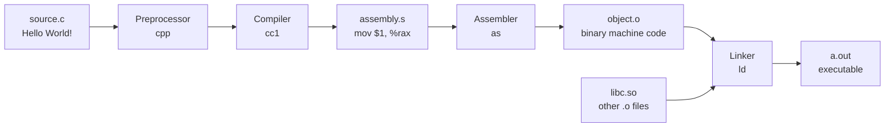

# Preprocessor and Compilation Pipeline

> [!summary] Goal
> Master the C compilation pipeline (preprocess → compile → assemble → link), the preprocessor directives (`#define`, `#include`, `#ifdef`, `#pragma`, `##`, `#`), and GCC/Clang compiler flags. Essential for understanding how C code becomes an executable and for OS development (freestanding environments).

## Table of Contents

1. [The Four Stages of Compilation](#the-four-stages-of-compilation)
2. [Preprocessor Directives](#preprocessor-directives)
3. [Object-like and Function-like Macros](#object-like-and-function-like-macros)
4. [Conditional Compilation](#conditional-compilation)
5. [X-Macros](#x-macros)
6. [Compiler Flags Deep Dive](#compiler-flags-deep-dive)
7. [Freestanding Environments](#freestanding-environments)
8. [Pitfalls](#pitfalls)

---

## The Four Stages of Compilation



| Stage | Tool | Input | Output | What it does |
|-------|:----:|:-----:|:------:|--------------|
| **1. Preprocessing** | `cpp` or `gcc -E` | `source.c` | `source.i` | Expands `#include`, `#define`, `#ifdef`, etc. |
| **2. Compilation** | `cc1` or `gcc -S` | `source.i` | `source.s` | Translates C → assembly |
| **3. Assembly** | `as` | `source.s` | `source.o` | Translates assembly → machine code (relocatable) |
| **4. Linking** | `ld` or `gcc` | `*.o` + libraries | `a.out` | Resolves symbols, produces executable or library |

### Observing each stage

```bash
# Preprocess only (see expanded macros, includes)
gcc -E program.c -o program.i

# Compile to assembly (human-readable)
gcc -S program.c -o program.s

# Assemble to object file
gcc -c program.c -o program.o

# Full compilation (all 4 stages)
gcc program.c -o program

# Examine object file symbols
nm program.o
objdump -t program.o

# Examine sections
objdump -h program.o

# Disassemble
objdump -d program.o
```

---

## Preprocessor Directives

> [!info] Preprocessor
> The preprocessor is a text-processing engine that runs **before** the compiler. It handles directives (lines starting with `#`), macro expansion, file inclusion, and conditional compilation. It operates on tokens, not on C syntax.

| Directive | Purpose | Example |
|-----------|---------|---------|
| `#include` | Insert file content | `#include <stdio.h>` |
| `#define` | Define macro | `#define MAX 100` |
| `#undef` | Remove macro | `#undef MAX` |
| `#if` | Conditional (constant expression) | `#if VERSION >= 2` |
| `#ifdef` | If macro defined | `#ifdef DEBUG` |
| `#ifndef` | If macro not defined | `#ifndef HEADER_H` |
| `#elif` | Else-if | `#elif VERSION == 1` |
| `#else` | Else | `#else` |
| `#endif` | End conditional | `#endif` |
| `#error` | Compile-time error | `#error "Unsupported platform"` |
| `#warning` | Compile-time warning | `#warning "Deprecated"` |
| `#line` | Set line number | `#line 100 "file.c"` |
| `#pragma` | Compiler-specific instructions | `#pragma once` |
| `_Pragma()` | `#pragma` as a string | `_Pragma("GCC poison malloc")` |

### Include guards

```c
// header.h — prevents double inclusion
#ifndef HEADER_H
#define HEADER_H

// ... declarations ...

#endif

// Alternative (non-standard but widely supported):
#pragma once
```

---

## Object-like and Function-like Macros

> [!info] Macro
> A preprocessor macro is a name that expands to C tokens before compilation. **Object-like macros** expand to a value. **Function-like macros** take arguments and expand to code. Macros operate on tokens, not values — they're pure text substitution.

### Object-like macros

```c
// Constants
#define MAX_BUFFER_SIZE 4096
#define PI 3.1415926535
#define COMPANY_NAME "Acme Corp"

// Platform detection
#define IS_LINUX
#define IS_X86_64

// Configuration
#define ENABLE_LOGGING 1
#define DEFAULT_PORT 8080

// Usage
int buffer[MAX_BUFFER_SIZE];
```

### Function-like macros

```c
// Simple expression
#define SQUARE(x) ((x) * (x))

// Multiple statements
#define SAFE_FREE(p) do {       \
    if (p) { free(p); p = NULL; } \
} while (0)

// Variadic macro (C99)
#define LOG(fmt, ...) \
    fprintf(stderr, "[LOG] " fmt "\n", ##__VA_ARGS__)

// Usage
int x = SQUARE(5);         // Expands to: ((5) * (5))
SAFE_FREE(ptr);            // Expands to: do { if (ptr) { free(ptr); ptr = NULL; } } while(0)
LOG("count = %d", 42);     // Expands to: fprintf(stderr, "[LOG] count = %d\n", 42);
```

### The `#` and `##` operators

```c
// # — stringify: converts macro argument to string literal
#define STRINGIFY(x) #x
printf("%s\n", STRINGIFY(hello world));   // "hello world"

// ## — token pasting: concatenates two tokens
#define CAT(a, b) a ## b
int xy = 42;
printf("%d\n", CAT(x, y));                // 42 (expands to: xy)

// ## with variadic macros (GCC extension) — removes trailing comma if __VA_ARGS__ is empty
#define ASSERT(cond, ...)                           \
    do {                                             \
        if (!(cond)) {                               \
            fprintf(stderr, "Assertion failed: %s"   \
                    ##__VA_ARGS__ ? ": " : "",       \
                    #cond, ##__VA_ARGS__);           \
            abort();                                 \
        }                                            \
    } while (0)

ASSERT(x > 0);            // OK: no extra args
ASSERT(x > 0, "x was %d", x);  // OK: with message
```

### Predefined macros

```c
// Standard predefined macros
__FILE__         // Current source file name ("program.c")
__LINE__         // Current line number (42)
__DATE__         // Compilation date ("May  9 2026")
__TIME__         // Compilation time ("14:30:00")
__STDC__         // 1 if standard C compiler
__STDC_VERSION__ // C standard version (201112L for C11, 201710L for C17)

// GCC/Clang
__GNUC__         // Major version (14)
__GNUC_MINOR__   // Minor version
__x86_64__       // Defined on x86-64
__linux__        // Defined on Linux

// Usage
printf("Compiled: %s %s (%s:%d)\n", __DATE__, __TIME__, __FILE__, __LINE__);
```

---

## Conditional Compilation

```c
// Platform-specific code
#ifdef __linux__
    #include <unistd.h>
    const char *os = "Linux";
#elif defined(_WIN32)
    #include <windows.h>
    const char *os = "Windows";
#else
    const char *os = "Unknown";
#endif

// Debug builds
#ifdef DEBUG
    #define DEBUG_PRINT(fmt, ...) \
        fprintf(stderr, "[DEBUG] %s:%d: " fmt "\n", __FILE__, __LINE__, ##__VA_ARGS__)
#else
    #define DEBUG_PRINT(fmt, ...) ((void)0)
#endif

// Feature detection
#if __STDC_VERSION__ >= 201112L
    // C11 features available
    #define HAVE_STATIC_ASSERT
#endif

// Compile-time assertions
#if MAX_BUFFER_SIZE < 256
    #error "MAX_BUFFER_SIZE must be at least 256"
#endif
```

### Common patterns

```c
// API export/import for shared libraries
#if defined(_WIN32) && defined(BUILDING_DLL)
    #define API __declspec(dllexport)
#elif defined(_WIN32)
    #define API __declspec(dllimport)
#else
    #define API __attribute__((visibility("default")))
#endif

API void public_function(void);

// Assert with message
#define ASSERT_MSG(cond, msg)                           \
    do {                                                 \
        if (!(cond)) {                                   \
            fprintf(stderr, "ASSERT: %s (%s at %s:%d)\n",\
                    msg, #cond, __FILE__, __LINE__);     \
            abort();                                     \
        }                                                \
    } while (0)
```

---

## X-Macros

> [!info] X-Macro
> An X-Macro is a technique where a single macro list drives code generation — a list of items is defined once and expanded multiple times with different macro definitions. This eliminates duplication when the same data is needed in multiple forms.

```c
// 1. Define the list (once)
#define COLOR_TABLE \
    X(COLOR_RED,   0xFF0000, "Red")    \
    X(COLOR_GREEN, 0x00FF00, "Green")  \
    X(COLOR_BLUE,  0x0000FF, "Blue")   \
    X(COLOR_BLACK, 0x000000, "Black")

// 2. Use with different X definitions

// Generate enum
#define X(id, value, name) id = value,
typedef enum { COLOR_TABLE } Color;
#undef X

// Generate lookup table
const char *color_names[] = {
#define X(id, value, name) [id] = name,
    COLOR_TABLE
#undef X
};

// Generate switch
const char *get_color_name(Color c) {
    switch (c) {
#define X(id, value, name) case id: return name;
        COLOR_TABLE
#undef X
    }
    return "Unknown";
}

// Now adding a new color requires ONE change — add to COLOR_TABLE
```

---

## Compiler Flags Deep Dive

### Warning flags

```bash
# Essential warnings
gcc -Wall -Wextra -Wpedantic program.c

# Advanced warnings (recommended for production)
gcc -Wall -Wextra -Wpedantic \
    -Wshadow             # Variable shadows another
    -Wstrict-prototypes  # Old-style function declarations
    -Wold-style-definition \
    -Wmissing-prototypes # Non-static functions without prototypes
    -Wconversion         # Implicit type conversions that change value
    -Wdouble-promotion   # Implicit float → double
    -Wformat=2           # printf/scanf format string mismatches
    -Wnull-dereference   # Potential NULL dereference
    -Werror              # Treat warnings as errors (CI)

# Treat as errors
gcc -Wall -Wextra -Werror program.c
```

### Optimization levels

| Flag | Level | Use case |
|------|:-----:|----------|
| `-O0` | None | Debugging — no optimization, fastest compilation |
| `-O1` | Moderate | General debug — small optimizations |
| `-O2` | Standard | **Release builds** — most optimizations |
| `-O3` | Aggressive | Performance-critical — may increase code size |
| `-Os` | Size | Optimize for binary size (embedded, constrained) |
| `-Og` | Debug-optimized | Debug with some optimization (best of -O0 and -O1) |
| `-Ofast` | Unsafe | `-O3` + ignores strict standards (may break code) |

### Debugging and analysis

```bash
# Debug symbols
gcc -g program.c -o program          # Standard debug
gcc -g3 program.c -o program         # Extra debug info (macro definitions)

# Sanitizers (runtime checks)
gcc -fsanitize=address program.c     # Buffer overflows, use-after-free
gcc -fsanitize=undefined program.c   # UB detection
gcc -fsanitize=thread program.c      # Data races
gcc -fsanitize=leak program.c        # Memory leaks

# Coverage
gcc -fprofile-arcs -ftest-coverage program.c -o program
./program
gcov program.c                       # Line-by-line coverage report
```

### Architecture-specific

```bash
# Target-specific optimization
gcc -march=native program.c          # Optimize for current CPU
gcc -march=x86-64-v3 program.c       # For Haswell+ CPUs (AVX2, BMI)
gcc -mtune=native program.c          # Schedule for current CPU

# Code generation
gcc -fPIC program.c                  # Position-independent code (shared libraries)
gcc -fomit-frame-pointer program.c   # Don't keep frame pointer (frees up a register)
gcc -fvisibility=hidden program.c    # Hide symbols by default (smaller/faster shared libs)
```

---

## Freestanding Environments

> [!info] Freestanding environment
> A freestanding environment is one **without** an operating system — no standard library, no `main()`, no OS services. This is the environment for OS kernels, bootloaders, and embedded systems. The standard library is replaced by your own code.

```bash
# Compiling for a freestanding environment (kernel, OS, embedded)
gcc -ffreestanding -nostdlib -nostartfiles -nodefaultlibs \
    -fno-builtin -fno-stack-protector \
    -mno-red-zone -mno-sse -mno-mmx \
    -c kernel.c -o kernel.o
```

```c
// Freestanding kernel entry point (not main!)
// The linker script specifies _start as the entry point
void _start(void) {
    // Setup stack pointer (in assembly, then call kmain)
    kmain();
}

// Kernel code — no standard library available
void kmain(void) {
    // Direct memory access for VGA text mode buffer
    volatile char *vga = (volatile char *)0xB8000;
    
    // Write "Hello" to the top-left of the screen
    vga[0] = 'H';
    vga[1] = 0x0F;  // White on black
    vga[2] = 'e';
    vga[3] = 0x0F;
    // ...
    
    // Halt
    while (1) { asm volatile("hlt"); }
}
```

### Required for freestanding

```c
// Must provide these yourself (compiler may emit calls to them)
void *memcpy(void *dest, const void *src, size_t n);
void *memset(void *s, int c, size_t n);
void *memmove(void *dest, const void *src, size_t n);
int memcmp(const void *s1, const void *s2, size_t n);

// For -O0 and division
// May also need: __udivdi3, __umoddi3 (software division for 64-bit on 32-bit)
```

---

## Pitfalls

### Macro argument side effects

```c
#define SQUARE(x) ((x) * (x))
int y = SQUARE(++x);    // Expands to: ((++x) * (++x)) — increments TWICE! UB!

// Fix: never use side effects in macro arguments
// Or use a static inline function instead
static inline int square(int x) { return x * x; }
```

### Missing parentheses in macros

```c
#define DOUBLE(x) x + x
int y = DOUBLE(5) * 2;  // Expands to: 5 + 5 * 2 = 15, NOT 20!

// Fix: always wrap macro body and arguments in parentheses
#define DOUBLE(x) ((x) + (x))
```

### Multi-statement macro without do-while

```c
#define SWAP(a, b) do { \
    typeof(a) tmp = a; a = b; b = tmp; \
} while (0)
```

### Compiler flag ordering

GCC processes flags left-to-right. `-l` (libraries) should come **after** source files:

```bash
# CORRECT
gcc program.c -lm -lpthread

# WRONG
gcc -lm program.c
```

---

> [!question]- Interview Questions
>
> **Q: What are the four stages of compilation in C?**
> A: (1) Preprocessing — expands `#include`, `#define`, conditional compilation. (2) Compilation — translates C to assembly language. (3) Assembly — translates assembly to relocatable machine code (object file). (4) Linking — combines object files and libraries into an executable, resolves symbol references.
>
> **Q: What is the difference between `#include <file.h>` and `#include "file.h"`?**
> A: `#include <file.h>` searches system include paths (`/usr/include`, etc.). `#include "file.h"` searches the current directory first, then system paths. Use `<>` for standard library headers, `""` for project headers.
>
> **Q: What are the dangers of function-like macros?**
> A: (1) Side effects from arguments evaluated multiple times (`SQUARE(++x)`). (2) Missing parentheses cause operator precedence bugs. (3) No type checking. (4) Hard to debug (expanded code differs from source). Prefer `static inline` functions when possible.
>
> **Q: What is the `##` operator in the preprocessor?**
> A: `##` (token pasting) concatenates two tokens into one. `CAT(x, y)` where `x=1` and `y=2` produces the token `12`. Used for generating identifiers, X-macros, and type-generic code.
>
> **Q: What compiler flags do you use for kernel development?**
> A: `-ffreestanding -nostdlib -nostartfiles -nodefaultlibs -fno-builtin -fno-stack-protector` — these tell the compiler it can't rely on the standard library or OS, which is essential when writing the OS itself.

---

## Cross-Links

- [[C/01_Foundations/07_Header_Files_Modules_and_Storage_Classes]] for `extern` and linkage
- [[C/02_Core/08_Build_Systems_and_Makefiles]] for Makefiles and CMake
- [[C/03_Advanced/07_Inline_Assembly_ABI_and_Calling_Conventions]] for linker scripts
- [[C/04_Playbooks/02_Use_Sanitizers_ASan_UBSan_TSan]] for sanitizer flags
- [[C/01_Foundations/01_C_Basics_and_Pointers]] for function-like macro alternatives
