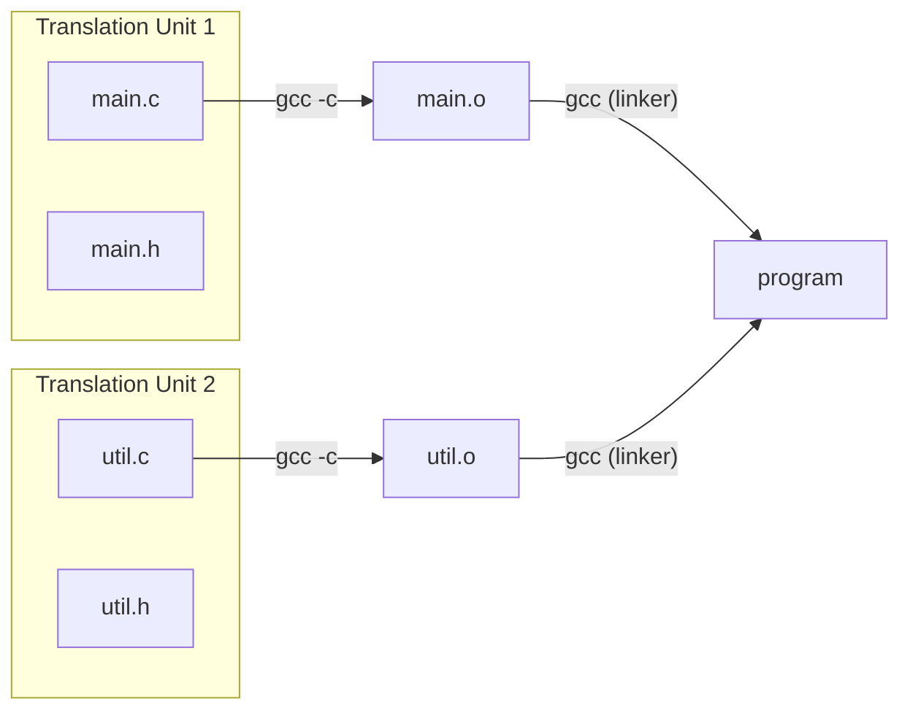
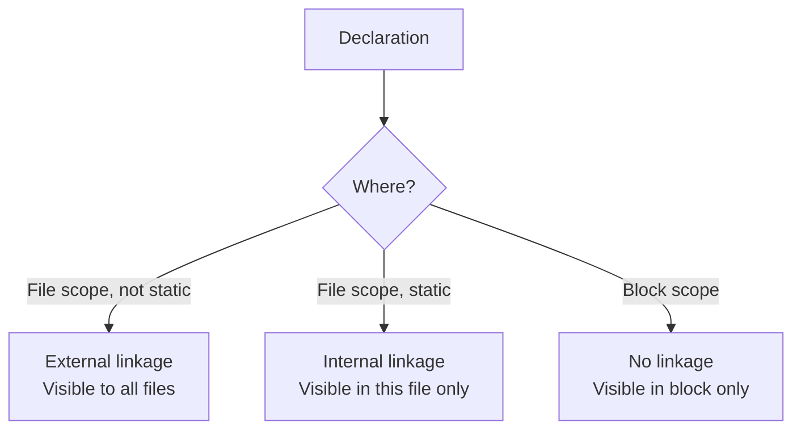

# Header Files, Modules, and Storage Classes

> [!summary] Goal
> Understand how C programs are organized into multiple files, the linkage rules (external vs internal), storage class specifiers (`static`, `extern`, `volatile`, `register`, `_Thread_local`), and how to structure header files for large projects.

## Table of Contents

1. [Multiple Compilation Units](#multiple-compilation-units)
2. [Header File Best Practices](#header-file-best-practices)
3. [Storage Classes](#storage-classes)
4. [Linkage: External vs Internal](#linkage-external-vs-internal)
5. [volatile](#volatile)
6. [Pitfalls](#pitfalls)

---

## Multiple Compilation Units

> [!info] Translation unit
> A **translation unit** is the basic unit of compilation: a `.c` file with all its included `.h` files after preprocessing. Each `.c` file is compiled independently into a `.o` object file. The linker then combines all `.o` files into an executable or library.



```bash
# Compile each .c file independently
gcc -c main.c -o main.o
gcc -c util.c -o util.o

# Link all object files
gcc main.o util.o -o program

# Or all in one command
gcc main.c util.c -o program
```

### What goes where

| File type | Purpose | Contains |
|-----------|---------|----------|
| `.h` (header) | **Declaration** — tells other files what exists | Function prototypes, type definitions, macro definitions, `extern` variable declarations |
| `.c` (source) | **Definition** — provides the implementation | Function bodies, global variable definitions |

```c
// math_utils.h — declarations
#ifndef MATH_UTILS_H
#define MATH_UTILS_H

int add(int a, int b);
int multiply(int a, int b);

#endif

// math_utils.c — definitions
#include "math_utils.h"

int add(int a, int b) { return a + b; }
int multiply(int a, int b) { return a + b; }  // Bug! Should be a * b
```

---

## Header File Best Practices

### Include guard (prevents double inclusion)

```c
// option 1: #pragma once (simpler, non-standard but widely supported)
#pragma once

// option 2: classic include guard (standard)
#ifndef MY_HEADER_H
#define MY_HEADER_H

// declarations...

#endif
```

### Forward declarations — avoid unnecessary includes

```c
// file.h — forward declare structs instead of including large headers
// Forward declaration: tells the compiler "this type exists"
struct User;         // Definition is in file.c

// You can use struct User* (pointers) without the full definition
// But NOT sizeof(struct User) or accessing members

void process_user(struct User *user);
```

### Include what you use

```c
// ❌ WRONG: relying on transitive includes
#include "myheader.h"    // myheader.h includes <stdio.h> — fragile!
FILE *f = fopen(...);    // Works, but breaks if myheader.h changes

// ✅ CORRECT: include what you directly use
#include <stdio.h>
#include "myheader.h"
FILE *f = fopen(...);    // Safe regardless of myheader.h's includes
```

### Header file organization

```c
// example_component.h — a well-organized header
#pragma once

#include <stddef.h>     // Dependencies first
#include <stdint.h>

#ifdef __cplusplus
extern "C" {            // Allow C++ compilers to link with C code
#endif

// Public types
typedef struct {
    int x;
    int y;
} Point;

// Public functions
Point point_create(int x, int y);
int point_distance(const Point *a, const Point *b);

#ifdef __cplusplus
}
#endif
```

---

## Storage Classes

> [!info] Storage class specifier
> A storage class specifier determines **where** a variable is stored (register, memory, thread-local), **how long** it lives (automatic, static), and **what scope** it has (file, function, block). C has five storage classes: `auto`, `register`, `static`, `extern`, `_Thread_local`.

### Overview

| Specifier | Lifetime | Scope | Initialization | Typical use |
|-----------|:--------:|:-----:|:--------------:|-------------|
| **`auto`** | Function | Block | Each call | Default for locals (rarely written) |
| **`register`** | Function | Block | Each call | Hint to CPU register (deprecated) |
| **`static` (local)** | Program | Block | Once | Preserve value between calls |
| **`static` (global)** | Program | File | Once | File-private global |
| **`extern`** | Program | Global | Once | Reference a global from another file |
| **`_Thread_local`** | Thread | File/Block | Once per thread | Per-thread data |

### `static` — file scope (internal linkage)

```c
// file.c

// Static global — only visible in this file
// Other files cannot access this variable, even with extern
static int internal_counter = 0;

// Static function — only callable from this file
static void helper(void) {
    internal_counter++;
}
```

### `static` — function scope (persistent)

```c
int next_id(void) {
    static int id = 0;      // Initialized ONCE at program start
    return id++;             // Value persists between calls
}

// first call:  returns 0
// second call: returns 1
// third call:  returns 2
```

### `extern` — referencing across files

```c
// globals.h
#pragma once
extern int shared_counter;    // Declaration — "exists somewhere, not here"

// globals.c
#include "globals.h"
int shared_counter = 0;       // Definition — actually creates the variable

// other.c
#include "globals.h"
void increment(void) {
    shared_counter++;          // OK: accesses the variable defined in globals.c
}
```

### `_Thread_local` (C11)

```c
// Each thread gets its own copy
_Thread_local int errno;       // errno is thread-local

void thread_function(void) {
    static _Thread_local int counter = 0;  // Per-thread persistent value
    counter++;
    printf("Thread calls: %d\n", counter);
}
// Each thread starts at 0 and increments independently
```

---

## Linkage: External vs Internal

> [!info] Linkage
> Linkage determines whether an identifier is visible across translation units. **External linkage** (default for functions and non-static globals) — visible everywhere. **Internal linkage** (`static`) — visible only within its translation unit. **No linkage** (locals) — visible only within its block.



```c
// file_a.c
int global = 5;             // External linkage — visible to all files
static int hidden = 10;      // Internal linkage — only in file_a.c

void func(void) {
    int local = 20;          // No linkage — only in func()
    static int persistent = 0;  // No linkage — but lifetime is program duration
}

// file_b.c
extern int global;            // OK: refers to file_a.c's global
// extern int hidden;         // ERROR: hidden is static, not accessible

void test(void) {
    global = 42;              // OK: modifies file_a.c's global
}
```

### The `static` function pattern

```c
// util.c — internal implementation detail

// Private helper — only used within this file
static int parse_header(const char *data) {
    // complex parsing logic
}

// Public API — callable from other files
int process_data(const char *data) {
    if (!parse_header(data)) {
        return -1;
    }
    // process...
    return 0;
}
```

---

## `volatile`

> [!info] volatile
> `volatile` tells the compiler that a variable's value may change at any time — outside the program's control. The compiler must read from the variable's address every time (no caching in registers) and cannot optimize away accesses. Essential for: hardware registers, signal handlers, multi-threaded access to shared flags.

```c
// Hardware register (memory-mapped I/O)
volatile uint32_t *status_reg = (volatile uint32_t *)0xFFFF0004;

while (*status_reg & BUSY) {   // Compiler MUST re-read from address each time
    // wait for hardware
}

// Variable modified by a signal handler
volatile sig_atomic_t signaled = 0;

void handler(int sig) {
    signaled = 1;              // Signal handler modifies this
}

int main(void) {
    signal(SIGINT, handler);
    while (!signaled) {        // Without volatile, compiler may optimize to:
        // wait                // if (!signaled) while (1) — infinite loop!
    }
}
```

### When to use volatile

| Scenario | Example | volatile needed? |
|----------|---------|:----------------:|
| Memory-mapped device register | `*reg = value;` | ✅ Yes |
| Signal handler flag | `int flag; handler() { flag = 1; }` | ✅ Yes |
| Thread synchronization | `int ready; thread1 sets it` | ❌ No (use atomics) |
| Shared variable, no special context | `int counter;` across functions | ❌ No |

> [!warning] volatile is not a synchronization primitive
> `volatile` does NOT provide atomicity or memory ordering. For multi-threaded code, use C11 atomics (`<stdatomic.h>`) instead of `volatile`. `volatile` + `sig_atomic_t` is only safe for signal handlers, not threads.

---

## Pitfalls

### Missing `extern` in header

```c
// globals.h
#pragma once
int shared_counter;     // ❌ WRONG! This is a DEFINITION, not a declaration.
                         // Every file including globals.h gets its own copy!
                         // Linker error: "multiple definition of shared_counter"

// Correct
extern int shared_counter;  // Declaration — just promises it exists
```

### Circular include dependencies

```c
// a.h
#pragma once
#include "b.h"
struct A { struct B *b; };

// b.h
#pragma once
#include "a.h"
struct B { struct A *a; };

// This works because both use pointers (forward declarations would be sufficient)
// But if structs contained values (not pointers):
// struct A { struct B b; };  // ERROR: B not yet defined
// Fix: use forward declarations for pointer fields
```

### Missing `static` on file-private functions

Without `static`, private helper functions pollute the global namespace and can conflict with identical names in other files. Always mark file-internal functions as `static`.

### Too-large translation units

A 10,000-line `.c` file is hard to compile, link, and maintain. Split by module: `lexer.c`, `parser.c`, `codegen.c` — each with its own header. This also enables parallel compilation.

---

> [!question]- Interview Questions
>
> **Q: What is the difference between a declaration and a definition?**
> A: A **declaration** tells the compiler that a variable or function exists with a given type. A **definition** allocates storage and provides the implementation. You can declare something many times but define it only once. `extern int x;` is a declaration; `int x = 5;` is a definition.
>
> **Q: What does `static` mean in different contexts?**
> A: (1) `static` on a global variable or function: **internal linkage** — only visible in the current file. (2) `static` on a local variable: **persistent lifetime** — initialized once, retains value between calls. (3) `static` on a function: **internal linkage** — not callable from other files.
>
> **Q: What is the purpose of `volatile`?**
> A: `volatile` tells the compiler not to optimize accesses to a variable — it must be read from memory every time and written to memory every time. Used for: memory-mapped hardware registers, variables modified by signal handlers, and variables modified by asynchronous events.
>
> **Q: How do you share a global variable across multiple `.c` files?**
> A: Define the variable in ONE `.c` file: `int shared = 0;`. Declare it with `extern` in a shared header: `extern int shared;`. Any file that includes the header can access it. Avoid globals when possible — prefer getter/setter functions or dependency injection.
>
> **Q: What is the `_Thread_local` storage class?**
> A: `_Thread_local` (C11) gives each thread its own copy of a variable. Each thread initializes its copy independently (once, at first access). Changes in one thread don't affect others. Used for: `errno`, thread-specific caches, per-thread logging context.

---

## Cross-Links

- [[C/01_Foundations/06_Preprocessor_and_Compilation]] for include guards and compilation model
- [[C/01_Foundations/01_C_Basics_and_Pointers]] for pointer fundamentals
- [[C/03_Advanced/02_C11_Atomics_and_Memory_Model]] for `volatile` vs `_Atomic`
- [[C/02_Core/08_Build_Systems_and_Makefiles]] for building multi-file projects
- [[C/03_Advanced/01_Concurrency_with_Pthreads]] for thread-local storage
