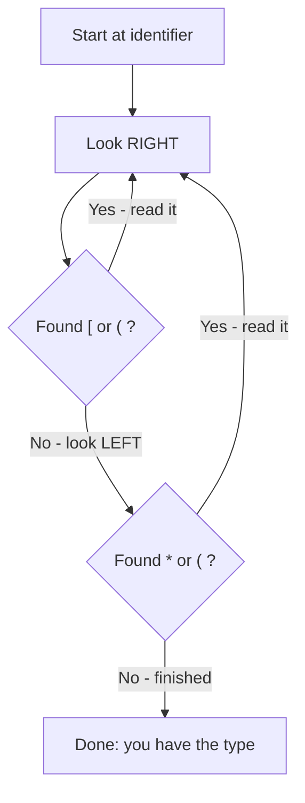

# Enums, Typedef, and Complex Declarations

> [!summary] Goal
> Master C enums (underlying type, scope, flags patterns), typedef (type aliases, function pointer types), and the right-left rule for reading complex declarations. Essential for understanding C library interfaces, system APIs, and data structure definitions.

## Table of Contents

1. [Enumeration Types](#enumeration-types)
2. [Typedef](#typedef)
3. [Reading Complex Declarations — The Right-Left Rule](#reading-complex-declarations-the-right-left-rule)
4. [Complex Declaration Patterns](#complex-declaration-patterns)
5. [Pitfalls](#pitfalls)

---

## Enumeration Types

> [!info] Enumeration
> An `enum` defines a set of named integer constants (enumerators). Enums improve code readability compared to `#define` by grouping related constants and providing type checking (in C++, but not really in C — C treats enums as integers).

```c
// Basic enum
enum Color { RED, GREEN, BLUE };

// Default values: RED=0, GREEN=1, BLUE=2
// Values are assigned sequentially from 0

// Explicit values
enum Status {
    OK = 0,
    ERROR_NOT_FOUND = 404,
    ERROR_TIMEOUT = 408,
    ERROR_SERVER = 500
};

// Enum with unspecified values continue from last
enum Mode {
    MODE_A = 10,
    MODE_B,             // 11
    MODE_C,             // 12
    MODE_D = 20,
    MODE_E              // 21
};
```

### Declaring enum variables

```c
enum Color c = RED;            // C syntax — requires 'enum' keyword

// With typedef (recommended for convenience)
typedef enum { OK, ERROR } Result;
Result r = OK;                 // No 'enum' keyword needed

// Anonymous enum (for constants only — no variables of this type)
enum { MAX_BUFFER = 4096, MAX_CONNECTIONS = 256 };
```

### Enum underlying type (C11)

```c
// C11 allows specifying the underlying type of an enum
enum Small : char { A, B, C };                     // 1 byte instead of int

// GCC extension: __attribute__((packed))
enum __attribute__((packed)) PackedEnum { X, Y, Z };
```

### Enum as flags

```c
// Enums for bit flags (powers of 2)
typedef enum {
    READ   = 1 << 0,   // 1
    WRITE  = 1 << 1,   // 2
    EXEC   = 1 << 2,   // 4
    DELETE = 1 << 3    // 8
} Permission;

Permission perms = READ | WRITE;        // Combine: 3
if (perms & READ) { /* can read */ }     // Test: true
if (perms & EXEC) { /* can exec */ }     // Test: false

// Remove a flag
perms &= ~WRITE;                         // Clear write
```

### Enum naming conventions

```c
// Common patterns:
typedef enum {
    LOG_LEVEL_ERROR,
    LOG_LEVEL_WARN,
    LOG_LEVEL_INFO,
    LOG_LEVEL_DEBUG
} LogLevel;

// Or with a common prefix using X macros
// (or simply use short unique names since C enum scoping is weak)
```

---

## Typedef

> [!info] Typedef
> `typedef` creates an **alias** for an existing type. It doesn't create a new type — just another name for the same type. Used for: simplifying complex types, providing abstraction (users don't need to know the underlying type), and portability.

### Basic typedefs

```c
// Simple aliases
typedef unsigned long ulong;
typedef unsigned char byte;
typedef int (*comparator)(const void *, const void *);

// Portable integer types (from <stdint.h>, but you get the idea)
typedef unsigned long long uint64;     // 64-bit unsigned
typedef long long int64;               // 64-bit signed
```

### Typedef for structs

```c
// Without typedef (C style)
struct Point { int x; int y; };
struct Point p1;                        // Must write 'struct' keyword

// With typedef (recommended)
typedef struct { int x; int y; } Point;
Point p2;                               // No 'struct' needed

// Named struct with typedef (needed for self-referential structs)
typedef struct Node Node;
struct Node {
    int value;
    Node *next;                         // OK: Node already declared
};
```

### Typedef for function pointers

```c
// Without typedef — hard to read
void sort(int *arr, int n, int (*compare)(const void *, const void *));

// With typedef — clearer
typedef int (*compare_fn)(const void *, const void *);
void sort(int *arr, int n, compare_fn compare);

// Array of function pointers
typedef void (*handler_fn)(int signal);
handler_fn handlers[10];

// Function returning a function pointer
typedef int (*operation_fn)(int, int);
operation_fn get_operation(char op);
```

### typedef vs #define for types

```c
typedef char *string_ptr;     // string_ptr is a pointer to char
#define STRING_PTR char *     // STRING_PTR is just text substitution

string_ptr a, b;              // Both are char*: a and b are pointers
STRING_PTR c, d;              // Only c is char*; d is just char!
// #define is text-level — it doesn't understand types
```

---

## Reading Complex Declarations — The Right-Left Rule

> [!info] Right-Left Rule
> To read a C declaration: start at the identifier, go **right** as far as possible (to `]`, `)`, or end), then go **left** past `*`, `()`, `[]`. Repeat until everything is parsed. "Declare X as ..."



### Step-by-step examples

```c
// Example 1: int *p[5]
//   p ------------> [5] (right: array of 5)
//   int * <--------     (left: pointer to int)
// Result: p is an array of 5 pointers to int

// Example 2: int (*p)[5]
//   p ------------------------> ) (right: nothing, go left)
//   (*p) <--------------------  (left: pointer)
//   p ---------------------------> [5] (right: array of 5)
//   int <----------------------- (left: int)
// Result: p is a pointer to an array of 5 ints

// Example 3: int *f(void)
//   f -------> (void)  (right: function taking void)
//   int * <--          (left: returns pointer to int)
// Result: f is a function taking void, returning pointer to int

// Example 4: int (*f)(void)
//   f ---------------------> ) (right: nothing, go left)
//   (*f) <-----------------    (left: pointer)
//   f --------------------------> (void) (right: function taking void)
//   int <------------------------ (left: returns int)
// Result: f is a pointer to a function taking void, returning int
```

### Practice declarations

| Declaration | Right-Left Reading | Meaning |
|-------------|-------------------|---------|
| `int *p` | p → (nothing) ← * ← int | p is a pointer to int |
| `int *p[5]` | p → [5] ← * ← int | p is an array[5] of pointer to int |
| `int (*p)[5]` | p → (→[5]) ← * ← int | p is a pointer to array[5] of int |
| `int *f()` | f → () ← * ← int | f is a function returning pointer to int |
| `int (*f)()` | f → (→()) ← * ← int | f is a pointer to function returning int |
| `int (*f[5])()` | f → [5] → (→()) ← * ← int | f is an array[5] of pointer to function returning int |
| `void (*signal(int, void (*)(int)))(int)` | signal → (int, fp) ← * ← (→(int)) ← void | signal is a function taking (int, pointer to function taking int returning void) returning pointer to function taking int returning void |

---

## Complex Declaration Patterns

### The "Ultimate" declaration — signal()

```c
// From <signal.h>: the signal() function
void (*signal(int sig, void (*handler)(int)))(int);

// Using the right-left rule:
// 1. signal → (int, void (*)(int)) — signal is a function taking (int, pointer to function...)
// 2. ← * — returns a pointer
// 3. → (int) — to a function taking int
// 4. ← void — returning void

// Simplified with typedef:
typedef void (*sighandler_t)(int);
sighandler_t signal(int sig, sighandler_t handler);
```

### OS-level declaration example

```c
// From POSIX: the sigaction structure (simplified)
struct sigaction {
    void     (*sa_handler)(int);           // Pointer to signal handler function
    void     (*sa_sigaction)(int, siginfo_t *, void *);  // Alternate handler
    sigset_t sa_mask;
    int      sa_flags;
};

// Function taking a struct and returning a pointer to a function
// int (*)(int) get_handler(const struct sigaction *sa);
typedef int (*handler_t)(int);
handler_t get_handler(const struct sigaction *sa);
```

---

## Pitfalls

### Forgetting the terminating semicolon in typedef

```c
typedef struct { int x, y; } Point  // ❌ Missing ; — compiler error on next line!
```

### Enum scope collision

C enums have **weak scoping** — enumerator names leak into the surrounding scope:

```c
enum Color { RED, GREEN, BLUE };
int RED = 5;                          // ❌ ERROR! RED already declared
```

In C11, there's no fix for this. Either use unique prefixes (`COLOR_RED`), or use `(enum Color)0` explicitly.

### Typedef hiding pointer semantics

```c
typedef int *ip;         // "ip is a pointer to int"

ip a, b;                 // Both are int* — OK

void func(ip p) {
    *p = 5;              // OK: p is int*
    p = malloc(...);     // OK: can reassign
}

// Problem: the user may not realize it's a pointer
// Consider not hiding pointer types in typedefs
```

### Declaring multiple function pointers incorrectly

```c
// WRONG — only fp1 is a function pointer; fp2 is int:
int *fp1(), fp2;

// CORRECT — both are function pointers:
int (*fp1)(), (*fp2)();
```

---

> [!question]- Interview Questions
>
> **Q: What is the underlying type of an enum in C?**
> A: In C (before C11), enums are `int`. In C11, you can specify the underlying type: `enum Status : char { OK, ERROR };`. The actual values used must fit in the chosen type. C++ has stricter enum type checking; C treats enums almost interchangeably with integers.
>
> **Q: What is the difference between `typedef` and `#define` for creating type aliases?**
> A: `typedef` is handled by the compiler and understands C type syntax correctly. `#define` is handled by the preprocessor — it's pure text substitution and doesn't understand types. `typedef char *string_ptr; string_ptr a, b;` — both a and b are pointers. `#define STRING_PTR char *; STRING_PTR a, b;` — only a is a pointer, b is just char.
>
> **Q: Use the right-left rule to explain `int (*fp[3])(int)`.**
> A: Start at fp: go right → [3] (array of 3), go left → * (pointer), go right → (int) (function taking int), go left → int (returning int). Result: fp is an array of 3 pointers to functions taking int and returning int.
>
> **Q: What is the problem with `signal()`'s declaration and how does typedef help?**
> A: `void (*signal(int, void (*)(int)))(int)` is extremely hard to read. Using `typedef void (*sighandler_t)(int); sighandler_t signal(int, sighandler_t);` makes it clear: signal takes an int and a signal handler, returns a signal handler. The typedef abstracts away the function pointer syntax.
>
> **Q: Why use an enum instead of `#define` for constants?**
> A: (1) Enums group related constants. (2) Enums can be used as function parameter types (documentation). (3) Debuggers can show enum names instead of raw numbers. (4) Enums are scoped to a type (in C++, partially in C11). (5) The compiler can warn about unhandled enum values in switch statements. However, `#define` gives you more control over the exact value and works in preprocessor conditions.

---

## Cross-Links

- [[C/01_Foundations/01_C_Basics_and_Pointers]] for function pointer basics
- [[C/01_Foundations/05_Structs_Unions_and_Bit_Fields]] for struct typedef patterns
- [[C/02_Core/01_Function_Pointers_Callbacks_and_vtables]] for function pointers deep dive
- [[C/01_Foundations/06_Preprocessor_and_Compilation]] for `#define` vs `typedef`
- [[C/01_Foundations/07_Header_Files_Modules_and_Storage_Classes]] for extern declarations
