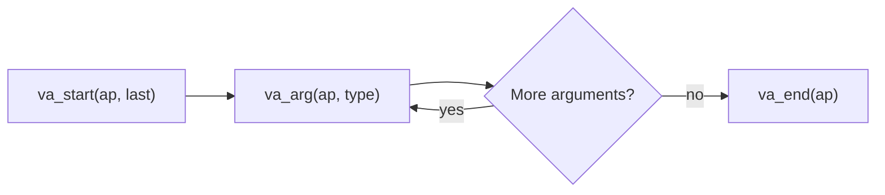

# Variadic Functions (`stdarg.h`)

> [!summary] Goal
> Master C variadic functions: declare, implement, and call functions that accept a variable number of arguments. Understand `va_list`, `va_start`, `va_arg`, `va_end`, `va_copy`, the `vprintf` family, and how variadic dispatch works at the ABI level. Essential for custom logging, error formatting, printf-like APIs, and generic container libraries.

## Table of Contents

1. [Why Variadic Functions Exist](#why-variadic-functions-exist)
2. [Core API](#core-api)
3. [Writing a Variadic Function](#writing-a-variadic-function)
4. [How va_arg Works Internally](#how-vaarg-works-internally)
5. [The vprintf Family](#the-vprintf-family)
6. [Variadic Wrappers and Forwarding](#variadic-wrappers-and-forwarding)
7. [Type Safety and Pitfalls](#type-safety-and-pitfalls)

---

## Why Variadic Functions Exist

> [!info] Variadic function
> A variadic function accepts a variable number of arguments. The number and types of arguments are determined at runtime. The interface consists of `<stdarg.h>` macros that traverse the argument list. The most familiar example is `printf(format, ...)` — the format string determines how many additional arguments are expected and what their types are.

Variadic functions solve:
- Flexible output formatting (printf, fprintf, sprintf)
- Error reporting with variable context (log_error, warn)
- Type-generic operations (building lists, calling callbacks)
- Open-ended APIs where argument count varies by use case

```c
#include <stdio.h>
#include <stdarg.h>

// The ellipsis (...) marks a variadic function
int printf(const char *format, ...);
```

---

## Core API

```c
#include <stdarg.h>

// Type
va_list ap;                  // Opaque type holding argument traversal state

// Macros (implemented as compiler builtins)
void va_start(va_list ap, last_named);
//      Initialize ap to point after last_named parameter.
//      Must be called before any va_arg() or va_copy().

type va_arg(va_list ap, type);
//      Retrieve the next argument and advance ap.
//      type must be the promoted type (integer promotions apply!).

void va_end(va_list ap);
//      Clean up ap. Must be called after traversal is done.
//      Safe to call even if no arguments were read.

void va_copy(va_list dest, va_list src);
//      Copy src to dest (for multiple traversals or deferred processing).
//      C99+. dest must be separately va_ended().
```

### Lifecycle



---

## Writing a Variadic Function

### Fixed named parameter + ellipsis

```c
// Every variadic function must have at least one named parameter
// before the ellipsis. The named parameter tells va_start where
// to begin reading the variable arguments.

#include <stdarg.h>
#include <stdio.h>

// Sum a variable number of integers.
// The first parameter 'count' tells us how many integers follow.
int sum(int count, ...) {
    va_list ap;
    va_start(ap, count);      // Initialize: ap points to first variadic arg

    int total = 0;
    for (int i = 0; i < count; i++) {
        total += va_arg(ap, int);  // Retrieve each argument as int
    }

    va_end(ap);               // Clean up
    return total;
}

int main(void) {
    int s = sum(4, 10, 20, 30, 40);    // s = 100
    printf("sum = %d\n", s);
    return 0;
}
```

### Custom logging function

```c
#include <stdarg.h>
#include <stdio.h>
#include <time.h>

// Custom logger with format string
// log(LOG_ERROR, "file %s line %d: %s", filename, line, message);

typedef enum { LOG_INFO, LOG_WARN, LOG_ERROR } LogLevel;

void log_message(LogLevel level, const char *format, ...) {
    va_list ap;
    va_start(ap, format);

    // Timestamp
    time_t now = time(NULL);
    struct tm *tm = localtime(&now);
    char timebuf[32];
    strftime(timebuf, sizeof(timebuf), "%Y-%m-%d %H:%M:%S", tm);

    // Level string
    const char *level_str[] = {"INFO", "WARN", "ERROR"};

    fprintf(stderr, "[%s] %s: ", timebuf, level_str[level]);
    vfprintf(stderr, format, ap);   // Forward to vfprintf
    fprintf(stderr, "\n");

    va_end(ap);
}

// Usage:
// log_message(LOG_ERROR, "Connection failed: %s (errno=%d)", strerror(errno), errno);
```

### Format string with error details

```c
// Format an error message into a dynamically allocated string.
// Caller must free the returned string.

char *format_error(const char *context, const char *format, ...) {
    va_list ap1, ap2;
    va_start(ap1, format);
    va_copy(ap2, ap1);              // Copy for two-pass approach

    // First pass: determine required size
    int n = vsnprintf(NULL, 0, format, ap1);
    if (n < 0) {
        va_end(ap1);
        va_end(ap2);
        return NULL;
    }

    // Second pass: actually format
    char *buf = malloc((size_t)(n + 32));
    if (!buf) {
        va_end(ap1);
        va_end(ap2);
        return NULL;
    }

    // Write context prefix, then formatted message
    int written = sprintf(buf, "[%s] ", context);
    vsnprintf(buf + written, (size_t)(n + 1), format, ap2);

    va_end(ap1);
    va_end(ap2);
    return buf;
}
```

---

## How va_arg Works Internally

> [!info] ABI-level mechanism
> On x86-64 (System V AMD64 ABI), the first 6 integer arguments are passed in registers (`rdi`, `rsi`, `rdx`, `rcx`, `r8`, `r9`), and the first 8 floating-point arguments in `xmm0`–`xmm7`. Variadic functions must save the register arguments to the **register save area** (a 48-byte region in the caller's stack frame). `va_list` points into this save area for the first 6 arguments and onto the stack for arguments 7+.

```c
// Simplified x86-64 va_list structure (actual definition in GCC):
typedef struct {
    unsigned int gp_offset;          // Offset in the register save area (0-48)
    unsigned int fp_offset;          // Offset in the FP register save area (0-128?)
    void *overflow_arg_area;         // Pointer to stack arguments (7th+)
    void *reg_save_area;             // Pointer to saved register buffer
} va_list[1];

// va_arg(ap, int):
//   if (ap->gp_offset < 48) {
//       int val = *(int *)(ap->reg_save_area + ap->gp_offset);
//       ap->gp_offset += 8;   // Advance by 8 (registers are 8 bytes)
//       return val;
//   } else {
//       int val = *(int *)ap->overflow_arg_area;
//       ap->overflow_arg_area += 8;
//       return val;
//   }

// This is why va_arg requires the actual type — it needs the size
// to advance correctly through the save area or stack.
```

### Default argument promotions

```c
// IMPLICIT INTEGER PROMOTIONS in variadic calls:
//   char   → int            (via integer promotion)
//   short  → int            (via integer promotion)
//   float  → double         (via default argument promotion)
//   enum   → int

// These happen BEFORE the argument is passed, so va_arg MUST use
// the promoted type:

void print_values(int count, ...) {
    va_list ap;
    va_start(ap, count);

    for (int i = 0; i < count; i++) {
        // ❌ WRONG: if caller passes a float, it was promoted to double
        // float val = va_arg(ap, float);

        // ✅ CORRECT: always use the promoted type
        double val = va_arg(ap, double);
        printf("%f\n", val);
    }

    va_end(ap);
}

// For char/short:
void print_chars(int count, ...) {
    va_list ap;
    va_start(ap, count);

    for (int i = 0; i < count; i++) {
        // ❌ WRONG: char is promoted to int
        // char c = va_arg(ap, char);

        // ✅ CORRECT:
        int c = va_arg(ap, int);   // Or use char after range check
        printf("%c ", c);
    }

    va_end(ap);
}
```

### Performance cost

```text
Calling a variadic function has a cost compared to a fixed-argument function:
  1. Caller must save register arguments to the register save area (x86-64).
  2. No prototype checking for variadic arguments (no type safety).
  3. Argument traversal is slower than direct access (register save area is on the stack).
  4. Some optimizations disabled (inlining is harder).

For hot paths, consider:
  - Type-safe wrappers with fixed arguments.
  - Using va_list + vfprintf only when needed.
  - Macros with __VA_ARGS__ for compile-time dispatch.
```

---

## The vprintf Family

The `v...` functions accept a `va_list` instead of `...`. They are the bridge between variadic functions and formatted output.

```c
#include <stdio.h>
#include <stdarg.h>

// The full vprintf family:
int vprintf(const char *format, va_list ap);         // stdout
int vfprintf(FILE *stream, const char *format, va_list ap);  // file stream
int vsprintf(char *str, const char *format, va_list ap);     // buffer (unbounded!)
int vsnprintf(char *str, size_t size, const char *format, va_list ap);  // bounded
int vdprintf(int fd, const char *format, va_list ap);       // POSIX, file descriptor
int vasprintf(char **str, const char *format, va_list ap);  // GNU, allocates buffer

// Practical: format into a fixed buffer safely
void log_error(const char *file, int line, const char *fmt, ...) {
    va_list ap;
    va_start(ap, fmt);

    char buf[1024];
    int n = snprintf(buf, sizeof(buf), "[%s:%d] ", file, line);
    if (n < (int)sizeof(buf)) {
        vsnprintf(buf + n, (size_t)(sizeof(buf) - n), fmt, ap);
    }
    fprintf(stderr, "%s\n", buf);

    va_end(ap);
}
```

### vfprintf callback pattern

```c
// Register a custom output handler that receives va_list.
// Useful for libraries that must not depend on how output is handled.

typedef void (*output_fn)(const char *format, va_list ap);

void default_output(const char *format, va_list ap) {
    vfprintf(stdout, format, ap);
}

static output_fn current_output = default_output;

void set_output_handler(output_fn fn) {
    current_output = fn;
}

void my_printf(const char *format, ...) {
    va_list ap;
    va_start(ap, format);
    current_output(format, ap);
    va_end(ap);
}

// Usage:
// set_output_handler(my_custom_logger);
// my_printf("value = %d\n", 42);
```

---

## Variadic Wrappers and Forwarding

### Forwarding variadic arguments

```c
// ❌ YOU CANNOT forward variadic arguments directly:
// void wrapper(const char *fmt, ...) {
//     my_printf(fmt, ...);   // ILLEGAL: ... cannot be forwarded
// }

// ✅ Correct: use va_list + v... functions
void wrapper(const char *fmt, ...) {
    va_list ap;
    va_start(ap, fmt);
    vfprintf(stderr, fmt, ap);   // Forward via vfprintf
    va_end(ap);
}
```

### Multiple traversals with va_copy

```c
#include <stdarg.h>

// Sometimes you need to traverse the argument list more than once:
// 1. First pass: calculate required buffer size
// 2. Second pass: actually format into the buffer

char *format_list(const char *separator, ...) {
    va_list ap1, ap2;
    va_start(ap1, separator);
    va_copy(ap2, ap1);              // Save copy for second pass

    // First pass: count arguments and total length
    int count = 0;
    size_t total = 0;
    const char *s;
    while ((s = va_arg(ap1, const char *)) != NULL) {
        count++;
        total += strlen(s);
    }
    total += (size_t)(count - 1) * strlen(separator) + 1;

    // Second pass: build the string
    char *result = malloc(total);
    if (!result) { va_end(ap1); va_end(ap2); return NULL; }

    char *p = result;
    const char *sep = "";
    while ((s = va_arg(ap2, const char *)) != NULL) {
        p += sprintf(p, "%s%s", sep, s);
        sep = separator;
    }

    va_end(ap1);
    va_end(ap2);
    return result;
}
```

### Variadic macro wrapper

```c
// Macros can accept variable arguments with __VA_ARGS__.
// This is compile-time — different from runtime va_list.

#define log_debug(fmt, ...) \
    do { \
        fprintf(stderr, "[DEBUG] %s:%d: ", __FILE__, __LINE__); \
        fprintf(stderr, fmt, ##__VA_ARGS__); \
        fprintf(stderr, "\n"); \
    } while (0)

// The ## before __VA_ARGS__ is a GNU extension:
//   - If __VA_ARGS__ is empty, the preceding comma is removed.
//   - log_debug("hello") expands to: fprintf(stderr, "hello");
//   - Without ##: log_debug("hello") → fprintf(stderr, "hello", );  // trailing comma

// C23 standardizes __VA_OPT__ for this:
// #define log_debug(fmt, ...) \
//     fprintf(stderr, "[DEBUG] " fmt "\n" __VA_OPT__(, ) __VA_ARGS__)
```

---

## Type Safety and Pitfalls

### No type checking on variadic arguments

```c
// The compiler does NOT check variadic argument types.
// This compiles without warning (unless format attribute is used):

printf("%s", 42);      // Undefined behavior: expects char*, passes int

// GCC/Clang format attribute adds compile-time checking:
__attribute__((format(printf, 1, 2)))
void my_printf(const char *fmt, ...);

// With __attribute__((format)), the compiler checks format string
// against argument types — like it does for printf itself.
```

### Forgetting va_end

```c
// va_end is REQUIRED even if no arguments were read.
// On some architectures, va_start allocates stack space that va_end frees.

void bad_func(int x, ...) {
    va_list ap;
    va_start(ap, x);
    // ... no va_arg calls ...
    // ❌ Missing va_end — possible resource leak
}
```

### va_arg with wrong type

```c
// The behavior is UNDEFINED if the type passed to va_arg doesn't match
// the actual promoted type of the argument.

void print_int(int count, ...) {
    va_list ap;
    va_start(ap, count);

    // ❌ BAD: if caller passes a long long, va_arg(ap, int) reads only 4 bytes
    // int val = va_arg(ap, int);

    for (int i = 0; i < count; i++) {
        long long val = va_arg(ap, long long);  // Must MATCH caller's type
        printf("%lld\n", val);
    }

    va_end(ap);
}
```

---

> [!question]- Interview Questions
>
> **Q: How does va_arg know where the next argument is on x86-64?**
> A: The callee's `va_list` contains a pointer to a register save area (set up by the caller using a specialized variadic entry sequence) and an overflow area pointer for stack-based arguments. `va_arg` reads the current position, advances by `sizeof(type)` (rounded to the register width), and returns the value. The first 6 integer arguments are in the save area; beyond that they're on the stack.
>
> **Q: Why can't you forward `...` from one function to another?**
> A: The `...` token expands to nothing at the language level — there's no standard mechanism to "repackage" variadic arguments. You must convert them to a `va_list` with `va_start` and pass the `va_list` to the target function, which must accept a `va_list` parameter (the `v...` family of functions).
>
> **Q: What default argument promotions apply to variadic arguments?**
> A: Integer promotions: `char` and `short` become `int` (or `unsigned int` if `int` can't represent all values). `float` becomes `double`. This is why you must always use `va_arg(ap, int)` and `va_arg(ap, double)` for these types. Using `va_arg(ap, float)` is undefined behavior.

---

## Cross-Links

- [[C/01_Foundations/10_Standard_Library_Utilities]] for `stdint.h`, `inttypes.h`, `stddef.h`
- [[C/02_Core/03_Error_Handling]] for error-return patterns used alongside variadic logging
- [[C/03_Advanced/09_GNU_C_Extensions_and_Compiler_Attributes]] for `__attribute__((format))`
- [[C/02_Core/02_File_IO_and_POSIX_System_Calls]] for `vfprintf` to file descriptors
