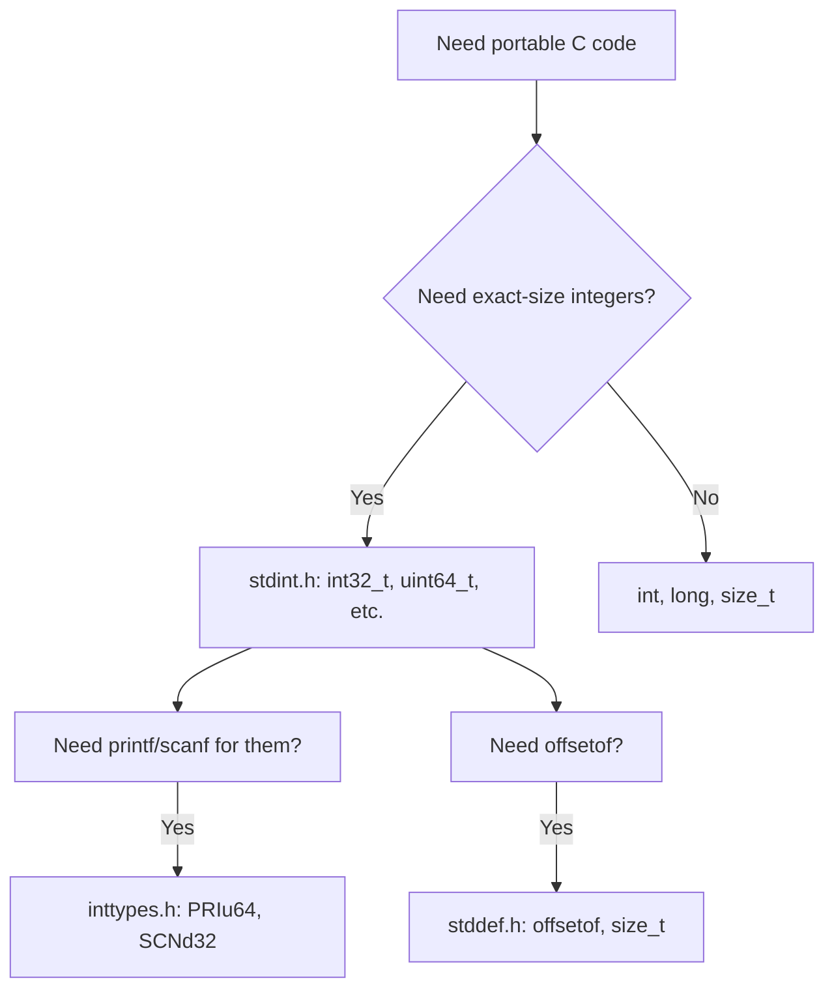

# Standard Library Utilities: `<stddef.h>`, `<stdint.h>`, `<inttypes.h>`, and Friends

> [!summary] Goal
> Master the C standard utility headers that provide portable type definitions, integer width guarantees, format specifier macros, and type limits. Essential for writing portable C code across platforms (x86, ARM, embedded, kernel).

## Table of Contents

1. [Why Utility Headers Matter](#why-utility-headers-matter)
2. [stddef.h — Standard Definitions](#stddef-h-standard-definitions)
3. [stdint.h — Exact-Width Integer Types](#stdint-h-exact-width-integer-types)
4. [inttypes.h — Format Specifier Macros](#inttypes-h-format-specifier-macros)
5. [stdbool.h — Boolean Type](#stdbool-h-boolean-type)
6. [stdalign.h — Alignment](#stdalign-h-alignment)
7. [stdnoreturn.h — Non-Returning Functions](#stdnoreturn-h-non-returning-functions)
8. [limits.h — Integer Type Limits](#limits-h-integer-type-limits)
9. [float.h — Floating-Point Limits](#float-h-floating-point-limits)
10. [stdckdint.h — Checked Integer Arithmetic (C23)](#stdckdint-h-checked-integer-arithmetic)
11. [Pitfalls](#pitfalls)

---

## Why Utility Headers Matter

Before these headers, C code was non-portable: `int` might be 16-bit on one platform and 32-bit on another. The C99 standard introduced `<stdint.h>` and `<inttypes.h>` to provide portable, exact-width integer types. These headers are essential for:

- Network protocols (fixed-size packet headers)
- Binary file formats (exact-width fields)
- Embedded systems (mapping to hardware register sizes)
- Kernel development (platform-independent data structures)
- Scientific computing (portable numerical types)



---

## `<stddef.h>` — Standard Definitions

```c
#include <stddef.h>

// Core types
size_t      // Unsigned integer type of the result of sizeof (typically 8 bytes on 64-bit)
ptrdiff_t   // Signed integer type of the result of pointer subtraction
wchar_t     // Wide character type (platform-dependent size, typically 4 bytes on Linux)

// Macro
NULL        // Null pointer constant (typically ((void*)0) or 0)

// Function-like macro
offsetof(type, member)
// Returns the byte offset of `member` from the start of `type`.
// Implemented as a compiler builtin, NOT as a real macro.
// Expands to an integer constant expression of type size_t.
```

### `offsetof` implementation and use

```c
#include <stddef.h>
#include <stdio.h>

struct Packet {
    uint16_t type;        // offset 0
    uint16_t length;      // offset 2
    uint32_t sequence;    // offset 4
    uint64_t timestamp;   // offset 8
    char     payload[];   // offset 16 (flexible array member, C99)
};

int main(void) {
    printf("type      offset = %zu\n", offsetof(struct Packet, type));
    printf("length    offset = %zu\n", offsetof(struct Packet, length));
    printf("sequence  offset = %zu\n", offsetof(struct Packet, sequence));
    printf("timestamp offset = %zu\n", offsetof(struct Packet, timestamp));
    printf("payload   offset = %zu\n", offsetof(struct Packet, payload));

    // Total header size = offset of payload
    printf("header size = %zu\n", offsetof(struct Packet, payload));
    return 0;
}

// Typical implementation (compiler builtin, this is conceptual):
// #define offsetof(type, member) ((size_t)&((type *)0)->member)
```

### `ptrdiff_t` — pointer difference

```c
int arr[10];
int *start = &arr[0];
int *end = &arr[9];

ptrdiff_t diff = end - start;    // 9 (difference in elements, NOT bytes)
// ptrdiff_t is SIGNED — can represent negative differences.
// On 64-bit: typically 8 bytes (signed 64-bit).
// Use %td or %t format specifier for printf.
```

---

## `<stdint.h>` — Exact-Width Integer Types

```c
#include <stdint.h>

// Exact-width types (guaranteed to exist on all C99+ platforms)
int8_t      // exactly 8 bits, signed
uint8_t     // exactly 8 bits, unsigned
int16_t     // exactly 16 bits
uint16_t    // exactly 16 bits
int32_t     // exactly 32 bits
uint32_t    // exactly 32 bits
int64_t     // exactly 64 bits
uint64_t    // exactly 64 bits

// Minimum-width types (at least N bits — may be larger)
int_least8_t    // at least 8 bits
int_least16_t   // at least 16 bits
int_least32_t   // at least 32 bits
int_least64_t   // at least 64 bits

// Fastest minimum-width types (optimized for speed, may be wider)
int_fast8_t     // fastest type that can hold at least 8 bits
int_fast16_t    // fastest type that can hold at least 16 bits
int_fast32_t    // fastest type that can hold at least 32 bits
int_fast64_t    // fastest type that can hold at least 64 bits

// Pointer-sized types
intptr_t     // signed integer capable of holding a pointer
uintptr_t    // unsigned integer capable of holding a pointer

// Maximum-width integer type
intmax_t     // the widest signed integer type (usually int64_t or __int128)
uintmax_t    // the widest unsigned integer type

// Limits (macros for min/max values):
INT8_MIN     INT8_MAX     UINT8_MAX
INT16_MIN    INT16_MAX    UINT16_MAX
INT32_MIN    INT32_MAX    UINT32_MAX
INT64_MIN    INT64_MAX    UINT64_MAX
SIZE_MAX     SIZE_MIN     // size_t limits
PTRDIFF_MIN  PTRDIFF_MAX  // ptrdiff_t limits
INTPTR_MIN   INTPTR_MAX   UINTPTR_MAX
INTMAX_MIN   INTMAX_MAX   UINTMAX_MAX
```

### When to use which type

```text
Type family            Use case
──────────────────────────────────────────────────
int8_t .. uint64_t     Binary formats, network protocols, hardware registers
                       (fixed width is REQUIRED by the spec).

int_leastN_t           Embedded/portable code where you want minimum size
                       but don't need exact width (rare in practice).

int_fastN_t            Performance-critical loops where the widest native
                       type avoids alignment penalties (also rare).
                       Use only when profiling shows it matters.

intptr_t / uintptr_t   Converting pointer ↔ integer for alignment tricks,
                       hash functions, or ABI-level code.

intmax_t / uintmax_t   The widest type available — useful for variadic
                       functions that must accept any integer.

int / long/ long long  General-purpose code where exact width doesn't matter.
                       Default: int (32-bit), long (32 or 64), long long (64).
```

---

## `<inttypes.h>` — Format Specifier Macros

> [!info] PRI / SCN macros
> The `<inttypes.h>` header defines printf (`PRI`) and scanf (`SCN`) format specifier macros for the `<stdint.h>` types. These macros expand to the correct format string for the platform, making printf/scanf code portable.

```c
#include <inttypes.h>

// Format: PRI{format}{width}
//   format: d (signed decimal), u (unsigned), x (hex), o (octal), i (integer)
//   width:  8, 16, 32, 64, PTR, MAX

uint64_t big = UINT64_MAX;
printf("max = %" PRIu64 "\n", big);      // Prints: max = 18446744073709551615

int32_t signed_val = -1000;
printf("val = %" PRId32 "\n", signed_val); // Prints: val = -1000

// Full PRI table:
//   PRIu8   PRIu16  PRIu32  PRIu64     unsigned decimal
//   PRId8   PRId16  PRId32  PRId64     signed decimal
//   PRIx8   PRIx16  PRIx32  PRIx64     hexadecimal (lowercase)
//   PRIX8   PRIX16  PRIX32  PRIX64     hexadecimal (uppercase)
//   PRIo8   PRIo16  PRIo32  PRIo64     octal
//   PRIdPTR PRIuPTR PRIxPTR            intptr_t / uintptr_t
//   PRIdMAX PRIuMAX PRIxMAX            intmax_t / uintmax_t

// SCN table (for scanf):
//   SCNu8   SCNu16  SCNu32  SCNu64
//   SCNd8   SCNd16  SCNd32  SCNd64
//   SCNx8   SCNx16  SCNx32  SCNx64

// Example:
uint32_t port;
sscanf("8080", "%" SCNu32, &port);       // Read uint32_t from string

// size_t / ssize_t:
printf("length = %zu\n", strlen(s));      // %zu for size_t
ssize_t n = read(fd, buf, size);
printf("read %zd bytes\n", n);            // %zd for ssize_t
```

---

## `<stdbool.h>` — Boolean Type

```c
#include <stdbool.h>

// Defines:
bool      // macro expands to _Bool (the built-in boolean type)
true      // macro expands to 1
false     // macro expands to 0

// Usage:
bool is_valid = true;
bool found = (search_result != NULL);

// _Bool rules:
//   - Any non-zero value converts to true (1).
//   - Zero converts to false (0).
//   - _Bool is 1 byte on most platforms.
//   - Assignment to _Bool normalizes: _Bool x = 100;  // x == 1

// ⚠️  C23: bool becomes a keyword, true/false become keywords.
//   #include <stdbool.h> is no longer required.
//   bool, true, false become native language keywords.
```

### bool in real code

```c
#include <stdbool.h>

// Boolean parameters make call sites readable:
typedef struct {
    bool initialized;
    bool verbose;
    bool dry_run;
} Config;

int process_file(const char *path, bool overwrite, bool create_backup) {
    if (overwrite && create_backup) {
        // ...
    }
    return 0;
}
```

---

## `<stdalign.h>` — Alignment (C11)

```c
#include <stdalign.h>

// Defines:
alignas    // macro for _Alignas (alignment specifier)
alignof    // macro for _Alignof (alignment query)

// alignas: specify alignment for a type or variable
alignas(64) int cache_line_aligned;     // Aligned to 64-byte boundary
alignas(4096) char page_buffer[4096];   // Aligned to page boundary

// alignof: query alignment of a type
printf("align of double = %zu\n", alignof(double));    // usually 8
printf("align of int64_t = %zu\n", alignof(int64_t));  // usually 8

// In C23, alignas and alignof become keywords (alignment specifier built-in).
```

---

## `<stdnoreturn.h>` — Non-Returning Functions (C11)

```c
#include <stdnoreturn.h>

// Defines:
noreturn   // macro for _Noreturn (function specifier)

// Functions marked noreturn MUST NOT return to the caller.
// The compiler can optimize call sites (no register saving for return values).

noreturn void fatal_error(const char *msg) {
    fprintf(stderr, "FATAL: %s\n", msg);
    exit(EXIT_FAILURE);
    // No return needed — compiler knows this function never returns.
}

// Without noreturn:
void example(void) {
    fatal_error("boom");  // Compiler may warn: "function declared noreturn"
    // Optional: unreachable() to suppress warnings
}

// C23: [[noreturn]] attribute syntax replaces _Noreturn.
// [[noreturn]] void fatal_error(const char *msg);
```

---

## `<limits.h>` — Integer Type Limits

```c
#include <limits.h>

// Integer type maximum/minimum values:
CHAR_BIT         // Bits in a char (usually 8)
CHAR_MIN         // Minimum value for char (0 if unsigned, -128 if signed)
CHAR_MAX         // Maximum value for char (255 if unsigned, 127 if signed)

SCHAR_MIN        // minimum signed char (-128)
SCHAR_MAX        // maximum signed char (127)
UCHAR_MAX        // maximum unsigned char (255)

SHRT_MIN         // minimum short (-32768)
SHRT_MAX         // maximum short (32767)
USHRT_MAX        // maximum unsigned short (65535)

INT_MIN          // minimum int (-2147483648)
INT_MAX          // maximum int (2147483647)
UINT_MAX         // maximum unsigned int (4294967295)

LONG_MIN         // minimum long
LONG_MAX         // maximum long
ULONG_MAX        // maximum unsigned long

LLONG_MIN        // minimum long long
LLONG_MAX        // maximum long long
ULLONG_MAX       // maximum unsigned long long

MB_LEN_MAX       // maximum multibyte sequence length (usually 6)
```

---

## `<float.h>` — Floating-Point Limits

```c
#include <float.h>

// General:
FLT_RADIX        // Radix of exponent representation (usually 2)
FLT_ROUNDS       // Rounding mode for addition (1 = nearest)

// float (32-bit IEEE 754):
FLT_MIN          // 1.17549435e-38F (smallest positive normalized)
FLT_MAX          // 3.40282347e+38F (largest finite)
FLT_EPSILON      // 1.19209290e-07F (machine epsilon: distance from 1.0 to next)
FLT_DIG          // 6 (decimal digits of precision)
FLT_MANT_DIG     // 24 (bits in mantissa)

// double (64-bit IEEE 754):
DBL_MIN          // 2.2250738585072014e-308
DBL_MAX          // 1.7976931348623157e+308
DBL_EPSILON      // 2.2204460492503131e-016
DBL_DIG          // 15 (decimal digits)
DBL_MANT_DIG     // 53

// long double:
LDBL_MIN, LDBL_MAX, LDBL_EPSILON, LDBL_DIG

// Checking subnormals, infinity, NaN support:
FLT_HAS_SUBNORM  // 1 if subnormals are supported
FLT_TRUE_MIN     // minimum positive subnormal value
```

---

## `<stdckdint.h>` — Checked Integer Arithmetic (C23)

```c
#include <stdckdint.h>

// C23 adds checked arithmetic builtins as type-generic macros.
// They detect overflow without the undefined behavior of signed overflow
// or the complexity of manual bounds checking.

// Returns: true if overflow occurred, false otherwise.
bool ckd_add(type1 *result, type2 a, type3 b);
bool ckd_sub(type1 *result, type2 a, type3 b);
bool ckd_mul(type1 *result, type2 a, type3 b);

// Usage:
int32_t a = INT32_MAX;
int32_t b = 1;
int32_t result;

if (ckd_add(&result, a, b)) {
    fprintf(stderr, "Overflow: %d + %d would overflow\n", a, b);
} else {
    printf("Sum = %d\n", result);
}

// The types can differ — result type determines the overflow detection.
// The operation is performed with the mathematical result, then checked
// against the range of *result's type.

// Before C23: manual checks were error-prone:
if (a > INT32_MAX - b) {
    /* overflow */
}
```

---

## Pitfalls

### `int` size is platform-dependent

`int` is guaranteed to be at least 16 bits. On most 32/64-bit systems it's 32 bits. On some 8/16-bit embedded systems, it's 16 bits. Always use `<stdint.h>` for fixed-width requirements.

### `size_t` is unsigned

`size_t` is unsigned (`%zu`). Using it in a loop that decrements can cause infinite loops:

```c
// ❌ BUG: size_t is unsigned, i >= 0 is ALWAYS true
for (size_t i = 9; i >= 0; i--) { ... }

// ✅ Fix: use a signed type, or use >= 0 with different loop structure
for (int i = 9; i >= 0; i--) { ... }
```

### `intptr_t` is NOT guaranteed to exist

The C standard says `intptr_t` is optional (it may not exist on architectures where a pointer doesn't fit in an integer). In practice it exists on all modern platforms.

### Forgetting `PRI`/`SCN` macros in portable code

Without `PRIu64`, a printf on Linux uses `%lu` but on Windows uses `%llu`. Always use `PRI` macros when printing `<stdint.h>` types in code that might be compiled on different platforms.

---

## Cross-Links

- [[C/01_Foundations/01_C_Basics_and_Pointers]] for the base type system
- [[C/01_Foundations/09_Variadic_Functions_and_stdarg]] for using PRI macros in printf-like functions
- [[C/02_Core/02_File_IO_and_POSIX_System_Calls]] for size_t in read/write calls
- [[C/03_Advanced/06_Memory_Alignment_and_Endianness]] for alignment concepts with stdalign.h
