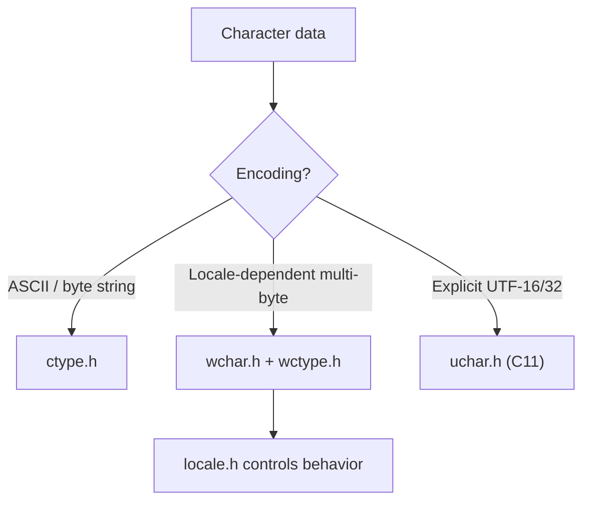

# Character Handling, Wide Strings, and Locale

> [!summary] Goal
> Master C character classification and conversion (`<ctype.h>`), wide character strings (`<wchar.h>`), Unicode support (`<uchar.h>`), and locale-aware programming (`<locale.h>`). Essential for writing parsers, text-processing tools, internationalized applications, and cross-platform string handling.

## Table of Contents

1. [Why Character Handling Matters](#why-character-handling-matters)
2. [ctype.h — Character Classification](#ctype-h-character-classification)
3. [ctype.h — Character Conversion](#ctype-h-character-conversion)
4. [Implementation: How ctype Uses Tables](#implementation-how-ctype-uses-tables)
5. [wchar.h — Wide Character Strings](#wchar-h-wide-character-strings)
6. [uchar.h — Unicode Support (C11)](#uchar-h-unicode-support)
7. [locale.h — Locale and Internationalization](#locale-h-locale-and-internationalization)
8. [Pitfalls](#pitfalls)

---

## Why Character Handling Matters

C's character handling is split across multiple headers because different domains need different abstractions:
- **ASCII/byte characters** (`ctype.h`) — classic parsers, tokenizers, config readers
- **Wide characters** (`wchar.h`, `wctype.h`) — locale-aware text with multi-byte encodings
- **Unicode types** (`uchar.h`) — portable UTF-16/32 support (C11)
- **Locale** (`locale.h`) — internationalization: number formatting, currency, collation



---

## `<ctype.h>` — Character Classification

```c
#include <ctype.h>

// All classification functions take an int (not char!) and return int.
// EOF must be representable, so parameter is int, not char.
// Arguments should be EOF or a value representable as unsigned char.

int isalpha(int c);     // alphabetic letter (a-z, A-Z)
int isdigit(int c);     // decimal digit (0-9)
int isalnum(int c);     // alpha or digit
int isxdigit(int c);    // hexadecimal digit (0-9, a-f, A-F)
int islower(int c);     // lowercase letter
int isupper(int c);     // uppercase letter

int isspace(int c);     // whitespace: ' ', '\t', '\n', '\v', '\f', '\r'
int isblank(int c);     // blank: space or tab (C99)
int ispunct(int c);     // punctuation (not alnum, not space)
int isgraph(int c);     // printable, not space (0x21–0x7E)
int isprint(int c);     // printable including space (0x20–0x7E)
int iscntrl(int c);     // control character (0x00–0x1F, 0x7F)
int isascii(int c);     // ASCII character (0x00–0x7F) — non-standard but common
```

### Classification look-up tables

```c
// ASCII classification reference:
//   00-1F: control (iscntrl)
//   20:    space (isspace, isprint, isblank)
//   21-2F: punctuation (ispunct) — ! " # $ % & ' ( ) * + , - . /
//   30-39: digits 0-9 (isdigit, isxdigit)
//   3A-40: punctuation — : ; < = > ? @
//   41-46: A B C D E F (isalpha, isupper, isxdigit)
//   47-5A: G-Z (isalpha, isupper)
//   5B-60: punctuation — [ \ ] ^ _ `
//   61-66: a b c d e f (isalpha, islower, isxdigit)
//   67-7A: g-z (isalpha, islower)
//   7B-7E: punctuation — { | } ~
//   7F:    control, DEL (iscntrl)
```

### Usage in parsers

```c
#include <ctype.h>
#include <stdio.h>

// Tokenizer: extract words and numbers from a string
int simple_tokenize(const char *input) {
    int count = 0;
    while (*input) {
        // Skip whitespace
        while (*input && isspace((unsigned char)*input)) {
            input++;
        }
        if (!*input) break;

        count++;  // Found a token

        // Advance through the token
        if (isalpha((unsigned char)*input)) {
            while (*input && isalpha((unsigned char)*input)) input++;
        } else if (isdigit((unsigned char)*input)) {
            while (*input && isdigit((unsigned char)*input)) input++;
        } else {
            // Single-character token (punctuation)
            input++;
        }
    }
    return count;
}

// Checking for valid identifier start
int is_valid_identifier_start(int c) {
    return isalpha((unsigned char)c) || c == '_';
}

// Checking for valid identifier continuation
int is_valid_identifier_cont(int c) {
    return isalnum((unsigned char)c) || c == '_';
}
```

---

## `<ctype.h>` — Character Conversion

```c
#include <ctype.h>

// Conversion functions:
int toupper(int c);    // Convert to uppercase if lowercase, else unchanged
int tolower(int c);    // Convert to lowercase if uppercase, else unchanged

// These are LOCALE-AWARE via the LC_CTYPE locale category.
// In the default "C" locale:
//   toupper('a') → 'A',   tolower('A') → 'a'
//   toupper('7') → '7'    (no change for non-letters)
```

### Case-insensitive comparison

```c
#include <ctype.h>
#include <string.h>

int strcasecmp_custom(const char *a, const char *b) {
    while (*a && *b) {
        int ca = tolower((unsigned char)*a);
        int cb = tolower((unsigned char)*b);
        if (ca != cb) return ca - cb;
        a++;
        b++;
    }
    // Handle one string ending before the other
    return tolower((unsigned char)*a) - tolower((unsigned char)*b);
}
```

---

## Implementation: How `ctype` Uses Tables

> [!info] ctype implementation
> The `<ctype.h>` functions are typically implemented using a 257-entry lookup table indexed by `(unsigned char)c + 1`. Each entry is a bitmask of flags. This makes all ctype functions O(1) and fast.

```c
// Typical implementation (glibc, simplified):
// The __ctype_b[] array stores bitmask flags for each character + 1.
// Index by (unsigned char)c + 1, where the +1 allows EOF (-1) to index 0.

// Bitmask flags:
enum {
    _ISupper  = 1 << 0,   // Uppercase
    _ISlower  = 1 << 1,   // Lowercase
    _ISalpha  = 1 << 2,   // Alphabetic
    _ISdigit  = 1 << 3,   // Digit
    _ISspace  = 1 << 4,   // Whitespace
    _ISpunct  = 1 << 5,   // Punctuation
    _IScntrl  = 1 << 6,   // Control
    _ISblank  = 1 << 7,   // Blank
    _ISgraph  = 1 << 8,   // Graphical
    _ISprint  = 1 << 9,   // Printable
    _ISxdigit = 1 << 10,  // Hex digit
};

// Global table (defined in libc)
extern const unsigned short int __ctype_b[];

// Implementation of isalpha:
int isalpha(int c) {
    // Cast to unsigned char to handle negative char values safely
    return __ctype_b[(unsigned char)c + 1] & _ISalpha;
}

// Why cast to unsigned char?
//   char may be signed on some platforms. 'é' might be a negative int.
//   EOF is -1. Casting to unsigned char ensures valid table index.
```

### The `unsigned char` cast is mandatory

```c
// ❌ BUG: c is negative (char is signed)
char c = '\xe9';          // 'é' extended ASCII — actually -23 on signed char
if (isalpha(c)) { ... }   // UB! Negative value that's not EOF.

// ✅ Correct: cast to unsigned char first
char c = '\xe9';
if (isalpha((unsigned char)c)) { ... }   // Safe
```

---

## `<wchar.h>` — Wide Character Strings

> [!info] Wide characters
> A wide character (`wchar_t`) can represent a larger character set than `char`. On Linux (glibc), `wchar_t` is 32-bit (UTF-32). On Windows, it's 16-bit (UTF-16). The `<wchar.h>` header provides wide-string equivalents of the `<string.h>` and `<ctype.h>` functions.

```c
#include <wchar.h>
#include <wctype.h>

// Wide character type
wchar_t wc = L'A';          // L prefix = wide character literal
const wchar_t *ws = L"hello";  // Wide string literal

// Wide string functions (analogous to string.h):
size_t wcslen(const wchar_t *s);       // Length (in wide characters)
wchar_t *wcscpy(wchar_t *dst, const wchar_t *src);  // Copy
int wcscmp(const wchar_t *s1, const wchar_t *s2);   // Compare

// Wide character classification (analogous to ctype.h):
int iswalpha(wint_t wc);       // wint_t = wchar_t extended with WEOF
int iswdigit(wint_t wc);
int iswspace(wint_t wc);
int iswlower(wint_t wc);
int iswupper(wint_t wc);
wint_t towupper(wint_t wc);    // Convert to uppercase
wint_t towlower(wint_t wc);    // Convert to lowercase

// Wide character I/O:
wint_t fgetwc(FILE *stream);       // Read one wide char
int fputwc(wchar_t wc, FILE *stream);   // Write one wide char
int fwprintf(FILE *stream, const wchar_t *format, ...);  // Wide formatted output
int fwscanf(FILE *stream, const wchar_t *format, ...);   // Wide formatted input

// Multi-byte / wide character conversion:
size_t mbrtowc(wchar_t *pwc, const char *s, size_t n, mbstate_t *ps);
size_t wcrtomb(char *s, wchar_t wc, mbstate_t *ps);
```

### Wide vs narrow functions

```text
Narrow (char)            Wide (wchar_t)
─────────────────────────────────────────
strlen(s)                wcslen(ws)
strcpy(d, s)             wcscpy(d, ws)
strcmp(a, b)             wcscmp(a, b)
strcat(d, s)             wcscat(d, ws)
sprintf(buf, ...)        swprintf(buf, count, ...)
printf(...)              wprintf(...)
fprintf(f, ...)          fwprintf(f, ...)
fopen(path, mode)        _wfopen(path, mode) [Windows]
```

---

## `<uchar.h>` — Unicode Support (C11)

> [!info] uchar.h (C11)
> C11 introduces fixed-size Unicode character types: `char16_t` (UTF-16) and `char32_t` (UTF-32). These are NOT the same as `wchar_t` (which is platform-dependent). They provide portable Unicode support.

```c
#include <uchar.h>

// Types:
char16_t c16 = u'A';        // UTF-16 character literal (u prefix)
char32_t c32 = U'A';        // UTF-32 character literal (U prefix)

// String literals:
const char16_t *s16 = u"hello";     // UTF-16 string
const char32_t *s32 = U"hello";     // UTF-32 string
const char8_t *s8 = u8"hello";      // UTF-8 string (C11, C23: standard)

// Conversion functions (C11):
size_t mbrtoc16(char16_t *pc16, const char *s, size_t n, mbstate_t *ps);
// Convert multi-byte character to UTF-16 (may produce surrogate pairs)

size_t c16rtomb(char *s, char16_t c16, mbstate_t *ps);
// Convert UTF-16 to multi-byte character

size_t mbrtoc32(char32_t *pc32, const char *s, size_t n, mbstate_t *ps);
size_t c32rtomb(char *s, char32_t c32, mbstate_t *ps);

// C23 improves Unicode support:
//   - char8_t becomes a keyword (UTF-8 code unit)
//   - u8 prefix for UTF-8 strings is standard
//   - #embed for embedding binary data
```

---

## `<locale.h>` — Locale and Internationalization

> [!info] Locale
> The locale controls locale-dependent behavior: character classification, collation order, number formatting, currency, date formatting, and character encoding. By default, C uses the "C" locale (POSIX locale — ASCII, English, simple rules).

```c
#include <locale.h>

// Set or query the program's locale
char *setlocale(int category, const char *locale);
// Returns the locale string, or NULL on error.

// Locale categories:
LC_ALL       // All categories
LC_COLLATE   // String collation (strcoll, strxfrm)
LC_CTYPE     // Character classification (isalpha, toupper, etc.)
LC_MONETARY  // Monetary formatting (localeconv)
LC_NUMERIC   // Number formatting (decimal point)
LC_TIME      // Date/time formatting (strftime)

// Query locale-dependent formatting
struct lconv *localeconv(void);
// Returns a struct with decimal_point, thousands_sep,
// currency_symbol, int_curr_symbol, etc.
```

### Setting the locale

```c
#include <locale.h>
#include <stdio.h>

int main(void) {
    // Get the default locale (C locale — portable but limited)
    printf("Default: %s\n", setlocale(LC_ALL, NULL));    // "C"

    // Set from environment (LANG, LC_ALL, etc.)
    setlocale(LC_ALL, "");   // User's system locale from environment

    // Set a specific locale
    setlocale(LC_ALL, "en_US.UTF-8");

    // Set only character handling
    setlocale(LC_CTYPE, "fr_FR.UTF-8");

    return 0;
}
```

### Locale-aware number formatting

```c
#include <locale.h>
#include <stdio.h>
#include <string.h>

int main(void) {
    setlocale(LC_ALL, "de_DE.UTF-8");
    // In German: decimal comma instead of decimal point

    char buf[64];
    snprintf(buf, sizeof(buf), "%'g", 1234567.89);
    // Output: 1.234.567,89  (German: dots as thousands, comma as decimal)

    // localeconv gives access to formatting components:
    struct lconv *lc = localeconv();
    printf("Decimal point: '%s'\n", lc->decimal_point);       // ","
    printf("Thousands sep: '%s'\n", lc->thousands_sep);       // "."
    printf("Currency: '%s'\n", lc->currency_symbol);          // "EUR"
}
```

### Locale-aware collation

```c
#include <locale.h>
#include <string.h>
#include <stdio.h>

int main(void) {
    setlocale(LC_ALL, "en_US.UTF-8");

    // strcoll() compares according to locale rules
    const char *a = "côte";
    const char *b = "cote";

    int cmp = strcoll(a, b);
    printf("strcoll: %s %s %s\n", a,
           cmp < 0 ? "<" : cmp > 0 ? ">" : "==", b);

    // strxfrm() transforms a string for efficient comparison
    char a_xfrm[256], b_xfrm[256];
    strxfrm(a_xfrm, a, sizeof(a_xfrm));
    strxfrm(b_xfrm, b, sizeof(b_xfrm));
    // Now strcmp(a_xfrm, b_xfrm) gives the same ordering as strcoll(a, b)
}
```

---

## Pitfalls

### `char` signedness is implementation-defined

`char` can be signed or unsigned depending on the platform and compiler flags. Always cast to `unsigned char` before calling `<ctype.h>` functions to avoid UB (negative values that aren't EOF).

### Wide-char I/O mixes poorly with narrow I/O

Once you switch a `FILE*` to wide-oriented mode (first wide I/O call), narrow operations on the same stream are undefined. Use `fwide()` to check/set orientation:

```c
int main(void) {
    fwide(stdout, 1);       // Force wide orientation
    fputws(L"hello\n", stdout);   // OK
}
```

### `wchar_t` size varies by platform

On Linux: 32-bit (UTF-32). On Windows: 16-bit (UTF-16). Code using `wchar_t` for serialization or network protocols is NOT portable. Use `<uchar.h>` for portable Unicode.

### `setlocale(LC_ALL, "")` depends on environment variables

If `LANG`, `LC_ALL`, or `LC_*` are not set, `setlocale(LC_ALL, "")` falls back to the "C" locale. Always check the return value (it returns NULL on error).

---

## Cross-Links

- [[C/01_Foundations/04_Arrays_Strings_and_Bounds]] for narrow string functions (string.h)
- [[C/01_Foundations/11_Generic_and_Type_Generic_Programming]] for _Generic with character types
- [[C/02_Core/02_File_IO_and_POSIX_System_Calls]] for narrow I/O (stdio)
- [[C/03_Advanced/05_System_Programming]] for locale in daemon processes
