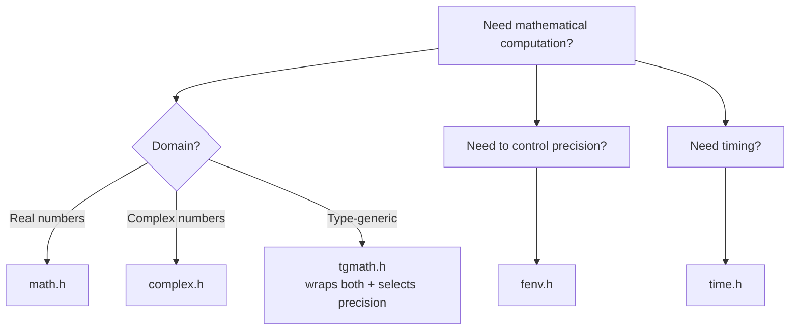

# Math, Complex, Time, and Floating-Point Control

> [!summary] Goal
> Master C's mathematical library (`<math.h>`, `<complex.h>`, `<tgmath.h>`), time and date handling (`<time.h>`), and floating-point environment control (`<fenv.h>`). Essential for scientific computing, simulation, timing/performance measurement, and robust numerical code.

## Table of Contents

1. [Why These Libraries Belong Together](#why-these-libraries-belong-together)
2. [math.h — Mathematical Functions](#math-h-mathematical-functions)
3. [Floating-Point Pitfalls](#floating-point-pitfalls)
4. [fenv.h — Floating-Point Environment](#fenv-h-floating-point-environment)
5. [complex.h — Complex Arithmetic](#complex-h-complex-arithmetic)
6. [time.h — Time and Date](#time-h-time-and-date)
7. [Pitfalls](#pitfalls)

---

## Why These Libraries Belong Together

These four headers (`<math.h>`, `<complex.h>`, `<fenv.h>`, `<time.h>`) share two themes: **numerical computation** (math, complex, FP control) and **measurement** (time for timing, FP for precision analysis). `<tgmath.h>` (type-generic math) bridges them by making math functions work across `float`/`double`/`long double` and `complex` types.



---

## `<math.h>` — Mathematical Functions

```c
#include <math.h>
// Link with -lm on Linux: gcc program.c -lm
```

### Rounding and absolute value

```c
// Rounding
double round(double x);     // round to nearest, ties away from zero
double rint(double x);      // round to nearest, ties to even (IEC 60559)
double trunc(double x);     // truncate toward zero
double floor(double x);     // floor (toward -inf)
double ceil(double x);      // ceiling (toward +inf)
double nearbyint(double x); // round using current rounding mode

// Fractional parts
double modf(double x, double *intpart);  // Split into fractional and integer parts
double fmod(double x, double y);         // Floating-point remainder (x - trunc(x/y) * y)

// Functions with f (float) and l (long double) variants:
float roundf(float x);
long double roundl(long double x);
```

### Exponential, log, and power

```c
double exp(double x);        // e^x
double exp2(double x);       // 2^x
double expm1(double x);      // e^x - 1 (accurate for small x)
double log(double x);        // natural log (base e)
double log2(double x);       // log base 2
double log10(double x);      // log base 10
double log1p(double x);      // log(1 + x) (accurate for small x)
double pow(double x, double y);    // x^y
double sqrt(double x);       // square root
double cbrt(double x);       // cube root
double hypot(double x, double y);  // sqrt(x^2 + y^2) without overflow
```

### Trigonometric

```c
double sin(double x);        // Sine (x in radians)
double cos(double x);        // Cosine
double tan(double x);        // Tangent
double asin(double x);       // Arc sine
double acos(double x);       // Arc cosine
double atan(double x);       // Arc tangent
double atan2(double y, double x);  // arctan(y/x), uses signs for quadrant

// Hyperbolic
double sinh(double x);
double cosh(double x);
double tanh(double x);
double asinh(double x);
double acosh(double x);
double atanh(double x);
```

### Error and gamma

```c
double erf(double x);        // Error function (for statistics)
double erfc(double x);       // Complementary error function (1 - erf, accurate for large x)
double tgamma(double x);     // Gamma function
double lgamma(double x);     // Log of gamma function
```

### Floating-point classification and comparison

```c
#include <math.h>

// Classification:
int fpclassify(double x);       // Returns FP_NAN, FP_INFINITE, FP_ZERO, FP_SUBNORMAL, FP_NORMAL
int isfinite(double x);          // Non-zero if x is finite (not inf, not nan)
int isinf(double x);             // Non-zero if x is ±inf
int isnan(double x);             // Non-zero if x is NaN
int isnormal(double x);          // Non-zero if x is normal (not zero, subnormal, inf, nan)

// Sign:
int signbit(double x);           // Non-zero if x is negative

// Comparison macros (handle NaN safely — non-NaN comparisons raise FP exception with isnan):
double fmax(double x, double y); // Maximum, handles NaN (returns the non-NaN)
double fmin(double x, double y); // Minimum, handles NaN
double fdim(double x, double y); // Positive difference: x - y if x > y, else 0
```

### NaN and infinity generation

```c
#include <math.h>

double nan(const char *tagp);       // Generate a quiet NaN with optional tag
double infinity(void);              // Generate +infinity (in GNU libc via macro)

// Common patterns:
double zero = 0.0;
double inf = 1.0 / zero;            // +infinity
double neg_inf = -1.0 / zero;       // -infinity
double nan_val = 0.0 / zero;        // NaN

printf("NaN check: %d\n", isnan(nan_val));          // 1
printf("Inf check: %d\n", isinf(inf));               // 1
printf("Is NaN == NaN: %d\n", nan_val == nan_val);   // 0 (!) NaN != NaN
```

---

## Floating-Point Pitfalls

### Cancellation

```c
// ❌ CANCELLATION: subtracting nearly-equal numbers loses precision.
double x = 1.000000000000001;
double y = 1.0;
double result = x - y;   // 9.992007221626409e-16 (only ~4 significant digits!)

// Better: reorganize computation to avoid cancellation.
// Instead of sqrt(x+1) - sqrt(x), use:
//    sqrt(x+1) - sqrt(x) = 1 / (sqrt(x+1) + sqrt(x))
```

### Kahan summation

```c
// Kahan summation reduces floating-point error when summing many values.
// Ordinary summation loses precision for large arrays of small-large mixed values.

double kahan_sum(const double *values, size_t n) {
    double sum = 0.0;
    double compensation = 0.0;  // Running error compensation

    for (size_t i = 0; i < n; i++) {
        double y = values[i] - compensation;
        double t = sum + y;
        compensation = (t - sum) - y;  // (sum + y) - y cancels, leaves low bits
        sum = t;
    }

    return sum;
}
```

### Comparing floating-point numbers

```c
#include <math.h>
#include <float.h>

// ❌ Never compare floats with ==
double a = 0.1 + 0.2;
if (a == 0.3) { /* may not execute */ }

// ✅ Compare with tolerance
int nearly_equal(double a, double b, double epsilon) {
    if (a == b) return 1;           // Exact match (including both inf)
    double diff = fabs(a - b);
    double scale = fmax(fabs(a), fabs(b));
    return diff <= epsilon * scale;  // Relative error
}

// Absolute tolerance for numbers near zero:
int near_zero(double x, double epsilon) {
    return fabs(x) <= epsilon;
}

// Machine epsilon:
//   FLT_EPSILON = 1.19e-07   (float)
//   DBL_EPSILON = 2.22e-16   (double)
```

---

## `<fenv.h>` — Floating-Point Environment (C99)

> [!info] FP environment
> The floating-point environment controls rounding direction, exception flags, and precision. By default, rounding is to-nearest and exceptions are not trapped. `<fenv.h>` lets you change these settings — useful for interval arithmetic, precise summation, and numerical analysis.

```c
#include <fenv.h>
// Link with -lm. On GCC, may also need -frounding-math to prevent
// the compiler from optimizing away rounding mode changes.
```

### Rounding modes

```c
// Available rounding direction macros (in <fenv.h>):
FE_TONEAREST    // Round to nearest, ties to even (default)
FE_UPWARD       // Round toward +inf
FE_DOWNWARD     // Round toward -inf
FE_TOWARDZERO   // Truncate toward zero

// Get current rounding direction
int fegetround(void);

// Set rounding direction
int fesetround(int round);
// Returns 0 on success, non-zero on failure.

// Example: compute using a specific rounding mode
double round_up(double x) {
    int old = fegetround();
    fesetround(FE_UPWARD);
    double result = x;  // All FP operations now round upward
    fesetround(old);    // Restore original mode
    return result;
}
```

### FP exception flags

```c
// Exception macros:
FE_DIVBYZERO      // Division by zero (producing infinity)
FE_INEXACT        // Inexact result (rounded result)
FE_INVALID        // Invalid operation (0/0, sqrt(-1))
FE_OVERFLOW       // Overflow (result too large)
FE_UNDERFLOW      // Underflow (result too small)
FE_ALL_EXCEPT     // All exceptions (bitwise OR of the above)

// Get/set exception flags:
int feclearexcept(int excepts);      // Clear specified exceptions
int fetestexcept(int excepts);       // Test if exceptions set
int feraiseexcept(int excepts);      // Raise exceptions

// Example: detecting division by zero
#include <fenv.h>
#include <stdio.h>
#include <math.h>

int main(void) {
    feclearexcept(FE_ALL_EXCEPT);

    double result = 1.0 / 0.0;    // Produces +infinity

    if (fetestexcept(FE_DIVBYZERO)) {
        printf("Division by zero detected!\n");
    }
    if (fetestexcept(FE_INEXACT)) {
        printf("Result was rounded.\n");
    }
    if (isinf(result)) {
        printf("Result is infinite.\n");
    }

    return 0;
}
```

---

## `<complex.h>` — Complex Arithmetic (C99)

```c
#include <complex.h>
// Link with -lm on Linux.

// Complex types:
double complex        // double-precision complex
float complex         // single-precision complex
long double complex   // extended-precision complex

// Construction:
double complex z = 1.0 + 2.0 * I;    // I = imaginary unit (sqrt(-1))
double complex w = CMPLX(1.0, 2.0);  // C11: avoids I-related pitfalls

// Real and imaginary parts:
double real = creal(z);    // Real part
double imag = cimag(z);    // Imaginary part

// Complex arithmetic: +, -, *, / all work with complex types natively.
```

### Complex functions

```c
#include <complex.h>

// Basic operations:
double complex cabs(double complex z);       // Absolute value |z| = sqrt(a² + b²)
double carg(double complex z);               // Argument (phase angle)
double complex conj(double complex z);       // Conjugate
double complex cproj(double complex z);      // Projection onto Riemann sphere

// Complex math (prefix 'c'):
double complex csin(double complex z);       // Complex sine
double complex ccos(double complex z);       // Complex cosine
double complex ctan(double complex z);       // Complex tangent
double complex csqrt(double complex z);      // Complex square root
double complex clog(double complex z);       // Complex natural log
double complex cexp(double complex z);       // Complex exponential
double complex cpow(double complex z, double complex w);  // Complex power
```

### Complex type-generic math with `<tgmath.h>`

```c
#include <tgmath.h>   // Includes <math.h> and <complex.h> with _Generic wrappers

// tgmath.h makes these work with both real and complex types:
double complex z = 1.0 + I*2.0;
double r = sqrt(4.0);           // Calls sqrt(double)
double complex s = sqrt(z);     // Calls csqrt (complex sqrt)

// The compiler selects the correct precision and domain at compile time:
float f = 4.0f;
double d = 4.0;
long double ld = 4.0L;

sqrt(f);    // sqrtf
sqrt(d);    // sqrt
sqrt(ld);   // sqrtl
```

---

## `<time.h>` — Time and Date

```c
#include <time.h>
// Most functions are in libc (no -lm needed).
```

### Time types

```c
clock_t          // Processor time (integer, clock ticks)
time_t           // Calendar time (typically seconds since epoch, integer)
struct timespec  // High-resolution time (seconds + nanoseconds, POSIX)
struct tm        // Broken-down calendar time (year, month, day, hour, min, sec)
```

### Time retrieval

```c
#include <time.h>

// Wall-clock time:
time_t now = time(NULL);               // Current calendar time (seconds since epoch)
struct tm *tm_now = localtime(&now);   // Convert to local time
struct tm *tm_gmt = gmtime(&now);      // Convert to UTC

// High-resolution (POSIX):
struct timespec ts;
clock_gettime(CLOCK_MONOTONIC, &ts);   // Monotonic time (unaffected by system clock changes)
clock_gettime(CLOCK_REALTIME, &ts);    // Wall-clock time
clock_gettime(CLOCK_THREAD_CPUTIME_ID, &ts);  // Per-thread CPU time

// CPU time used by the process:
clock_t cpu = clock();                 // CPU time (divide by CLOCKS_PER_SEC for seconds)
```

### Formatting time

```c
#include <time.h>

time_t now = time(NULL);
struct tm *tm = localtime(&now);

// Format to string (buffer must be at least 26 bytes)
char buf[64];
strftime(buf, sizeof(buf), "%Y-%m-%d %H:%M:%S", tm);
printf("Formatted: %s\n", buf);

// strftime format specifiers:
// %Y  Year (4 digits)                   2026
// %m  Month (01-12)                     05
// %d  Day of month (01-31)              11
// %H  Hour (00-23)                      14
// %M  Minute (00-59)                    30
// %S  Second (00-61, leap seconds)      45
// %A  Weekday full name                 Monday
// %B  Month full name                   May
// %c  Locale-dependent date/time        Mon May 11 14:30:45 2026
// %s  Seconds since epoch (GNU ext)     1715446245

// Parsing a time string (POSIX, not standard C):
struct tm parsed = {0};
strptime("2026-05-11", "%Y-%m-%d", &parsed);
time_t parsed_time = mktime(&parsed);
```

### Timing operations (benchmarking)

```c
#include <time.h>
#include <stdio.h>

double time_it(void (*func)(void)) {
    struct timespec start, end;

    clock_gettime(CLOCK_MONOTONIC, &start);
    func();
    clock_gettime(CLOCK_MONOTONIC, &end);

    double elapsed = (end.tv_sec - start.tv_sec)
                    + (end.tv_nsec - start.tv_nsec) / 1e9;
    return elapsed;
}

// High-resolution sleep:
void nano_sleep_ms(long milliseconds) {
    struct timespec ts = {
        .tv_sec = milliseconds / 1000,
        .tv_nsec = (milliseconds % 1000) * 1000000L,
    };
    nanosleep(&ts, NULL);
}
```

### Timer objects (POSIX timers)

```c
#include <time.h>
#include <signal.h>

// POSIX interval timers:
timer_t timerid;
struct sigevent sev;
struct itimerspec its;

// Create timer
sev.sigev_notify = SIGEV_SIGNAL;
sev.sigev_signo = SIGALRM;
sev.sigev_value.sival_ptr = &timerid;
timer_create(CLOCK_MONOTONIC, &sev, &timerid);

// Arm timer: fire after 1 second, repeat every 500ms
its.it_value.tv_sec = 1;       // Initial delay
its.it_value.tv_nsec = 0;
its.it_interval.tv_sec = 0;     // Repeat interval
its.it_interval.tv_nsec = 500000000;
timer_settime(timerid, 0, &its, NULL);
```

---

## Pitfalls

### `clock()` measures CPU time, not elapsed time

```c
clock_t start = clock();
sleep(2);          // sleep doesn't use CPU
clock_t end = clock();
double elapsed = (double)(end - start) / CLOCKS_PER_SEC;
// elapsed ≈ 0.0 (CPU time for sleep is near zero, NOT 2 seconds)

// For elapsed wall time: clock_gettime(CLOCK_MONOTONIC, ...)
```

### `sqrt(-1)` raises FP invalid and returns NaN

```c
double result = sqrt(-1.0);
if (isnan(result)) {
    // Handle domain error
}
```

### Complex `I` conflicts with other uses

The `I` macro from `<complex.h>` may conflict with user code. Prefer `CMPLX()` in C11 for constructing complex numbers without `I`.

### `strftime` buffer size

`strftime` doesn't guarantee null-termination if the buffer is too small. Always use a buffer that's at least 26 bytes. Prefer `sizeof(buf)` over a hardcoded size.

### `localtime` and `gmtime` return pointers to static data

```c
// These return a pointer to a static struct tm.
// The SAME buffer is reused on every call — copy it immediately!

struct tm *t1 = localtime(&time1);
struct tm *t2 = localtime(&time2);  // Overwrites t1's data!
// t1 and t2 now point to the SAME struct (time2's data).

// ✅ Fix: copy immediately
struct tm t1_copy = *localtime(&time1);
struct tm t2_copy = *localtime(&time2);
```

---

## Cross-Links

- [[C/01_Foundations/11_Generic_and_Type_Generic_Programming]] for tgmath.h internals (_Generic dispatch)
- [[C/01_Foundations/10_Standard_Library_Utilities]] for float.h, FP type limits
- [[C/03_Advanced/06_Memory_Alignment_and_Endianness]] for endianness in time_t serialization
- [[C/03_Advanced/08_Performance_Profiling_and_Optimization]] for perf + clock_gettime timing
