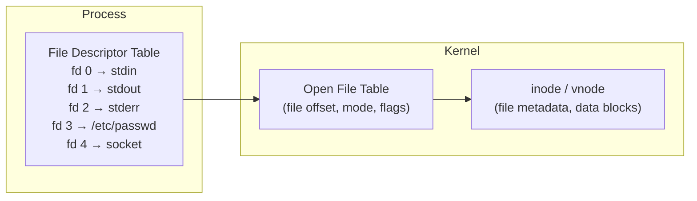
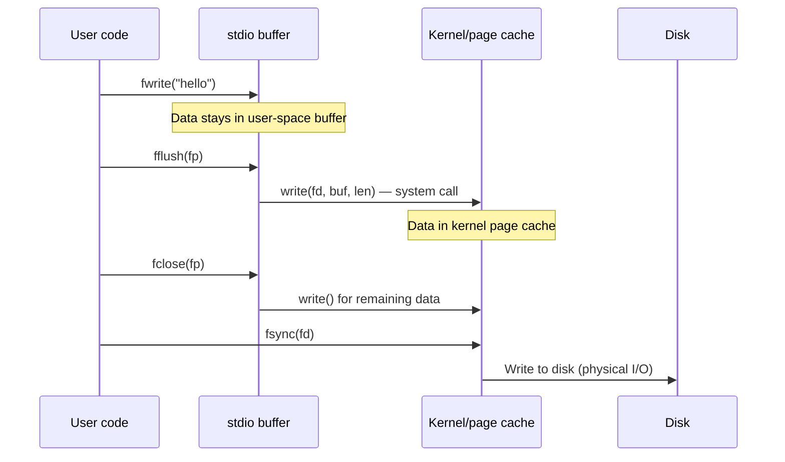

# File I/O and POSIX System Calls

> [!summary] Goal
> Master C file I/O — both the standard `stdio` library and low-level POSIX system calls. Understand buffering, file descriptors, error handling, direct I/O, and `mmap`. Essential for systems programming, network servers, and OS development.

## Table of Contents

1. [The File Descriptor Model](#the-file-descriptor-model)
2. [Standard I/O (stdio)](#standard-i-o)
3. [Low-Level POSIX I/O](#low-level-posix-i-o)
4. [Buffering](#buffering)
5. [Directories and File Metadata](#directories-and-file-metadata)
6. [mmap — Memory-Mapped Files](#mmap-memory-mapped-files)
7. [stdio vs POSIX Comparison](#stdio-vs-posix-comparison)
8. [Pitfalls](#pitfalls)

---

## The File Descriptor Model

> [!info] File descriptor
> A file descriptor (fd) is a small non-negative integer that the kernel uses to reference an open file. Every process has a **file descriptor table**. When a process starts, fd 0 (stdin), 1 (stdout), and 2 (stderr) are already open.



### File descriptor operations

| Operation | stdio function | POSIX function | System call |
|-----------|:--------------:|:--------------:|:-----------:|
| Open | `fopen()` | `open()` | `open` / `openat` |
| Close | `fclose()` | `close()` | `close` |
| Read | `fread()` / `fgets()` / `fgetc()` | `read()` | `read` |
| Write | `fwrite()` / `fprintf()` / `fputc()` | `write()` | `write` |
| Position | `fseek()` / `ftell()` | `lseek()` | `lseek` |
| Flush | `fflush()` | `fsync()` / `fdatasync()` | `fsync` |
| Get fd | `fileno()` | — | — |
| Wrap fd | `fdopen()` | — | — |

---

## Standard I/O (stdio)

> [!info] stdio
> The C standard library's I/O functions (`fopen`, `fread`, `fwrite`, etc.) provide **buffered** access with automatic buffer management. They sit on top of POSIX system calls, adding a user-space buffer to reduce system call frequency.

```c
#include <stdio.h>

// Opening
FILE *fp = fopen("file.txt", "r");      // Read text
FILE *fp = fopen("file.txt", "w");      // Write text (create/truncate)
FILE *fp = fopen("file.txt", "a");      // Append text
FILE *fp = fopen("file.txt", "rb");     // Read binary
FILE *fp = fopen("file.txt", "wb");     // Write binary
FILE *fp = fopen("file.txt", "r+");     // Read and write (existing file)

if (!fp) { perror("fopen"); return -1; }  // Always check!
```

### Reading

```c
// Character-by-character (slow — use only for simple parsing)
int c;
while ((c = fgetc(fp)) != EOF) { putchar(c); }

// Line-by-line (common for text processing)
char line[1024];
while (fgets(line, sizeof(line), fp)) {
    line[strcspn(line, "\n")] = '\0';     // Remove trailing newline
    printf("LINE: %s\n", line);
}

// Formatted parsing
int id; char name[64]; double score;
while (fscanf(fp, "%d,%63[^,],%lf", &id, name, &score) == 3) {
    printf("ID=%d Name=%s Score=%.2f\n", id, name, score);
}

// Raw binary read
size_t items_read = fread(buffer, sizeof(int), 100, fp);
```

### Writing

```c
// Character
fputc('A', fp);

// Formatted
fprintf(fp, "Value: %d, Name: %s\n", 42, "Alice");

// Raw binary write
size_t written = fwrite(data, sizeof(double), count, fp);

// Flush (force write from user-space buffer to kernel)
fflush(fp);       // Flushes stdio buffer (does NOT call fsync)
```

### Positioning and closing

```c
// Get position
long pos = ftell(fp);

// Seek
fseek(fp, 0, SEEK_END);        // End of file
fseek(fp, 100, SEEK_SET);       // 100 bytes from start
fseek(fp, -50, SEEK_CUR);       // 50 bytes back from current position
fseek(fp, 0, SEEK_SET);         // Rewind

// Rewind
rewind(fp);                     // fseek(fp, 0, SEEK_SET) + clearerr(fp)

// Close
if (fclose(fp) == EOF) {
    perror("fclose");
}
```

---

## Low-Level POSIX I/O

> [!info] POSIX I/O
> POSIX `open`/`read`/`write`/`close` are **unbuffered** system calls. They go directly to the kernel on every call. They work with file descriptors (`int`) instead of `FILE*`. Essential for: pipe/network I/O, special files, and when you need precise control.

```c
#include <fcntl.h>     // open flags
#include <unistd.h>    // read, write, close, lseek

// Open
int fd = open("file.txt", O_RDONLY);             // Read only
int fd = open("file.txt", O_WRONLY | O_CREAT | O_TRUNC, 0644);  // Write
int fd = open("file.txt", O_WRONLY | O_CREAT | O_APPEND, 0644); // Append

if (fd < 0) { perror("open"); return -1; }
```

### Open flags

| Flag | Effect |
|------|--------|
| `O_RDONLY` | Open for reading only |
| `O_WRONLY` | Open for writing only |
| `O_RDWR` | Open for reading and writing |
| `O_CREAT` | Create file if it doesn't exist |
| `O_EXCL` | Error if O_CREAT and file exists |
| `O_TRUNC` | Truncate file to zero length |
| `O_APPEND` | Append — writes always go to end |
| `O_NONBLOCK` | Open without blocking (pipes, FIFOs, devices) |
| `O_SYNC` | Synchronous writes (block until written to disk) |
| `O_DIRECT` | Bypass page cache (direct I/O) |

### Reading and writing

```c
char buf[4096];
ssize_t n = read(fd, buf, sizeof(buf));
if (n < 0) {
    perror("read");
} else if (n == 0) {
    printf("EOF\n");
} else {
    printf("Read %zd bytes\n", n);
}

// write
ssize_t written = write(fd, "hello", 5);
if (written != 5) {
    // Partial write! Must loop to write remaining bytes
}

// Positioning
off_t pos = lseek(fd, 0, SEEK_CUR);     // Current position
off_t size = lseek(fd, 0, SEEK_END);     // File size (works on regular files)
lseek(fd, 100, SEEK_SET);                // Seek to position 100

// Close
close(fd);
```

### Handling partial writes

```c
// write() may not write all requested bytes — must loop
ssize_t write_all(int fd, const void *buf, size_t count) {
    const char *p = (const char *)buf;
    size_t remaining = count;
    
    while (remaining > 0) {
        ssize_t n = write(fd, p, remaining);
        if (n < 0) {
            if (errno == EINTR) continue;   // Interrupted by signal — retry
            return -1;                       // Real error
        }
        p += n;
        remaining -= n;
    }
    return count;  // All bytes written
}
```

---

## Buffering

### stdio buffering modes

| Mode | Set with | Behavior |
|------|----------|----------|
| **Fully buffered** | `setvbuf(fp, NULL, _IOFBF, size)` | Data written when buffer is full (default for disk files) |
| **Line buffered** | `setvbuf(fp, NULL, _IOLBF, size)` | Data written when newline seen (default for stdout to terminal) |
| **Unbuffered** | `setvbuf(fp, NULL, _IONBF, 0)` | Data written immediately (default for stderr) |

```c
// Change buffering
setvbuf(stdout, NULL, _IOLBF, 0);    // Line-buffer stdout
setvbuf(stderr, NULL, _IONBF, 0);     // Unbuffer stderr (already default)

// Disable buffering on a file
FILE *log = fopen("log.txt", "w");
setvbuf(log, NULL, _IONBF, 0);        // Every write = immediate system call
```

### The flush cascade



---

## Directories and File Metadata

```c
#include <sys/stat.h>
#include <dirent.h>

// Get file metadata
struct stat st;
if (stat("file.txt", &st) == 0) {
    printf("Size: %lld bytes\n", (long long)st.st_size);
    printf("Mode: %o\n", st.st_mode & 07777);
    printf("UID:  %d\n", st.st_uid);
    printf("Modified: %ld\n", st.st_mtime);
}

// Check file type
if (S_ISREG(st.st_mode)) { /* regular file */ }
if (S_ISDIR(st.st_mode)) { /* directory */ }
if (S_ISLNK(st.st_mode)) { /* symlink */ }

// Directory listing
DIR *dir = opendir("/path");
if (dir) {
    struct dirent *entry;
    while ((entry = readdir(dir)) != NULL) {
        if (entry->d_name[0] == '.') continue;  // Skip hidden
        printf("%s (type: %d)\n", entry->d_name, entry->d_type);
    }
    closedir(dir);
}
```

---

## mmap — Memory-Mapped Files

> [!info] mmap
> `mmap` maps a file (or anonymous memory) into the process's address space. Reading and writing the mapped memory reads and writes the file directly, without `read()`/`write()` system calls. The kernel manages the data transfer via page faults.

```c
#include <sys/mman.h>

int fd = open("file.txt", O_RDWR);
struct stat st;
fstat(fd, &st);

// Map file into memory
void *map = mmap(NULL, st.st_size,          // Address hint, length
                 PROT_READ | PROT_WRITE,     // Read/write permission
                 MAP_SHARED,                 // Changes write back to file
                 fd, 0);                     // File descriptor, offset

if (map == MAP_FAILED) { perror("mmap"); close(fd); return -1; }

// Use as a memory buffer
char *data = (char *)map;
printf("%s\n", data);                        // Read file content
memcpy(data, "new data", 8);                 // Write to file (visible to other processes!)

// Unmap
munmap(map, st.st_size);
close(fd);
```

### When to use mmap vs read/write

| Aspect | mmap | read/write |
|--------|:----:|:----------:|
| **System calls** | One for setup, one for teardown | One per read/write operation |
| **Access pattern** | Random access (just index) | Sequential (seek + read) |
| **Large files** | ✅ Excellent (virtual memory) | ❌ Must manage buffers |
| **Small I/Os** | ❌ Overkill (page fault overhead) | ✅ Simple and fast |
| **Non-regular files** | ❌ (pipes, sockets) | ✅ (all fd types) |
| **Multiple processes** | ✅ MAP_SHARED shares changes | ❌ Separate buffering |

---

## stdio vs POSIX Comparison

| Aspect | stdio (fopen/fread/fwrite) | POSIX (open/read/write) |
|--------|:--------------------------:|:-----------------------:|
| **Buffering** | User-space buffer (automatic) | Kernel buffer only |
| **Type** | `FILE*` (opaque pointer) | `int` (file descriptor) |
| **Formatting** | `fprintf`, `fscanf` built-in | Manual formatting (`sprintf` + `write`) |
| **Performance** | Better for many small I/Os | Better for large block I/O |
| **Pipes/sockets** | Limited (use fdopen) | ✅ Native support |
| **Portability** | ✅ Standard C everywhere | ❌ POSIX-specific |
| **Thread safety** | Per-call locking | Per-call locking (same) |
| **Binary reads** | `fread` | `read` |

### When to use which

```c
// ✅ Use stdio when:
// — You're reading/writing text files
// — You need formatted I/O (fprintf, fscanf)
// — Portability matters (Windows, embedded)
// — Small, frequent reads/writes

// ✅ Use POSIX when:
// — Working with pipes, sockets, special devices
// — Need non-blocking I/O
// — Calling fcntl, ioctl on the fd
// — Using mmap
// — Need to bypass buffering (O_DIRECT)

// ✅ Use both together:
FILE *fp = fopen("file.txt", "r");
int fd = fileno(fp);              // Get fd from FILE*
// Use fd for POSIX calls, fp for stdio calls
```

---

## Pitfalls

### Not checking fopen return value

`fopen` returns NULL on failure. Dereferencing NULL crashes. Always check.

### Mixing stdio and POSIX access on the same file

```c
int fd = open("file.txt", O_WRONLY);
FILE *fp = fdopen(fd, "w");   // Wrap fd in FILE* (duplex!)
fprintf(fp, "hello");
// Don't call write(fd, ...) directly! stdio buffer may not have flushed.
// Use fileno() to get the fd from FILE*, not the other way.
```

### Reading past EOF with fgets

```c
while (!feof(fp)) {               // ❌ Wrong! feof is only set AFTER hit
    fgets(line, sizeof(line), fp); // If this fails, line is garbage
}
// ✅ Correct:
while (fgets(line, sizeof(line), fp)) {
    // Process line
}
```

### Not checking for partial writes

`write()` can write fewer bytes than requested. Always loop. Network sockets are especially prone to partial writes.

### Unbuffered stdin issues with getchar

`stdin` is line-buffered by default when connected to a terminal. Characters aren't available until Enter is pressed. Use terminal raw mode or read from fd 0 with `read()` for character-by-character input.

---

> [!question]- Interview Questions
>
> **Q: What is the difference between `fopen` and `open`?**
> A: `fopen` is a standard C library function that returns a `FILE*` and provides user-space buffering. `open` is a POSIX system call that returns a file descriptor. `fopen` sits on top of `open` internally. `fopen` is portable; `open` is POSIX-only.
>
> **Q: What is a file descriptor and what are the three standard ones?**
> A: A file descriptor is a small integer representing an open file in the kernel. 0 = stdin, 1 = stdout, 2 = stderr. When a process opens a new file, it gets the lowest available number (usually 3, 4, ...).
>
> **Q: How does `mmap` work and when would you use it over `read`/`write`?**
> A: `mmap` maps a file into the process's virtual address space. Memory accesses to the mapped region read/write the file transparently via page faults. Use `mmap` for: large files with random access, sharing memory between processes (`MAP_SHARED`), and when you want the kernel to manage I/O scheduling. Use `read`/`write` for: small files, sequential access, pipes/sockets.
>
> **Q: What causes a partial write?**
> A: `write()` is not guaranteed to write all requested bytes. It may write fewer (the return value shows how many). This happens with: (1) network sockets (buffer full), (2) non-blocking I/O, (3) signals interrupting the write (returns EINTR). Always loop on partial writes.
>
> **Q: What does `fflush` do and when is it necessary?**
> A: `fflush` flushes the user-space stdio buffer to the kernel (via `write`). It does NOT flush to disk — that requires `fsync`. Call `fflush` when: (1) you need to ensure data is sent (e.g., before `fork()`), (2) you're switching between read and write on the same FILE, (3) you want to see output immediately on a line-buffered stream.

---

## Cross-Links

- [[C/01_Foundations/06_Preprocessor_and_Compilation]] for freestanding file I/O
- [[C/02_Core/03_Error_Handling]] for errno and file I/O error handling
- [[C/03_Advanced/04_Socket_Programming]] for network I/O (file descriptors)
- [[C/03_Advanced/05_System_Programming]] for pipes, fork, and exec
- [[C/05_Projects/02_HTTP_Server_Minimal]] for HTTP server file serving
