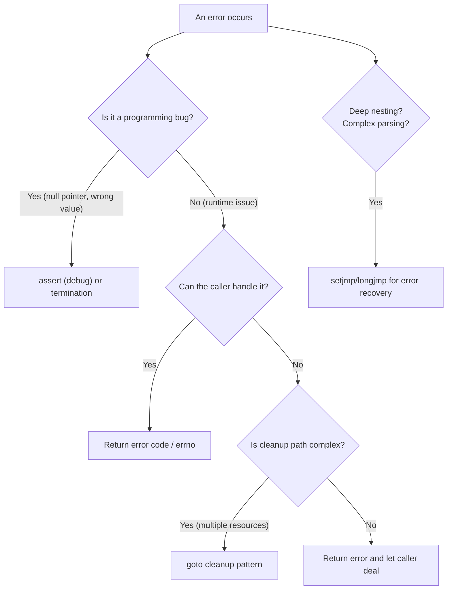

# Error Handling: errno, setjmp/longjmp, and Assertions

> [!summary] Goal
> Handle errors in C using return codes, errno, assertions, and non-local jumps (setjmp/longjmp). Understand why C has no exceptions and how to build robust error handling patterns.

## Table of Contents

1. [Return Codes](#return-codes)
2. [errno — The Global Error Number](#errno-the-global-error-number)
3. [Patterns for Robust Error Handling](#patterns-for-robust-error-handling)
4. [Assertions](#assertions)
5. [setjmp/longjmp — Non-Local Jumps](#setjmp-longjmp-non-local-jumps)
6. [Error Handling Strategy Guide](#error-handling-strategy-guide)
7. [Pitfalls](#pitfalls)

---

## Return Codes

> [!info] Return code
> A return code is the most basic error handling mechanism in C: a function returns a value indicating success or failure. By convention, 0 means success, non-zero means failure (negative for POSIX system calls, positive for some libraries). This is the foundation — everything else builds on it.

```c
// Common patterns

// Pattern 1: return 0 for success, non-zero for error
int divide(int a, int b, double *result) {
    if (b == 0) return -1;          // Error: division by zero
    *result = (double)a / b;
    return 0;                       // Success
}

double result;
if (divide(10, 0, &result) != 0) {
    fprintf(stderr, "Division failed\n");
}

// Pattern 2: return negative for error, >= 0 for success/value
ssize_t read(int fd, void *buf, size_t count);
ssize_t n = read(fd, buf, sizeof(buf));
if (n < 0) { /* handle error */ }
// n >= 0: number of bytes read (0 = EOF)

// Pattern 3: return valid pointer or NULL
FILE *fp = fopen("file.txt", "r");
if (!fp) { /* handle error */ }
```

### Multiple error codes

```c
typedef enum {
    ERR_OK = 0,
    ERR_NOT_FOUND = -1,
    ERR_PERMISSION = -2,
    ERR_INVALID_INPUT = -3,
    ERR_OUT_OF_MEMORY = -4,
    ERR_UNKNOWN = -99
} ErrorCode;

ErrorCode process_file(const char *path) {
    FILE *fp = fopen(path, "r");
    if (!fp) {
        if (errno == ENOENT) return ERR_NOT_FOUND;
        if (errno == EACCES) return ERR_PERMISSION;
        return ERR_UNKNOWN;
    }
    // ...
    fclose(fp);
    return ERR_OK;
}
```

---

## errno — The Global Error Number

> [!info] errno
> `errno` is a thread-local integer variable set by system calls and some library functions when they fail. It contains the error code of the **last** failed operation. You should read it immediately after a failure — a later call (even printf) can overwrite it.

```c
#include <errno.h>
#include <string.h>    // strerror
#include <stdio.h>     // perror

FILE *fp = fopen("nonexistent.txt", "r");
if (!fp) {
    // Method 1: print error with perror
    perror("fopen");                    // "fopen: No such file or directory"
    
    // Method 2: get error string
    fprintf(stderr, "Error %d: %s\n", errno, strerror(errno));
    
    // Method 3: check specific error
    if (errno == ENOENT) {
        fprintf(stderr, "File doesn't exist\n");
    }
}
```

### Common errno values

| errno constant | Value (typical) | Meaning | Example |
|:--------------:|:---------------:|---------|---------|
| `EPERM` | 1 | Operation not permitted | `chmod` on file you don't own |
| `ENOENT` | 2 | No such file or directory | `fopen` of non-existent file |
| `EINTR` | 4 | Interrupted system call | Signal received during `read` |
| `EIO` | 5 | I/O error | Physical disk error |
| `EBADF` | 9 | Bad file descriptor | `read` on closed fd |
| `ENOMEM` | 12 | Out of memory | `malloc` failed |
| `EACCES` | 13 | Permission denied | `open` without read permission |
| `EEXIST` | 17 | File exists | `open` with `O_CREAT | O_EXCL` |
| `EAGAIN` / `EWOULDBLOCK` | 11 | Resource temporarily unavailable | Non-blocking read with no data |

### Thread safety

```c
// errno is defined as a thread-local variable (since C11 / POSIX.1-2001)
// This means each thread has its own errno — thread-safe by design.

// But be careful: library functions that succeed may SET errno
// This is allowed — they can modify errno even on success
// So only use errno after an explicit failure
```

---

## Patterns for Robust Error Handling

### The `goto` cleanup pattern

> [!info] Goto cleanup
> In C, `goto` is the cleanest way to centralize error handling — it jumps to the cleanup section at the end of a function. This is the standard pattern in the Linux kernel. Every `goto` jumps **forward** to the cleanup label — never backward.

```c
int process_file(const char *path) {
    FILE *fp = NULL;
    char *buffer = NULL;
    int ret = -1;

    fp = fopen(path, "r");
    if (!fp) {
        perror("fopen");
        goto cleanup;
    }

    buffer = malloc(4096);
    if (!buffer) {
        fprintf(stderr, "malloc failed\n");
        goto cleanup;
    }

    if (fread(buffer, 1, 4096, fp) < 0) {
        perror("fread");
        goto cleanup;
    }

    ret = 0;        // Success

cleanup:
    if (buffer) free(buffer);
    if (fp) fclose(fp);
    return ret;     // ret is 0 on success, -1 on any failure
}
```

### The out-parameter pattern

```c
// Pass error information through a dedicated output parameter

typedef struct {
    int error_code;
    char error_msg[256];
} Error;

Error err = {0};

void process(Error *err) {
    FILE *fp = fopen("file.txt", "r");
    if (!fp) {
        err->error_code = errno;
        snprintf(err->error_msg, sizeof(err->error_msg),
                 "Failed to open file: %s", strerror(errno));
        return;
    }
    // ... processing ...
    fclose(fp);
}

// Usage
Error err = {0};
process(&err);
if (err.error_code != 0) {
    fprintf(stderr, "Error: %s\n", err.error_msg);
}
```

### Resource acquisition guard (simplified)

```c
// Every resource acquisition should be paired with a release
// Track all resources to ensure cleanup on any failure path

int safe_function(void) {
    int fd = -1;
    void *map = NULL;
    void *data = NULL;
    int ret = -1;
    
    fd = open("file", O_RDONLY);
    if (fd < 0) goto out;
    
    map = mmap(NULL, 4096, PROT_READ, MAP_PRIVATE, fd, 0);
    if (map == MAP_FAILED) goto out;
    
    data = malloc(4096);
    if (!data) goto out;
    
    // ... use resources ...
    ret = 0;
    
out:
    free(data);       // NULL-safe free
    if (map) munmap(map, 4096);
    if (fd >= 0) close(fd);
    return ret;
}
```

---

## Assertions

> [!info] Assertion
> `assert(expression)` is a macro that terminates the program if the expression is false (evaluates to 0). It's for **debugging** — it catches bugs during development. Assertions are disabled when `NDEBUG` is defined (typically in release builds). Never use assert for error handling that the program should recover from.

```c
#include <assert.h>

// Precondition checks
int divide(int a, int b, double *result) {
    assert(b != 0);               // Crash if b == 0 — this is a BUG
    assert(result != NULL);        // Crash if result is NULL
    *result = (double)a / b;
    return 0;
}

// Postcondition checks
int *sort(int *arr, int n) {
    // ... sort ...
    for (int i = 1; i < n; i++) {
        assert(arr[i-1] <= arr[i]);  // Verify sorted
    }
    return arr;
}

// Assert with message (not standard, but common)
#define ASSERT(cond, msg) do {                     \
    if (!(cond)) {                                  \
        fprintf(stderr, "ASSERTION FAILED: %s (%s:%d)\n  %s\n", \
                #cond, __FILE__, __LINE__, msg);    \
        abort();                                    \
    }                                               \
} while (0)
```

### static_assert (C11)

```c
#include <assert.h>

// Compile-time assertion — checked at compile time, zero runtime cost
static_assert(sizeof(int) == 4, "int must be 4 bytes");
static_assert(sizeof(void*) == 8, "64-bit platform required");

// Useful for struct layout validation
static_assert(sizeof(PacketHeader) == 8, "PacketHeader must be 8 bytes (packed)");
static_assert(offsetof(PacketHeader, length) == 1, "length must be at offset 1");
```

---

## setjmp/longjmp — Non-Local Jumps

> [!info] setjmp/longjmp
> `setjmp` saves the program state (registers, stack pointer, program counter) into a `jmp_buf`. `longjmp` restores that state, jumping back to the `setjmp` call as if it had returned a second time. This is C's only mechanism for "unwind" — similar to a try/catch, but simpler and more dangerous.

```c
#include <setjmp.h>

jmp_buf error_handler;

void risky_function(void) {
    if (/* something bad */) {
        longjmp(error_handler, 1);   // Jump back to setjmp, return value 1
    }
}

int main(void) {
    int result = setjmp(error_handler);
    if (result == 0) {
        // Normal execution path (try block)
        risky_function();
        printf("Success\n");
    } else {
        // Error handling path (catch block)
        fprintf(stderr, "Error occurred (code=%d)\n", result);
    }
    return 0;
}
```

### Real-world usage: parsing with recovery

```c
#include <setjmp.h>

typedef struct {
    jmp_buf env;
    int error_code;
    const char *error_msg;
} ParserContext;

void parse_error(ParserContext *ctx, int code, const char *msg) {
    ctx->error_code = code;
    ctx->error_msg = msg;
    longjmp(ctx->env, 1);           // Jump back to setjmp point
}

void parse_number(ParserContext *ctx, const char **input) {
    if (**input == '\0') {
        parse_error(ctx, ERR_EMPTY, "Unexpected end of input");
    }
    if (**input < '0' || **input > '9') {
        parse_error(ctx, ERR_INVALID, "Expected digit");
    }
    // ... parse number ...
    while (**input >= '0' && **input <= '9') (*input)++;
}

int main(void) {
    ParserContext ctx = {0};
    
    if (setjmp(ctx.env) == 0) {
        // Try block
        const char *input = "42abc";
        parse_number(&ctx, &input);
        printf("Parsed OK\n");
    } else {
        // Catch block
        fprintf(stderr, "Parse error %d: %s\n", ctx.error_code, ctx.error_msg);
    }
    return 0;
}
```

### Limitations of setjmp/longjmp

| Issue | Detail |
|-------|--------|
| **Local variables** | Values of local variables are indeterminate after longjmp if they were modified between setjmp and longjmp (unless declared `volatile`) |
| **Resources** | Does NOT call any cleanup — files are not closed, memory is not freed |
| **Nesting** | Cannot jump between threads. jmp_buf is thread-specific. |
| **Signal handling** | Can be used in signal handlers, but carefully (must use `sigsetjmp`/`siglongjmp`) |
| **C++ incompatibility** | longjmp through C++ destructors is undefined behavior |

---

## Error Handling Strategy Guide



| Strategy | Use for | Pros | Cons |
|----------|---------|------|------|
| **Return code** | Most functions | Simple, standard, flexible | Caller must check |
| **errno** | System calls | Standard POSIX, thread-local | Global state (per thread) |
| **assert** | Programming bugs | Zero-cost in release | Terminates program |
| **goto cleanup** | Multi-resource functions | Correct, visible cleanup | Critics dislike goto |
| **setjmp/longjmp** | Deep error recovery | Non-local jump, like try/catch | Dangerous, no cleanup |

---

## Pitfalls

### Ignoring return values

```c
// ❌ Common mistake
fopen("file.txt", "r");              // Return value not checked!
// Next line: fgets on NULL pointer → crash

// ✅ Always check
FILE *fp = fopen("file.txt", "r");
if (!fp) { /* handle error */ }
```

### Checking errno after success

```c
// errno may be set by successful calls that call library functions internally
// Only check errno after a FAILED call (e.g., fopen returns NULL)
// Clear errno before a risky call if you need to check it afterward:
errno = 0;
long val = strtol("  123", &end, 10);
if (errno != 0) { /* overflow occurred */ }
```

### Using assert for runtime errors

```c
assert(fp != NULL);     // ❌ Wrong! User input errors should be handled gracefully
                        // Assert disappears in release builds (NDEBUG)
if (!fp) {
    fprintf(stderr, "Cannot open file\n");
    return -1;           // ✅ Correct: runtime error handling
}
```

### Stack corruption from longjmp

```c
void inner(void) {
    jmp_buf env;
    if (setjmp(env) == 0) { /* ... */ }
    // ⚠️ WRONG: returning while env points to this function's stack frame
    // If another function calls longjmp(env), stack corruption!
}
```

longjmp to a `jmp_buf` in a function that has already returned = **undefined behavior**.

---

> [!question]- Interview Questions
>
> **Q: How does C handle errors compared to C++/Java?**
> A: C has no exceptions. Errors are communicated via: return values (0 = success, non-zero = error), errno (for system calls), out-parameters (pointer to error code), and assertions (for programming bugs). C's approach is explicit — the programmer must check every return value.
>
> **Q: What is the `goto` cleanup pattern and why is it used?**
> A: When a function acquires multiple resources (file handles, memory, locks), every error path must release all previously acquired resources. The `goto cleanup` pattern jumps to a single cleanup section at the end of the function that frees everything. This avoids duplicating cleanup code on every error path and prevents resource leaks. The Linux kernel uses this pattern extensively.
>
> **Q: What is `errno` and how is it made thread-safe?**
> A: `errno` is defined as a macro that expands to a thread-local variable (since C11 / POSIX.1-2001). Each thread has its own `errno`, so errors in one thread don't interfere with another. This was a major improvement over the original global `errno`.
>
> **Q: What is `setjmp`/`longjmp` and what are its limitations?**
> A: `setjmp` saves the program state; `longjmp` restores it — effectively a non-local goto that can jump up the call stack. Limitations: (1) local variable values may be indeterminate after longjmp, (2) automatic cleanup (free, close) doesn't happen, (3) can't jump between threads, (4) undefined behavior if you longjmp into a function that has already returned.
>
> **Q: What is the difference between `assert` and `static_assert`?**
> A: `assert` is a runtime check — it evaluates the expression and terminates if false. It's disabled when `NDEBUG` is defined (release builds). `static_assert` is a compile-time check — it validates the expression during compilation. If false, compilation fails. `static_assert` has zero runtime cost and is used for type sizes, struct layout, and platform assumptions.

---

## Cross-Links

- [[C/01_Foundations/01_C_Basics_and_Pointers]] for NULL pointer checks
- [[C/01_Foundations/03_Dynamic_Memory]] for malloc failure handling
- [[C/02_Core/02_File_IO_and_POSIX_System_Calls]] for file I/O error handling
- [[C/03_Advanced/05_System_Programming]] for fork/exec error codes
- [[C/04_Playbooks/01_Debug_Segfaults_and_Invalid_Memory_Access]] for error debugging
