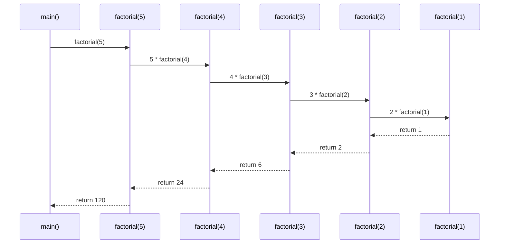

# Algorithms and Recursion

> [!summary] Goal
> Understand recursion (stack frames, tail recursion), implement fundamental searching and sorting algorithms in C, and analyze time/space complexity. Essential for system programming, kernel scheduling, and embedded performance.

## Table of Contents

1. [Recursion](#recursion)
2. [Searching Algorithms](#searching-algorithms)
3. [Sorting Algorithms](#sorting-algorithms)
4. [Complexity Analysis](#complexity-analysis)
5. [Pitfalls](#pitfalls)

---

## Recursion

> [!info] Recursion
> A function that calls itself. Each call creates a new **stack frame** with its own local variables. The base case terminates the recursion. Deep recursion can overflow the stack (~8 MB default). Every recursive solution has an equivalent iterative one (using an explicit stack).

### Recursion stack frame diagram



### Classic recursion examples

```c
// Factorial — O(n) time, O(n) stack space
int factorial(int n) {
    if (n <= 1) return 1;         // Base case
    return n * factorial(n - 1);   // Recursive case
}

// Fibonacci — O(2^n) time! Don't do this for n > 30
int fib_bad(int n) {
    if (n <= 1) return n;
    return fib_bad(n - 1) + fib_bad(n - 2);
}

// Fibonacci with memoization — O(n) time, O(n) space
int fib_memo(int n, int *memo) {
    if (n <= 1) return n;
    if (memo[n] != -1) return memo[n];
    memo[n] = fib_memo(n - 1, memo) + fib_memo(n - 2, memo);
    return memo[n];
}
```

### Tail recursion

> [!info] Tail recursion
> A recursive call is **tail-recursive** if it's the last operation in the function — the function returns the result of the recursive call directly. A **tail-call-optimizing** compiler can reuse the current stack frame instead of creating a new one, eliminating stack growth. GCC does this with `-O2` or higher.

```c
// ❌ Not tail-recursive: multiplication happens AFTER the recursive call
int factorial(int n) {
    return n * factorial(n - 1);    // Must unwind stack to multiply
}

// ✅ Tail-recursive: the recursive call IS the return value
int factorial_tail(int n, int accumulator) {
    if (n <= 1) return accumulator;
    return factorial_tail(n - 1, n * accumulator);  // Tail call
}

// Usage: factorial_tail(5, 1) → 120

// Tree traversal (inorder) — naturally recursive, not easily tail-recursive
void inorder(TreeNode *root) {
    if (!root) return;
    inorder(root->left);           // Not tail: need to come back
    printf("%d ", root->value);
    inorder(root->right);          // Could be tail? No — must return from left first
}
```

---

## Searching Algorithms

### Linear search

```c
// O(n) — works on unsorted data
int *linear_search(int *arr, int n, int target) {
    for (int i = 0; i < n; i++) {
        if (arr[i] == target) return &arr[i];
    }
    return NULL;
}
```

### Binary search (iterative)

```c
// O(log n) — requires sorted array
int *binary_search(int *arr, int n, int target) {
    int lo = 0, hi = n - 1;
    
    while (lo <= hi) {
        int mid = lo + (hi - lo) / 2;     // Prevents overflow: (lo+hi)/2 can overflow
        
        if (arr[mid] == target) return &arr[mid];
        if (arr[mid] < target) lo = mid + 1;
        else hi = mid - 1;
    }
    return NULL;
}
```

### Binary search (recursive)

```c
int *bsearch_recursive(int *arr, int lo, int hi, int target) {
    if (lo > hi) return NULL;
    
    int mid = lo + (hi - lo) / 2;
    
    if (arr[mid] == target) return &arr[mid];
    if (arr[mid] < target) return bsearch_recursive(arr, mid + 1, hi, target);
    return bsearch_recursive(arr, lo, mid - 1, target);
}

// Standard library version
#include <stdlib.h>
int key = 42;
int *result = bsearch(&key, arr, n, sizeof(int), compare_ints);
```

---

## Sorting Algorithms

### Bubble sort — O(n²)

```c
void bubble_sort(int *arr, int n) {
    for (int i = 0; i < n - 1; i++) {
        int swapped = 0;
        for (int j = 0; j < n - i - 1; j++) {
            if (arr[j] > arr[j + 1]) {
                int tmp = arr[j]; arr[j] = arr[j + 1]; arr[j + 1] = tmp;
                swapped = 1;
            }
        }
        if (!swapped) break;  // Early exit if already sorted
    }
}
```

### Insertion sort — average O(n²), best O(n)

```c
void insertion_sort(int *arr, int n) {
    for (int i = 1; i < n; i++) {
        int key = arr[i];
        int j = i - 1;
        while (j >= 0 && arr[j] > key) {
            arr[j + 1] = arr[j];
            j--;
        }
        arr[j + 1] = key;
    }
}
// Best for: nearly-sorted data, small arrays (n < 50)
```

### Merge sort — O(n log n), stable

```c
void merge(int *arr, int lo, int mid, int hi) {
    int left_size = mid - lo + 1;
    int right_size = hi - mid;
    int L[left_size], R[right_size];         // VLA — careful with large sizes
    
    for (int i = 0; i < left_size; i++)  L[i] = arr[lo + i];
    for (int j = 0; j < right_size; j++) R[j] = arr[mid + 1 + j];
    
    int i = 0, j = 0, k = lo;
    while (i < left_size && j < right_size) {
        arr[k++] = (L[i] <= R[j]) ? L[i++] : R[j++];
    }
    while (i < left_size)  arr[k++] = L[i++];
    while (j < right_size) arr[k++] = R[j++];
}

void merge_sort(int *arr, int lo, int hi) {
    if (lo < hi) {
        int mid = lo + (hi - lo) / 2;
        merge_sort(arr, lo, mid);
        merge_sort(arr, mid + 1, hi);
        merge(arr, lo, mid, hi);
    }
}
```

### Quick sort — average O(n log n), in-place

```c
int partition(int *arr, int lo, int hi) {
    int pivot = arr[hi];               // Lomuto partition: pivot is last element
    int i = lo - 1;
    
    for (int j = lo; j < hi; j++) {
        if (arr[j] <= pivot) {
            i++;
            int tmp = arr[i]; arr[i] = arr[j]; arr[j] = tmp;
        }
    }
    int tmp = arr[i + 1]; arr[i + 1] = arr[hi]; arr[hi] = tmp;
    return i + 1;
}

void quick_sort(int *arr, int lo, int hi) {
    if (lo < hi) {
        int p = partition(arr, lo, hi);
        quick_sort(arr, lo, p - 1);
        quick_sort(arr, p + 1, hi);
    }
}

// Usage
quick_sort(arr, 0, n - 1);
```

### Sorting comparison

| Algorithm | Best | Average | Worst | Space | Stable | When to use |
|-----------|:----:|:-------:|:-----:|:----:|:-----:|-------------|
| **Bubble** | O(n) | O(n²) | O(n²) | O(1) | Yes | Educational only |
| **Insertion** | O(n) | O(n²) | O(n²) | O(1) | Yes | Near-sorted, n < 50 |
| **Merge** | O(n log n) | O(n log n) | O(n log n) | O(n) | Yes | Guaranteed speed, stable |
| **Quick** | O(n log n) | O(n log n) | O(n²) | O(log n) | No | General purpose, fast |
| **Heap** | O(n log n) | O(n log n) | O(n log n) | O(1) | No | Guaranteed speed, in-place |
| **qsort** (stdlib) | O(n log n) | O(n log n) | O(n²) | O(log n) | No | Convenience, generic |

---

## Complexity Analysis

### Big O reference

| Notation | Name | Example | Scales to |
|----------|------|---------|:---------:|
| O(1) | Constant | Array access, hash lookup | Any size |
| O(log n) | Logarithmic | Binary search | Billion+ items |
| O(n) | Linear | Linear search, array iteration | Tens of millions |
| O(n log n) | Linearithmic | Merge sort, quick sort | Millions |
| O(n²) | Quadratic | Bubble sort, nested loops | Thousands |
| O(2ⁿ) | Exponential | Naive Fibonacci | ~30 |
| O(n!) | Factorial | All permutations | ~10 |

### Space complexity

```c
// O(1) — in-place, no extra memory proportional to input
void in_place_reverse(int *arr, int n) {
    for (int i = 0; i < n / 2; i++) {
        int tmp = arr[i];
        arr[i] = arr[n - 1 - i];
        arr[n - 1 - i] = tmp;
    }
}

// O(n) — linear extra space
int *copy_array(int *src, int n) {
    int *dst = malloc(n * sizeof(int));
    for (int i = 0; i < n; i++) dst[i] = src[i];
    return dst;     // O(n) extra space
}

// O(log n) — recursion depth (merge sort)
// merge_sort recursively calls itself log n times before base case
```

---

## Pitfalls

### Stack overflow from deep recursion

```c
// factorial(100000) — 100K stack frames, each ~32 bytes = ~3.2 MB
// On an 8 MB stack, this might work. But factorial(1000000) will crash.
// Use iteration for large n:
long factorial_iter(int n) {
    long result = 1;
    for (int i = 2; i <= n; i++) result *= i;
    return result;
}
```

### Quick sort worst case

Quick sort degrades to O(n²) when the pivot is always the smallest or largest element (sorted or reverse-sorted input). Mitigate by: (a) random pivot selection, (b) median-of-three pivoting, (c) switching to insertion sort for small sub-arrays.

### Integer overflow in binary search

```c
int mid = (lo + hi) / 2;        // ❌ Undefined behavior if lo + hi > INT_MAX
int mid = lo + (hi - lo) / 2;   // ✅ Safe for any lo/hi
```

### Forgetting base case

```c
int bad_factorial(int n) {
    return n * bad_factorial(n - 1);    // No base case — infinite recursion → stack overflow
}
```

---

> [!question]- Interview Questions
>
> **Q: What is tail recursion and why does it matter?**
> A: Tail recursion is when the recursive call is the last operation — the function returns its result directly. A tail-call-optimizing compiler can reuse the current stack frame, eliminating stack growth. GCC does this at -O2 or higher. Compare: `return n * f(n-1)` (NOT tail) vs `return f(n-1, acc)` (tail).
>
> **Q: Sort a linked list in O(n log n) time.**
> A: Merge sort is the natural choice for linked lists — it doesn't need random access. Find the middle (fast/slow pointers), split, recursively sort each half, merge. Time O(n log n), space O(log n) for recursion stack. Quick sort on linked lists is slower due to the pivot selection overhead.
>
> **Q: When would you choose merge sort over quick sort?**
> A: (1) When you need stable sorting (equal elements maintain their original order). (2) When worst-case performance must be guaranteed — quick sort can be O(n²) on sorted data, merge sort is always O(n log n). (3) For linked lists — merge sort doesn't need random access. (4) When memory isn't constrained (merge sort needs O(n) extra space).
>
> **Q: What is the difference between O(log n) and O(n) space for recursion?**
> A: Merge sort has O(log n) recursion depth (binary division) but needs O(n) auxiliary space for the merge phase. Quick sort has O(log n) recursion space and O(1) extra (in-place partitioning). Tree operations have O(h) space where h is tree height — O(log n) for balanced, O(n) for degenerate.
>
> **Q: How does the standard library's `qsort` work internally?**
> A: Most `qsort` implementations use introsort — a hybrid of quick sort, heap sort, and insertion sort. Quick sort is used for most of the input, but if recursion depth exceeds log(n), it switches to heap sort (guaranteeing O(n log n)). Small partitions (n < 16) use insertion sort.

---

## Cross-Links

- [[C/02_Core/04_Data_Structures_in_C]] for tree structures and traversal
- [[C/01_Foundations/02_Memory_Model_and_Allocation]] for stack vs heap in recursion
- [[C/02_Core/01_Function_Pointers_Callbacks_and_vtables]] for qsort comparator
- [[C/02_Core/06_Undefined_Behavior_and_Memory_Safety]] for integer overflow
- [[DSA/Algorithms]] for algorithm patterns beyond C
