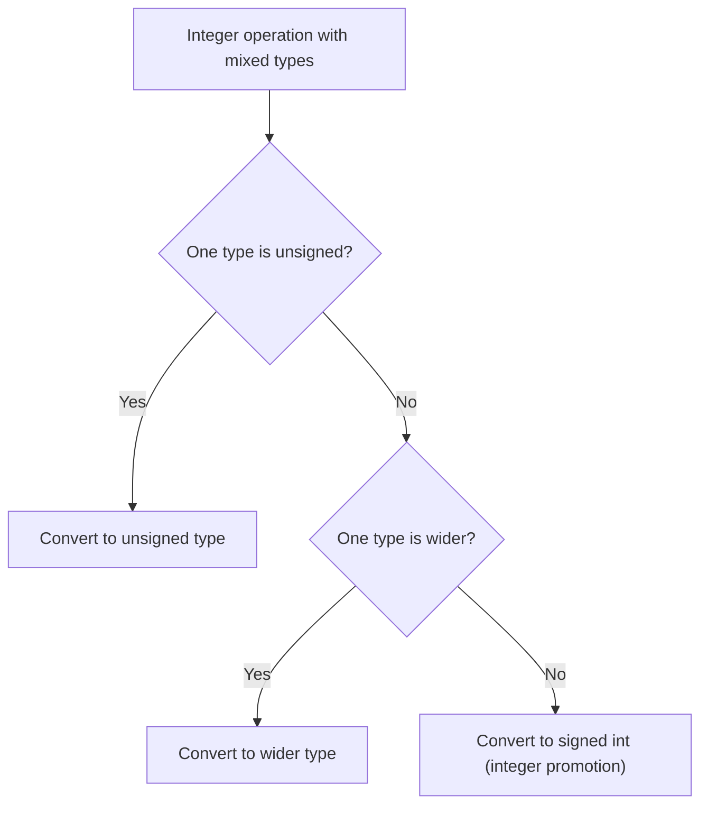

# Undefined Behavior and Memory Safety

> [!summary] Goal
> Understand C undefined behavior — what it is, why it exists, and how to avoid it. Covers all common UB sources, strict aliasing, integer overflow, sequence points, and defensive programming patterns. Essential for writing safe, portable, and secure C code.

## Table of Contents

1. [What Is Undefined Behavior?](#what-is-undefined-behavior)
2. [Common UB Sources](#common-ub-sources)
3. [Strict Aliasing](#strict-aliasing)
4. [Integer Overflow and Signedness](#integer-overflow-and-signedness)
5. [Sequence Points](#sequence-points)
6. [Defensive Programming](#defensive-programming)
7. [Detection Tools](#detection-tools)
8. [Pitfalls](#pitfalls)

---

## What Is Undefined Behavior?

> [!info] Undefined behavior (UB)
> The C standard says certain operations produce "undefined behavior" — the program can do **anything**: crash, silently produce wrong results, appear to work correctly, or even delete your files. UB is not an error message — it's the **absence** of any requirement on the compiler. The compiler is allowed to assume UB never happens and optimize accordingly.

```c
// The compiler can assume this never happens because signed overflow is UB
int overflow(int x) {
    int result = x + 100;       // If x = INT_MAX, this is UB
    return result;
}

// GCC may optimize to: return x + 100;
// Clang may optimize to: __builtin_unreachable(); (abort if x = INT_MAX)
// Both are "correct" according to the standard
```

| Category | Behavior | What the compiler does |
|----------|----------|----------------------|
| **Defined** | Standard guarantees a specific result | The result is predictable |
| **Unspecified** | Standard offers a choice among options | The result is one of the options |
| **Implementation-defined** | Platform decides (documented) | The result is consistent per platform |
| **Undefined** | Nothing is guaranteed | Anything can happen |

---

## Common UB Sources

### Buffer overflow (most dangerous)

```c
int arr[5];
arr[5] = 42;            // ❌ UB: write past end
arr[-1] = 42;           // ❌ UB: write before start

void func(int n) {
    int buf[10];
    gets(buf);           // ❌ UB if n > 10 — no bounds check!
    memcpy(buf, src, n); // ❌ UB if n > 10
}
```

### Null pointer dereference

```c
int *p = NULL;
*p = 5;                  // ❌ UB: dereferencing NULL (usually crashes)
free(p);                 // ❌ UB: freeing NULL (actually OK — free(NULL) is defined)
```

### Use-after-free

```c
int *p = malloc(sizeof(int));
free(p);
*p = 42;                 // ❌ UB: use after free
```

### Double free

```c
int *p = malloc(sizeof(int));
free(p);
free(p);                 // ❌ UB: double free
```

### Signed integer overflow

```c
int i = INT_MAX;
i++;                     // ❌ UB: signed overflow

// Unsigned overflow is WELL-DEFINED:
unsigned int u = UINT_MAX;
u++;                     // ✅ Wraps to 0 (defined behavior)
```

### Division by zero

```c
int x = 5 / 0;           // ❌ UB: integer division by zero
double y = 5.0 / 0.0;   // ✅ OK: returns +Infinity (IEEE 754 floating point)
```

### Uninitialized variables

```c
int x;                   // Stack variable — contains garbage
if (x > 0) { /* ... */ } // ❌ UB: reading uninitialized variable

// Exceptions: all-zero-bits is a valid trap representation for some types
// Always initialize:
int x = 0;
```

---

## Strict Aliasing

> [!info] Strict aliasing
> The compiler assumes pointers of different types never point to the same memory location (unless one is `char*` or `void*`). Violating this assumption produces UB. The compiler can reorder operations or make incorrect optimizations.

```c
// ❌ UB: strict aliasing violation
int *int_ptr = malloc(sizeof(int));
float *float_ptr = (float *)int_ptr;
*int_ptr = 42;
*float_ptr = 3.14;       // ❌ Compiler may reorder this before *int_ptr = 42

// ✅ Correct: use a union or memcpy
union { int i; float f; } u;
u.i = 42;
u.f = 3.14;              // OK: writing to one union member then reading another

// ✅ Correct: use memcpy
float f;
int i = 42;
memcpy(&f, &i, sizeof(f));  // OK: char* exception to aliasing rules

// ✅ Always OK: char/void pointers can alias anything
int x = 42;
char *cp = (char *)&x;   // OK: char* can alias any type
```

### The `-fno-strict-aliasing` flag

```c
// The Linux kernel is compiled with -fno-strict-aliasing
// because lots of kernel code breaks strict aliasing rules
// (networking code, device drivers, etc.)
```

---

## Integer Overflow and Signedness

### Safe addition

```c
#include <limits.h>

// Check for overflow BEFORE performing the operation
int safe_add(int a, int b, int *result) {
    if ((b > 0 && a > INT_MAX - b) || (b < 0 && a < INT_MIN - b)) {
        return -1;  // Overflow would occur
    }
    *result = a + b;
    return 0;
}
```

### Implicit conversions and sign mismatch

```c
unsigned int u = 10;
int s = -1;

if (s > u) {            // ❌ BUG! s is converted to unsigned → UINT_MAX (huge)
    printf("-1 > 10? YES!\n");
}
// Fix: compare as signed
if (s > (int)u) { ... }

// The compiler warns about this:
// gcc -Wsign-compare (included in -Wextra)
```

### Conversion rules



---

## Sequence Points

> [!info] Sequence point
> A point in the program where all side effects of previous evaluations are guaranteed to be complete. Between sequence points, the compiler can reorder expressions' evaluation arbitrarily. Modifying a variable twice between sequence points is UB.

```c
int i = 5;

i = i++;                // ❌ UB: i modified twice between sequence points
i = ++i + i++;          // ❌ UB: i modified three times
printf("%d %d", ++i, ++i);  // ❌ UB: i modified twice between sequence points

// Sequence points occur at:
// - Semicolons (end of an expression statement)
// - Logical operators: &&, ||
// - Ternary: ? :
// - Comma operator: (a, b)
// - Function calls (after argument evaluation, before function body)
```

### Safe patterns

```c
// ✅ Use separate statements:
int i = 5;
i++;                     // Sequence point after semicolon
int j = i;               // Sequence point after semicolon

// ✅ Comma operator is a sequence point:
int x = (i++, i);        // OK: i is incremented, then x = i

// ✅ Short-circuit operators are sequence points:
if (p != NULL && *p == 5) { }  // OK: p is checked before dereference
```

---

## Defensive Programming

### Always check input parameters

```c
int process(int *arr, size_t n) {
    if (!arr) return -1;          // Null check
    if (n == 0) return 0;         // Empty array
    if (n > MAX_SIZE) return -1;  // Size check
    
    for (size_t i = 0; i < n; i++) {
        arr[i] *= 2;
    }
    return 0;
}
```

### Bounds-checked string operations

```c
// Never use unbounded functions:
// gets() → fgets()
// strcpy() → strncpy() or strlcpy()
// sprintf() → snprintf()
// strcat() → strncat()
```

### Use sized types

```c
#include <stdint.h>

int32_t x;               // Exactly 32 bits — no platform surprises
uint16_t y;              // Exactly 16 bits
size_t n;                // Correct type for sizes and indices
```

### Enable compiler warnings

```bash
# Minimum
gcc -Wall -Wextra

# Recommended for production
gcc -Wall -Wextra -Wpedantic -Wshadow -Wstrict-prototypes \
    -Wold-style-definition -Wconversion -Wformat=2 \
    -Wnull-dereference -Werror
```

---

## Detection Tools

### Compile-time: GCC/Clang warnings

```bash
gcc -Wall -Wextra program.c           # Most common UB
gcc -fanalyzer program.c              # Static analysis (GCC 10+)
```

### Runtime: Sanitizers

```bash
# AddressSanitizer — buffer overflows, use-after-free, double free
gcc -fsanitize=address -g program.c -o program
./program

# UndefinedBehaviorSanitizer — UB detection
gcc -fsanitize=undefined -g program.c -o program
./program                    # Reports UB with file/line info

# MemorySanitizer — uninitialized memory reads
gcc -fsanitize=memory -g program.c -o program

# Both together
gcc -fsanitize=address,undefined -g program.c -o program
```

### Static analysis tools

```bash
# cppcheck
cppcheck --enable=all program.c

# clang-tidy
clang-tidy program.c -- -std=c99

# GCC -fanalyzer
gcc -fanalyzer program.c
```

---

## Pitfalls

### Assuming UB always crashes

The most dangerous thing about UB is that it can appear to work. A buffer overflow may not crash immediately — it corrupts neighbor data that causes a crash seconds later in unrelated code. This makes UB bugs extremely hard to find without sanitizers.

### Sign mismatch in comparisons

```c
unsigned int u = 0;
if (u - 1 >= 0) { }      // Always true! u - 1 wraps to UINT_MAX
```

Cast explicitly or use signed types for comparisons.

### Forgetting about integer promotion

```c
uint16_t a = 65535;
uint16_t b = 1;
uint32_t c = a + b;       // a and b are promoted to int (32-bit), sum is 65536
                          // This is fine — but if int is 16-bit...
```

### `-fwrapv` for defined signed overflow

```bash
# Makes signed integer overflow wrap-around (defined behavior)
# NOT standard — use only if you must
gcc -fwrapv program.c
```

---

> [!question]- Interview Questions
>
> **Q: What is undefined behavior and why does C have it?**
> A: UB means the C standard imposes no requirements on the program's behavior — anything can happen. C has UB to allow compiler optimizations (the compiler assumes UB never happens) and to avoid mandating specific behavior for edge cases that would slow down all programs (like bounds checking). This tradeoff is why C is fast but dangerous.
>
> **Q: Give three examples of undefined behavior.**
> A: (1) Signed integer overflow (`INT_MAX + 1`). (2) Buffer overflow (`arr[5]` where arr has 5 elements — index 5 is past the end). (3) Use-after-free (accessing memory after `free()`). All three can — but don't always — crash the program.
>
> **Q: What is the strict aliasing rule?**
> A: The compiler assumes that pointers of different types never point to the same memory (except `char*` and `void*`). If you cast an `int*` to a `float*` and write through it, the compiler may reorder the write past other accesses, causing incorrect behavior. Fix: use `memcpy` or a union, or compile with `-fno-strict-aliasing`.
>
> **Q: How do you detect undefined behavior in your code?**
> A: (1) Compile with `-Wall -Wextra -Wpedantic` for static detection. (2) Use `-fsanitize=address,undefined` for runtime detection. (3) Use static analysis tools (cppcheck, clang-tidy, GCC -fanalyzer). (4) Enable all sanitizers in CI. Never test without sanitizers.
>
> **Q: What is a sequence point?**
> A: A sequence point is a point where all side effects from previous expressions are complete. Between sequence points, the compiler can reorder evaluations. Modifying a variable more than once between sequence points (`i = i++`) is UB. Sequence points occur at: semicolons, `&&`, `||`, `?:`, the comma operator, and function call boundaries.

---

## Cross-Links

- [[C/01_Foundations/04_Arrays_Strings_and_Bounds]] for buffer overflows
- [[C/01_Foundations/03_Dynamic_Memory]] for use-after-free and double free
- [[C/01_Foundations/01_C_Basics_and_Pointers]] for pointer safety and null checks
- [[C/04_Playbooks/01_Debug_Segfaults_and_Invalid_Memory_Access]] for debugging UB
- [[C/04_Playbooks/02_Use_Sanitizers_ASan_UBSan_TSan]] for sanitizer usage
