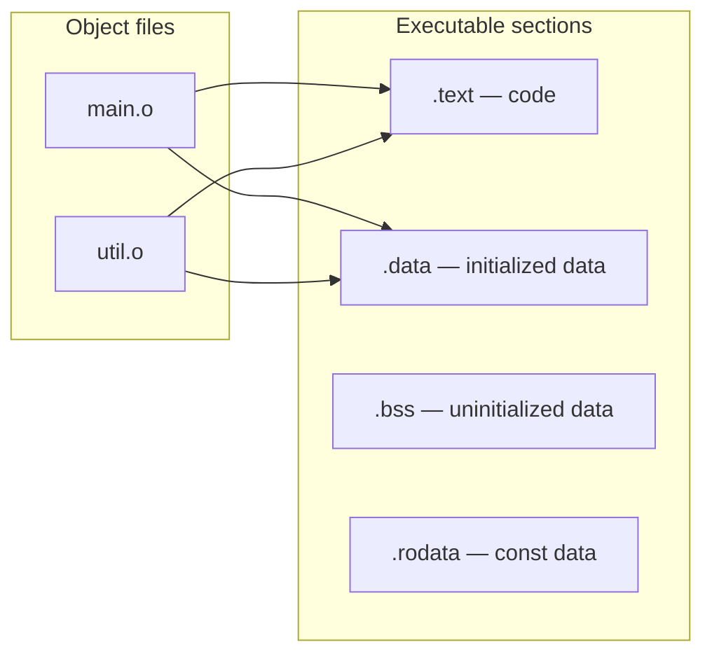

# Build Systems: Make, CMake, and Linker Scripts

> [!summary] Goal
> Build C projects with Make and CMake. Understand compilation, static/shared libraries, linker scripts, and cross-compilation. Essential for managing multi-file projects, OS kernel build systems, and library development.

## Table of Contents

1. [Makefiles](#makefiles)
2. [Static and Shared Libraries](#static-and-shared-libraries)
3. [CMake](#cmake)
4. [Linker Scripts](#linker-scripts)
5. [Cross-Compilation](#cross-compilation)
6. [Pitfalls](#pitfalls)

---

## Makefiles

> [!info] Make
> Make is a build automation tool that reads a `Makefile` and determines which source files need recompilation based on file timestamps. Targets can have prerequisites — if any prerequisite is newer, the target's recipe is run.

### Basic Makefile

```makefile
CC = gcc
CFLAGS = -Wall -Wextra -O2 -g
LDFLAGS = -lm

# Default target (first in file)
all: program

# Link target — depends on object files
program: main.o util.o
	$(CC) $(CFLAGS) -o $@ $^ $(LDFLAGS)

# Compilation targets — each .o depends on its .c and .h
main.o: main.c util.h
	$(CC) $(CFLAGS) -c $< -o $@

util.o: util.c util.h
	$(CC) $(CFLAGS) -c $< -o $@

# Phony targets — not real files
.PHONY: clean

clean:
	rm -f *.o program
```

### Automatic variables

| Variable | Meaning | Example value |
|----------|---------|:-------------:|
| `$@` | Target name | `program`, `main.o` |
| `$<` | First prerequisite | `main.c` |
| `$^` | All prerequisites | `main.o util.o` |
| `$?` | Prerequisites newer than target | Changed files only |
| `$*` | Stem (pattern rule match) | For `%.o: %.c`, it's the stem |

### Pattern rules — handle all .c files

```makefile
# Pattern rule — compiles any .c to .o
%.o: %.c
	$(CC) $(CFLAGS) -c $< -o $@

# Then a single rule links all .o files
SRCS = $(wildcard src/*.c)       # All .c files in src/
OBJS = $(SRCS:.c=.o)             # Replace .c with .o

program: $(OBJS)
	$(CC) $(CFLAGS) -o $@ $^ $(LDFLAGS)
```

### Advanced Makefile

```makefile
CC = gcc
CFLAGS = -Wall -Wextra -O2 -g -Iinclude
LDFLAGS = -lm

# Directories
SRC_DIR = src
OBJ_DIR = obj
BIN_DIR = bin

# Source files
SRCS = $(wildcard $(SRC_DIR)/*.c)
OBJS = $(patsubst $(SRC_DIR)/%.c, $(OBJ_DIR)/%.o, $(SRCS))
TARGET = $(BIN_DIR)/program

.PHONY: all clean

all: $(TARGET)

$(TARGET): $(OBJS) | $(BIN_DIR)
	$(CC) $(CFLAGS) -o $@ $^ $(LDFLAGS)

$(OBJ_DIR)/%.o: $(SRC_DIR)/%.c | $(OBJ_DIR)
	$(CC) $(CFLAGS) -c $< -o $@

$(OBJ_DIR) $(BIN_DIR):
	mkdir -p $@

clean:
	rm -rf $(OBJ_DIR) $(BIN_DIR)
```

---

## Static and Shared Libraries

### Static library (.a)

```makefile
# Create the library member objects
libutil.o: libutil.c libutil.h
	gcc -c -o $@ $<

# Create the static library
libutil.a: libutil.o
	ar rcs $@ $^       # ar = archiver, rcs = replace/create/index

# Link with the library
program: main.o libutil.a
	gcc -o $@ $^ -L. -lutil

# ar flags: r = replace, c = create, s = index
```

### Shared library (.so)

```makefile
# Position-independent code (required for shared libraries)
libutil.o: libutil.c libutil.h
	gcc -c -fPIC -o $@ $<

# Create shared library
libutil.so: libutil.o
	gcc -shared -o $@ $^

# Link with shared library
program: main.o libutil.so
	gcc -o $@ $^ -L. -lutil

# Tell the runtime where to find the library
# Option 1: environment variable
export LD_LIBRARY_PATH=/path/to/lib:$LD_LIBRARY_PATH

# Option 2: embed the path in the binary
gcc -o program main.o -L. -lutil -Wl,-rpath,/path/to/lib

# Option 3: install to standard location
sudo cp libutil.so /usr/local/lib/
sudo ldconfig
```

### Static vs Shared Libraries

| Aspect | Static (.a) | Shared (.so) |
|--------|:-----------:|:------------:|
| **Size** | Larger binary (library code included) | Smaller binary (library loaded at runtime) |
| **Memory** | Each process has its own copy | One copy in memory shared by all processes |
| **Update** | Must relink the program | Replace .so file (if ABI-compatible) |
| **Startup** | Instant | Slightly slower (symbol resolution) |
| **Deployment** | Single file | Must ensure .so is available |
| **Versioning** | Tied to program version | SONAME versioning |
| **Use case** | Small tools, embedded | System libraries, plugins |

---

## CMake

### Basic CMakeLists.txt

```cmake
cmake_minimum_required(VERSION 3.10)
project(MyProject C)

# Set C standard
set(CMAKE_C_STANDARD 11)
set(CMAKE_C_STANDARD_REQUIRED ON)

# Add executable
add_executable(program main.c util.c)

# Add include path
target_include_directories(program PRIVATE include)

# Link a library
target_link_libraries(program PRIVATE m)

# Building:
# mkdir build && cd build && cmake .. && make
```

### CMake with libraries

```cmake
cmake_minimum_required(VERSION 3.10)
project(MyProject C)

set(CMAKE_C_STANDARD 11)

# Library
add_library(util STATIC            # or SHARED
    src/util.c
    src/hash.c
)
target_include_directories(util PUBLIC include)

# Executable
add_executable(program src/main.c)
target_link_libraries(program PRIVATE util)

# Tests
enable_testing()
add_test(NAME test_program COMMAND program --test)

# Install
install(TARGETS program RUNTIME DESTINATION bin)
install(TARGETS util ARCHIVE DESTINATION lib)
```

### CMake with multiple directories

```cmake
# Top-level CMakeLists.txt
cmake_minimum_required(VERSION 3.10)
project(MyProject C)

add_subdirectory(lib)
add_subdirectory(src)
add_subdirectory(tests)

# lib/CMakeLists.txt
add_library(core core.c hash.c)
target_include_directories(core PUBLIC ${CMAKE_CURRENT_SOURCE_DIR})

# src/CMakeLists.txt
add_executable(program main.c)
target_link_libraries(program PRIVATE core)
```

---

## Linker Scripts

> [!info] Linker script
> A linker script tells the linker how to combine object files and sections into an executable. It defines the memory layout — where .text, .data, .bss, and other sections go. Custom linker scripts are essential for OS development (kernel layout), embedded systems (ROM/RAM layout), and bootloaders.

### Default layout (WHAT the linker does)



### Custom linker script for a kernel

```ld
/* kernel.ld — linker script for a simple x86-64 kernel */
OUTPUT_FORMAT(elf64-x86-64)
OUTPUT_ARCH(i386:x86-64)
ENTRY(_start)                /* Entry point */

SECTIONS
{
    /* Kernel starts at 1 MB (conventional) */
    . = 0x100000;
    
    /* Text section — executable code */
    .text : {
        *(.text)             /* All .text sections from all input files */
        *(.text.*)
    }
    
    /* Read-only data */
    .rodata : {
        *(.rodata)
        *(.rodata.*)
    }
    
    /* Initialized data */
    .data : {
        *(.data)
        *(.data.*)
    }
    
    /* Uninitialized data (zeroed at startup) */
    .bss : {
        . = ALIGN(16);
        *(.bss)
        *(COMMON)
        . = ALIGN(16);
    }
    
    /* Kernel end — used for heap start */
    end = .;
}
```

### Building with a custom linker script

```bash
gcc -ffreestanding -c kernel.c -o kernel.o
gcc -ffreestanding -c start.s -o start.o
ld -T kernel.ld -o kernel.bin kernel.o start.o

# Or just pass to gcc:
gcc -T kernel.ld -o kernel.bin kernel.o start.o
```

---

## Cross-Compilation

> [!info] Cross-compilation
> Building a program on one platform (host) to run on another (target). Essential for: embedded systems (ARM, RISC-V), OS development (kernel must run on bare metal), and firmware. The toolchain is prefixed with the target triple.

```bash
# Examples of cross-compilers
arm-linux-gnueabihf-gcc     # ARM 32-bit, Linux, hard-float
aarch64-linux-gnu-gcc       # ARM 64-bit, Linux
x86_64-elf-gcc              # x86-64, no OS (freestanding — for OS dev)
riscv64-unknown-elf-gcc     # RISC-V 64-bit, bare metal

# Using a cross-compiler
arm-linux-gnueabihf-gcc -O2 -march=armv7-a program.c -o program

# CMake cross-compilation
cmake -DCMAKE_TOOLCHAIN_FILE=arm-toolchain.cmake ..
```

---

## Pitfalls

### Missing library order in linking

```makefile
# ❌ WRONG: libraries before object files
gcc -lfoo program.o          # Linker may not find symbols

# ✅ CORRECT: libraries AFTER object files
gcc program.o -lfoo          # Linker finds unresolved symbols from program.o
```

### Forgetting `-fPIC` for shared libraries

Without `-fPIC`, the dynamic linker can't relocate the library code at load time. The linker error is: "relocation R_X86_64_32 against `.rodata' can not be used when making a shared object." Always compile shared library sources with `-fPIC`.

### Not rebuilding after header changes

Make detects when `.c` files change but NOT when `.h` files change unless you list the dependencies. Use a dependency generator:

```makefile
# Auto-generate dependencies
%.d: %.c
	gcc -MM -MT $(@:.d=.o) $< > $@

-include $(SRCS:.c=.d)
```

### Trying to use `-static` without static libraries

```bash
gcc -static program.c -o program   # Works if all libraries have .a versions
# Fails if any library only has .so
```

---

> [!question]- Interview Questions
>
> **Q: What is the difference between a static library and a shared library?**
> A: A static library (.a) is copied into the executable at link time — the resulting binary is self-contained but larger. A shared library (.so) is loaded at runtime — the binary is smaller but depends on the .so being present. Shared libraries can be updated independently (if ABI-compatible) and are shared in memory across processes.
>
> **Q: How does Make determine whether a file needs recompilation?**
> A: Make compares the timestamps of the target and its prerequisites. If any prerequisite is newer than the target, the target's recipe is re-run. This is why listing header files as prerequisites is essential — if a header changes, all .c files that include it must be recompiled.
>
> **Q: What does a linker script do?**
> A: A linker script tells the linker how to combine input sections into output sections and assign them to memory addresses. It defines: the entry point, where each section (.text, .data, .bss) goes in memory, alignment requirements, and symbol values. Custom linker scripts are essential for OS kernels (which have specific memory layout requirements) and embedded systems (which split code between ROM and RAM).
>
> **Q: What is cross-compilation?**
> A: Building a program on one platform (host, e.g., x86-64 Linux) that runs on a different platform (target, e.g., ARM microcontroller). Requires a cross-compiler toolchain prefixed with the target triple (e.g., `arm-linux-gnueabihf-gcc`). Used for embedded development and OS development.
>
> **Q: What is the purpose of `ar rcs` when creating a static library?**
> A: `ar` (archiver) creates an archive from object files. `r` = replace/insert members (update if newer), `c` = create archive (silence warning), `s` = create an index (needed for linking). The resulting `.a` file is essentially a `tar` archive of `.o` files that the linker can search for symbols.

---

## Cross-Links

- [[C/01_Foundations/06_Preprocessor_and_Compilation]] for compilation pipeline and GCC flags
- [[C/01_Foundations/07_Header_Files_Modules_and_Storage_Classes]] for multi-file projects
- [[C/03_Advanced/07_Inline_Assembly_ABI_and_Calling_Conventions]] for linker scripts in OS dev
- [[C/01_Foundations/02_Memory_Model_and_Allocation]] for program segments and layout
- [[C/05_Projects/01_Build_a_Memory_Arena_Allocator]] for custom allocator build system
