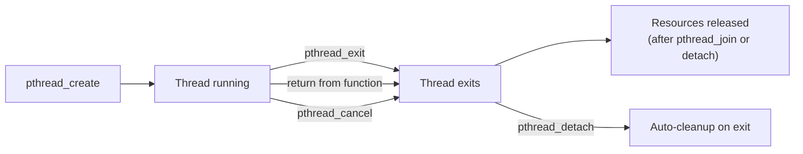

# Concurrency with Pthreads

> [!summary] Goal
> Write multi-threaded programs using POSIX threads: create and join threads, synchronize with mutexes and condition variables, avoid deadlocks, and build a thread pool. Essential for multi-core programming, network servers, and understanding kernel concurrency primitives.

## Table of Contents

1. [Thread Creation and Management](#thread-creation-and-management)
2. [Mutexes](#mutexes)
3. [Condition Variables](#condition-variables)
4. [Read-Write Locks](#read-write-locks)
5. [Deadlock Prevention](#deadlock-prevention)
6. [Thread Pool](#thread-pool)
7. [Pitfalls](#pitfalls)

---

## Thread Creation and Management

> [!info] Thread
> A thread is a single execution sequence within a process. Threads share the same address space (heap, globals, file descriptors) but have their own stack and registers. Creating a thread with `pthread_create` is much cheaper than creating a process with `fork`.

```c
#include <pthread.h>
#include <stdio.h>

void *worker(void *arg) {
    int id = *(int *)arg;
    printf("Thread %d: hello from thread!\n", id);
    return NULL;
}

int main(void) {
    pthread_t threads[4];
    int ids[4] = {0, 1, 2, 3};

    for (int i = 0; i < 4; i++) {
        pthread_create(&threads[i], NULL, worker, &ids[i]);
    }

    for (int i = 0; i < 4; i++) {
        pthread_join(threads[i], NULL);   // Wait for thread to finish
    }

    printf("Main: all threads done\n");
    return 0;
}
```

### Thread lifecycle



### Thread attributes

```c
pthread_attr_t attr;
pthread_attr_init(&attr);

// Set thread as detached (no join needed — auto-cleanup on exit)
pthread_attr_setdetachstate(&attr, PTHREAD_CREATE_DETACHED);

// Set stack size (useful to avoid default 8 MB waste)
pthread_attr_setstacksize(&attr, 1024 * 1024);  // 1 MB

pthread_t thread;
pthread_create(&thread, &attr, worker, arg);
pthread_attr_destroy(&attr);    // Free attr after use
```

### Thread return values

```c
typedef struct { int min; int max; int sum; } Result;

void *compute(void *arg) {
    int *data = (int *)arg;
    Result *res = malloc(sizeof(Result));
    res->min = res->max = res->sum = data[0];
    for (int i = 1; i < 100; i++) {
        if (data[i] < res->min) res->min = data[i];
        if (data[i] > res->max) res->max = data[i];
        res->sum += data[i];
    }
    return res;     // Return heap-allocated result
}

int main(void) {
    pthread_t thread;
    int data[100] = { /* ... */ };
    pthread_create(&thread, NULL, compute, data);

    Result *res;
    pthread_join(thread, (void **)&res);
    printf("Min=%d Max=%d Sum=%d\n", res->min, res->max, res->sum);
    free(res);      // Free in the joining thread
}
```

---

## Mutexes

> [!info] Mutex
> A mutex (mutual exclusion) ensures that only one thread executes a critical section at a time. If another thread tries to lock an already-locked mutex, it blocks until the mutex is unlocked.

```c
pthread_mutex_t mutex = PTHREAD_MUTEX_INITIALIZER;  // Static init
int shared_counter = 0;

void *increment(void *arg) {
    for (int i = 0; i < 100000; i++) {
        pthread_mutex_lock(&mutex);
        shared_counter++;             // Critical section
        pthread_mutex_unlock(&mutex);
    }
    return NULL;
}
```

### Mutex types

| Type | Behavior | Use case |
|------|----------|----------|
| `PTHREAD_MUTEX_NORMAL` | Deadlocks on double-lock | General use |
| `PTHREAD_MUTEX_ERRORCHECK` | Returns EDEADLK on double-lock | Debugging |
| `PTHREAD_MUTEX_RECURSIVE` | Same thread can lock multiple times | Recursive functions |

```c
// Recursive mutex — same thread can lock multiple times
pthread_mutexattr_t attr;
pthread_mutexattr_init(&attr);
pthread_mutexattr_settype(&attr, PTHREAD_MUTEX_RECURSIVE);

pthread_mutex_t mutex;
pthread_mutex_init(&mutex, &attr);

void recursive_func(int depth) {
    pthread_mutex_lock(&mutex);
    if (depth > 0) recursive_func(depth - 1);
    pthread_mutex_unlock(&mutex);
}
// Each lock/unlock pair must be balanced
```

### Trylock and timedlock

```c
// Non-blocking attempt
if (pthread_mutex_trylock(&mutex) == 0) {
    // Got the lock
    shared_counter++;
    pthread_mutex_unlock(&mutex);
} else {
    // Lock already held — do something else
}

// Block with timeout
struct timespec ts;
clock_gettime(CLOCK_REALTIME, &ts);
ts.tv_sec += 1;                     // 1 second timeout

int rc = pthread_mutex_timedlock(&mutex, &ts);
if (rc == 0) {
    // Got the lock within 1 second
    pthread_mutex_unlock(&mutex);
} else if (rc == ETIMEDOUT) {
    // Could not acquire lock within 1 second
}
```

---

## Condition Variables

> [!info] Condition variable
> A condition variable lets threads wait for a specific condition to become true. It always works with a mutex. `pthread_cond_wait` atomically unlocks the mutex and blocks. When signaled, it re-acquires the mutex before returning.

```c
pthread_mutex_t mutex = PTHREAD_MUTEX_INITIALIZER;
pthread_cond_t cond = PTHREAD_COND_INITIALIZER;
int data_ready = 0;

void *producer(void *arg) {
    // Produce data
    pthread_mutex_lock(&mutex);
    data_ready = 1;
    pthread_cond_signal(&cond);       // Wake one waiting consumer
    pthread_mutex_unlock(&mutex);
    return NULL;
}

void *consumer(void *arg) {
    pthread_mutex_lock(&mutex);
    while (!data_ready) {              // Always check in a loop (spurious wakeup!)
        pthread_cond_wait(&cond, &mutex);  // Atomically unlock and wait
    }
    // data_ready is true — consume data
    pthread_mutex_unlock(&mutex);
    return NULL;
}
```

### Broadcast vs Signal

```c
// pthread_cond_signal — wakes ONE waiting thread
// pthread_cond_broadcast — wakes ALL waiting threads

// Use broadcast when:
// - Multiple threads are waiting for different conditions that all became true
// - You can't determine which thread should wake up
// - A resource pool: all threads can check if their resource is available

// Use signal when:
// - Exactly one thread should wake up (typical producer-consumer)
// - Higher performance (fewer context switches)
```

### Bounded buffer (producer-consumer)

```c
typedef struct {
    int *buf;
    int head, tail;
    int size, count;
    pthread_mutex_t mutex;
    pthread_cond_t not_full;
    pthread_cond_t not_empty;
} BoundedBuffer;

BoundedBuffer *bb_create(int capacity) {
    BoundedBuffer *bb = malloc(sizeof(BoundedBuffer));
    bb->buf = calloc(capacity, sizeof(int));
    bb->head = bb->tail = bb->count = 0;
    bb->size = capacity;
    pthread_mutex_init(&bb->mutex, NULL);
    pthread_cond_init(&bb->not_full, NULL);
    pthread_cond_init(&bb->not_empty, NULL);
    return bb;
}

void bb_put(BoundedBuffer *bb, int value) {
    pthread_mutex_lock(&bb->mutex);
    while (bb->count >= bb->size) {               // Buffer full?
        pthread_cond_wait(&bb->not_full, &bb->mutex);
    }
    bb->buf[bb->tail] = value;
    bb->tail = (bb->tail + 1) % bb->size;
    bb->count++;
    pthread_cond_signal(&bb->not_empty);            // Wake consumer
    pthread_mutex_unlock(&bb->mutex);
}

int bb_get(BoundedBuffer *bb) {
    pthread_mutex_lock(&bb->mutex);
    while (bb->count <= 0) {                       // Buffer empty?
        pthread_cond_wait(&bb->not_empty, &bb->mutex);
    }
    int value = bb->buf[bb->head];
    bb->head = (bb->head + 1) % bb->size;
    bb->count--;
    pthread_cond_signal(&bb->not_full);             // Wake producer
    pthread_mutex_unlock(&bb->mutex);
    return value;
}
```

---

## Read-Write Locks

> [!info] RWLock
> A read-write lock allows multiple threads to read simultaneously, but only one thread to write. If reads dominate (common in databases, caches), RW locks significantly outperform plain mutexes.

```c
pthread_rwlock_t rwlock = PTHREAD_RWLOCK_INITIALIZER;

void *reader(void *arg) {
    pthread_rwlock_rdlock(&rwlock);    // Multiple readers allowed
    printf("Reading...\n");
    pthread_rwlock_unlock(&rwlock);
    return NULL;
}

void *writer(void *arg) {
    pthread_rwlock_wrlock(&rwlock);    // Exclusive — no readers or other writers
    printf("Writing...\n");
    pthread_rwlock_unlock(&rwlock);
    return NULL;
}
```

---

## Deadlock Prevention

> [!info] Deadlock
> A deadlock occurs when two threads hold locks that the other needs, and neither will release. Four conditions must all hold: Mutual Exclusion, Hold-and-Wait, No Preemption, Circular Wait.

```c
// ❌ DEADLOCK: lock ordering violation
// Thread 1: lock(A) → lock(B)
// Thread 2: lock(B) → lock(A)

// Timeline: T1 locks A, T2 locks B, T1 waits for B, T2 waits for A → deadlock

// ✅ FIX: fixed lock ordering — always lock A then B
```

### Deadlock prevention strategies

| Strategy | Description | Example |
|----------|-------------|---------|
| **Fixed ordering** | Always acquire locks in the same order | Lock mutex_A before mutex_B |
| **Lock hierarchy** | Assign levels, lock only in increasing level | Level 1 locks before Level 2 |
| **Try-lock with backoff** | Try to acquire, release all on failure | `pthread_mutex_trylock` in a loop |
| **One lock** | Use a single lock instead of multiple | Coarser granularity |

```c
// Try-lock with backoff — avoids deadlock
int transfer(Account *from, Account *to, double amount) {
    while (1) {
        pthread_mutex_lock(&from->lock);
        if (pthread_mutex_trylock(&to->lock) == 0) {
            // Got both locks — proceed
            break;
        }
        pthread_mutex_unlock(&from->lock);   // Release and retry
        usleep(1000);                        // Backoff
    }
    // Perform transfer
    pthread_mutex_unlock(&to->lock);
    pthread_mutex_unlock(&from->lock);
    return 0;
}
```

---

## Thread Pool

> [!info] Thread pool
> A fixed number of worker threads that process tasks from a queue. Avoids the overhead of creating/destroying threads per task. Used in: web servers, database engines, parallel processing frameworks.

```c
typedef struct {
    void (*function)(void *);
    void *arg;
} Task;

typedef struct {
    Task *queue;
    int capacity;
    int head, tail;
    int count;
    pthread_mutex_t mutex;
    pthread_cond_t not_empty;
    pthread_cond_t not_full;
    int shutdown;
    int thread_count;
    pthread_t *threads;
} ThreadPool;

void *thread_pool_worker(void *arg) {
    ThreadPool *pool = (ThreadPool *)arg;
    while (1) {
        pthread_mutex_lock(&pool->mutex);
        while (pool->count == 0 && !pool->shutdown) {
            pthread_cond_wait(&pool->not_empty, &pool->mutex);
        }
        if (pool->shutdown && pool->count == 0) {
            pthread_mutex_unlock(&pool->mutex);
            return NULL;
        }
        Task task = pool->queue[pool->head];
        pool->head = (pool->head + 1) % pool->capacity;
        pool->count--;
        pthread_cond_signal(&pool->not_full);
        pthread_mutex_unlock(&pool->mutex);
        
        task.function(task.arg);            // Execute task outside lock
    }
}

ThreadPool *thread_pool_create(int num_threads, int queue_capacity) {
    ThreadPool *pool = calloc(1, sizeof(ThreadPool));
    pool->queue = calloc(queue_capacity, sizeof(Task));
    pool->capacity = queue_capacity;
    pool->thread_count = num_threads;
    pool->threads = calloc(num_threads, sizeof(pthread_t));
    pthread_mutex_init(&pool->mutex, NULL);
    pthread_cond_init(&pool->not_empty, NULL);
    pthread_cond_init(&pool->not_full, NULL);
    
    for (int i = 0; i < num_threads; i++) {
        pthread_create(&pool->threads[i], NULL, thread_pool_worker, pool);
    }
    return pool;
}

void thread_pool_submit(ThreadPool *pool, void (*fn)(void *), void *arg) {
    pthread_mutex_lock(&pool->mutex);
    while (pool->count >= pool->capacity) {
        pthread_cond_wait(&pool->not_full, &pool->mutex);
    }
    pool->queue[pool->tail].function = fn;
    pool->queue[pool->tail].arg = arg;
    pool->tail = (pool->tail + 1) % pool->capacity;
    pool->count++;
    pthread_cond_signal(&pool->not_empty);
    pthread_mutex_unlock(&pool->mutex);
}

void thread_pool_destroy(ThreadPool *pool) {
    pthread_mutex_lock(&pool->mutex);
    pool->shutdown = 1;
    pthread_cond_broadcast(&pool->not_empty);    // Wake all workers
    pthread_mutex_unlock(&pool->mutex);
    
    for (int i = 0; i < pool->thread_count; i++) {
        pthread_join(pool->threads[i], NULL);
    }
    free(pool->threads);
    free(pool->queue);
    pthread_mutex_destroy(&pool->mutex);
    pthread_cond_destroy(&pool->not_empty);
    pthread_cond_destroy(&pool->not_full);
    free(pool);
}
```

---

## Pitfalls

### Spurious wakeups

`pthread_cond_wait` can return even when the condition hasn't been signaled (spurious wakeup). Always check the condition in a `while` loop, not an `if`.

### Forgetting to unlock on all paths

```c
void func(void) {
    pthread_mutex_lock(&mutex);
    if (error) {
        return;             // ❌ BUG: forgot to unlock on error path!
    }
    pthread_mutex_unlock(&mutex);
}
```

### Race on thread argument

```c
int ids[4];
for (int i = 0; i < 4; i++) {
    ids[i] = i;
    pthread_create(&t[i], NULL, worker, &ids[i]);   // ✅ Each thread gets unique address
}

// ❌ WRONG — all threads share the same address!
for (int i = 0; i < 4; i++) {
    pthread_create(&t[i], NULL, worker, &i);       // i changes before thread reads it
}
```

### Not joining or detaching threads

A thread that exits without being joined or detached leaks resources (its stack). Either `pthread_join` (if you need the result) or `pthread_detach` (if you don't care about the result).

---

> [!question]- Interview Questions
>
> **Q: What is the difference between a mutex and a condition variable?**
> A: A mutex provides **mutual exclusion** — only one thread can hold it. A condition variable provides **signaling** — a thread can wait for a condition to become true, and another thread can signal it. Condition variables always work with a mutex: `pthread_cond_wait` atomically unlocks the mutex and blocks, then re-acquires it when signaled.
>
> **Q: What is a spurious wakeup and how do you handle it?**
> A: A spurious wakeup is when `pthread_cond_wait` returns even though the condition hasn't been signaled (it can happen on any multi-threaded platform). Fix: always wrap `pthread_cond_wait` in a `while` loop that checks the condition, not an `if` statement.
>
> **Q: How does a thread pool improve performance?**
> A: Creating and destroying threads is expensive (system calls, stack allocation, TLB flushes). A thread pool pre-creates N threads that wait for work. Tasks are submitted to a queue, and workers pull tasks. This eliminates per-task thread creation overhead and limits the number of concurrent threads to avoid resource exhaustion.
>
> **Q: What is a read-write lock and when would you use it?**
> A: An RWLock allows multiple readers simultaneously but exclusive access for writers. Use it when reads dominate (databases, config caches). If 90% of operations are reads, an RWLock performs much better than a plain mutex. If writes are frequent, the RWLock overhead isn't worth it — use a plain mutex.
>
> **Q: How do you prevent deadlocks?**
> A: (1) Fixed lock ordering — always acquire locks in the same global order. (2) Lock hierarchy — assign levels, lock only in increasing level. (3) Try-lock with backoff — release all locks and retry if you can't acquire the next one. (4) Minimize the number of locks — use coarser granularity. (5) Use lock-free techniques (atomics) where possible.

---

## Cross-Links

- [[C/03_Advanced/02_C11_Atomics_and_Memory_Model]] for lock-free concurrency
- [[C/03_Advanced/03_Signal_Handling]] for async-signal-safe functions
- [[C/02_Core/04_Data_Structures_in_C]] for concurrent queue implementations
- [[C/03_Advanced/08_Performance_Profiling_and_Optimization]] for concurrency profiling
- [[C/05_Projects/04_Thread_Pool]] for thread pool project
