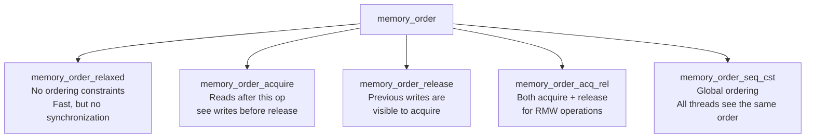

# C11 Atomics and Memory Model

> [!summary] Goal
> Use C11 atomic operations for lock-free synchronization. Understand the memory model (memory ordering, happens-before, barriers). Build lock-free data structures. Essential for high-performance concurrency, kernel synchronization (spinlocks, RCU), and real-time systems.

## Table of Contents

1. [Atomic Types](#atomic-types)
2. [Atomic Operations](#atomic-operations)
3. [Memory Ordering](#memory-ordering)
4. [Lock-Free Programming Patterns](#lock-free-programming-patterns)
5. [Fences (Memory Barriers)](#fences)
6. [Pitfalls](#pitfalls)

---

## Atomic Types

> [!info] Atomic type
> An atomic variable provides operations that are **indivisible** — no thread can see a partial update. Operations on atomic variables are also visible to other threads according to the specified memory ordering. C11's `<stdatomic.h>` provides these without requiring assembly.

```c
#include <stdatomic.h>
#include <stdbool.h>

// Declare atomic variables
atomic_int counter = ATOMIC_VAR_INIT(0);       // C11 initialization
atomic_int counter = 0;                         // Simpler (C11, works with clang/gcc)
atomic_bool flag = false;
atomic_uintptr_t ptr;                           // Atomic pointer-sized integer
_Atomic int x;                                  // Alternate syntax

// C11 atomic types correspond to standard types:
// atomic_int, atomic_uint, atomic_long, atomic_ullong
// atomic_bool, atomic_char, atomic_intptr_t, atomic_size_t
// atomic_flag — guaranteeably lock-free (used for spinlocks)

// Check if lock-free
if (atomic_is_lock_free(&counter)) {
    printf("counter is lock-free\n");
}
```

### atomic_flag — the simplest spinlock

```c
atomic_flag lock = ATOMIC_FLAG_INIT;   // Guaranteed lock-free

void spinlock_lock(atomic_flag *lock) {
    while (atomic_flag_test_and_set(lock)) {   // TAS: exchange, return old
        // Spin (optionally yield: sched_yield())
    }
}

void spinlock_unlock(atomic_flag *lock) {
    atomic_flag_clear(lock);                   // Clear the flag
}
```

---

## Atomic Operations

```c
atomic_int count = 0;                   // Not atomic for plain reads/writes!

// Atomic read and write
int val = atomic_load(&count);          // Atomic read
atomic_store(&count, 42);               // Atomic write

// Atomic read-modify-write operations
int prev = atomic_fetch_add(&count, 1); // count++ (returns previous value)
prev = atomic_fetch_sub(&count, 1);     // count--
prev = atomic_fetch_or(&flags, 0x10);   // Set bit
prev = atomic_fetch_and(&flags, ~0x10); // Clear bit
prev = atomic_fetch_xor(&flags, 0x10);  // Toggle bit

// Compare-and-swap (CAS) — the heart of lock-free programming
int expected = 0;
int desired = 42;
bool success = atomic_compare_exchange_strong(&count, &expected, desired);
// If count == expected, set count = desired and return true
// Otherwise, set expected = count (current value) and return false

// Weak variant — may fail spuriously (faster on some archs)
success = atomic_compare_exchange_weak(&count, &expected, desired);
// Must be used in a loop: while (!atomic_compare_exchange_weak(...));
```

---

## Memory Ordering

> [!info] Memory ordering
> Memory ordering controls how atomic operations interact with other memory accesses. Without proper ordering, the compiler and CPU can reorder operations in ways that break concurrent algorithms. The ordering spectrum ranges from relaxed (fast, weak guarantees) to sequentially consistent (slowest, strongest guarantees).



### Ordering levels

| Order | Use case | Cost |
|-------|----------|:----:|
| `memory_order_relaxed` | Counters, statistics | None |
| `memory_order_acquire` | Reading a flag set by another thread | Low |
| `memory_order_release` | Publishing data before a flag | Low |
| `memory_order_acq_rel` | Compare-and-swap operations | Medium |
| `memory_order_seq_cst` | Default — strongest guarantee | Highest |

### Release-Acquire pattern

```c
// Correct lock-free data publication

_Atomic bool ready = false;
char data[256];

// Thread 1 — producer
void produce(void) {
    sprintf(data, "Important data");          // Store data FIRST
    atomic_store_explicit(&ready, true, memory_order_release);
    // Everything before release becomes visible after acquire
}

// Thread 2 — consumer
void consume(void) {
    while (!atomic_load_explicit(&ready, memory_order_acquire)) {
        // Spin
    }
    printf("Data: %s\n", data);   // Guaranteed to see the latest 'data'
}
```

### Relaxed ordering — counters

```c
atomic_long total_requests = ATOMIC_VAR_INIT(0);

void handle_request(void) {
    atomic_fetch_add_explicit(&total_requests, 1, memory_order_relaxed);
}

void print_stats(void) {
    // For statistics, exact ordering doesn't matter
    long count = atomic_load_explicit(&total_requests, memory_order_relaxed);
    printf("Total requests: %ld\n", count);
}
```

### Memory ordering comparison

| Scenario | Correct ordering | Wrong ordering consequence |
|----------|-----------------|---------------------------|
| **Flag publication** | release / acquire | Consumer sees data before it's fully initialized |
| **Counter** | relaxed | May see stale value — fine for stats |
| **Queue push/pop** | release (push) / acquire (pop) | Pop returns uninitialized data |
| **CAS in lock-free push** | acq_rel | ABA problem, wrong head pointer |
| **Default** | seq_cst | Correct, but slowest |

---

## Lock-Free Programming Patterns

### Lock-free stack (Treiber stack)

```c
typedef struct Node {
    int value;
    struct Node *next;
} Node;

_Atomic Node *stack = NULL;

void lf_push(int value) {
    Node *node = malloc(sizeof(Node));
    node->value = value;

    Node *old_head;
    do {
        old_head = atomic_load(&stack);               // Read current head
        node->next = old_head;                         // Link new node
    } while (!atomic_compare_exchange_weak(&stack, &old_head, node));
    // CAS loops until it succeeds: if stack == old_head, set stack = node
}

int lf_pop(int *value) {
    Node *old_head;
    do {
        old_head = atomic_load(&stack);
        if (old_head == NULL) return -1;               // Empty
    } while (!atomic_compare_exchange_weak(&stack, &old_head, old_head->next));

    *value = old_head->value;
    free(old_head);    // ⚠️ Memory reclamation problem! Use RCU or hazard pointers
    return 0;
}
```

### Lock-free ring buffer (single producer, single consumer)

```c
typedef struct {
    _Atomic int head;        // Write index
    _Atomic int tail;        // Read index
    int size;
    int *buffer;
} RingBuffer;

RingBuffer *rb_create(int size) {
    RingBuffer *rb = malloc(sizeof(RingBuffer));
    rb->buffer = calloc(size, sizeof(int));
    rb->size = size;
    atomic_init(&rb->head, 0);
    atomic_init(&rb->tail, 0);
    return rb;
}

bool rb_push(RingBuffer *rb, int value) {
    int head = atomic_load_explicit(&rb->head, memory_order_relaxed);
    int next = (head + 1) % rb->size;
    if (next == atomic_load_explicit(&rb->tail, memory_order_acquire)) {
        return false;   // Full
    }
    rb->buffer[head] = value;                                    // Store data
    atomic_store_explicit(&rb->head, next, memory_order_release); // Publish
    return true;
}

bool rb_pop(RingBuffer *rb, int *value) {
    int tail = atomic_load_explicit(&rb->tail, memory_order_relaxed);
    if (tail == atomic_load_explicit(&rb->head, memory_order_acquire)) {
        return false;   // Empty
    }
    *value = rb->buffer[tail];                                     // Read data
    atomic_store_explicit(&rb->tail, (tail + 1) % rb->size, memory_order_release);
    return true;
}
```

---

## Fences (Memory Barriers)

> [!info] Fence
> A fence (memory barrier) creates ordering guarantees without an atomic operation. It forces the CPU / compiler to respect ordering between all memory accesses before and after the fence. Use when you need ordering on non-atomic variables combined with atomics.

```c
// Compiler barrier — prevents compiler reordering but not CPU reordering
asm volatile("" ::: "memory");

// Full memory barrier — both compiler and CPU (x86: mfence, ARM: dmb)
atomic_thread_fence(memory_order_seq_cst);

// Acquire fence
atomic_thread_fence(memory_order_acquire);

// Release fence
atomic_thread_fence(memory_order_release);

// Example: use fence with non-atomic data
int shared_data;
atomic_bool flag = false;

// Thread 1
shared_data = 42;
atomic_thread_fence(memory_order_release);
atomic_store(&flag, true);       // Could be relaxed — fence provides ordering

// Thread 2
while (!atomic_load(&flag));     // Could be relaxed
atomic_thread_fence(memory_order_acquire);
// shared_data is now guaranteed to be 42
```

### When to use fences vs atomic operations

```text
Use atomic operations with memory_order instead of fences when possible.
Fences are needed when:
  1. You're ordering non-atomic accesses with atomic operations
  2. You need bi-directional ordering (acquire+release)
  3. Working with legacy code that doesn't use atomics

Prefer atomic operations with explicit ordering for most cases.
```

---

## Pitfalls

### ABA problem in CAS

```c
// CAS-based data structures suffer from the ABA problem:
// Thread 1: reads head = Node A
// Thread 1: (gets preempted)
// Thread 2: pops A, pushes B, pushes A (same address as before)
// Thread 1: CAS succeeds — but the list structure has changed!
// Fix: tagged pointers (double-wide CAS with counter) or RCU
```

### Not using volatile for atomics

Before C11, `volatile` was used for atomic-like operations. **Don't mix them.** C11 atomics are always volatile-qualified internally. Using `volatile` without atomics is unsafe for multi-threading.

### Sequential consistency is slow

The default `memory_order_seq_cst` uses the strongest ordering, which on ARM/PowerPC requires expensive memory barrier instructions. Use weaker orderings where correctness allows. On x86, the default is nearly free (x86 is strongly ordered).

### Lock-free ≠ wait-free

Lock-free means the system as a whole makes progress (at least one thread progresses). Wait-free means every thread progresses within a bounded number of steps. Lock-free data structures can starve individual threads. Wait-free structures are harder to implement.

---

> [!question]- Interview Questions
>
> **Q: What is the difference between `memory_order_relaxed` and `memory_order_seq_cst`?**
> A: `relaxed` provides atomicity but no ordering guarantees — other threads may see operations in any order. `seq_cst` (sequentially consistent) provides full ordering — all threads see all operations in the same total order. `seq_cst` is the default and safest, but may be slower on weakly-ordered architectures (ARM, PowerPC).
>
> **Q: What is a compare-and-swap (CAS) operation?**
> A: CAS atomically compares a variable to an expected value. If equal, it replaces it with a desired value. It returns true on success. CAS is the fundamental building block of lock-free data structures. `atomic_compare_exchange_strong` is the strong form (always succeeds if expected matches); the weak form may spuriously fail but can be faster.
>
> **Q: What is the ABA problem in lock-free programming?**
> A: A location changes from A to B and back to A between a thread's read and CAS. The CAS succeeds because the pointer still points to A, but the data structure has changed in a way that violates assumptions. Fix: use tagged pointers (include a counter in the atomic word) or RCU (Read-Copy-Update).
>
> **Q: What is the difference between `atomic_compare_exchange_weak` and `_strong`?**
> A: The weak form may fail spuriously (return false even when expected == variable) but can be faster on some platforms (x86: CMPXCHG vs loop). The strong form never fails spuriously. Use weak in a loop (`while (!weak(...)) { ... }`). Use strong when you need the result unconditionally (e.g., CAS-once patterns).
>
> **Q: What is a memory fence and when would you use one?**
> A: A memory fence (barrier) prevents the compiler and CPU from reordering memory accesses across the fence. Use `atomic_thread_fence` when you need to order non-atomic variables with atomic operations. In practice, prefer explicit memory ordering on atomic operations — fences are more error-prone and less portable.

---

## Cross-Links

- [[C/03_Advanced/01_Concurrency_with_Pthreads]] for thread creation and mutexes
- [[C/03_Advanced/07_Inline_Assembly_ABI_and_Calling_Conventions]] for asm barriers
- [[C/02_Core/04_Data_Structures_in_C]] for lock-free queue implementations
- [[C/03_Advanced/05_System_Programming]] for fork safety with atomics
- [[C/05_Projects/04_Thread_Pool]] for lock-free task queue
