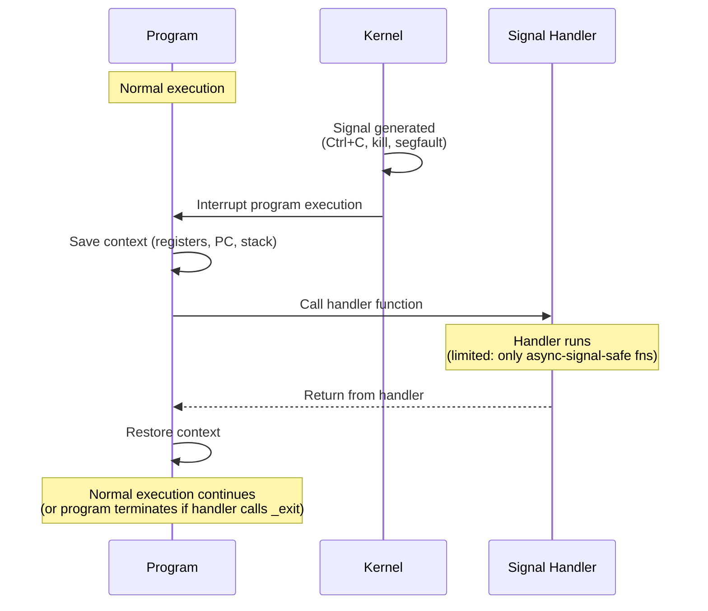

# Signal Handling

> [!summary] Goal
> Handle POSIX signals safely: use `sigaction` instead of `signal`, understand async-signal-safe functions, block signals in critical sections, and use real-time signals. Essential for: daemon processes, shell job control, child process management, and kernel signal delivery.

## Table of Contents

1. [Signal Concepts](#signal-concepts)
2. [Installing Handlers: signal vs sigaction](#installing-handlers-signal-vs-sigaction)
3. [Signal Masks](#signal-masks)
4. [Async-Signal-Safe Functions](#async-signal-safe-functions)
5. [Real-Time Signals](#real-time-signals)
6. [Pitfalls](#pitfalls)

---

## Signal Concepts

> [!info] Signal
> A signal is a software interrupt delivered to a process or thread. Signals can be synchronous (caused by the program: SIGFPE, SIGSEGV) or asynchronous (from outside: SIGINT from Ctrl+C, SIGTERM from `kill`). A signal handler is a function that runs when the signal is received.

### Common signals

| Signal | Default action | Typical cause |
|--------|:--------------:|---------------|
| `SIGSEGV` | Terminate + core | Segmentation fault (null pointer, buffer overflow) |
| `SIGFPE` | Terminate + core | Floating-point exception (division by zero) |
| `SIGINT` | Terminate | Ctrl+C from terminal |
| `SIGTERM` | Terminate | `kill <pid>` (default) |
| `SIGKILL` | Terminate | `kill -9 <pid>` — cannot be caught/blocked |
| `SIGSTOP` | Stop | Ctrl+Z — cannot be caught/blocked |
| `SIGCONT` | Continue | `fg` or kill -SIGCONT |
| `SIGPIPE` | Terminate | Write to broken pipe/socket |
| `SIGALRM` | Terminate | Timer expired (`alarm()`, `setitimer()`) |
| `SIGHUP` | Terminate | Terminal closed (daemons reload config) |
| `SIGUSR1` / `SIGUSR2` | Terminate | User-defined (application logic) |

---

## Installing Handlers: signal vs sigaction

### Signal delivery flow



> [!info] Signal handler
> A function called when a signal is received. Handlers run in interrupt context — they can be invoked at any point in the program's execution. This means the handler must avoid most library functions (only async-signal-safe functions are allowed).

### signal() — obsolete, don't use

```c
// ❌ signal() is obsolete — behavior varies across Unix versions
signal(SIGINT, my_handler);        // May reset handler after each signal!
signal(SIGINT, SIG_IGN);           // Ignore the signal
signal(SIGINT, SIG_DFL);           // Restore default behavior
```

### sigaction() — the correct way

```c
#include <signal.h>
#include <stdio.h>

volatile sig_atomic_t sigint_received = 0;

void handle_sigint(int sig) {
    sigint_received = 1;            // Only safe thing to do in a handler
}

int main(void) {
    struct sigaction sa = {0};
    sa.sa_handler = handle_sigint;
    sigemptyset(&sa.sa_mask);       // No additional signals blocked during handler
    sa.sa_flags = 0;                // No special behavior

    if (sigaction(SIGINT, &sa, NULL) == -1) {
        perror("sigaction");
        return 1;
    }

    while (!sigint_received) {
        // Main loop
    }
    printf("Got SIGINT, exiting gracefully\n");
    return 0;
}
```

### sigaction flags

```c
struct sigaction sa = {0};
sa.sa_handler = handler;
sigemptyset(&sa.sa_mask);          // Block no additional signals
sigaddset(&sa.sa_mask, SIGTERM);   // Block SIGTERM during handler execution

// Flags:
sa.sa_flags = SA_RESTART;          // Auto-restart interrupted system calls (read, write)
sa.sa_flags = SA_NOCLDSTOP;        // Don't receive SIGCHLD for stopped children
sa.sa_flags = SA_SIGINFO;          // Use sa_sigaction (3-arg handler with siginfo_t)
sa.sa_flags = SA_ONESHOT;          // Reset handler after first signal (obsolete, use sigaction)

// SA_SIGINFO — receive detailed signal info
sa.sa_sigaction = handle_sigaction; // 3-argument handler
sa.sa_flags = SA_SIGINFO;

void handle_sigaction(int sig, siginfo_t *info, void *ucontext) {
    // info->si_pid:  sending process ID
    // info->si_uid:  sending user ID
    // info->si_code: reason (SI_USER, SI_QUEUE, SI_TIMER)
    // info->si_value.sival_int: payload (for real-time signals)
}
```

---

## Signal Masks

> [!info] Signal mask
> A signal mask defines which signals are **blocked** (pending but not delivered). Blocked signals remain pending until unblocked. `sigprocmask` manages the mask at the process level; `pthread_sigmask` manages it per thread.

```c
sigset_t set;
sigemptyset(&set);                   // Initialize empty set
sigaddset(&set, SIGINT);            // Add SIGINT to the set
sigdelset(&set, SIGINT);            // Remove from the set
sigfillset(&set);                   // Add ALL signals
int is_member = sigismember(&set, SIGINT);  // Check membership

// Block SIGINT in a critical section
sigset_t old;
sigprocmask(SIG_BLOCK, &set, &old);      // Add SIGINT to blocked set

// Critical section — SIGINT won't be delivered
do_critical_work();

sigprocmask(SIG_SETMASK, &old, NULL);    // Restore original mask (unblock if needed)
```

### Waiting for signals

```c
// sigsuspend — atomically unblock and wait for a signal
sigset_t mask;
sigemptyset(&mask);
// Assume SIGINT was blocked earlier with sigprocmask

// Wait for SIGINT without race condition
sigsuspend(&mask);     // Atomically: set mask, wait for any signal, restore old mask

// sigwaitinfo — thread-safe signal wait (doesn't use handler)
sigset_t set;
sigemptyset(&set);
sigaddset(&set, SIGINT);
sigprocmask(SIG_BLOCK, &set, NULL);      // Must block before sigwaitinfo

siginfo_t info;
int sig = sigwaitinfo(&set, NULL);       // Blocks until SIGINT is received
printf("Received signal %d from pid %d\n", sig, info.si_pid);
```

---

## Async-Signal-Safe Functions

> [!info] Async-signal-safe
> A function is async-signal-safe if it can be safely called inside a signal handler. Most standard library functions are NOT safe (they may hold locks, use global state, or perform non-reentrant operations). In a signal handler, you're limited to a very small set of functions.

### Safe functions (call from signal handler)

```c
// POSIX guarantees these are safe:

write(fd, buf, n);                  // Low-level write
read(fd, buf, n);                   // Low-level read
close(fd);                          // Close file descriptor
_exit(status);                      // Exit without cleanup (NOT exit())
sigaction(sig, NULL, &old);         // Query/change signal action
sigprocmask(...);                   // Change signal mask
getpid();                           // Get process ID
gettimeofday();                     // Get time
sched_yield();                      // Yield CPU
memcpy(), memset(), strlen()        // Memory operations

// Setting a volatile sig_atomic_t flag
volatile sig_atomic_t flag = 0;
// sig_atomic_t is guaranteed to be read/written atomically
```

### What NOT to do in a signal handler

```c
void bad_handler(int sig) {
    // ❌ UNSAFE — these use locks or global state:
    printf("Got signal!\n");         // Uses stdio locks — can deadlock!
    malloc(100);                     // Can deadlock with malloc's lock!
    free(ptr);                       // Same — not reentrant
    exit(1);                         // Calls cleanup handlers (may deadlock)
    longjmp(env, 1);                 // If interrupted during setjmp, corrupts state

    // ✅ Safe alternatives:
    char msg[] = "Got signal!\n";
    write(STDOUT_FILENO, msg, strlen(msg));  // Direct write — no locks
    _exit(1);                                  // Exit without cleanup
}
```

### Self-pipe trick (wake up select/poll from signal handler)

```c
// Problem: you're blocked in select() and need to wake up on a signal.
// Solution: write a byte to a self-pipe from the signal handler.

int signal_pipe[2];
pipe(signal_pipe);                         // Create pipe for signal notification

void handle_sigterm(int sig) {
    char byte = 1;
    write(signal_pipe[1], &byte, 1);       // Safe: write is async-signal-safe
}

int main(void) {
    // Set up handler
    struct sigaction sa = { .sa_handler = handle_sigterm };
    sigaction(SIGTERM, &sa, NULL);

    fd_set read_fds;
    FD_ZERO(&read_fds);
    FD_SET(signal_pipe[0], &read_fds);

    // select() will return when either data arrives or SIGTERM is received
    select(signal_pipe[0] + 1, &read_fds, NULL, NULL, NULL);

    if (FD_ISSET(signal_pipe[0], &read_fds)) {
        char byte;
        read(signal_pipe[0], &byte, 1);    // It was SIGTERM — handle shutdown
    }
    return 0;
}
```

---

## Real-Time Signals

> [!info] Real-time signal
> Real-time signals (SIGRTMIN to SIGRTMAX) provide: (1) queuing — multiple signals are not coalesced, (2) ordering — lower-numbered signals are delivered first, (3) payload — a data value (int or pointer) can be attached to each signal.

```c
// Sending a real-time signal with payload
#include <signal.h>

union sigval sv;
sv.sival_int = 42;                           // Integer payload
sigqueue(target_pid, SIGRTMIN, sv);          // Send with payload

// Receiving with SA_SIGINFO
struct sigaction sa;
sa.sa_sigaction = handler;
sa.sa_flags = SA_SIGINFO;
sigaction(SIGRTMIN, &sa, NULL);

void handler(int sig, siginfo_t *info, void *ctx) {
    int payload = info->si_value.sival_int;   // 42
    pid_t sender = info->si_pid;
}
```

### Standard vs Real-Time signals

| Aspect | Standard signals | Real-time signals |
|--------|:----------------:|:-----------------:|
| **Count** | ~15 defined | SIGRTMIN to SIGRTMAX (~30) |
| **Queuing** | Coalesced (only one pending) | Queued (all delivered) |
| **Ordering** | Unspecified | Lowest number first |
| **Payload** | None | `sival_int` or `sival_ptr` |
| **Portability** | All POSIX | POSIX.1-2001 |

---

## Pitfalls

### Not restarting interrupted system calls

A signal handler that doesn't have `SA_RESTART` will cause `read()`, `write()`, `accept()`, and other blocking calls to return `EINTR`. Either set `SA_RESTART` in `sa_flags` or manually restart the call:

```c
// Manual restart
ssize_t n;
do {
    n = read(fd, buf, sizeof(buf));
} while (n < 0 && errno == EINTR);
```

### printf in signal handlers

`printf` is not async-signal-safe. Using it from a signal handler can deadlock if the handler interrupts a `printf` call in the main program. The same applies to `malloc`, `free`, and most standard library functions.

### Race between setting handler and sending signal

If the signal is sent before `sigaction` completes, the default handler (usually termination) runs. Set up all handlers before creating child threads/processes.

### Ignoring SIGPIPE

Writing to a broken pipe or socket generates SIGPIPE, which terminates the process by default. In network servers, this is almost never desired. Either ignore SIGPIPE or handle it:

```c
signal(SIGPIPE, SIG_IGN);      // Suppress — write returns -1 with EPIPE instead
```

---

> [!question]- Interview Questions
>
> **Q: What is the difference between `signal()` and `sigaction()`?**
> A: `signal()` is obsolete — its behavior differs across Unix versions (some reset the handler after each signal, others don't). `sigaction()` is POSIX-standard, portable, and provides fine-grained control: block signals during handler, SA_RESTART for interrupted syscalls, SA_SIGINFO for extra detail (sender PID, payload). Always use `sigaction()`.
>
> **Q: What functions can you safely call from a signal handler?**
> A: Very few. Only async-signal-safe functions: `write()`, `read()`, `close()`, `_exit()`, `sigaction()`, `sigprocmask()`, `getpid()`, and setting a `volatile sig_atomic_t` variable. NOT safe: `printf`, `malloc`, `free`, `exit`, most of the standard library.
>
> **Q: What is the self-pipe trick?**
> A: A technique to wake up a `select()`/`poll()` loop from a signal handler. Create a pipe. In the signal handler, `write()` one byte to the pipe. In the main loop, include the pipe's read end in the `select()` fd set. When the signal arrives, the write unblocks `select()`. This is safe because `write()` is async-signal-safe.
>
> **Q: What is the difference between `sigprocmask` and `sigsuspend`?**
> A: `sigprocmask` changes the signal mask (block/unblock signals). `sigsuspend` atomically sets a new mask and waits for a signal — it's the safe way to wait for a signal without the race condition of: unblock, then pause (signal could arrive between these two calls).
>
> **Q: What are real-time signals and why are they useful?**
> A: Real-time signals (SIGRTMIN-SIGRTMAX) are queued (never coalesced), ordered by number, and can carry a payload (int or pointer). Use them for: (1) delivering multiple occurrences of the same event, (2) ordering the delivery, (3) passing application-specific data. Standard signals coalesce — if a signal is already pending, additional occurrences are lost.

---

## Cross-Links

- [[C/03_Advanced/05_System_Programming]] for child process management with SIGCHLD
- [[C/03_Advanced/01_Concurrency_with_Pthreads]] for thread signal masks (pthread_sigmask)
- [[C/02_Core/03_Error_Handling]] for EINTR handling
- [[C/04_Playbooks/01_Debug_Segfaults_and_Invalid_Memory_Access]] for SIGSEGV debugging
- [[C/05_Projects/03_Tiny_Shell_Parser_and_Executor]] for job control signals
