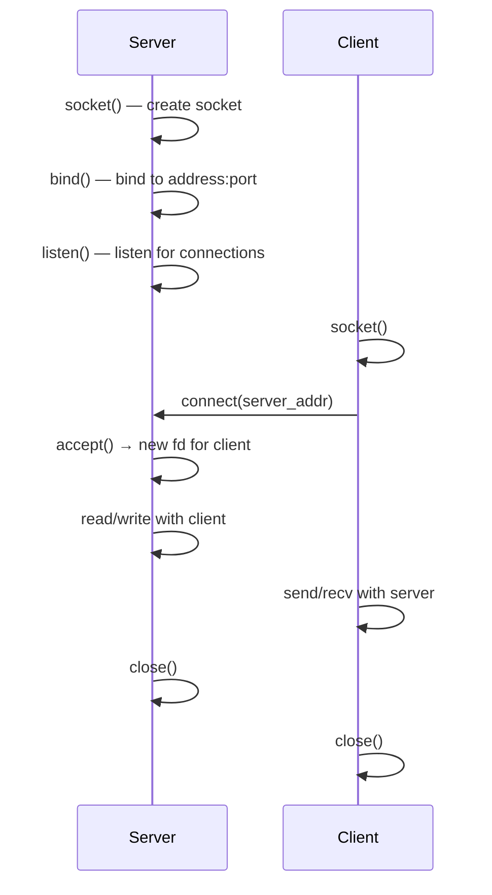

# Socket Programming

> [!summary] Goal
> Build network applications with Berkeley sockets: TCP/UDP client-server, non-blocking I/O, multiplexing with select/poll/epoll. Essential for: HTTP servers, chat systems, database drivers, and understanding kernel network stack.

## Table of Contents

1. [Socket Basics](#socket-basics)
2. [TCP Client-Server](#tcp-client-server)
3. [UDP](#udp)
4. [Non-Blocking I/O](#non-blocking-i-o)
5. [I/O Multiplexing](#i-o-multiplexing)
6. [Pitfalls](#pitfalls)

---

## Socket Basics

> [!info] Socket
> A socket is an endpoint for network communication. Like a file descriptor, it's represented by an `int`. Sockets support different protocols: TCP (reliable, connection-oriented), UDP (unreliable, connectionless), and Unix domain (local, file-system-based).

```c
#include <sys/socket.h>
#include <netinet/in.h>      // sockaddr_in (IPv4)
#include <arpa/inet.h>       // inet_pton, htons

// Create a socket: domain, type, protocol
int sock = socket(AF_INET, SOCK_STREAM, 0);    // TCP (IPv4)
int sock = socket(AF_INET, SOCK_DGRAM, 0);     // UDP (IPv4)
int sock = socket(AF_UNIX, SOCK_STREAM, 0);    // Unix domain stream
```

### Address structures

```c
// IPv4 socket address
struct sockaddr_in addr;
addr.sin_family = AF_INET;                     // IPv4
addr.sin_port = htons(8080);                    // Port (network byte order!)
inet_pton(AF_INET, "127.0.0.1", &addr.sin_addr); // IP address

// sockaddr_in is the IPv4-specific struct
// sockaddr is the generic struct passed to socket functions

// Helper: convert string to address
struct in_addr ip;
inet_pton(AF_INET, "192.168.1.1", &ip);        // "192.168.1.1" → network order

// Helper: convert address to string
char buf[INET_ADDRSTRLEN];
inet_ntop(AF_INET, &addr.sin_addr, buf, sizeof(buf));
printf("IP: %s\n", buf);
```

### Byte ordering

```c
// Network byte order is BIG-ENDIAN
// x86/x86-64 is LITTLE-ENDIAN — need conversion

htons(8080);      // Host TO Network Short (16-bit)
htonl(0x1234);    // Host TO Network Long (32-bit)
ntohs(port);      // Network TO Host Short
ntohl(addr);      // Network TO Host Long

// Port numbers and IP addresses in socket structures are always network order!
```

---

## TCP Client-Server

### TCP Server



```c
#include <stdio.h>
#include <stdlib.h>
#include <string.h>
#include <unistd.h>
#include <sys/socket.h>
#include <netinet/in.h>

int main(void) {
    int server_fd, client_fd;
    struct sockaddr_in address;
    int opt = 1;
    int addrlen = sizeof(address);
    char buffer[1024] = {0};

    // 1. Create socket
    server_fd = socket(AF_INET, SOCK_STREAM, 0);
    if (server_fd < 0) { perror("socket"); exit(1); }

    // Set socket option: reuse address (avoids "Address already in use")
    if (setsockopt(server_fd, SOL_SOCKET, SO_REUSEADDR, &opt, sizeof(opt)) < 0) {
        perror("setsockopt"); exit(1);
    }

    // 2. Bind to port
    address.sin_family = AF_INET;
    address.sin_addr.s_addr = INADDR_ANY;        // Bind to all interfaces
    address.sin_port = htons(8080);

    if (bind(server_fd, (struct sockaddr *)&address, sizeof(address)) < 0) {
        perror("bind"); exit(1);
    }

    // 3. Listen
    if (listen(server_fd, 3) < 0) { perror("listen"); exit(1); }

    printf("Listening on port 8080...\n");

    // 4. Accept connection
    client_fd = accept(server_fd, (struct sockaddr *)&address, (socklen_t *)&addrlen);
    if (client_fd < 0) { perror("accept"); exit(1); }

    // 5. Communicate
    read(client_fd, buffer, 1024);
    printf("Received: %s\n", buffer);

    char *response = "HTTP/1.1 200 OK\r\nContent-Length: 13\r\n\r\nHello, World!";
    write(client_fd, response, strlen(response));

    // 6. Close
    close(client_fd);
    close(server_fd);
    return 0;
}
```

### TCP Client

```c
int main(void) {
    int sock = 0;
    struct sockaddr_in serv_addr;
    char *hello = "GET / HTTP/1.1\r\nHost: example.com\r\n\r\n";
    char buffer[1024] = {0};

    // Create socket
    sock = socket(AF_INET, SOCK_STREAM, 0);
    if (sock < 0) { perror("socket"); return -1; }

    serv_addr.sin_family = AF_INET;
    serv_addr.sin_port = htons(80);

    // Convert and check address
    if (inet_pton(AF_INET, "93.184.216.34", &serv_addr.sin_addr) <= 0) {
        perror("inet_pton"); return -1;
    }

    // Connect
    if (connect(sock, (struct sockaddr *)&serv_addr, sizeof(serv_addr)) < 0) {
        perror("connect"); return -1;
    }

    // Send request
    send(sock, hello, strlen(hello), 0);

    // Read response
    read(sock, buffer, 1024);
    printf("%s\n", buffer);

    close(sock);
    return 0;
}
```

---

## UDP

> [!info] UDP (User Datagram Protocol)
> UDP is connectionless — there's no handshake, no guarantee of delivery, no ordering. Each `sendto` sends a single datagram. Each `recvfrom` receives a single datagram. Uses the same socket for all communication.

### UDP Server

```c
int sock = socket(AF_INET, SOCK_DGRAM, 0);      // SOCK_DGRAM for UDP

struct sockaddr_in addr;
addr.sin_family = AF_INET;
addr.sin_addr.s_addr = INADDR_ANY;
addr.sin_port = htons(8080);

bind(sock, (struct sockaddr *)&addr, sizeof(addr));

char buffer[1024];
struct sockaddr_in client_addr;
socklen_t client_len = sizeof(client_addr);

// Receive (returns sender's address)
ssize_t n = recvfrom(sock, buffer, sizeof(buffer), 0,
                     (struct sockaddr *)&client_addr, &client_len);
buffer[n] = '\0';
printf("Received from client: %s\n", buffer);

// Send response to the same client
sendto(sock, "ACK", 3, 0,
       (struct sockaddr *)&client_addr, client_len);

close(sock);
```

### UDP Client

```c
int sock = socket(AF_INET, SOCK_DGRAM, 0);

struct sockaddr_in server_addr;
server_addr.sin_family = AF_INET;
server_addr.sin_port = htons(8080);
inet_pton(AF_INET, "127.0.0.1", &server_addr.sin_addr);

// Send — no connect() needed for UDP
sendto(sock, "Hello", 5, 0,
       (struct sockaddr *)&server_addr, sizeof(server_addr));

char buffer[1024];
socklen_t addr_len = sizeof(server_addr);
recvfrom(sock, buffer, sizeof(buffer), 0,
         (struct sockaddr *)&server_addr, &addr_len);
printf("Server response: %s\n", buffer);

close(sock);
```

---

## Non-Blocking I/O

> [!info] Non-blocking I/O
> A non-blocking socket operation returns immediately. If no data is available, `read` returns -1 with `errno = EAGAIN` (or `EWOULDBLOCK`). If the send buffer is full, `write` returns -1 with the same errno. Used with `select`/`poll`/`epoll` for event-driven servers.

```c
int set_nonblocking(int fd) {
    int flags = fcntl(fd, F_GETFL, 0);
    if (flags < 0) return -1;
    return fcntl(fd, F_SETFL, flags | O_NONBLOCK);
}

// Usage
int sock = socket(AF_INET, SOCK_STREAM, 0);
set_nonblocking(sock);

// Non-blocking read
char buf[4096];
ssize_t n = read(sock, buf, sizeof(buf));
if (n < 0) {
    if (errno == EAGAIN || errno == EWOULDBLOCK) {
        // No data available — come back later
    } else {
        perror("read");  // Real error
    }
}
```

---

## I/O Multiplexing

> [!info] I/O multiplexing
> I/O multiplexing lets a single thread monitor multiple file descriptors for readability, writability, or errors. Instead of creating one thread per connection, one thread handles thousands of connections. `select` (portable, old), `poll` (better than select), `epoll` (Linux-specific, best).

### select — portable, limited

```c
fd_set read_fds;
FD_ZERO(&read_fds);
FD_SET(sock1, &read_fds);
FD_SET(sock2, &read_fds);

int max_fd = (sock1 > sock2 ? sock1 : sock2) + 1;
struct timeval timeout = {5, 0};    // 5 second timeout

int ret = select(max_fd, &read_fds, NULL, NULL, &timeout);

if (ret < 0) {
    perror("select");
} else if (ret == 0) {
    printf("Timeout — no data in 5 seconds\n");
} else {
    if (FD_ISSET(sock1, &read_fds)) handle_read(sock1);
    if (FD_ISSET(sock2, &read_fds)) handle_read(sock2);
}
```

### epoll — Linux-specific, scalable

```c
#include <sys/epoll.h>

int epoll_fd = epoll_create1(0);        // Create epoll instance

// Add a socket to epoll
struct epoll_event ev;
ev.events = EPOLLIN;                     // Monitor for readability
ev.data.fd = server_fd;
epoll_ctl(epoll_fd, EPOLL_CTL_ADD, server_fd, &ev);

// Event loop
struct epoll_event events[1024];
int nfds = epoll_wait(epoll_fd, events, 1024, -1);   // Wait indefinitely

for (int i = 0; i < nfds; i++) {
    if (events[i].data.fd == server_fd) {
        // New connection
        int client_fd = accept(server_fd, NULL, NULL);
        set_nonblocking(client_fd);

        struct epoll_event client_ev;
        client_ev.events = EPOLLIN | EPOLLET;   // Edge-triggered
        client_ev.data.fd = client_fd;
        epoll_ctl(epoll_fd, EPOLL_CTL_ADD, client_fd, &client_ev);
    } else {
        if (events[i].events & EPOLLIN) {
            handle_client(events[i].data.fd);
        }
    }
}
```

### select vs poll vs epoll

| Feature | select | poll | epoll |
|---------|:------:|:----:|:-----:|
| **Portability** | All POSIX | Most POSIX | Linux only |
| **Max fd** | FD_SETSIZE (1024) | Unlimited | Unlimited |
| **Performance (1000s of fds)** | O(n) — scans all | O(n) — scans all | O(1) — only active |
| **Data structure** | Bitmask (modified on return) | Array (not modified) | Callback-based |
| **Edge-triggered** | ❌ | ❌ | ✅ (EPOLLET) |
| **When to use** | Simple scripts, <1024 fds | Portable, moderate scale | Linux, high-performance |

### Epoll edge-triggered vs level-triggered

```c
// Level-triggered (default): 
// epoll_wait returns as long as data is available
// Simplest: use non-blocking I/O, handle all data, no special logic

// Edge-triggered (EPOLLET):
// epoll_wait returns only ONCE when the state changes
// (data arrives → readability goes from not-ready to ready)
// Must read ALL available data in a loop until EAGAIN:
struct epoll_event ev;
ev.events = EPOLLIN | EPOLLET;

// Edge-triggered read:
void handle_client(int fd) {
    char buf[4096];
    while (1) {
        ssize_t n = read(fd, buf, sizeof(buf));
        if (n > 0) { process(buf, n); continue; }
        if (n < 0 && errno == EAGAIN) break;  // All data read
        if (n == 0) { close(fd); break; }     // Connection closed
        perror("read"); close(fd); break;      // Error
    }
}
```

---

## Pitfalls

### SIGPIPE termination

Writing to a closed connection sends SIGPIPE, which kills the process. Ignore it in network servers:

```c
signal(SIGPIPE, SIG_IGN);    // write() returns -1 with EPIPE instead
```

### Not handling partial sends

`write()` / `send()` may not send all bytes. Always loop:

```c
ssize_t send_all(int fd, const char *data, size_t len) {
    while (len > 0) {
        ssize_t n = send(fd, data, len, MSG_NOSIGNAL);  // MSG_NOSIGNAL prevents SIGPIPE
        if (n < 0) return -1;
        data += n;
        len -= n;
    }
    return 0;
}
```

### Forgetting to convert byte order

Port numbers and IP addresses are always in network byte order (big-endian). Use `htons()`/`htonl()` when setting, `ntohs()`/`ntohl()` when reading. Almost every socket bug involving port numbers is a byte-order bug.

### Listening socket backlog

The second argument to `listen()` is the backlog — the number of pending connections the kernel will queue before accepting. A value of SOMAXCONN (`/proc/sys/net/core/somaxconn`, default 128) is typical. Too small = clients see "Connection refused" under load.

---

> [!question]- Interview Questions
>
> **Q: What is the difference between TCP and UDP socket programming?**
> A: TCP uses SOCK_STREAM: connection-oriented, reliable, ordered, no message boundaries. Server calls socket → bind → listen → accept. Client calls socket → connect. Uses `read`/`write`. UDP uses SOCK_DGRAM: connectionless, unreliable, datagram boundaries preserved. Server just calls socket → bind → recvfrom → sendto. Client calls socket → sendto → recvfrom. No accept() needed.
>
> **Q: What is the difference between select, poll, and epoll?**
> A: select is portable but limited to 1024 file descriptors and O(n) performance. poll is similar but without the FD_SETSIZE limit (still O(n)). epoll is Linux-specific, O(1) for active connections, and supports edge-triggered mode. For high-performance servers handling thousands of connections, epoll is the standard choice on Linux.
>
> **Q: What is edge-triggered vs level-triggered epoll?**
> A: Level-triggered (default): epoll_wait returns as long as data is available — simpler, but you may get repeated notifications. Edge-triggered (EPOLLET): returns only once per state change — you must read all data in a loop until EAGAIN or you'll miss data. Edge-triggered is more efficient (fewer wakeups) but requires careful coding.
>
> **Q: What does `htons` do and why is it needed?**
> A: `htons` converts a 16-bit integer from host byte order to network byte order. x86/x86-64 is little-endian. Network protocols (IP, TCP, UDP) use big-endian. Port numbers and IP addresses in socket structures must be in network byte order. Without `htons`, port 8080 would be interpreted as 0x901F instead of 0x1F90 on little-endian systems.
>
> **Q: How does a server handle connections from multiple clients?**
> A: Options: (1) Fork per connection — each child handles one client. (2) Thread per connection — threads share address space. (3) Event-driven (select/poll/epoll) — single thread multiplexes thousands of connections. For high concurrency (10K+ connections), event-driven with epoll is the standard approach.

---

## Cross-Links

- [[C/02_Core/02_File_IO_and_POSIX_System_Calls]] for fd operations and non-blocking I/O
- [[C/03_Advanced/03_Signal_Handling]] for SIGPIPE handling
- [[C/03_Advanced/05_System_Programming]] for forking socket servers
- [[C/03_Advanced/01_Concurrency_with_Pthreads]] for threaded socket servers
- [[C/05_Projects/02_HTTP_Server_Minimal]] for a complete HTTP server project
