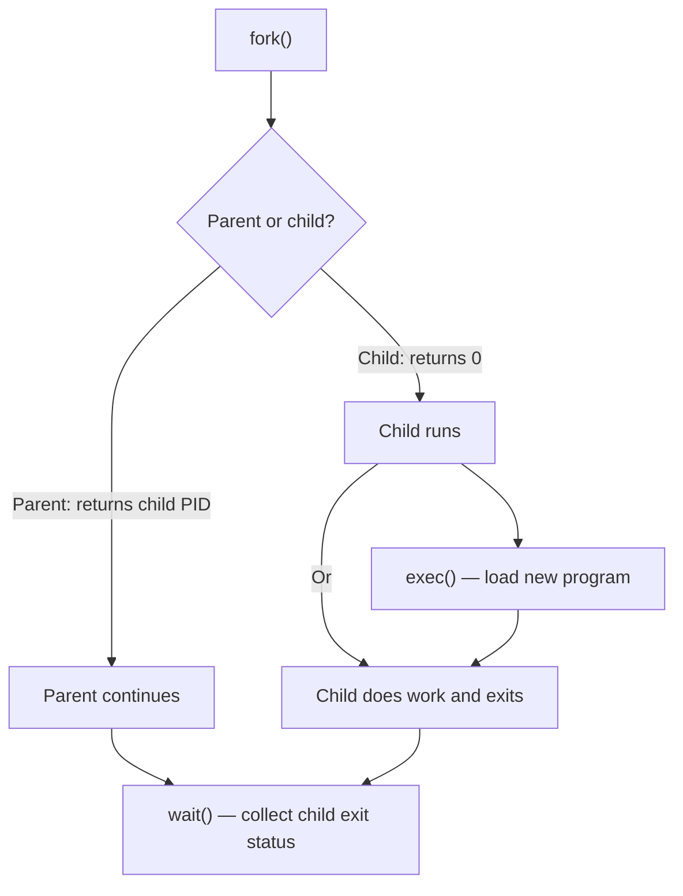

# System Programming: Processes, Pipes, and Daemons

> [!summary] Goal
> Master POSIX process management: fork, exec, wait, pipes, and daemonization. Essential for: shell implementation, process supervision, service management, and understanding kernel process/scheduler internals.

## Table of Contents

1. [Process Lifecycle](#process-lifecycle)
2. [fork](#fork)
3. [exec](#exec)
4. [wait and Status](#wait-and-status)
5. [Pipes](#pipes)
6. [Daemons](#daemons)
7. [Pitfalls](#pitfalls)

---

## Process Lifecycle

> [!info] Process
> A process is an instance of a running program — it has its own address space, file descriptors, and execution context. `fork()` creates a new process by cloning the current one. `exec()` replaces the current process's image with a new program.



---

## fork

> [!info] fork
> `fork()` creates a new process (the child) by duplicating the calling process (the parent). After fork, both processes execute from the next instruction. The child gets a copy of the parent's memory, file descriptors, and execution state. **Copy-on-Write** means physical memory is shared until one process writes.

```c
#include <unistd.h>
#include <sys/wait.h>
#include <stdio.h>

pid_t pid = fork();

if (pid < 0) {
    // Error
    perror("fork");
} else if (pid == 0) {
    // Child process
    printf("Child: PID=%d, Parent PID=%d\n", getpid(), getppid());
    // Do child work...
    _exit(0);                       // Child exits (use _exit, not exit!)
} else {
    // Parent process
    printf("Parent: child PID=%d\n", pid);
    int status;
    waitpid(pid, &status, 0);       // Wait for child to finish
    printf("Child exited with status %d\n", WEXITSTATUS(status));
}
```

### Fork behavior

```mermaid
flowchart LR
    subgraph Before["Before fork"]
        P1["Parent<br/>PID=100<br/>fd=3 → /tmp/file<br/>heap: data"">"] 
    end
    subgraph After["After fork (Copy on Write)"]
        PAR["Parent<br/>PID=100<br/>fd=3 → /tmp/file<br/>heap: data"]  -->|"Parent continues"| PAR2["Parent modifies data<br/>(private copy created)"]
        CHILD["Child<br/>PID=101<br/>fd=3 → /tmp/file<br/>heap: data (shared)"] -->|"Child writes"| CHILD2["Child gets private copy<br/>Parent's data unaffected"]
    end
```

### What's shared vs copied

| Resource | After fork |
|----------|:----------:|
| **File descriptors** | ✅ Shared (both point to the same kernel fd table) |
| **Memory** | ❌ Copied (Copy-on-Write — physical pages shared until written) |
| **Signal handlers** | ❌ Copied (child has its own) |
| **Working directory** | ❌ Copied |
| **Environment** | ❌ Copied |
| **Open files** | ✅ Shared (same offset! seek in parent affects child) |

---

## exec

> [!info] exec
> The `exec()` family replaces the current process with a new program. The process ID stays the same. All program code, data, heap, and stack are replaced — but file descriptors with the `FD_CLOEXEC` flag cleared survive.

```c
#include <unistd.h>

// exec variants
execl("/bin/ls", "ls", "-l", "/tmp", (char *)NULL);     // List of args
execv("/bin/ls", (char *[]){"ls", "-l", "/tmp", NULL}); // Array of args
execlp("ls", "ls", "-l", (char *)NULL);                 // Search PATH
execvp("ls", (char *[]){"ls", "-l", NULL});              // Search PATH + array

// With environment
char *env[] = {"PATH=/usr/bin", "USER=alice", NULL};
execle("/bin/ls", "ls", "-l", (char *)NULL, env);

// exec always replaces the current process — no return on success
```

### Typical fork + exec pattern

```c
pid_t pid = fork();

if (pid == 0) {
    // Child — redirect stdout to a file before exec
    int fd = open("output.txt", O_WRONLY | O_CREAT | O_TRUNC, 0644);
    dup2(fd, STDOUT_FILENO);          // Make fd = stdout
    close(fd);

    execlp("ls", "ls", "-l", (char *)NULL);
    // Only reached if exec fails
    perror("exec");
    _exit(1);
} else if (pid > 0) {
    int status;
    waitpid(pid, &status, 0);
}
```

### Close-on-exec

```c
// File descriptors with FD_CLOEXEC are automatically closed on exec
// This prevents leaking fds to the new program

int fd = open("secret.txt", O_RDONLY);
fcntl(fd, F_SETFD, FD_CLOEXEC);       // Close on exec

// Or open with close-on-exec from the start (Linux 3.1+):
int fd = open("secret.txt", O_RDONLY | O_CLOEXEC);
```

---

## wait and Status

```c
#include <sys/wait.h>

// Wait for any child
pid_t pid = wait(NULL);                        // Block until any child exits
pid_t pid = waitpid(child_pid, &status, 0);    // Wait for specific child
pid_t pid = waitpid(-1, &status, WNOHANG);     // Non-blocking: return 0 if no child exited

// Check child's exit status
if (WIFEXITED(status)) {
    printf("Exited normally: %d\n", WEXITSTATUS(status));  // exit code
}
if (WIFSIGNALED(status)) {
    printf("Killed by signal: %d\n", WTERMSIG(status));     // signal number
}
if (WCOREDUMP(status)) {
    printf("Core dumped\n");
}
if (WIFSTOPPED(status)) {
    printf("Stopped by signal: %d\n", WSTOPSIG(status));   // for job control
}
```

### Zombie and Orphan processes

```mermaid
flowchart TD
    A["Child exits"] --> B{Parent calls wait()?}
    B -->|"Yes"| C["Child's exit status collected → child removed"]
    B -->|"No"| D["Child becomes ZOMBIE<br/>(only PID and exit status remain)"]
    D --> E["Parent exits"] --> F["Zombie adopted by init (PID 1) → cleaned"]
    D --> G["Too many zombies"] --> H["System runs out of PIDs"]
    
    A --> I{Parent exits first?}
    I -->|"Yes"| J["Child becomes ORPHAN<br/>→ adopted by init (PID 1)"]
```

```c
// Prevent zombies: handle SIGCHLD
void handle_sigchld(int sig) {
    int status;
    pid_t pid;
    while ((pid = waitpid(-1, &status, WNOHANG)) > 0) {
        printf("Child %d exited\n", pid);
    }
}

struct sigaction sa = { .sa_handler = handle_sigchld };
sigemptyset(&sa.sa_mask);
sa.sa_flags = SA_RESTART | SA_NOCLDSTOP;
sigaction(SIGCHLD, &sa, NULL);
```

---

## Pipes

> [!info] Pipe
> A pipe is a unidirectional communication channel between processes. `pipe(fds)` creates two file descriptors: `fds[0]` for reading, `fds[1]` for writing. Data written to `fds[1]` can be read from `fds[0]`. Pipes have a fixed-size buffer (~64 KB on Linux).

```c
// Basic pipe between parent and child
int pipefd[2];
pipe(pipefd);                      // Create pipe

pid_t pid = fork();

if (pid == 0) {
    // Child — read from pipe
    close(pipefd[1]);              // Close unused write end
    char buf[256];
    ssize_t n = read(pipefd[0], buf, sizeof(buf) - 1);
    buf[n] = '\0';
    printf("Child received: %s\n", buf);
    close(pipefd[0]);
} else {
    // Parent — write to pipe
    close(pipefd[0]);              // Close unused read end
    write(pipefd[1], "Hello from parent!", 19);
    close(pipefd[1]);
    wait(NULL);
}
```

### Pipeline: ls | wc -l

```c
int pipefd[2];
pipe(pipefd);

pid_t pid1 = fork();
if (pid1 == 0) {
    // First child: ls
    close(pipefd[0]);                     // Close read end
    dup2(pipefd[1], STDOUT_FILENO);        // Make stdout = pipe write end
    close(pipefd[1]);
    execlp("ls", "ls", (char *)NULL);
    _exit(1);
}

pid_t pid2 = fork();
if (pid2 == 0) {
    // Second child: wc -l
    close(pipefd[1]);                     // Close write end
    dup2(pipefd[0], STDIN_FILENO);         // Make stdin = pipe read end
    close(pipefd[0]);
    execlp("wc", "wc", "-l", (char *)NULL);
    _exit(1);
}

// Parent: close both ends, wait for children
close(pipefd[0]);
close(pipefd[1]);
waitpid(pid1, NULL, 0);
waitpid(pid2, NULL, 0);
```

---

## Daemons

> [!info] Daemon
> A daemon is a background process with no controlling terminal. It runs independently, usually started at boot. Becoming a daemon requires: (1) fork + parent exits, (2) create new session, (3) change working directory, (4) redirect stdin/stdout/stderr, (5) close unnecessary file descriptors.

```c
#include <sys/stat.h>

void daemonize(const char *lockfile) {
    pid_t pid;

    // 1. Fork off the parent
    pid = fork();
    if (pid < 0) exit(EXIT_FAILURE);
    if (pid > 0) exit(EXIT_SUCCESS);        // Parent exits

    // 2. Create new session (detach from terminal)
    if (setsid() < 0) exit(EXIT_FAILURE);

    // 3. Fork again (prevent re-acquiring a terminal)
    pid = fork();
    if (pid < 0) exit(EXIT_FAILURE);
    if (pid > 0) exit(EXIT_SUCCESS);

    // 4. Change working directory to root
    chdir("/");

    // 5. Set file permissions mask
    umask(0);

    // 6. Close all file descriptors
    for (int i = 0; i < sysconf(_SC_OPEN_MAX); i++) {
        close(i);
    }

    // 7. Redirect stdin/stdout/stderr to /dev/null
    open("/dev/null", O_RDWR);              // stdin (fd 0)
    dup(0);                                 // stdout (fd 1)
    dup(0);                                 // stderr (fd 2)

    // 8. Write PID file (optional, for service management)
    if (lockfile) {
        int fd = open(lockfile, O_WRONLY | O_CREAT | O_TRUNC, 0644);
        if (fd > 0) {
            char pid_str[16];
            snprintf(pid_str, sizeof(pid_str), "%d\n", getpid());
            write(fd, pid_str, strlen(pid_str));
            close(fd);
        }
    }
}

int main(void) {
    daemonize("/var/run/mydaemon.pid");

    // Daemon's main loop
    while (1) {
        // Work...
        sleep(10);
    }
    return 0;
}
```

---

## Pitfalls

### Not closing unused pipe ends

Every pipe fd must be closed in the process that doesn't use it. Forgetting to close the write end in the reader means `read()` never returns EOF (it blocks waiting for more data from a process that thinks the pipe is still open).

### Fork in a multi-threaded program

`fork()` in a multi-threaded program is dangerous — only the calling thread is copied. Other threads' locks are left in an inconsistent state. The child should call `_exit()` immediately, never `exit()` (which runs cleanup handlers that may assume all threads exist).

### Using `exit()` instead of `_exit()` in child

`exit()` flushes stdio buffers and runs cleanup functions (registered with `atexit()`). In a child after `fork()`, this can corrupt shared resources (e.g., writing to a log file twice). Use `_exit()` in the child to exit immediately without cleanup.

### Not handling fork failure

`fork()` returns -1 on failure (typically out of memory or process limit reached). Check the return value. Low-probability, but critical when it happens.

### SIGCHLD handling in loops

Without a signal handler for SIGCHLD, children become zombies. With a handler, be aware that `waitpid(-1, ...)` in the handler may interfere with explicit `waitpid()` calls in the main loop. Use `WNOHANG` and loop in the handler.

---

> [!question]- Interview Questions
>
> **Q: How does `fork()` work under the hood?**
> A: `fork()` clones the calling process. The kernel: (1) creates a new process with a new PID, (2) copies the parent's address space using Copy-on-Write (physical pages are shared, marked read-only; a private copy is created when either process writes), (3) copies the file descriptor table (both processes share the same kernel fd structures), (4) returns 0 to the child and the child's PID to the parent.
>
> **Q: What is a zombie process?**
> A: A zombie is a process that has exited but whose exit status hasn't been collected by the parent via `wait()`/`waitpid()`. The kernel keeps only the PID and exit status. Zombies don't use memory or CPU, but they consume a PID. Too many zombies exhaust the PID table. Collect children or use `sigaction(SIGCHLD, ...)` with `SA_NOCLDWAIT`.
>
> **Q: How do pipes work for inter-process communication?**
> A: `pipe(fds)` creates two file descriptors: `fds[0]` (read end) and `fds[1]` (write end). After fork, both parent and child have access to both ends. Close the unused end in each process: parent closes read, child closes write (or vice versa). Data flows in one direction. For bidirectional communication, use two pipes.
>
> **Q: What is the difference between `fork()` and `exec()`?**
> A: `fork()` creates a new process by cloning the current one — both processes continue running the same program. `exec()` replaces the current process's code, data, heap, and stack with a new program — the process ID stays the same, but the running program changes. They're typically used together: `fork()` to create a child, then `exec()` in the child to run a different program.
>
> **Q: How does daemonization work?**
> A: A program becomes a daemon by: (1) `fork()` + parent exits (orphan the child). (2) `setsid()` to create a new session (detach from terminal). (3) Another `fork()` to ensure no terminal can be re-acquired. (4) `chdir("/")` to avoid blocking a filesystem. (5) Close all file descriptors; redirect stdin/stdout/stderr to /dev/null. (6) Optionally create a PID file.

---

## Cross-Links

- [[C/03_Advanced/03_Signal_Handling]] for SIGCHLD and signal handlers
- [[C/02_Core/02_File_IO_and_POSIX_System_Calls]] for file descriptors and redirection
- [[C/02_Core/07_Debugging_with_GDB]] for debugging multi-process programs
- [[C/03_Advanced/04_Socket_Programming]] for forking socket servers
- [[C/05_Projects/03_Tiny_Shell_Parser_and_Executor]] for shell implementation
