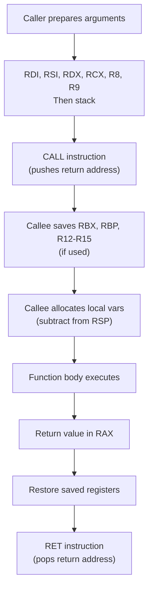

# Inline Assembly, ABI, and Calling Conventions

> [!summary] Goal
> Use inline assembly in C, understand the system V ABI (calling conventions, stack frame layout), and work with linker scripts. Essential for: OS kernels (syscall entry, context switching), performance-critical code (CPU feature detection), and low-level debugging.

## Table of Contents

1. [Inline Assembly](#inline-assembly)
2. [System V AMD64 ABI](#system-v-amd64-abi)
3. [Linker Scripts for OS Development](#linker-scripts-for-os-development)
4. [ELF Binary Format](#elf-binary-format)
5. [Pitfalls](#pitfalls)

---

## Inline Assembly

> [!info] Inline assembly
> Inline assembly embeds assembly instructions directly within C code. GCC's extended `asm()` syntax allows specifying inputs, outputs, and clobbered registers. The compiler allocates registers and handles the prologue/epilogue.

### Basic asm

```c
// Simple asm — no operands, no constraints
asm("nop");                          // No operation
asm("cli");                          // Clear interrupts (kernel)
asm("hlt");                          // Halt CPU
```

### Extended asm — with operands

```c
// Syntax: asm("instructions" : outputs : inputs : clobbers);

// Add two values
int a = 10, b = 20, result;
asm("addl %2, %0"                   // %0 = output, %2 = input
    : "=r" (result)                 // Output: %0 = result (register)
    : "0" (a), "r" (b)              // Inputs: %1 = a (same as %0), %2 = b
    : "cc"                          // Clobbered: condition codes
);

// result == 30
```

### System call via syscall instruction (x86-64)

```c
#include <unistd.h>

// write(1, "Hello\n", 6) via inline assembly
ssize_t syscall_write(int fd, const void *buf, size_t count) {
    ssize_t result;

    asm volatile(
        "syscall"
        : "=a" (result)                      // RAX: return value
        : "a" (__NR_write),                  // RAX: syscall number
          "D" (fd),                          // RDI: 1st arg
          "S" (buf),                         // RSI: 2nd arg
          "d" (count)                        // RDX: 3rd arg
        : "rcx", "r11", "memory"             // RCX (return IP), R11 (RFLAGS)
    );

    return result;
}

// System V AMD64 syscall convention:
// RAX = syscall number, RDI, RSI, RDX, R10, R8, R9 = arguments
// Return value in RAX
// RAX, RCX, R11 are clobbered
// RCX = return address, R11 = saved RFLAGS
```

### Atomic operations via asm

```c
// Atomic increment (x86 lock prefix)
int atomic_inc(int *ptr) {
    int result;
    asm volatile(
        "lock xaddl %0, %1"
        : "=r" (result), "=m" (*ptr)
        : "0" (1), "m" (*ptr)
        : "memory"
    );
    return result;
}

// CPUID — read CPU features
void cpuid(int code, int *a, int *b, int *c, int *d) {
    asm volatile(
        "cpuid"
        : "=a" (*a), "=b" (*b), "=c" (*c), "=d" (*d)
        : "a" (code)
    );
}
```

### asm constraints reference

| Constraint | Meaning | x86-64 example |
|:----------:|---------|:--------------:|
| `r` | Any general register | RAX, RBX, RCX, RDX, RSI, RDI, R8-R15 |
| `a` | RAX/EAX register | Division, system calls |
| `b` | RBX/EBX | |
| `c` | RCX/ECX | `cpuid` |
| `d` | RDX/EDX | |
| `D` | RDI/EDI | Syscall arg 1 |
| `S` | RSI/ESI | Syscall arg 2 |
| `m` | Memory operand | `lock addl %0, (%1)` |
| `i` | Immediate integer | |
| `=r` | Output (write-only) | |
| `+r` | Read-write operand | |
| `&r` | Early clobber (not shared with inputs) | |

---

## System V AMD64 ABI

> [!info] ABI
> The Application Binary Interface defines how functions call each other at the machine level: register usage, stack layout, parameter passing, and return values. The System V AMD64 ABI is the standard on Linux, macOS, and most Unix systems for x86-64.

### Register usage

| Register | Purpose | Preserved by callee? |
|----------|---------|:--------------------:|
| **RAX** | Return value, syscall number | ❌ No |
| **RBX** | Callee-saved | ✅ Yes |
| **RCX** | 4th argument (syscall), scratch | ❌ No |
| **RDX** | 3rd argument, scratch | ❌ No |
| **RSI** | 2nd argument | ❌ No |
| **RDI** | 1st argument | ❌ No |
| **RBP** | Frame pointer (base pointer) | ✅ Yes |
| **RSP** | Stack pointer | ✅ Yes |
| **R8** | 5th argument | ❌ No |
| **R9** | 6th argument | ❌ No |
| **R10-R11** | Scratch | ❌ No |
| **R12-R15** | Callee-saved | ✅ Yes |
| **XMM0-XMM7** | Floating-point/vector args | ❌ No |
| **XMM8-XMM15** | Scratch | ❌ No |

### Function call sequence



### Stack frame layout

```c
// x86-64 stack frame (high → low address):
//   [caller's higher frames]
//   [argument 7+] (if more than 6 args)
//   [return address]           ← CALL pushed this
//   [saved RBP]               ← PUSH RBP
//   [saved RBX, R12-R15]      ← PUSH (if needed)
//   [local variables]         ← SUB RSP, size
//   [caller's argument space] ← for calls to other functions
//   [current RSP]
```

### Red zone (System V AMD64 only)

> [!info] Red zone
> The 128 bytes below RSP that are owned by the current function. Signal and interrupt handlers can clobber the red zone. Kernel code must disable the red zone (`-mno-red-zone` flag) because interrupts use the current kernel stack.

---

## Linker Scripts for OS Development

```ld
/* kernel.ld — x86-64 kernel linker script */
OUTPUT_FORMAT(elf64-x86-64)
OUTPUT_ARCH(i386:x86-64)
ENTRY(_start)                 /* Entry point defined in boot.s */

PHDRS
{
    text PT_LOAD FLAGS(5);    /* Read + Execute */
    data PT_LOAD FLAGS(6);    /* Read + Write */
}

SECTIONS
{
    /* Kernel at 2MB (compatible with GRUB multiboot) */
    . = 0x100000 + SIZEOF_HEADERS;

    .text : {
        *(.multiboot)         /* Multiboot header first */
        *(.text)
        *(.text.*)
        . = ALIGN(4096);
    } :text

    .rodata : {
        *(.rodata)
        *(.rodata.*)
        . = ALIGN(4096);
    } :text

    .data : {
        *(.data)
        *(.data.*)
        . = ALIGN(4096);
    } :data

    .bss : {
        . = ALIGN(16);
        __bss_start = .;
        *(.bss)
        *(COMMON)
        . = ALIGN(16);
        __bss_end = .;
    } :data

    /* Kernel end — used for page frame allocator */
    end = .;
}

/* Resolve virtual address base */
KERNEL_VMA = 0xFFFFFFFF80000000;
```

### Building a kernel with the linker script

```bash
# Compile boot assembly
nasm -f elf64 boot.s -o boot.o

# Compile kernel C code (FREESTANDING — no libc)
gcc -ffreestanding -mno-red-zone -mno-sse -c kernel.c -o kernel.o

# Link with custom script
ld -T kernel.ld -o kernel.elf boot.o kernel.o

# Check layout
objdump -h kernel.elf
readelf -l kernel.elf        # Verify segments
```

---

## ELF Binary Format

> [!info] ELF
> Executable and Linkable Format — the standard binary format on Linux. An ELF file has: an ELF header, program headers (for loading), section headers (for linking), and sections (.text, .data, .bss, .rodata, .debug, etc.).

### Key ELF sections

| Section | Type | Contains |
|---------|:----:|----------|
| `.text` | Code | Executable instructions |
| `.rodata` | Data | Read-only constants (string literals, `const` globals) |
| `.data` | Data | Initialized global/static variables |
| `.bss` | Data | Zero-initialized globals/sttics |
| `.debug_info` | Debug | DWARF debug symbols (when compiled with -g) |
| `.symtab` | Symbol | Symbol table (function/variable names, addresses) |
| `.strtab` | String | String table for symbol names |

```bash
# Examine ELF files
readelf -h program.o          # ELF header
readelf -S program.o          # Section headers
readelf -s program.o          # Symbol table
objdump -d program.o          # Disassembly
objdump -t program.o          # Symbol table (alternative)
size program.o                # Section sizes (text, data, bss)

# Example output:
#   text    data     bss     dec     hex filename
#   1234     256      16    1506    5e2 program.o
```

---

## Pitfalls

### Missing early clobber constraint

```c
// ❌ BUG: %0 and %1 may be assigned the same register!
asm("mov %1, %0; add $1, %0"
    : "=r" (result)
    : "r" (input));

// ✅ FIX: early clobber (&)
asm("mov %1, %0; add $1, %0"
    : "=&r" (result)              // & means: not shared with inputs
    : "r" (input));
```

### Not listing memory clobber for writes

If inline assembly writes to memory, include `"memory"` in the clobber list. Otherwise the compiler may not know memory was modified and may keep stale values in registers.

### Volatile for asm with side effects

Use `asm volatile()` if the asm has side effects that shouldn't be optimized away (most asm does: syscalls, device register access, CPUID, etc.).

### -mno-red-zone for kernel code

Kernel code must be compiled with `-mno-red-zone` because interrupt handlers use the current kernel stack and would clobber the red zone. This flag is required for all OS kernel development.

### Inline assembly portability

Inline assembly is **architecture-specific**. Code written for x86-64 won't work on ARM. Isolate asm behind macros/inline functions with fallback C implementations.

---

> [!question]- Interview Questions
>
> **Q: How does the System V AMD64 calling convention pass arguments?**
> A: The first 6 integer/pointer arguments go in registers: RDI, RSI, RDX, RCX, R8, R9. Additional arguments go on the stack (right-to-left). The return value goes in RAX. The callee must preserve RBX, RBP, R12-R15. Everything else is caller-saved.
>
> **Q: What is the red zone in the System V ABI?**
> A: The 128 bytes below RSP that the current function can use without adjusting RSP. Signal handlers can clobber the red zone — that's why it exists (so leaf functions don't need RSP adjustments). Kernel code must compile with `-mno-red-zone` because interrupt handlers on the kernel stack would corrupt the red zone.
>
> **Q: How do you make a system call in x86-64 using inline assembly?**
> A: Load the syscall number into RAX, arguments into RDI, RSI, RDX, R10, R8, R9 (in that order), then execute the `syscall` instruction. The return value is in RAX. RCX and R11 are clobbered (they hold the return RIP and saved RFLAGS). On error, the return value is negative (the kernel returns -errno).
>
> **Q: What does a linker script do for an OS kernel?**
> A: A linker script tells the linker the exact memory layout of the kernel. It defines: (1) the entry point (`_start`), (2) where `.text`, `.data`, `.bss` sections go in memory, (3) alignment requirements, (4) program headers (for GRUB multiboot), (5) symbols for the kernel's start/end (used by the page frame allocator). Without a linker script, the kernel won't boot.
>
> **Q: What is the ELF format and what are its main sections?**
> A: ELF (Executable and Linkable Format) is the standard binary format on Linux. It has: `.text` (code), `.data` (initialized data), `.bss` (zero-initialized data), `.rodata` (read-only data), `.debug_*` (debug info), `.symtab` (symbols), `.strtab` (symbol names). ELF files are used for both object files (`.o`) and executables.

---

## Cross-Links

- [[C/01_Foundations/06_Preprocessor_and_Compilation]] for -ffreestanding and -mno-red-zone
- [[C/02_Core/08_Build_Systems_and_Makefiles]] for linker scripts and ld
- [[C/03_Advanced/02_C11_Atomics_and_Memory_Model]] for asm barriers vs C11 atomics
- [[C/03_Advanced/05_System_Programming]] for syscall wrapper vs direct syscall
- [[C/03_Advanced/08_Performance_Profiling_and_Optimization]] for CPU feature detection via CPUID
