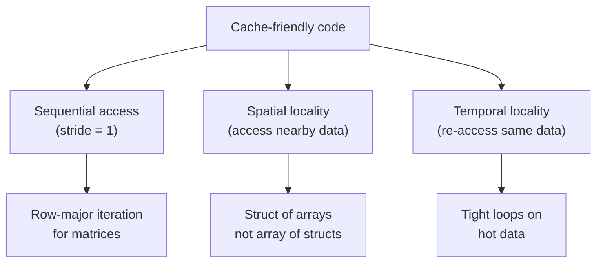

# Performance Profiling and Optimization

> [!summary] Goal
> Profile C programs to find bottlenecks, understand cache behavior, and apply optimizations. Use perf, Valgrind, and GCC builtins. Essential for: high-performance computing, game development, database engines, and kernel optimization.

## Table of Contents

1. [Profiling with perf](#profiling-with-perf)
2. [Micro-optimizations](#micro-optimizations)
3. [Cache-Friendly Programming](#cache-friendly-programming)
4. [GCC Builtins and Intrinsics](#gcc-builtins-and-intrinsics)
5. [Profile-Guided Optimization](#profile-guided-optimization)
6. [Pitfalls](#pitfalls)

---

## Profiling with perf

> [!info] perf
> Linux's perf subsystem uses hardware performance counters (CPU cycles, cache misses, branch mispredictions) to profile programs with minimal overhead. Unlike gprof (which requires instrumentation), perf uses CPU hardware counters — it adds near-zero overhead.

```bash
# Install perf (if not present)
sudo apt install linux-tools-common linux-tools-$(uname -r)

# Basic profiling
gcc -O2 -g program.c -o program        # Compile with -g for symbol names
perf stat ./program                     # Summary counters
perf record ./program                   # Profile and save
perf report                             # Interactive report (hot functions)

# Common perf events
perf stat -e cycles,instructions,cache-misses,cache-references,branches,branch-misses ./program

# Per-function breakdown
perf record -g ./program                # -g: call-graph (dwarf or fp)
perf report -g graph                    # Show call graph

# Annotate specific function
perf annotate process_data              # Show instruction-level breakdown

# Real-time monitoring
perf top -p PID                         # Live profiling of running process
```

### Interpreting perf output

```bash
# Example: perf stat output
#    5,000,000,000   cycles           # 3.4 GHz
#    2,000,000,000   instructions      # 0.40 insn per cycle
#      100,000,000   cache-misses      # 10% of cache references
#       20,000,000   branch-misses     # 2% of branches

# Key metrics:
# IPC (instructions per cycle): > 1 is good, < 0.5 is bad
# Cache miss rate: > 5% suggests optimization needed
# Branch miss rate: > 5% is high
```

---

## Micro-optimizations

### likely/unlikely (branch prediction hints)

```c
// GCC/Clang: __builtin_expect tells the compiler which branch is more likely
// The compiler arranges the assembly to optimize the likely path

#define likely(x)   __builtin_expect(!!(x), 1)
#define unlikely(x) __builtin_expect(!!(x), 0)

int process(int *ptr) {
    if (unlikely(ptr == NULL)) {          // Unlikely: NULL pointer rarely happens
        return -1;
    }
    // Normal path — optimized by compiler
    return *ptr * 2;
}
```

### restrict keyword

```c
// restrict tells the compiler that only this pointer references the memory
// Enables better optimization (no aliasing concerns)

void copy(int *restrict dest, const int *restrict src, size_t n) {
    for (size_t i = 0; i < n; i++) {
        dest[i] = src[i];     // Compiler can vectorize this
    }
}
// Without restrict: compiler assumes dest and src may overlap
// With restrict: can use SIMD, loop unrolling, etc.
```

### Loop optimizations

```c
// Loop unrolling — manual
void sum_array(const int *arr, size_t n, int *result) {
    int sum = 0;
    size_t i;

    // Process 4 elements per iteration
    for (i = 0; i + 3 < n; i += 4) {
        sum += arr[i] + arr[i+1] + arr[i+2] + arr[i+3];
    }
    // Handle remaining elements
    for (; i < n; i++) {
        sum += arr[i];
    }
    *result = sum;
}
// The compiler may do this automatically at -O3

// Loop-invariant code motion — move constant computations outside
for (int i = 0; i < n; i++) {
    // ❌ BAD: strlen called every iteration
    // buf[i] *= strlen("constant_string");

    // ✅ GOOD: compute once
    size_t len = strlen("constant_string");
    for (int i = 0; i < n; i++) {
        buf[i] *= len;
    }
}

// Strength reduction — replace expensive ops with cheaper ones
// ❌ x * 17 → slow (multiply)
// ✅ (x << 4) + x → faster (shift + add)
```

---

## Cache-Friendly Programming

> [!info] CPU cache
> Modern CPUs have L1 (~32KB, ~1ns), L2 (~256KB, ~3-5ns), L3 (~8-32MB, ~10-20ns) caches. Main memory takes ~100ns. A cache miss costs 10-50× more than a cache hit. Writing cache-friendly code is the single most impactful optimization.

### Memory access patterns



### Row-major vs column-major

```c
#define N 4096
int matrix[N][N];      // Row-major in C

// ✅ CACHE-FRIENDLY: iterate row by row (contiguous memory)
int sum_row_major(void) {
    int sum = 0;
    for (int i = 0; i < N; i++) {
        for (int j = 0; j < N; j++) {
            sum += matrix[i][j];     // Access: matrix[0][0], matrix[0][1], ...
        }
    }
    return sum;
}

// ❌ CACHE-UNFRIENDLY: iterate column by column (stride = N*4 bytes)
int sum_col_major(void) {
    int sum = 0;
    for (int j = 0; j < N; j++) {
        for (int i = 0; i < N; i++) {
            sum += matrix[i][j];     // Access: matrix[0][0], matrix[1][0], ...
        }
    }
    return sum;    // 10-50× SLOWER than row-major!
}
```

### Struct of Arrays (SoA) vs Array of Structs (AoS)

```c
// ❌ Array of Structs — poor cache usage (only one field needed)
typedef struct { int id; double score; char name[64]; } Student;

Student students[100000];
double sum = 0;
for (int i = 0; i < 100000; i++) {
    sum += students[i].score;     // Loads id, score, name — wastes cache!
}

// ✅ Struct of Arrays — only the needed data in cache
typedef struct {
    int *ids;
    double *scores;
    char **names;
} Students;

Students s;
double sum = 0;
for (int i = 0; i < 100000; i++) {
    sum += s.scores[i];           // Only scores in cache — efficient!
}
```

### Cache line alignment for false sharing prevention

```c
// False sharing: two threads access different variables on the same cache line
// Each write invalidates the cache line for the other thread
// Fix: align to cache line boundary

typedef struct {
    int value;
    char padding[60];              // Pad to 64 bytes (cache line)
} CacheAlignedCounter;

// Or with attribute
typedef struct __attribute__((aligned(64))) {
    int value;
} AlignedCounter;

CacheAlignedCounter counters[4];   // Each counter on its own cache line
// Thread 0 → counters[0].value, Thread 1 → counters[1].value (no false sharing)

// Without alignment: counters[0] and counters[1] may be on the same cache line
// Thread 0 and Thread 1 would invalidate each other's cache — 10-100× slower!
```

---

## GCC Builtins and Intrinsics

### Prefetch (software prefetch)

```c
// Hint to CPU to load data into cache before it's needed
// Prefetch addresses that the current pointer + stride will access

void process_with_prefetch(int *data, size_t n) {
    for (size_t i = 0; i < n; i++) {
        __builtin_prefetch(&data[i + 64], 0, 1);  // Read, medium temporal locality
        data[i] *= 2;
    }
}

// __builtin_prefetch(addr, rw, locality):
//   rw: 0 = read, 1 = write
//   locality: 0 = no temporal, 3 = high temporal (leave in L1/L2)
```

### Overflow checking

```c
// Check for signed overflow without UB
int safe_add(int a, int b, int *result) {
    if (__builtin_add_overflow(a, b, result)) {
        return -1;  // Overflow would occur
    }
    return 0;
}

// Also: __builtin_sub_overflow, __builtin_mul_overflow
```

### Population count (popcount)

```c
// Count set bits in an integer
int bits = __builtin_popcount(0xFF);          // 8 (returns int)
int bits64 = __builtin_popcountll(0xFFFF);    // 16 (unsigned long long)

// Count leading/trailing zeros
int lz = __builtin_clz(0x0FF00000);           // Leading zeros
int tz = __builtin_ctz(0x00100000);           // Trailing zeros

// These compile to a single CPU instruction (popcnt, bsf, bsr, etc.)
```

### Operation assertions

```c
// Tell the compiler about invariants (enables optimizations)
int process_value(int x) {
    __builtin_assume(x > 0);          // clang: x is always positive
    // Compiler can skip bounds checks, use signed division, etc.
    return 100 / x;
}
```

---

## Profile-Guided Optimization

> [!info] PGO
> Profile-Guided Optimization (PGO) compiles your program twice: first with instrumentation, then using the collected profile to guide optimization decisions (inline, function placement, branch layout).

```bash
# Step 1: Compile with instrumentation
gcc -O2 -fprofile-generate program.c -o program

# Step 2: Run with representative inputs (generates .gcda files)
./program < test_input.txt

# Step 3: Recompile using the profile
gcc -O2 -fprofile-use program.c -o program_fast

# Result: better branch prediction, inline decisions, cache layout
```

---

## Pitfalls

### Profiling unoptimized code

Don't profile `-O0` builds. Optimization changes code layout so much that -O0 results don't translate. Profile with the optimization level you'll ship (`-O2` or `-O3`).

### Micro-benchmark vs real-world

A micro-benchmark that tests a single function in a loop may be cache-hot and not representative of real-world usage where cache is cold. Always profile the full application.

### Premature optimization

Optimize only after profiling identifies the bottleneck. "Make it work, then make it right, then make it fast." Most code is not on the critical path — optimizing non-hot code wastes time and can make code harder to maintain.

### Ignoring the memory subsystem

CPUs are fast, memory is slow. Most bottlenecks are memory-bound, not CPU-bound. If your IPC (instructions per cycle) is low, focus on cache-friendly data structures, not micro-optimizations.

### PGO with unrepresentative input

Profile-guided optimization with wrong input data can make the program **slower**. Use production data or representative synthetic data for training.

---

> [!question]- Interview Questions
>
> **Q: What is the most impactful optimization in modern CPUs?**
> A: Cache-friendly data access patterns. A cache miss can cost 100-300 cycles while a cache hit costs 3-5 cycles. Optimizing memory access (sequential access, SoA vs AoS, cache line alignment) can give 10-50× speedups, while micro-optimizations typically give 1-20%. Profile first, then optimize the memory-bound bottlenecks.
>
> **Q: What is false sharing and how do you prevent it?**
> A: False sharing occurs when two threads write to different variables on the same cache line. The cache coherence protocol forces the cache line to ping-pong between cores, causing 10-100× slowdown. Fix: align shared variables to cache line boundaries (64 bytes) so each thread's data is on a different cache line. Use `__attribute__((aligned(64)))` or pad structs to 64 bytes.
>
> **Q: What does `__builtin_expect` do?**
> A: `likely()`/`unlikely()` wraps `__builtin_expect` to tell the compiler which branch is more likely. The compiler arranges the assembly so the likely path has fewer branch penalties (fall-through instead of taken). This matters in hot loops where branch mispredictions cost 10-20 cycles. On modern CPUs, the effect is modest, but for well-predicted branches it can help.
>
> **Q: Why is iterating a 2D array column-by-column slower than row-by-row in C?**
> A: C stores arrays in row-major order — `matrix[i][j]` has `matrix[i][0]` through `matrix[i][N-1]` contiguous in memory. Row-by-row iteration accesses sequential memory addresses (stride = 4 bytes), maximizing cache utilization (spatial locality). Column-by-column iteration jumps by row stride (N × 4 bytes), touching one element per cache line — most of the cache line is wasted.
>
> **Q: What is Profile-Guided Optimization and when would you use it?**
> A: PGO compiles the program twice. First, with instrumentation (`-fprofile-generate`) to collect runtime behavior (branch counts, function call counts, edge frequencies). Run with representative input. Then recompile with `-fprofile-use`, using the profile to guide inlining, branch layout, and basic block placement. Use PGO for: release builds of performance-critical software (game engines, databases, compilers) where you can provide representative training data.

---

## Cross-Links

- [[C/02_Core/07_Debugging_with_GDB]] for debugging performance issues
- [[C/03_Advanced/06_Memory_Alignment_and_Endianness]] for alignment and cache lines
- [[C/03_Advanced/01_Concurrency_with_Pthreads]] for false sharing in threaded code
- [[C/03_Advanced/07_Inline_Assembly_ABI_and_Calling_Conventions]] for CPUID instruction
- [[C/04_Playbooks/03_Valgrind_Leaks_and_Heap_Corruption]] for cache profiling with cachegrind
