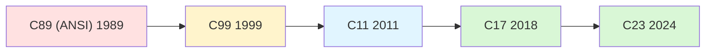

# C Standard Evolution (C89 → C99 → C11 → C17 → C23)

> [!summary] Goal
> Understand how the C language evolved across each ISO standard revision: what was added, what changed, what was deprecated, and how to write code that targets a specific standard version. Essential for maintaining legacy codebases, adopting modern C features, and writing portable code across compilers.

## Table of Contents

1. [Why Standard Versions Matter](#why-standard-versions-matter)
2. [C89 / ANSI C — The First Standard](#c89-ansi-c-the-first-standard)
3. [C99 — The First Major Revision](#c99-the-first-major-revision)
4. [C11 — Memory Model and Threads](#c11-memory-model-and-threads)
5. [C17 — Defect Fixes Only](#c17-defect-fixes-only)
6. [C23 — The Modern Revision](#c23-the-modern-revision)
7. [Feature Availability Across Standards](#feature-availability-across-standards)
8. [Pitfalls](#pitfalls)

---

## Why Standard Versions Matter

C has been standardized five times: C89, C99, C11, C17, and C23. Each revision adds features but also changes the language in ways that matter for portability:

- **Legacy code** may rely on C89-only idioms that are deprecated in later standards
- **Embedded compilers** may only support C89 or C99
- **Modern C** (C23) adds keywords (`bool`, `true`, `false`, `typeof`) that could conflict with existing code
- **Compiler flags** determine which standard is used (`-std=c11`, `-std=gnu11`, `-std=c2x`)



---

## C89 / ANSI C — The First Standard

> [!info] ANSI C (1989) / ISO C (1990)
> The first standard C specification. Defined the language that most legacy C code is written in. Nearly all modern C compilers still support C89 (though C99+ features may not be available in strict C89 mode).

### Key features introduced in C89

```text
  - Function prototypes (before C89, functions were declared without parameter lists)
  - void type and void* pointer
  - const and volatile type qualifiers
  - signed and unsigned qualifiers
  - struct assignment (copy entire struct with =)
  - enum types
  - #pragma directive (implementation-defined)
  - Standard library: <stdio.h>, <stdlib.h>, <string.h>, <math.h>, <ctype.h>, etc.
  - Preprocessor: #elif, stringizing (#), token pasting (##)
  - Trigraphs (removed in C23)

Compile with: gcc -std=c89 -pedantic program.c
```

### C89 today

```c
// C89 idiom: all declarations at top of block
int func(void) {
    int i;
    int result = 0;

    for (i = 0; i < 10; i++) {
        result += i;
    }
    return result;
}

// C89 does NOT allow:
//   - for (int i = 0; ...)  — declaration in for (C99+)
//   - // comments (C99+)
//   - <stdint.h> (C99+)
```

---

## C99 — The First Major Revision

> [!info] ISO C99
> A major update that added significant language features and library improvements. C99 was the first standard to introduce: long long, variable-length arrays, designated initializers, compound literals, inline functions, `restrict`, and many new library headers.

### Key features

```text
Language features:
  - long long, unsigned long long (64-bit integer types)
  - _Bool (boolean type)
  - Complex types (_Complex, float _Complex)
  - Variable-length arrays (VLAs)
  - Flexible array members (struct hack standardized)
  - Designated initializers: struct {.x = 1, .y = 2}
  - Compound literals: (struct Point){10, 20}
  - Inline functions: inline int max(int a, int b) { return a > b ? a : b; }
  - restrict keyword (optimization hint for alias-free pointers)
  - Declarations anywhere in a block (not just at the top)
  - // comments (C++ style)
  - Variadic macros: #define debug(fmt, ...) fprintf(stderr, fmt, __VA_ARGS__)
  - _Pragma operator

Library additions:
  - <stdint.h> (fixed-width integer types)
  - <inttypes.h> (PRI/SCN format macros)
  - <stdbool.h> (_Bool → bool, true, false)
  - <complex.h> (complex arithmetic)
  - <fenv.h> (floating-point environment)
  - <tgmath.h> (type-generic math)
  - <stdarg.h> (va_copy added)
  - snprintf, vsnprintf (bounded string formatting)
  - strftime improvements
```

### C99 example

```c
// -std=c99

#include <stdint.h>
#include <stdio.h>

int main(void) {
    // Declare anywhere
    for (int i = 0; i < 10; i++) {
        // Designated initializer
        struct { int x; int y; } point = {.x = i, .y = i * 2};
        printf("(%d, %d)\n", point.x, point.y);
    }
    return 0;
}
```

---

## C11 — Memory Model and Threads

> [!info] ISO C11
> C11's biggest addition was a formal **memory model** and **threading support**, making C a viable language for concurrent and parallel programming without relying on POSIX. It also deprecated gets(), added _Generic, and made VLAs optional.

### Key features

```text
Language features:
  - _Generic (type-generic selection)
  - _Static_assert (compile-time assertions)
  - _Alignas, _Alignof (alignment control)
  - _Noreturn (non-returning functions)
  - _Atomic (atomic types and operations)
  - Unicode: char16_t, char32_t (in <uchar.h>)
  - Anonymous structs and unions
  - Multithreading: <threads.h>
  - Memory model: <stdatomic.h>
  - gets() removed (it was already deprecated by C99)

Library additions:
  - <threads.h> (thread creation, mutexes, condition variables, TSS)
  - <stdatomic.h> (atomic operations with memory ordering)
  - <uchar.h> (char16_t, char32_t conversion functions)
  - <stdalign.h> (alignas, alignof macros)
  - <stdnoreturn.h> (_Noreturn → noreturn macro)
  - timespec_get() in <time.h>
  - fopen() exclusive mode "x"
  - strtol, strtoll improvements
```

### C11 memory model

```c
// C11 introduced a formal memory model (like C++11's) for atomics.
// Before C11, concurrent access to shared variables was undefined behavior.

#include <stdatomic.h>
#include <threads.h>

atomic_int counter = ATOMIC_VAR_INIT(0);

int worker(void *arg) {
    for (int i = 0; i < 1000000; i++) {
        atomic_fetch_add(&counter, 1);
    }
    return 0;
}
```

---

## C17 — Defect Fixes Only

> [!info] ISO C17
> C17 (also called C18) is a minor revision that only fixes defects in C11. No new language features or library functions were added. C17 is to C11 what C++14 is to C++11 — a bug-fix release.

### What changed in C17

```text
  - No new features
  - Defect reports addressed (DR 400–481)
  - Clarified that the C11 standard's behavior for some edge cases
  - Improved consistency in the specification
  - Some undefined behaviors were better specified
  - Made VLAs conditional feature (already optional in C11)
```

---

## C23 — The Modern Revision

> [!info] ISO C23
> C23 is the most significant C revision since C99. It adds keywords for `bool`, `true`, `false`, `typeof`, `nullptr`, `auto`, `char8_t`, `#embed`, attributes (`[[nodiscard]]`, `[[fallthrough]]`, `[[maybe_unused]]`, `[[noreturn]]`), `_BitInt`, `stdckdint.h` for checked arithmetic, and many library improvements.

### Key features

```text
Language features:
  - bool, true, false become KEYWORDS (no longer need <stdbool.h>)
  - typeof and typeof_unqual (type deduction, previously GNU extension)
  - nullptr_t and nullptr (null pointer constant, not just ((void*)0))
  - auto keyword for type deduction (like C++ auto — distinct from C's old storage-class auto)
  - char8_t (UTF-8 code unit), u8 string literals standardized
  - #embed (binary resource inclusion at compile time)
  - #elifdef, #elifndef (preprocessor directives)
  - __VA_OPT__ (conditional variadic expansion)
  - _BitInt(N) (arbitrary-precision integer types)
  - Attributes: [[nodiscard]], [[fallthrough]], [[maybe_unused]], [[noreturn]], [[deprecated]]
  - constexpr (constant expressions)
  - Label at end of compound statement (no need for empty statement)
  - Comma in enum trailing values allowed
  - Most deprecated features removed (trigraphs, some old library functions)

Library additions:
  - <stdckdint.h> (checked integer arithmetic: ckd_add, ckd_sub, ckd_mul)
  - <stdbit.h> (bit manipulation: stdc_bit_ceil, stdc_bit_floor, stdc_count_ones, etc.)
  - memccpy, strdup, strndup standardized (from POSIX)
  - timespec_getres (get resolution of a clock)
  - mbrtoc8, c8rtomb (UTF-8 conversion functions)
  - Digital exponent in floating-point literals (0x1.0p-3)

Removed in C23:
  - Trigraphs (?? sequences)
  - gets() (removed from standard — already removed from C11)
```

### C23 examples

```c
// C23: bool, true, false are keywords
bool is_ready = true;           // No #include <stdbool.h> needed

// C23: typeof
typeof(1 + 2) x = 42;          // x is int

// C23: nullptr
void *ptr = nullptr;            // Type safe null — not convertible to int

// C23: #embed (compile-time resource inclusion)
// const unsigned char icon_data[] = {
//     #embed "icon.png"      // Binary content at compile time
// };

// C23: attributes
[[nodiscard]] int must_check(void) { return 42; }
[[maybe_unused]] int unused_var;

// C23: auto for type deduction
auto result = must_check();     // result is int

// C23: checked arithmetic
#include <stdckdint.h>
int r;
if (ckd_add(&r, INT_MAX, 1)) {
    // Overflow detected!
}

// C23: _BitInt
_BitInt(17) exact_17_bit = 0;   // Exactly 17 bits

// C23: #elifdef
#ifdef FEATURE_A
// ...
#elifdef FEATURE_B   // Instead of: #elif defined(FEATURE_B)
// ...
#endif
```

---

## Feature Availability Across Standards

| Feature | C89 | C99 | C11 | C17 | C23 |
|:--------|:---:|:---:|:---:|:---:|:---:|
| Function prototypes | ✅ | ✅ | ✅ | ✅ | ✅ |
| `//` comments | ❌ | ✅ | ✅ | ✅ | ✅ |
| `long long` | ❌ | ✅ | ✅ | ✅ | ✅ |
| `_Bool` / `bool` | ❌ | ✅ (macro) | ✅ (macro) | ✅ (macro) | ✅ (keyword) |
| `//` comments | ❌ | ✅ | ✅ | ✅ | ✅ |
| `inline` functions | ❌ | ✅ | ✅ | ✅ | ✅ |
| `restrict` | ❌ | ✅ | ✅ | ✅ | ✅ |
| Designated initializers | ❌ | ✅ | ✅ | ✅ | ✅ |
| Compound literals | ❌ | ✅ | ✅ | ✅ | ✅ |
| Variable-length arrays | ❌ | ✅ | Optional | Optional | Conditional |
| `<stdint.h>` fixed-width types | ❌ | ✅ | ✅ | ✅ | ✅ |
| `snprintf` | ❌ | ✅ | ✅ | ✅ | ✅ |
| `_Generic` | ❌ | ❌ | ✅ | ✅ | ✅ |
| `_Static_assert` | ❌ | ❌ | ✅ | ✅ | ✅ |
| `_Atomics` / `<stdatomic.h>` | ❌ | ❌ | ✅ | ✅ | ✅ |
| `<threads.h>` | ❌ | ❌ | Optional | Optional | ✅ |
| `<uchar.h>` / `char16_t` | ❌ | ❌ | ✅ | ✅ | ✅ |
| `timespec_get` | ❌ | ❌ | ✅ | ✅ | ✅ |
| `__VA_OPT__` | ❌ | ❌ | ❌ | ❌ | ✅ |
| `#embed` | ❌ | ❌ | ❌ | ❌ | ✅ |
| `typeof` | ❌ | ❌ | ❌ | ❌ | ✅ |
| `nullptr` / `nullptr_t` | ❌ | ❌ | ❌ | ❌ | ✅ |
| `[[attributes]]` | ❌ | ❌ | ❌ | ❌ | ✅ |
| `auto` type deduction | ❌ | ❌ | ❌ | ❌ | ✅ |
| `_BitInt(N)` | ❌ | ❌ | ❌ | ❌ | ✅ |
| `<stdckdint.h>` | ❌ | ❌ | ❌ | ❌ | ✅ |
| `<stdbit.h>` | ❌ | ❌ | ❌ | ❌ | ✅ |

### Compiler flags

```bash
# GCC / Clang standard selection
gcc -std=c89 program.c          # C89 with GNU extensions
gcc -std=c99 program.c          # C99
gcc -std=c11 program.c          # C11
gcc -std=c17 program.c          # C17 (also -std=c18, same specification)
gcc -std=c23 program.c          # C23 (also -std=c2x in draft stages)

# Strict standard mode (disables GNU extensions)
gcc -std=c11 -pedantic program.c    # Warns about extensions
gcc -std=c11 -pedantic-errors program.c  # Errors on extensions

# GNU mode: -std=gnu11 (default) — C11 with GNU extensions
gcc program.c                   # Default: gnu17 (or gnu11 on older GCC)
```

---

## Pitfalls

### Mixing C89 and C99+ idioms in the same file

Code that mixes `//` comments (C99) with K&R-style function declarations (C89) may not compile under strict C89 mode. Always pick a standard version and stick to it within a file.

### `//` comments in C89 mode

GCC accepts `//` comments even in C89 mode (as an extension). To catch this, use `-std=c89 -pedantic`. Clang's `-Weverything` also catches it.

### VLAs changed from required (C99) to optional (C11) to conditional (C23)

VLAs were mandatory in C99 (all compilers had to support them). In C11 they became optional. In C23 they're a conditional feature. Code using VLAs may not compile on all C11 or C23 implementations. Prefer `alloca` or `malloc` for portable code.

### `bool` is a macro in C11, a keyword in C23

In C11: `#include <stdbool.h>` defines `bool` as `_Bool`. In C23: `bool` is a keyword. Code that `#define bool int` or `#undef bool` will break under C23. Code that uses `bool` without `#include <stdbool.h>` will work in C23 but not in C11.

---

## Cross-Links

- [[C/01_Foundations/01_C_Basics_and_Pointers]] for fundamental types across standards
- [[C/01_Foundations/11_Generic_and_Type_Generic_Programming]] for _Generic (C11)
- [[C/01_Foundations/10_Standard_Library_Utilities]] for stdbit.h and stdckdint.h (C23)
- [[C/03_Advanced/02_C11_Atomics_and_Memory_Model]] for stdatomic.h (C11)
- [[C/03_Advanced/10_C11_Threads_and_Threads_H]] for threads.h (C11)
- [[C/03_Advanced/09_GNU_C_Extensions_and_Compiler_Attributes]] for typeof, auto (GNU → C23)
