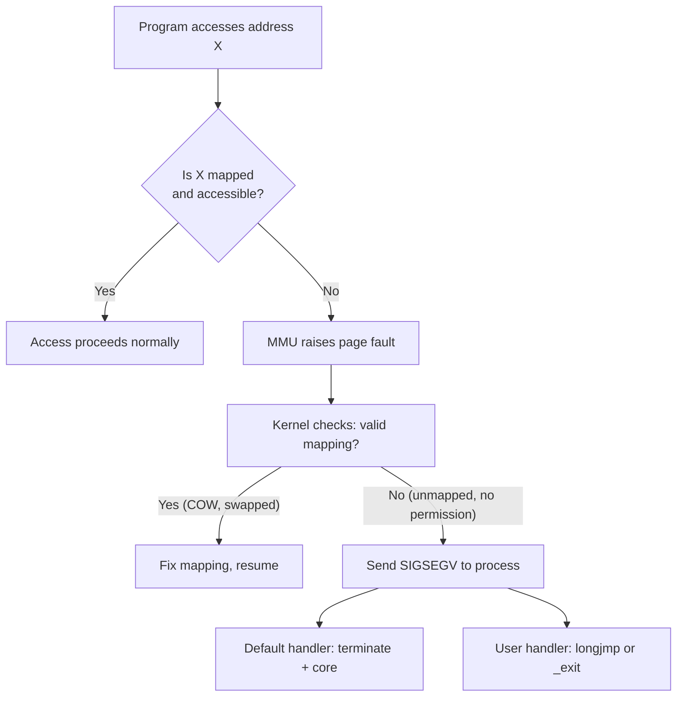

# Playbook: Debug Segfaults and Invalid Memory Access

> [!summary] Goal
> Systematically debug segmentation faults and invalid memory accesses. Understand what causes a segfault (page fault → SIGSEGV), how to analyze crash sites with GDB, and how to identify common memory access patterns that go wrong.

## Table of Contents

1. [What Is a Segfault?](#what-is-a-segfault)
2. [Crash Investigation](#crash-investigation)
3. [Root Cause Patterns](#root-cause-patterns)
4. [Prevention](#prevention)

---

## What Is a Segfault?

> [!info] Segmentation fault
> A segfault (SIGSEGV) occurs when a program accesses memory it's not allowed to access. The MMU detects the violation (page fault), the kernel sends SIGSEGV, and the default handler terminates the process (optionally with a core dump). The address that caused the fault and the access type (read/write/execute) are recorded.



### SIGSEGV vs SIGBUS

| Signal | Cause | Typical address |
|--------|-------|:---------------:|
| **SIGSEGV** | Accessing unmapped memory, or writing to read-only memory | Invalid address or valid with wrong permissions |
| **SIGBUS** | Unaligned access (ARM), or mmap beyond file end | Valid address, but hardware can't access |

---

## Crash Investigation

### Step 1: Get a stack trace

```bash
# Compile with debug symbols
gcc -g -O0 program.c -o program

# Run under GDB
gdb ./program
(gdb) run
# ... wait for crash ...
(gdb) bt                     # Backtrace
(gdb) bt full                # Backtrace with local variables
(gdb) info registers         # CPU state at crash
(gdb) frame 0                # Go to crash frame
(gdb) list                   # Show source around crash
```

### Step 2: Analyze a core dump

```bash
# Enable core dumps
ulimit -c unlimited          # Set before running

# Run the program until it crashes
./program
# Segmentation fault (core dumped)

# Analyze
gdb ./program core
(gdb) bt
(gdb) frame 0
(gdb) info locals
(gdb) print variable         # Inspect values
(gdb) x/20x $rsp             # Examine stack memory around crash
```

### Step 3: Read the crash site

```bash
(gdb) bt
#0  0x0000555555554712 in process_data (arr=0x0, n=100) at program.c:23
#1  0x00005555555546a0 in main () at program.c:45

# The crash is at program.c:23 in process_data, called from main at line 45
# arr is NULL — dereferencing a NULL pointer

(gdb) frame 0
(gdb) info locals
# arr = 0x0                     ← NULL pointer — the problem!
# n = 100
(gdb) print arr[0]              # Confirms: "Cannot access memory at address 0x0"
```

---

## Root Cause Patterns

### NULL pointer dereference

```c
int *p = NULL;
*p = 5;                     // SIGSEGV: address 0x0

// Fix: check before dereference
if (p) { *p = 5; }
```

### Buffer overflow (stack)

```c
void func(void) {
    int buf[10];
    buf[10] = 42;           // Writes past end — corrupts adjacent locals or return address
}
// This may not crash immediately — it corrupts the stack and crashes on return
// Signature: crash at a RETURN instruction, not at the overflow site
```

### Buffer overflow (heap)

```c
int *arr = malloc(10 * sizeof(int));
arr[15] = 42;               // Writes past heap chunk — corrupts heap metadata
free(arr);                  // Crash in free() — heap metadata corrupted
// Signature: crash in malloc/free/realloc with "invalid pointer" or "corrupted double-linked list"
```

### Use-after-free

```c
int *p = malloc(100);
free(p);
*p = 42;                    // Writing to freed memory
// Signature: crash at an apparently valid address, with corrupt data
// The memory may have been reallocated to something else
```

### Stack overflow

```c
void recurse(void) {
    char big[1024 * 1024];  // Total stack usage exceeds limit
    recurse();              // Each call adds ~1 MB to the stack
}
// Signature: crash at a low address (bottom of stack), often in a recursive function
```

---

## Prevention

| Technique | What it catches | How |
|-----------|----------------|-----|
| **Bounds-checked functions** | Buffer overflows | Use `snprintf` not `sprintf`, `strncpy` not `strcpy` |
| **NULL checks** | NULL dereferences | Check pointers before use |
| **Set to NULL after free** | Use-after-free | `free(p); p = NULL;` |
| **Stack canaries** | Stack buffer overflow | `-fstack-protector-strong` |
| **ASan** | Buffer overflow, use-after-free | `-fsanitize=address` |
| **UBSan** | Undefined behavior | `-fsanitize=undefined` |

---

## Cross-Links

- [[C/02_Core/07_Debugging_with_GDB]] for GDB commands reference
- [[C/02_Core/06_Undefined_Behavior_and_Memory_Safety]] for UB sources
- [[C/04_Playbooks/02_Use_Sanitizers_ASan_UBSan_TSan]] for sanitizer usage
- [[C/04_Playbooks/03_Valgrind_Leaks_and_Heap_Corruption]] for heap debugging
- [[C/02_Core/04_Data_Structures_in_C]] for data structure memory issues
