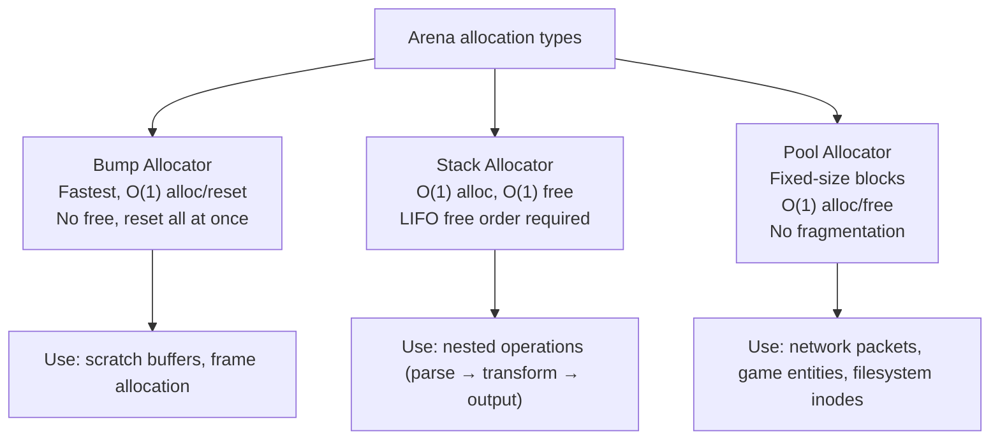

# Project: Build a Memory Arena Allocator

> [!summary] Goal
> Build a complete arena allocator system with bump allocation, stack-allocator (LIFO), and pool allocator (fixed-size). Understand how custom allocators work inside OS kernels, game engines, and high-performance systems.

## Table of Contents

1. [Design Overview](#design-overview)
2. [Bump Allocator](#bump-allocator)
3. [Stack Allocator](#stack-allocator)
4. [Pool Allocator](#pool-allocator)
5. [Usage Patterns](#usage-patterns)
6. [Pitfalls](#pitfalls)

---

## Design Overview



### Common interface

```c
typedef struct Arena Arena;

// Allocate memory from the arena
void *arena_alloc(Arena *arena, size_t size);

// Reset all allocations (for bump/stack)
void arena_reset(Arena *arena);

// Free a specific allocation (for pool/stack)
void arena_free(Arena *arena, void *ptr);

// Destroy arena, free all underlying memory
void arena_destroy(Arena *arena);
```

---

## Bump Allocator

```c
#include <stdint.h>
#include <stdlib.h>
#include <string.h>

#define ARENA_ALIGNMENT 16

typedef struct {
    char *start;
    char *current;
    size_t capacity;
} BumpArena;

static size_t align_up(size_t size, size_t alignment) {
    return (size + alignment - 1) & ~(alignment - 1);
}

BumpArena *bump_create(size_t capacity) {
    BumpArena *a = malloc(sizeof(BumpArena));
    if (!a) return NULL;
    a->start = malloc(capacity);
    if (!a->start) { free(a); return NULL; }
    a->current = a->start;
    a->capacity = capacity;
    return a;
}

void *bump_alloc(BumpArena *a, size_t size) {
    size = align_up(size, ARENA_ALIGNMENT);
    if (a->current + size > a->start + a->capacity) return NULL;
    void *ptr = a->current;
    a->current += size;
    return ptr;
}

void *bump_alloc_zero(BumpArena *a, size_t size) {
    void *ptr = bump_alloc(a, size);
    if (ptr) memset(ptr, 0, size);
    return ptr;
}

void bump_reset(BumpArena *a) {
    a->current = a->start;
}

void bump_destroy(BumpArena *a) {
    free(a->start);
    free(a);
}
```

---

## Stack Allocator

The stack allocator supports LIFO-style free using a marker:

```c
typedef struct {
    char *start;
    char *current;
    size_t capacity;
} StackArena;

StackArena *stack_create(size_t capacity) {
    StackArena *a = malloc(sizeof(StackArena));
    if (!a) return NULL;
    a->start = malloc(capacity);
    if (!a->start) { free(a); return NULL; }
    a->current = a->start;
    a->capacity = capacity;
    return a;
}

void *stack_alloc(StackArena *a, size_t size) {
    size = align_up(size, ARENA_ALIGNMENT);
    if (a->current + size > a->start + a->capacity) return NULL;
    void *ptr = a->current;
    a->current += size;
    return ptr;
}

// Save current position for later restore
size_t stack_marker(StackArena *a) {
    return (size_t)(a->current - a->start);
}

// Free back to a marker (LIFO — free most recently allocated first)
void stack_free_to(StackArena *a, size_t marker) {
    a->current = a->start + marker;
}

void stack_reset(StackArena *a) {
    a->current = a->start;
}

void stack_destroy(StackArena *a) {
    free(a->start);
    free(a);
}
```

### Stack marker usage

```c
StackArena *scratch = stack_create(1024 * 1024);  // 1 MB scratch

void parse_and_transform(const char *input) {
    size_t mark = stack_marker(scratch);           // Save position

    char *copy = stack_alloc(scratch, strlen(input) + 1);
    strcpy(copy, input);
    // ... parse ...

    char *output = stack_alloc(scratch, 4096);
    // ... transform ...

    stack_free_to(scratch, mark);                  // Free everything back
    // stack_alloc'd memory above 'mark' is now reusable
}
```

---

## Pool Allocator

```c
typedef struct PoolBlock {
    struct PoolBlock *next;
} PoolBlock;

typedef struct {
    PoolBlock *free_list;
    size_t block_size;
    void *arena_start;
    size_t arena_size;
} Pool;

Pool *pool_create(size_t block_size, size_t block_count) {
    Pool *p = malloc(sizeof(Pool));
    if (!p) return NULL;

    p->block_size = (block_size >= sizeof(PoolBlock))
                    ? block_size : sizeof(PoolBlock);
    p->arena_size = p->block_size * block_count;
    p->arena_start = malloc(p->arena_size);
    if (!p->arena_start) { free(p); return NULL; }

    // Build free list
    p->free_list = NULL;
    char *ptr = (char *)p->arena_start;
    for (size_t i = 0; i < block_count; i++) {
        PoolBlock *block = (PoolBlock *)(ptr + i * p->block_size);
        block->next = p->free_list;
        p->free_list = block;
    }
    return p;
}

void *pool_alloc(Pool *p) {
    if (!p->free_list) return NULL;
    PoolBlock *block = p->free_list;
    p->free_list = block->next;
    memset(block, 0, p->block_size);     // Zero-initialized
    return (void *)block;
}

void pool_free(Pool *p, void *ptr) {
    if (!ptr) return;
    PoolBlock *block = (PoolBlock *)ptr;
    block->next = p->free_list;
    p->free_list = block;
}

void pool_destroy(Pool *p) {
    free(p->arena_start);
    free(p);
}
```

### Pool usage

```c
typedef struct {
    int id;
    char name[64];
    double balance;
} Account;

Pool *account_pool = pool_create(sizeof(Account), 1000);

// Allocate — O(1), no malloc overhead
Account *acc = (Account *)pool_alloc(account_pool);
acc->id = 42;
strcpy(acc->name, "Alice");

// Free — O(1), returns to free list
pool_free(account_pool, acc);
```

---

## Usage Patterns

### Scoped allocations (game engine style)

```c
// Each frame: reset the arena, allocate everything for the frame

BumpArena *frame_arena = bump_create(64 * 1024 * 1024);  // 64 MB

while (running) {
    bump_reset(frame_arena);              // Reclaim ALL frame memory

    Mesh *mesh = bump_alloc(frame_arena, sizeof(Mesh));
    Vertex *verts = bump_alloc(frame_arena, num_verts * sizeof(Vertex));
    // ... build frame ...

    // No free() needed — arena_reset handles everything
}

bump_destroy(frame_arena);
```

### Nested operations (stack allocator)

```c
void process_file(const char *path) {
    size_t mark = stack_marker(scratch);

    char *content = read_file_into_arena(path, scratch);
    ParsedDoc *doc = parse_document(content, scratch);
    HtmlOutput *html = render_to_html(doc, scratch);

    write_output(html);
    stack_free_to(scratch, mark);          // All temp memory reclaimed
}
```

---

## Pitfalls

### Cannot free individual allocations in bump allocator

Bump allocators only support reset-all-at-once. If you need per-allocation free, use pool allocator (same size) or stack allocator (LIFO order).

### Pool allocator memory waste

If blocks are much larger than needed, memory is wasted. If blocks are too small, allocations fail. Tune block size to the exact struct size.

### Thread safety

None of these allocators are thread-safe. For multi-threaded use, give each thread its own arena, or add a mutex (defeating the purpose of fast allocation).

### Alignment

All pointers returned by these allocators are aligned to ARENA_ALIGNMENT (16 bytes). For SIMD (32-byte alignment) or page (4096-byte) alignment, adjust `align_up` accordingly.

---

## Cross-Links

- [[C/01_Foundations/03_Dynamic_Memory]] for malloc internals and comparison
- [[C/01_Foundations/02_Memory_Model_and_Allocation]] for memory segments
- [[C/02_Core/04_Data_Structures_in_C]] for data structures using arenas
- [[C/03_Advanced/06_Memory_Alignment_and_Endianness]] for alignment requirements
- [[C/05_Projects/02_HTTP_Server_Minimal]] for arena usage in network server
