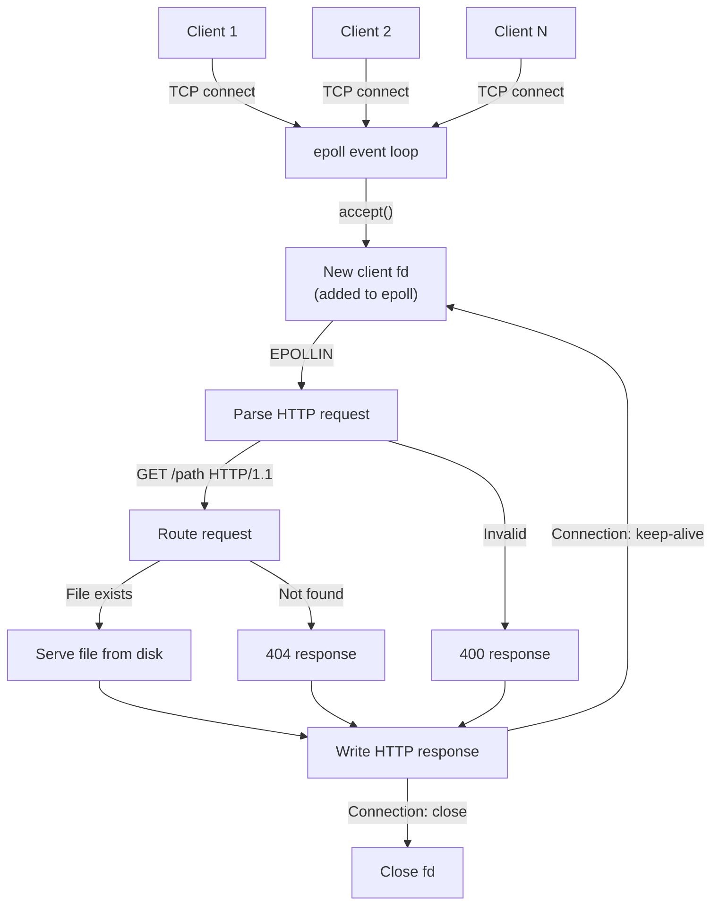

# Project: Build an HTTP Server from Scratch

> [!summary] Goal
> Build a functional HTTP/1.1 server using sockets and epoll. Handle multiple concurrent connections, parse HTTP requests, serve files from disk, and produce proper HTTP responses. This is the foundation for understanding web servers (nginx, Apache) and network services.

## Table of Contents

1. [Architecture Overview](#architecture-overview)
2. [Core Event Loop](#core-event-loop)
3. [HTTP Request Parsing](#http-request-parsing)
4. [Response Generation](#response-generation)
5. [Pitfalls](#pitfalls)

---

## Architecture Overview



---

## Core Event Loop

```c
#include <stdio.h>
#include <stdlib.h>
#include <string.h>
#include <unistd.h>
#include <fcntl.h>
#include <sys/epoll.h>
#include <sys/socket.h>
#include <netinet/in.h>
#include <arpa/inet.h>

#define PORT 8080
#define MAX_EVENTS 1024
#define BUFFER_SIZE 4096

int set_nonblocking(int fd) {
    int flags = fcntl(fd, F_GETFL, 0);
    return fcntl(fd, F_SETFL, flags | O_NONBLOCK);
}

int create_server_socket(int port) {
    int fd = socket(AF_INET, SOCK_STREAM | SOCK_NONBLOCK, 0);
    if (fd < 0) { perror("socket"); return -1; }

    int opt = 1;
    setsockopt(fd, SOL_SOCKET, SO_REUSEADDR, &opt, sizeof(opt));

    struct sockaddr_in addr = {
        .sin_family = AF_INET,
        .sin_addr.s_addr = INADDR_ANY,
        .sin_port = htons(port)
    };

    if (bind(fd, (struct sockaddr *)&addr, sizeof(addr)) < 0) {
        perror("bind"); close(fd); return -1;
    }

    if (listen(fd, SOMAXCONN) < 0) {
        perror("listen"); close(fd); return -1;
    }
    return fd;
}

void handle_client(int client_fd) {
    char buf[BUFFER_SIZE];
    ssize_t n = read(client_fd, buf, sizeof(buf) - 1);
    if (n <= 0) { close(client_fd); return; }
    buf[n] = '\0';

    // Parse request — extract method, path
    char method[16], path[256], version[16];
    if (sscanf(buf, "%15s %255s %15s", method, path, version) != 3) {
        const char *bad = "HTTP/1.1 400 Bad Request\r\nContent-Length: 11\r\n\r\nBad Request";
        write(client_fd, bad, strlen(bad));
        close(client_fd);
        return;
    }

    // Generate response
    char response[BUFFER_SIZE];
    int len;

    if (strcmp(path, "/") == 0) {
        len = snprintf(response, sizeof(response),
            "HTTP/1.1 200 OK\r\n"
            "Content-Type: text/html\r\n"
            "Content-Length: 59\r\n"
            "Connection: close\r\n"
            "\r\n"
            "<html><body><h1>Hello from C!</h1></body></html>");
    } else {
        len = snprintf(response, sizeof(response),
            "HTTP/1.1 404 Not Found\r\n"
            "Content-Length: 13\r\n"
            "Connection: close\r\n"
            "\r\n"
            "404 Not Found");
    }

    write(client_fd, response, len);
    close(client_fd);
}

int main(void) {
    int server_fd = create_server_socket(PORT);
    if (server_fd < 0) return 1;

    int epoll_fd = epoll_create1(0);
    struct epoll_event ev = { .events = EPOLLIN, .data.fd = server_fd };
    epoll_ctl(epoll_fd, EPOLL_CTL_ADD, server_fd, &ev);

    printf("Server listening on http://localhost:%d\n", PORT);

    struct epoll_event events[MAX_EVENTS];

    while (1) {
        int nfds = epoll_wait(epoll_fd, events, MAX_EVENTS, -1);
        for (int i = 0; i < nfds; i++) {
            if (events[i].data.fd == server_fd) {
                // New connection
                struct sockaddr_in client_addr;
                socklen_t client_len = sizeof(client_addr);
                int client_fd = accept(server_fd,
                    (struct sockaddr *)&client_addr, &client_len);
                if (client_fd < 0) continue;

                set_nonblocking(client_fd);
                struct epoll_event cev = {
                    .events = EPOLLIN | EPOLLONESHOT,
                    .data.fd = client_fd
                };
                epoll_ctl(epoll_fd, EPOLL_CTL_ADD, client_fd, &cev);
            } else {
                handle_client(events[i].data.fd);
            }
        }
    }

    close(server_fd);
    close(epoll_fd);
    return 0;
}
```

---

## HTTP Request Parsing

```c
typedef struct {
    char method[16];
    char path[256];
    char version[16];
    int major_version;
    int minor_version;
    struct {
        char name[64];
        char value[256];
    } headers[64];
    int header_count;
    char *body;
    size_t body_length;
} HttpRequest;

int parse_request_line(HttpRequest *req, const char *line) {
    // GET /path HTTP/1.1
    return sscanf(line, "%15s %255s %15s",
                  req->method, req->path, req->version) == 3;
}

int parse_headers(HttpRequest *req, const char *buf, size_t len) {
    // Split on \r\n\r\n, parse each header line
    const char *header_end = strstr(buf, "\r\n\r\n");
    if (!header_end) return -1;    // Incomplete headers

    const char *line = buf;
    // Skip request line
    line = strchr(line, '\n');
    if (!line) return -1;
    line++;

    while (line < header_end) {
        if (sscanf(line, "%63[^:]: %255[^\r\n]",
                   req->headers[req->header_count].name,
                   req->headers[req->header_count].value) == 2) {
            req->header_count++;
        }
        line = strchr(line, '\n');
        if (!line) break;
        line++;
    }

    req->body = (char *)(header_end + 4);
    req->body_length = len - (req->body - buf);
    return 0;
}
```

---

## Response Generation

```c
typedef struct {
    int status_code;
    const char *status_text;
    const char *content_type;
    const char *body;
    size_t body_length;
} HttpResponse;

int send_response(int client_fd, HttpResponse *resp) {
    char header[4096];
    int header_len = snprintf(header, sizeof(header),
        "HTTP/1.1 %d %s\r\n"
        "Content-Type: %s\r\n"
        "Content-Length: %zu\r\n"
        "Connection: close\r\n"
        "\r\n",
        resp->status_code, resp->status_text,
        resp->content_type,
        resp->body_length);

    // Write header
    write(client_fd, header, header_len);

    // Write body
    if (resp->body_length > 0) {
        write(client_fd, resp->body, resp->body_length);
    }
    return 0;
}

// Serve a file from disk
int serve_file(int client_fd, const char *path) {
    // Security: prevent directory traversal
    if (strstr(path, "..")) {
        HttpResponse not_found = {
            .status_code = 404,
            .status_text = "Not Found",
            .content_type = "text/plain",
            .body = "Not Found", .body_length = 9
        };
        return send_response(client_fd, &not_found);
    }

    FILE *fp = fopen(path + 1, "rb");  // Skip leading /
    if (!fp) {
        HttpResponse not_found = {
            .status_code = 404,
            .status_text = "Not Found",
            .content_type = "text/plain",
            .body = "Not Found", .body_length = 9
        };
        return send_response(client_fd, &not_found);
    }

    fseek(fp, 0, SEEK_END);
    long file_size = ftell(fp);
    fseek(fp, 0, SEEK_SET);

    char *content = malloc(file_size);
    fread(content, 1, file_size, fp);
    fclose(fp);

    // Determine content type from extension
    const char *ext = strrchr(path, '.');
    const char *content_type = "text/plain";
    if (ext) {
        if (strcmp(ext, ".html") == 0) content_type = "text/html";
        else if (strcmp(ext, ".css") == 0) content_type = "text/css";
        else if (strcmp(ext, ".js") == 0) content_type = "application/javascript";
        else if (strcmp(ext, ".png") == 0) content_type = "image/png";
        else if (strcmp(ext, ".json") == 0) content_type = "application/json";
    }

    HttpResponse resp = {
        .status_code = 200,
        .status_text = "OK",
        .content_type = content_type,
        .body = content,
        .body_length = file_size
    };
    send_response(client_fd, &resp);
    free(content);
    return 0;
}
```

---

## Pitfalls

### Not setting SO_REUSEADDR

Without `SO_REUSEADDR`, restarting the server fails with "Address already in use" for minutes (TIME_WAIT state on the socket).

### Blocking accept

The server should use non-blocking I/O or epoll edge-triggered mode to handle slow clients. A single slow client shouldn't block the entire event loop.

### Directory traversal

`serve_file` must check for `..` in the path. A malicious request `GET /../../../etc/passwd` could read any file on the system.

### Partial writes

`write()` may not send all data in one call. Loop until all bytes are sent.

---

## Cross-Links

- [[C/03_Advanced/04_Socket_Programming]] for socket API reference
- [[C/03_Advanced/01_Concurrency_with_Pthreads]] for multi-threaded server
- [[C/02_Core/02_File_IO_and_POSIX_System_Calls]] for file serving
- [[C/02_Core/07_Debugging_with_GDB]] for debugging server
- [[C/04_Playbooks/01_Debug_Segfaults_and_Invalid_Memory_Access]] for crash debugging
