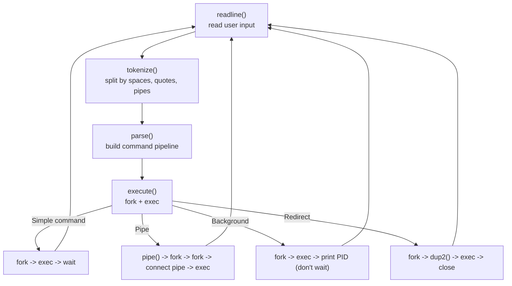
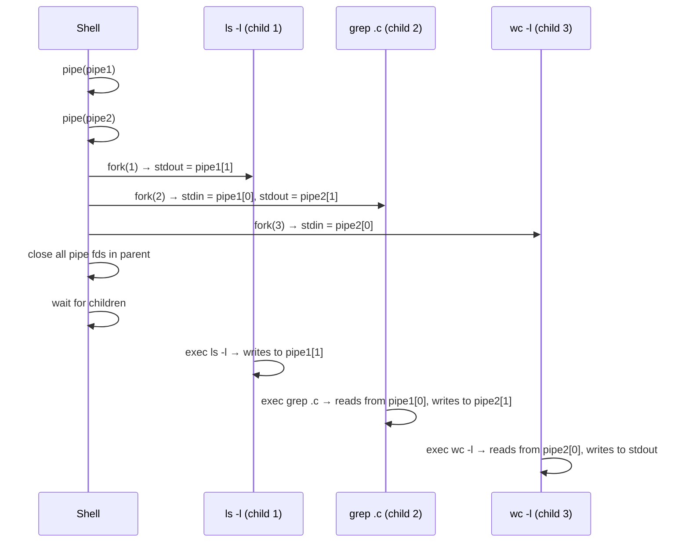

# Project: Build a Tiny Shell

> [!summary] Goal
> Build a functional Unix shell that can execute external commands, handle pipes, redirections, and job control. Understand how shells work under the hood — forking, exec, pipe management, and signal handling.

## Table of Contents

1. [Architecture Overview](#architecture-overview)
2. [Tokenization and Parsing](#tokenization-and-parsing)
3. [Command Execution](#command-execution)
4. [Pipes and Redirections](#pipes-and-redirections)
5. [Pitfalls](#pitfalls)

---

## Architecture Overview



---

## Tokenization and Parsing

```c
#include <stdio.h>
#include <stdlib.h>
#include <string.h>
#include <unistd.h>
#include <sys/wait.h>
#include <fcntl.h>

#define MAX_ARGS 256
#define MAX_COMMANDS 64

typedef enum { TOK_WORD, TOK_PIPE, TOK_REDIR_IN, TOK_REDIR_OUT, TOK_APPEND, TOK_BG } TokenType;

typedef struct {
    TokenType type;
    char *value;
} Token;

typedef struct {
    char *args[MAX_ARGS];        // argv-style argument list
    int arg_count;
    char *input_file;            // < file
    char *output_file;           // > file
    int append;                  // >> vs >
    int background;              // &
} Command;

typedef struct {
    Command commands[MAX_COMMANDS];
    int count;
} Pipeline;

void tokenize(const char *input, Token *tokens, int *token_count) {
    int pos = 0, tpos = 0;
    int len = strlen(input);

    while (pos < len) {
        // Skip whitespace
        while (pos < len && input[pos] == ' ') pos++;
        if (pos >= len) break;

        switch (input[pos]) {
            case '|': tokens[tpos++] = (Token){ .type = TOK_PIPE }; pos++; break;
            case '<': tokens[tpos++] = (Token){ .type = TOK_REDIR_IN }; pos++; break;
            case '>':
                if (input[pos + 1] == '>') {
                    tokens[tpos++] = (Token){ .type = TOK_APPEND }; pos += 2;
                } else {
                    tokens[tpos++] = (Token){ .type = TOK_REDIR_OUT }; pos++;
                }
                break;
            case '&': tokens[tpos++] = (Token){ .type = TOK_BG }; pos++; break;
            default: {
                // Quote-aware word tokenization
                int start = pos;
                if (input[pos] == '"' || input[pos] == '\'') {
                    char quote = input[pos];
                    pos++; start = pos;
                    while (pos < len && input[pos] != quote) pos++;
                } else {
                    while (pos < len && input[pos] != ' ' && input[pos] != '|'
                           && input[pos] != '<' && input[pos] != '>' && input[pos] != '&')
                        pos++;
                }
                char *word = strndup(input + start, pos - start);
                tokens[tpos++] = (Token){ .type = TOK_WORD, .value = word };
                if (input[pos] == '"' || input[pos] == '\'') pos++;  // Skip closing quote
                break;
            }
        }
    }
    *token_count = tpos;
}

void parse_pipeline(Token *tokens, int token_count, Pipeline *pipeline) {
    pipeline->count = 0;
    Command *current = &pipeline->commands[0];
    current->arg_count = 0;
    current->input_file = NULL;
    current->output_file = NULL;
    current->append = 0;
    current->background = 0;

    for (int i = 0; i < token_count; i++) {
        switch (tokens[i].type) {
            case TOK_WORD:
                current->args[current->arg_count++] = tokens[i].value;
                break;
            case TOK_PIPE:
                current->args[current->arg_count] = NULL;
                pipeline->count++;
                current = &pipeline->commands[pipeline->count];
                current->arg_count = 0;
                current->input_file = NULL;
                current->output_file = NULL;
                current->append = 0;
                current->background = 0;
                break;
            case TOK_REDIR_IN:
                if (i + 1 < token_count && tokens[i+1].type == TOK_WORD)
                    current->input_file = tokens[++i].value;
                break;
            case TOK_REDIR_OUT:
                if (i + 1 < token_count && tokens[i+1].type == TOK_WORD)
                    current->output_file = tokens[++i].value;
                break;
            case TOK_APPEND:
                if (i + 1 < token_count && tokens[i+1].type == TOK_WORD) {
                    current->output_file = tokens[++i].value;
                    current->append = 1;
                }
                break;
            case TOK_BG:
                current->background = 1;
                break;
        }
    }
    current->args[current->arg_count] = NULL;
    pipeline->count++;
}
```

---

## Command Execution

```c
int execute_command(Command *cmd, int input_fd, int output_fd) {
    pid_t pid = fork();

    if (pid < 0) { perror("fork"); return -1; }

    if (pid == 0) {
        // Child — set up I/O redirections
        if (input_fd != STDIN_FILENO) {
            dup2(input_fd, STDIN_FILENO);
            close(input_fd);
        }
        if (output_fd != STDOUT_FILENO) {
            dup2(output_fd, STDOUT_FILENO);
            close(output_fd);
        }

        // Input file redirection
        if (cmd->input_file) {
            int fd = open(cmd->input_file, O_RDONLY);
            if (fd < 0) { perror(cmd->input_file); _exit(1); }
            dup2(fd, STDIN_FILENO);
            close(fd);
        }

        // Output file redirection
        if (cmd->output_file) {
            int flags = O_WRONLY | O_CREAT | (cmd->append ? O_APPEND : O_TRUNC);
            int fd = open(cmd->output_file, flags, 0644);
            if (fd < 0) { perror(cmd->output_file); _exit(1); }
            dup2(fd, STDOUT_FILENO);
            close(fd);
        }

        // Execute external command (or built-in)
        execvp(cmd->args[0], cmd->args);
        // execvp only returns on error
        fprintf(stderr, "%s: command not found\n", cmd->args[0]);
        _exit(127);
    }

    return pid;
}

void execute_pipeline(Pipeline *p) {
    int prev_fd = STDIN_FILENO;
    int pipe_fds[2];
    pid_t pids[MAX_COMMANDS];
    int pid_count = 0;

    for (int i = 0; i < p->count; i++) {
        // Create pipe for next command (if not last)
        if (i < p->count - 1) {
            if (pipe(pipe_fds) < 0) { perror("pipe"); return; }
        }

        int output_fd = (i < p->count - 1) ? pipe_fds[1] : STDOUT_FILENO;
        pid_t pid = execute_command(&p->commands[i], prev_fd, output_fd);

        if (pid > 0) pids[pid_count++] = pid;

        // Close prev_fd (child has a copy)
        if (prev_fd != STDIN_FILENO) close(prev_fd);
        if (output_fd != STDOUT_FILENO) close(output_fd);

        // Read end becomes prev_fd for next command
        prev_fd = (i < p->count - 1) ? pipe_fds[0] : STDIN_FILENO;
    }

    // Wait for all processes (unless background)
    for (int i = 0; i < pid_count; i++) {
        if (!p->commands[0].background) {
            int status;
            waitpid(pids[i], &status, 0);
        }
    }
}
```

---

## Pipes and Redirections

### How `ls -l | grep .c | wc -l` works



### Built-in commands

```c
int handle_builtin(Command *cmd) {
    if (strcmp(cmd->args[0], "cd") == 0) {
        const char *path = cmd->args[1] ? cmd->args[1] : getenv("HOME");
        if (chdir(path) < 0) perror("cd");
        return 1;  // Handled
    }
    if (strcmp(cmd->args[0], "exit") == 0) {
        exit(0);
    }
    if (strcmp(cmd->args[0], "pwd") == 0) {
        char cwd[1024];
        if (getcwd(cwd, sizeof(cwd))) printf("%s\n", cwd);
        return 1;
    }
    return 0;  // Not a built-in
}

// In execute_command, before execvp:
if (handle_builtin(cmd)) _exit(0);
```

---

## Main Loop

```c
#include <signal.h>

int main(void) {
    signal(SIGINT, SIG_IGN);         // Let child handle Ctrl+C
    signal(SIGCHLD, SIG_IGN);        // Auto-reap zombies

    char input[4096];

    while (1) {
        printf("$ ");
        fflush(stdout);

        if (!fgets(input, sizeof(input), stdin)) {
            printf("\n");
            break;
        }

        // Remove trailing newline
        input[strcspn(input, "\n")] = '\0';

        // Skip empty input
        if (input[0] == '\0') continue;

        Token tokens[256];
        int token_count = 0;
        tokenize(input, tokens, &token_count);

        if (token_count == 0) continue;

        Pipeline pipeline;
        parse_pipeline(tokens, token_count, &pipeline);

        execute_pipeline(&pipeline);

        // Free token values
        for (int i = 0; i < token_count; i++) {
            if (tokens[i].value) free(tokens[i].value);
        }
    }
    return 0;
}
```

---

## Pitfalls

### Not closing unused pipe ends

Every pipe file descriptor must be closed in every process that doesn't use it. The reader won't see EOF until all write ends are closed. This is the #1 bug in shell implementations.

### Zombie children

Without `wait()` or `SIGCHLD` handling, exited children become zombies. Use `signal(SIGCHLD, SIG_IGN)` (auto-reap) or `waitpid(-1, NULL, WNOHANG)` in a SIGCHLD handler.

### SIGINT handling

Ctrl+C should interrupt the foreground command, not the shell. The shell should ignore SIGINT; the child process inherits the default handler (terminate).

### Buffer overflow in tokenization

`strdup` and fixed-size arrays need care. Long input lines, deeply nested quotes, or many pipeline stages can overflow.

---

## Cross-Links

- [[C/03_Advanced/05_System_Programming]] for fork, exec, pipe, wait
- [[C/03_Advanced/03_Signal_Handling]] for SIGCHLD, SIGINT
- [[C/02_Core/02_File_IO_and_POSIX_System_Calls]] for fd operations
- [[C/02_Core/04_Data_Structures_in_C]] for command history, job list
- [[C/03_Advanced/04_Socket_Programming]] for network shell (rsh)
