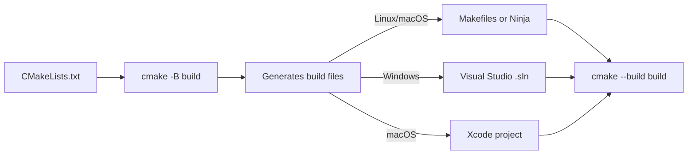

# CMake Deep Dive

> [!summary] Goal
> Master CMake — the de facto standard build system for C and C++ projects. Cover syntax, variables, targets, dependencies, `find_package`, toolchains, testing, installation, and cross-compilation from beginner to expert.

## Table of Contents

1. [Why CMake?](#why-cmake)
2. [CMake Syntax Basics](#cmake-syntax-basics)
3. [Variables and Lists](#variables-and-lists)
4. [Targets and Properties](#targets-and-properties)
5. [Dependencies and find_package](#dependencies-and-findpackage)
6. [Toolchains and Cross-Compilation](#toolchains-and-cross-compilation)
7. [Testing with CTest](#testing-with-ctest)
8. [Installation and Packaging](#installation-and-packaging)
9. [Generator Expressions](#generator-expressions)
10. [Pitfalls](#pitfalls)

---

## Why CMake?

> [!info] CMake
> CMake is a meta-build system — it generates build files for native tools (Makefiles, Ninja, Visual Studio, Xcode). It handles: cross-platform builds, dependency management, compiler detection, installation rules, testing, and packaging. CMake is the standard for C and C++ projects (LLVM, Qt, Boost, OpenCV, and most major C/C++ libraries use CMake).



### Key concepts

| Concept | Description |
|---------|-------------|
| **Source dir** | Where `CMakeLists.txt` lives (`-S .`) |
| **Build dir** | Where generated files go (`-B build`) |
| **Target** | A thing to build: executable, library, custom target |
| **Generator** | What build system to produce (Makefiles, Ninja, VS) |
| **Toolchain** | Compiler, linker, and platform settings |
| **Preset** | Saved configuration presets (`CMakePresets.json`) |

---

## CMake Syntax Basics

```cmake
# Minimum CMake version
cmake_minimum_required(VERSION 3.16)

# Project name, language, and version
project(MyApp VERSION 1.0.0 LANGUAGES C CXX)

# Set C standard
set(CMAKE_C_STANDARD 11)
set(CMAKE_C_STANDARD_REQUIRED ON)
set(CMAKE_C_EXTENSIONS OFF)      # Use -std=c11, not -std=gnu11

# Add executable
add_executable(myapp main.c util.c)

# Add library
add_library(mylib STATIC lib.c)   # STATIC, SHARED, MODULE, OBJECT, INTERFACE

# Include directories
target_include_directories(myapp PRIVATE include)

# Link libraries
target_link_libraries(myapp PRIVATE mylib)

# Compile definitions
target_compile_definitions(myapp PRIVATE NDEBUG VERSION=1)

# Compile options
target_compile_options(myapp PRIVATE -Wall -Wextra)
```

### Three basic commands

```cmake
# 1. add_executable — creates a program
add_executable(myapp main.c)

# 2. add_library — creates a library
add_library(util STATIC util.c)    # Static library (libutil.a)
add_library(util SHARED util.c)    # Shared library (libutil.so)
add_library(util OBJECT util.c)    # Object library (no archive, compiled .o files)

# 3. add_custom_target — runs arbitrary commands
add_custom_target(run
    COMMAND ./myapp
    DEPENDS myapp
)
```

### CMakeLists.txt for a minimal C project

```cmake
cmake_minimum_required(VERSION 3.16)
project(MyProject C)

set(CMAKE_C_STANDARD 11)

# Collect all sources
file(GLOB_RECURSE SOURCES src/*.c)

add_executable(myapp ${SOURCES})
target_include_directories(myapp PRIVATE include)
```

### CMakeLists.txt for a multi-directory project

```cmake
# Top-level CMakeLists.txt
cmake_minimum_required(VERSION 3.16)
project(MyProject VERSION 1.0.0 LANGUAGES C)

add_subdirectory(lib)
add_subdirectory(src)
add_subdirectory(tests)

# lib/CMakeLists.txt
add_library(core STATIC
    core.c
    hash.c
    utils.c
)
target_include_directories(core PUBLIC
    ${CMAKE_CURRENT_SOURCE_DIR}  # Exposed to consumers
)

# src/CMakeLists.txt
add_executable(myapp main.c)
target_link_libraries(myapp PRIVATE core)

# tests/CMakeLists.txt
add_executable(test_core test_core.c)
target_link_libraries(test_core PRIVATE core)
```

---

## Variables and Lists

```cmake
# Variables
set(MY_VAR "hello")
message(STATUS "MY_VAR = ${MY_VAR}")

# Lists (semicolon-separated)
set(SOURCES main.c util.c helper.c)
message(STATUS "${SOURCES}")    # "main.c;util.c;helper.c"

# Cache variables (visible in cmake-gui, can be set from command line)
set(MY_PATH "/usr/local" CACHE PATH "Path to something")

# Environment variables
set(ENV{PATH} "/opt/bin:$ENV{PATH}")

# Built-in variables
message(STATUS "Project: ${PROJECT_NAME}")
message(STATUS "Source dir: ${CMAKE_SOURCE_DIR}")
message(STATUS "Build dir: ${CMAKE_BINARY_DIR}")
message(STATUS "C compiler: ${CMAKE_C_COMPILER}")
message(STATUS "C flags: ${CMAKE_C_FLAGS}")
message(STATUS "Build type: ${CMAKE_BUILD_TYPE}")      # Debug, Release, RelWithDebInfo, MinSizeRel
message(STATUS "System: ${CMAKE_SYSTEM_NAME}")         # Linux, Darwin, Windows
```

### Common built-in variables

| Variable | Meaning |
|----------|---------|
| `CMAKE_SOURCE_DIR` | Top-level source directory |
| `CMAKE_BINARY_DIR` | Top-level build directory |
| `CMAKE_CURRENT_SOURCE_DIR` | Current source directory (when using add_subdirectory) |
| `CMAKE_CURRENT_BINARY_DIR` | Current build directory |
| `CMAKE_C_COMPILER` | C compiler path |
| `CMAKE_CXX_COMPILER` | C++ compiler path |
| `CMAKE_BUILD_TYPE` | Debug, Release, RelWithDebInfo, MinSizeRel |
| `CMAKE_INSTALL_PREFIX` | Installation prefix (/usr/local) |
| `PROJECT_NAME` | Name of the project |
| `PROJECT_SOURCE_DIR` | Source dir of the most recent project() |
| `CMAKE_MODULE_PATH` | Directories to search for FindXXX.cmake modules |

---

## Targets and Properties

> [!info] CMake targets are first-class objects
> In modern CMake, everything revolves around **targets** created by `add_executable` or `add_library`. Properties are attached to targets using `target_*` functions. This is the "modern CMake" approach — avoid global functions like `include_directories()` and `link_directories()`.

```cmake
# ❌ Old-style CMake (global)
include_directories(/usr/include/foo)
link_directories(/usr/lib/foo)
add_definitions(-DNDEBUG)

# ✅ Modern CMake (per-target)
add_library(foo ...)
target_include_directories(foo PUBLIC /usr/include/foo)
target_link_directories(foo PUBLIC /usr/lib/foo)
target_compile_definitions(foo PRIVATE NDEBUG)
```

### Target visibility

| Visibility | Meaning |
|:----------:|---------|
| **PRIVATE** | Affects only this target (not consumers) |
| **PUBLIC** | Affects this target AND its consumers |
| **INTERFACE** | Affects only consumers (used for header-only libraries) |

```cmake
add_library(core core.c)
target_include_directories(core
    PUBLIC  include          # Exposed to myapp
    PRIVATE src              # Only for compiling core.c
)

add_executable(myapp main.c)
target_link_libraries(myapp PRIVATE core)
# myapp gets: -Iinclude (from core's PUBLIC include)

# Interface library (header-only)
add_library(myheader_only INTERFACE)
target_include_directories(myheader_only INTERFACE include)
target_compile_features(myheader_only INTERFACE cxx_std_17)
```

### Common target properties

```cmake
# Output name
set_target_properties(myapp PROPERTIES
    OUTPUT_NAME "my-program"        # Instead of "myapp"
)

# C/C++ standard per target
set_target_properties(myapp PROPERTIES
    C_STANDARD 11
    C_STANDARD_REQUIRED ON
    C_EXTENSIONS OFF
)

# Position-independent code (for shared libraries)
set_target_properties(mylib PROPERTIES
    POSITION_INDEPENDENT_CODE ON
)

# Visibility (for shared libraries)
set_target_properties(mylib PROPERTIES
    C_VISIBILITY_PRESET hidden
    VISIBILITY_INLINES_HIDDEN ON
)
```

---

## Dependencies and find_package

> [!info] find_package
> `find_package` locates external libraries. It searches for `Find<Package>.cmake` or `<Package>Config.cmake` files. The **CONFIG** mode looks for a `<Package>Config.cmake` shipped with the library. The **MODULE** mode looks for a `Find<Package>.cmake` shipped with CMake or your project.

```cmake
# Find a package
find_package(OpenMP REQUIRED)
find_package(ZLIB REQUIRED)
find_package(PkgConfig REQUIRED)

# MODULE mode (CMake ships FindZLIB.cmake, FindOpenMP.cmake)
find_package(ZLIB REQUIRED)
if(ZLIB_FOUND)
    target_link_libraries(myapp PRIVATE ZLIB::ZLIB)
endif()

# CONFIG mode (library ships FooConfig.cmake)
find_package(Foo CONFIG REQUIRED)
target_link_libraries(myapp PRIVATE Foo::foo)
```

### Writing a simple Find module

```cmake
# cmake/FindMyLib.cmake — place in CMAKE_MODULE_PATH
find_path(MYLIB_INCLUDE_DIR mylib.h
    PATHS /usr/include /usr/local/include
)

find_library(MYLIB_LIBRARY mylib
    PATHS /usr/lib /usr/local/lib
)

if(MYLIB_INCLUDE_DIR AND MYLIB_LIBRARY)
    set(MYLIB_FOUND TRUE)
    add_library(MyLib::MyLib UNKNOWN IMPORTED)
    set_target_properties(MyLib::MyLib PROPERTIES
        IMPORTED_LOCATION ${MYLIB_LIBRARY}
        INTERFACE_INCLUDE_DIRECTORIES ${MYLIB_INCLUDE_DIR}
    )
endif()
```

### FetchContent (download dependencies at build time)

```cmake
include(FetchContent)

FetchContent_Declare(
    json
    GIT_REPOSITORY https://github.com/nlohmann/json.git
    GIT_TAG v3.11.2
)

FetchContent_MakeAvailable(json)
# Now json is available: target_link_libraries(myapp PRIVATE nlohmann_json::nlohmann_json)
```

---

## Toolchains and Cross-Compilation

> [!info] Toolchain file
> A toolchain file tells CMake about the cross-compiler, target system, and sysroot. It's specified with `-DCMAKE_TOOLCHAIN_FILE=path/to/toolchain.cmake`.

```cmake
# arm-toolchain.cmake — for ARM cross-compilation
set(CMAKE_SYSTEM_NAME Linux)
set(CMAKE_SYSTEM_PROCESSOR arm)

set(CMAKE_C_COMPILER arm-linux-gnueabihf-gcc)
set(CMAKE_CXX_COMPILER arm-linux-gnueabihf-g++)

set(CMAKE_FIND_ROOT_PATH /path/to/sysroot)
set(CMAKE_FIND_ROOT_PATH_MODE_PROGRAM NEVER)
set(CMAKE_FIND_ROOT_PATH_MODE_LIBRARY ONLY)
set(CMAKE_FIND_ROOT_PATH_MODE_INCLUDE ONLY)
set(CMAKE_FIND_ROOT_PATH_MODE_PACKAGE ONLY)
```

```bash
# Use the toolchain file
cmake -B build -S . \
    -DCMAKE_TOOLCHAIN_FILE=arm-toolchain.cmake \
    -DCMAKE_BUILD_TYPE=Release
```

---

## Testing with CTest

```cmake
# Enable testing
enable_testing()

# Add tests
add_test(NAME test_basic COMMAND ./test_core)
add_test(NAME test_advanced COMMAND ./test_core --advanced)

# Tests with arguments
add_test(NAME test_args COMMAND ./test_core --iterations 1000)

# Set test properties
set_tests_properties(test_advanced PROPERTIES
    TIMEOUT 30
    ENVIRONMENT "MY_VAR=hello"
    WORKING_DIRECTORY ${CMAKE_SOURCE_DIR}/test_data
)

# Run tests
cmake --build build && ctest --test-dir build
ctest --test-dir build -V              # Verbose
ctest --test-dir build -N              # List tests, don't run
ctest --test-dir build -R test_basic   # Run tests matching regex
```

---

## Installation and Packaging

```cmake
# Install targets
install(TARGETS myapp RUNTIME DESTINATION bin)
install(TARGETS mylib ARCHIVE DESTINATION lib)    # Static lib
install(TARGETS mylib LIBRARY DESTINATION lib)    # Shared lib

# Install headers
install(DIRECTORY include/ DESTINATION include
    FILES_MATCHING PATTERN "*.h"
)

# Install config file
install(FILES config.ini DESTINATION etc)

# CPack — create installers and packages
set(CPACK_GENERATOR "TGZ;DEB;RPM")
set(CPACK_PACKAGE_NAME "myapp")
set(CPACK_PACKAGE_VERSION "1.0.0")
include(CPack)

# Build a package
# cpack -G TGZ    → myapp-1.0.0-Linux.tar.gz
# cpack -G DEB    → myapp_1.0.0_amd64.deb
# cpack -G RPM    → myapp-1.0.0-1.x86_64.rpm
```

---

## Generator Expressions

> [!info] Generator expressions
> Generator expressions are evaluated at **build-time**, not configure-time. They allow conditional logic based on build type, target properties, platform, and more. Syntax: `$<condition:true-value>`.

```cmake
# Conditional compile flags
target_compile_options(myapp PRIVATE
    $<$<CONFIG:Debug>:-O0>
    $<$<CONFIG:Release>:-O3>
)

# Conditional link
target_link_libraries(myapp PRIVATE
    $<$<PLATFORM_ID:Linux>:rt>
    $<$<PLATFORM_ID:Windows>:ws2_32>
)

# Platform-specific sources
target_sources(myapp PRIVATE
    common.c
    $<$<PLATFORM_ID:Linux>:linux.c>
    $<$<PLATFORM_ID:Windows>:win32.c>
)

# Common generator expressions
$<CONFIG:Debug>                    # True if Debug build
$<PLATFORM_ID:Linux>               # True if Linux
$<C_COMPILER_ID:GNU>              # True if GCC
$<TARGET_PROPERTY:target,prop>    # Property value
$<TARGET_FILE:target>              # Full path to target output
$<INSTALL_INTERFACE:include>       # Include path for installed targets
$<BUILD_INTERFACE:${src}/include>  # Include path during build
```

---

## Pitfalls

### Not using BUILD_INTERFACE and INSTALL_INTERFACE

```cmake
# ❌ Wrong — hardcoded path works for build but not install
target_include_directories(mylib PUBLIC ${CMAKE_SOURCE_DIR}/include)

# ✅ Correct — separate build and install paths
target_include_directories(mylib PUBLIC
    $<BUILD_INTERFACE:${CMAKE_SOURCE_DIR}/include>
    $<INSTALL_INTERFACE:include>
)
```

### Using file(GLOB) for sources

`file(GLOB ...)` collects sources once at configure time. If you add new files, you need to re-run cmake (not just make). Use explicit source lists for reliable builds.

### Forgetting CMP0077 (option() vs set() for cache variables)

In older CMake, `option()` and `set(... CACHE BOOL ...)` interact differently with the command line. Set `cmake_policy(SET CMP0077 NEW)` for consistent behavior.

### Mixing PRIVATE and PUBLIC

Putting `PRIVATE include` on a library when consumers need the headers (e.g., a header's include path) causes compile errors. Always use PUBLIC when the header is in the library's interface.

---

> [!question]- Interview Questions
>
> **Q: What's the difference between PRIVATE, PUBLIC, and INTERFACE in target_include_directories?**
> A: PRIVATE adds the path only when compiling the target itself. PUBLIC adds it to the target AND any target that links to it. INTERFACE doesn't affect the target's compilation — only targets that link to it (used for header-only libraries).
>
> **Q: What is a generator expression and when would you use one?**
> A: A generator expression is evaluated at build time, not configure time. Use them for: conditional compile flags per build type (`$<CONFIG:Debug>:-g`), platform-specific sources (`$<PLATFORM_ID:Windows>:win32.c`), and separating build/install include paths (`$<BUILD_INTERFACE:...>` and `$<INSTALL_INTERFACE:...>`).
>
> **Q: How does find_package find libraries?**
> A: It searches in MODE mode for `Find<Package>.cmake` (CMake-provided or in CMAKE_MODULE_PATH) and CONFIG mode for `<Package>Config.cmake` (shipped with the library). The CONFIG mode checks standard install paths and `CMAKE_PREFIX_PATH`. The found targets are imported as `Package::Target`. If REQUIRED is specified, configure fails if not found.
>
> **Q: What is a toolchain file used for?**
> A: A toolchain file configures cross-compilation. It sets `CMAKE_SYSTEM_NAME`, `CMAKE_C_COMPILER` (the cross-compiler), and `CMAKE_FIND_ROOT_PATH` (the sysroot). It tells CMake: "don't look for libraries on the host — look in the sysroot instead."

---

## Cross-Links

- [[C/06_Build_Systems/02_Make_Deep_Dive]] for Makefiles (alternative build system)
- [[C/01_Foundations/06_Preprocessor_and_Compilation]] for compiler flags
- [[C/02_Core/08_Build_Systems_and_Makefiles]] for basic Make+CMake intro
- [[C++/06_Build_Systems/01_CMake_Deep_Dive]] for C++-specific CMake patterns
- [[C++/06_Build_Systems/02_Make_Deep_Dive]] for C++ Makefiles
