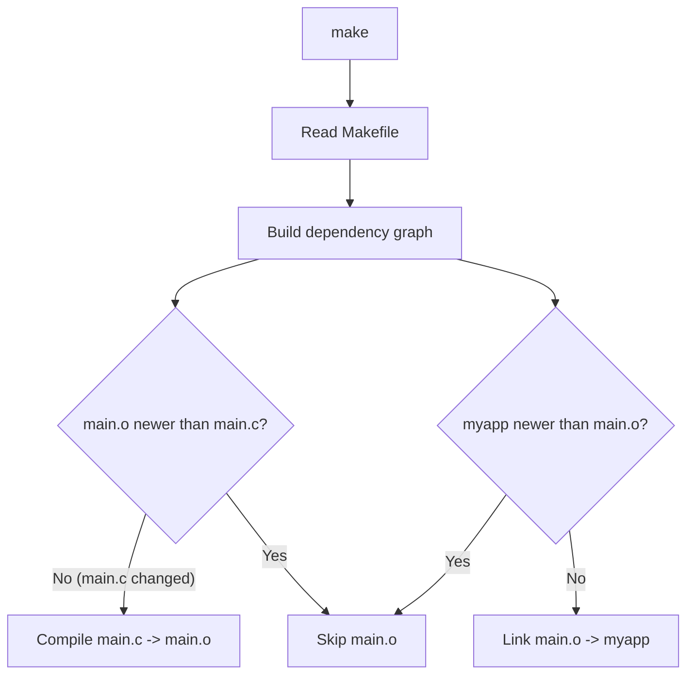

# Make Deep Dive

> [!summary] Goal
> Master GNU Make — from basic targets to advanced functions, pattern rules, automatic variables, order-only prerequisites, and multi-directory projects. Understand Make well enough to build any C project by hand.

## Table of Contents

1. [Make Concepts](#make-concepts)
2. [Rules and Targets](#rules-and-targets)
3. [Variables](#variables)
4. [Automatic Variables](#automatic-variables)
5. [Pattern Rules](#pattern-rules)
6. [Functions](#functions)
7. [Conditionals](#conditionals)
8. [Multi-Directory Projects](#multi-directory-projects)
9. [Pitfalls](#pitfalls)

---

## Make Concepts

> [!info] Make
> GNU Make automates building. It reads a `Makefile`, determines which files need recompilation based on **timestamps**, and runs the necessary commands. A target is **out of date** if any of its prerequisites is newer than the target. Make uses the last-modified time of files, not their content.



---

## Rules and Targets

```makefile
# Basic rule
target: prerequisites
	recipe

# Example — compile a program
myapp: main.o util.o
	gcc -o myapp main.o util.o -lm

main.o: main.c util.h
	gcc -c -o main.o main.c

util.o: util.c util.h
	gcc -c -o util.o util.c

# Phony target — not a real file
.PHONY: clean
clean:
	rm -f *.o myapp
```

### Rules with multiple targets

```makefile
# Multiple targets from one rule
all: program tests docs

# Implicit rule matching (pattern-based)
%.o: %.c
	gcc -c -o $@ $<
```

### Order-only prerequisites

```makefile
# Prerequisites after | are order-only — they must exist but timestamps don't matter
$(OBJ_DIR)/%.o: %.c | $(OBJ_DIR)
	gcc -c -o $@ $<

$(OBJ_DIR):
	mkdir -p $(OBJ_DIR)
```

---

## Variables

```makefile
# Variable assignment
CC      = gcc
CFLAGS  = -Wall -Wextra -O2 -g
LDFLAGS = -lm
SRCS    = main.c util.c helper.c
OBJS    = main.o util.o helper.o
TARGET  = myapp

# Immediate assignment (evaluated when assigned, not when used)
IMM     := $(shell pwd)

# Conditional assignment (only if not already defined)
CFLAGS  ?= -O2

# Append
CFLAGS  += -I include

# Reference
$(TARGET): $(OBJS)
	$(CC) $(CFLAGS) -o $@ $^ $(LDFLAGS)
```

### Variable types

| Type | Syntax | Evaluation | Use case |
|:----:|--------|:----------:|----------|
| **Recursive** | `VAR = value` | At use time | Standard (lazy) |
| **Simple** | `VAR := value` | At assignment | When RHS is fixed |
| **Conditional** | `VAR ?= value` | If undefined | Default values |
| **Append** | `VAR += value` | Append with space | Building options |

### VPATH and vpath

```makefile
# VPATH — search path for prerequisites
VPATH = src:lib:include

# vpath — search path for specific patterns
vpath %.c src:lib
vpath %.h include

# Now make finds main.c in src/, util.c in lib/
myapp: main.o util.o
	gcc -o $@ $^
```

---

## Automatic Variables

> [!info] Automatic variables
> Automatic variables are set automatically by Make for each rule. Use them instead of repeating target and prerequisite names. They are only available in the recipe portion of a rule.

```makefile
# Key automatic variables
main.o: main.c util.h
	$(CC) $(CFLAGS) -c $< -o $@

# Example with all
myapp: main.o util.o
	$(CC) $(CFLAGS) -o $@ $^ $(LDFLAGS)
```

| Variable | Meaning | Example value |
|:--------:|---------|:-------------:|
| `$@` | Target name | `main.o` |
| `$<` | First prerequisite | `main.c` |
| `$^` | All prerequisites | `main.c util.h` |
| `$?` | Prerequisites newer than target | Changed files |
| `$*` | Stem (pattern rule match) | For `%.o: %.c`, stem is the `%` part |
| `$(@D)` | Directory part of target | `obj` for `obj/main.o` |
| `$(@F)` | Filename part of target | `main.o` for `obj/main.o` |
| `$(<D)` | Directory part of first prereq | `src` for `src/main.c` |
| `$(<F)` | Filename part of first prereq | `main.c` for `src/main.c` |

---

## Pattern Rules

> [!info] Pattern rules
> Pattern rules use `%` as a wildcard to match any filename stem. They replace explicit compilation rules for each source file. Combined with automatic variables, a single pattern rule handles all `.c` → `.o` compilations.

```makefile
# Pattern rule: compile any .c to .o
%.o: %.c
	$(CC) $(CFLAGS) -c $< -o $@

# Pattern rule with header dependency
%.o: %.c $(wildcard *.h)
	$(CC) $(CFLAGS) -c $< -o $@

# Static pattern rule — only for specific list
$(OBJS): %.o: %.c
	$(CC) $(CFLAGS) -c $< -o $@
```

### Complete Makefile with patterns

```makefile
CC       = gcc
CFLAGS   = -Wall -Wextra -O2 -g -I include
LDFLAGS  = -lm
SRC_DIR  = src
OBJ_DIR  = obj
SRCS     = $(wildcard $(SRC_DIR)/*.c)
OBJS     = $(patsubst $(SRC_DIR)/%.c, $(OBJ_DIR)/%.o, $(SRCS))
TARGET   = myapp

.PHONY: all clean

all: $(TARGET)

$(TARGET): $(OBJS)
	$(CC) $(CFLAGS) -o $@ $^ $(LDFLAGS)

# Pattern rule — compile .c to .o in obj/
$(OBJ_DIR)/%.o: $(SRC_DIR)/%.c | $(OBJ_DIR)
	$(CC) $(CFLAGS) -c $< -o $@

$(OBJ_DIR):
	mkdir -p $@

clean:
	rm -rf $(OBJ_DIR) $(TARGET)

# Auto-dependency generation
$(OBJ_DIR)/%.d: $(SRC_DIR)/%.c | $(OBJ_DIR)
	$(CC) -MM -MT $(@:.d=.o) $< > $@

include $(wildcard $(OBJ_DIR)/*.d)
```

---

## Functions

```makefile
# String substitution
OBJS := $(SRCS:.c=.o)                      # Replace .c with .o
OBJS := $(patsubst src/%.c, obj/%.o, $(SRCS))  # Advanced pattern substitution

# Wildcard
SRCS := $(wildcard src/*.c lib/*.c)         # Find all .c files

# Notdir — strip directory
FILES := $(notdir $(SRCS))                  # main.c util.c (no path)

# Dir — extract directory
DIRS  := $(dir $(SRCS))                     # src/ lib/

# Basename — strip extension
NAMES := $(basename $(SRCS))                # src/main src/util

# Filter/filter-out
C_SRCS   := $(filter %.c, $(SRCS))          # Keep only .c files
H_SRCS   := $(filter-out %.c, $(SRCS))      # Remove .c files

# Shell
DATE := $(shell date +%Y-%m-%d)
FILES := $(shell find src -name '*.c')

# Foreach — iterate over a list
ALL_DEPS := $(foreach dir,$(SRC_DIRS),$(wildcard $(dir)/*.c))

# Origin — check where variable came from
$(origin CFLAGS)  # "file", "environment", "command-line", etc.
```

### Dependency generation (auto-deps)

```makefile
# Automatically track #include dependencies
# gcc -MM generates dependency rules that Make understands

%.d: %.c                                 # Rule to generate .d files
	gcc -MM -MT $(@:.d=.o) $< > $@

include $(wildcard *.d)                   # Include all .d files
```

### Shell function for platform detection

```makefile
UNAME := $(shell uname)

ifeq ($(UNAME),Linux)
	LDFLAGS += -lrt -lpthread
endif
ifeq ($(UNAME),Darwin)
	LDFLAGS += -framework CoreFoundation
endif
ifeq ($(UNAME),MINGW32_NT-6.1)
	LDFLAGS += -lws2_32
endif
```

---

## Conditionals

```makefile
# ifdef / ifndef
ifdef DEBUG
	CFLAGS += -g -O0 -DDEBUG
else
	CFLAGS += -O2
endif

# ifeq / ifneq
ifeq ($(CC),gcc)
	CFLAGS += -Wall -Wextra
endif

ifeq ($(UNAME),Linux)
	LDFLAGS += -lrt
endif

# else if (using else + ifeq)
ifdef FEATURE_X
	SRCS += feature_x.c
else ifdef FEATURE_Y
	SRCS += feature_y.c
else
	$(info Using minimal build)
endif
```

---

## Multi-Directory Projects

### Recursive Make (traditional approach)

```makefile
# Top-level Makefile
SUBDIRS = lib src tests

.PHONY: all $(SUBDIRS) clean

all: $(SUBDIRS)

$(SUBDIRS):
	$(MAKE) -C $@

clean:
	for dir in $(SUBDIRS); do \
		$(MAKE) -C $$dir clean; \
	done
```

### Non-recursive Make (modern, preferred)

```makefile
# Top-level Makefile — single build across all directories
CC       = gcc
CFLAGS   = -Wall -Wextra -I include
SRC_DIRS = src/lib src/app src/common

# Collect all sources
SRCS := $(foreach dir,$(SRC_DIRS),$(wildcard $(dir)/*.c))
OBJS := $(patsubst %.c, %.o, $(SRCS))
TARGET = myapp

$(TARGET): $(OBJS)
	$(CC) $(CFLAGS) -o $@ $^

# Pattern rule handles all directories
%.o: %.c
	$(CC) $(CFLAGS) -c $< -o $@

clean:
	rm -f $(OBJS) $(TARGET)
```

---

## Pitfalls

### Recipe recipe prefix is a TAB, not spaces

The most common Make mistake: recipe lines must start with a **literal TAB** character, not spaces. If you see "missing separator" errors, check your editor is not converting tabs to spaces in Makefiles.

### Not listing header dependencies

Make doesn't know about `#include` dependencies unless you list them explicitly or auto-generate them. Without header dependencies, changing a header doesn't trigger recompilation. Use `gcc -MM` auto-dependency generation or list `.h` files as prerequisites.

### Using recursive Make for simple projects

Recursive Make (`$(MAKE) -C subdir`) is simpler but slower and doesn't track cross-directory dependencies correctly. For most projects, non-recursive Make (one Makefile that includes all rules) is faster and more reliable.

### Pattern rule with no prerequisites

A pattern rule with prerequisites ONLY (no recipe) cancels the implicit rule. This is useful for preventing unwanted implicit rules:

```makefile
%.o: %.c       # OK: replaces the built-in rule
%.o:           # Danger: cancels ALL rules for %.o
```

---

> [!question]- Interview Questions
>
> **Q: What's the difference between $@, $<, and $^?**
> A: `$@` is the target name. `$<` is the first prerequisite. `$^` is ALL prerequisites (deduplicated). In `main.o: main.c util.h`, `$@=main.o`, `$<=main.c`, `$^=main.c util.h`. Use `$<` for compilation (single source file) and `$^` for linking (all object files).
>
> **Q: What is a phony target and why do you need it?**
> A: A phony target is a target that doesn't represent a real file (declared with `.PHONY: target`). Without `.PHONY`, if a file named `clean` exists, Make won't run the clean recipe (it considers the target up to date). `.PHONY` tells Make: always run this recipe, regardless of files on disk.
>
> **Q: How does Make determine if a file needs recompilation?**
> A: Make compares the timestamps of the target and its prerequisites. If ANY prerequisite is newer than the target, the recipe is re-run. If the target doesn't exist, it's always built. This is why missing header dependencies cause subtle bugs — changing a header doesn't update the target's timestamp comparison, so Make thinks nothing needs rebuilding.
>
> **Q: What is a pattern rule and how is it different from an implicit rule?**
> A: A pattern rule uses `%` to match any stem: `%.o: %.c`. It replaces writing explicit rules for every source file. Implicit rules are Make's built-in pattern rules (like `%.o: %.c` with default recipes). You can override implicit rules by defining your own pattern rule — it automatically takes precedence.

---

## Cross-Links

- [[C/06_Build_Systems/01_CMake_Deep_Dive]] for CMake (modern alternative to Make)
- [[C/01_Foundations/06_Preprocessor_and_Compilation]] for compiler flags
- [[C/02_Core/08_Build_Systems_and_Makefiles]] for basic build system intro
- [[C++/06_Build_Systems/01_CMake_Deep_Dive]] for C++ CMake
- [[C++/06_Build_Systems/02_Make_Deep_Dive]] for C++ Makefiles
