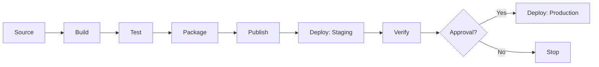
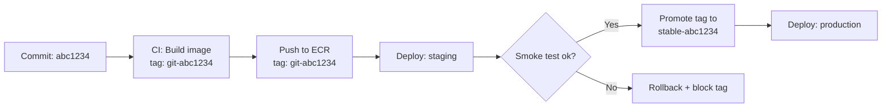

# Pipelines Basics

> [!summary] Goal
> Understand CI/CD pipeline fundamentals: stages (source → build → test → package → publish → deploy → verify), pipeline types (CI-only, CD-only, CI+CD), branch strategies (trunk-based, GitFlow, GitHub Flow), trigger types (push, PR, schedule, manual), artifact promotion, and common failure modes.

## Table of Contents

1. [CI vs CD vs Deploy vs Release](#ci-vs-cd-vs-deploy-vs-release)
2. [Pipeline Stages](#pipeline-stages)
3. [Branch Strategies](#branch-strategies)
4. [Triggers](#triggers)
5. [Artifact Promotion](#artifact-promotion)

---

## CI vs CD vs Deploy vs Release

> [!info] CI/CD definitions
> **Continuous Integration (CI)**: automatically build and test every commit. **Continuous Delivery (CD)**: automatically deploy to staging; production deployment is manual or approved. **Continuous Deployment**: automatically deploy to production after all checks pass. **Release**: making a feature available — orthogonal to deployment (a feature can be deployed but not released behind a feature flag).

| Stage | CI | CD (Delivery) | CD (Deployment) |
|:------|:--:|:-------------:|:----------------:|
| Build | ✅ | ✅ | ✅ |
| Unit test | ✅ | ✅ | ✅ |
| Integration test | ✅ | ✅ | ✅ |
| Package | ✅ | ✅ | ✅ |
| Publish artifact | ✅ | ✅ | ✅ |
| Deploy to staging | | ✅ | ✅ |
| Acceptance test | | ✅ | ✅ |
| Approval gate | | ✅ (manual) | ❌ (automatic) |
| Deploy to production | | ❌ (manual) | ✅ (automatic) |

---

## Pipeline Stages



### Stage breakdown

| Stage | Typical steps | Tools | Artifacts produced |
|:------|:--------------|:------|:-------------------|
| **Source** | Checkout, submodules, LFS, fetch tags | Git, GitHub, GitLab | Commit SHA |
| **Build** | Compile, transpile, dependency resolution | Maven, Gradle, Webpack, esbuild, Docker build | Compiled code, packed modules |
| **Test** | Unit, integration, E2E, lint, typecheck | JUnit, pytest, Jest, Vitest, ESLint, tsc | Test reports, coverage reports |
| **Package** | Archive, containerize, create Helm chart | Docker, Jib, Packer, Helm | Container image, JAR, tarball |
| **Publish** | Push to registry, upload to artifact store | Docker push, npm publish, S3 upload, Artifactory push | Image tag in ECR, package on npm |
| **Deploy** | Apply manifests, update service, switch traffic | kubectl, Helm, Terraform, CDK, Serverless Framework | Deployed service, revision |
| **Verify** | Smoke test, health check, metric validation | curl, custom scripts, Datadog, CloudWatch | Pass/fail signal |

---

## Branch Strategies

| Strategy | Workflow | CI/CD pattern | Best for |
|:---------|:---------|:--------------|----------|
| **Trunk-based** | Short-lived feature branches → merge to main multiple times/day | CI: every push to any branch. CD: merge to main → deploy to staging → optional deploy to prod | CI/CD, small teams, GitOps |
| **GitHub Flow** | Feature branch → PR → merge to main → deploy | CI on PR + merge. CD on main push | Most teams using GitHub Actions |
| **GitFlow** | `develop`/`main`/`release`/`hotfix` branches with specific rules | CI on every branch. CD on `release` or `main` | Release-based teams, mobile apps, regulated environments |
| **Release branches** | Long-lived release branches (v1.0.x, v2.0.x) with cherry-picks | CI on branch. CD on tag or branch merge | Enterprise with concurrent supported versions |

```text
CI trigger — what starts the pipeline:
  - Push to any branch: full CI (build + test + lint + package).
  - Push to main/release: CI + publish (build + test + package + push to registry).
  - PR opened/updated: CI only (no publish, no deploy).
  - Schedule (nightly): long-running tests, security scans, dependency updates.
  - Manual: deploy to production, rollback, one-off tasks.

Deploy trigger — what starts the deploy pipeline:
  - Merge to main → deploy to staging.
  - Git tag created (v1.2.3) → deploy to staging + manual approval for prod.
  - Schedule (cron) → nightly staging refresh.
  - Manual via webhook or button → emergency deploy or rollback.
```

---

## Artifact Promotion

> [!info] Artifact promotion
> Build once, deploy many. An immutable artifact (identified by SHA or SemVer tag) is built in CI and promoted through environments. Each environment receives the SAME artifact — only configuration changes.



```text
Recommended tagging scheme:
  - git-<sha>: exact commit reference (most explicit).
  - <semver>: v1.2.3, v2.0.0-rc1 (human-readable, needs version management).
  - stable: mutable tag, points to the last known-good prod version (for quick rollbacks).

Anti-pattern: "latest" tag for deployments.
  - latest is mutable — the same tag points to different images over time.
  - Use git-<sha> or <semver> for deployments; latest is fine only for local dev.
```

---

## Cross-Links

- [[CICD/01_Foundations/02_Build_Artifacts_and_Versioning]] for artifact types and registries
- [[CICD/02_Core/01_Deployment_Strategies]] for rolling, blue/green, canary, feature flags
- [[CICD/02_Core/02_Secrets_Management]] for secrets in CI/CD pipelines
- [[CICD/GitHubActions/01_Foundations/01_Workflow_Syntax_and_Triggers]] for GitHub Actions workflow syntax
- [[CICD/Jenkins/01_Foundations/01_Pipelines_and_Jobs]] for Jenkins pipeline structure
