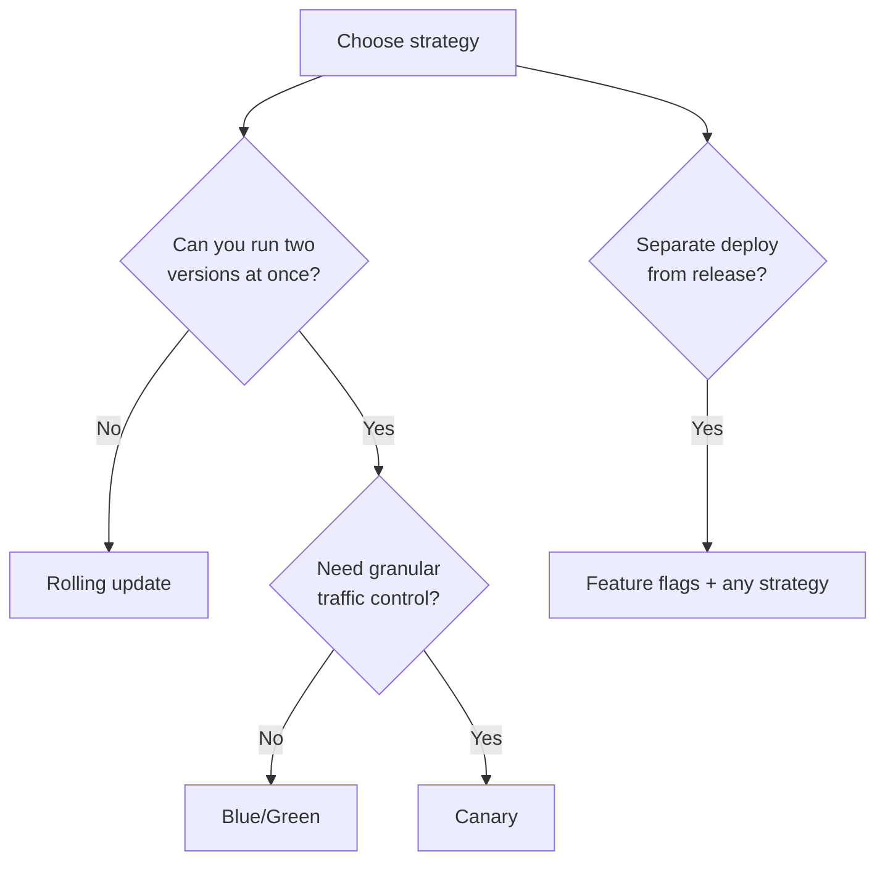
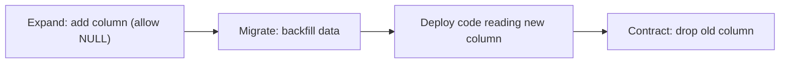

# Deployment Strategies

> [!summary] Goal
> Reduce risk while shipping frequently: pick a rollout strategy that matches your architecture, SLOs, and rollback constraints. Compare rolling, blue/green, canary, feature flags, and database migration patterns.

## Table of Contents

1. [Strategy Comparison](#strategy-comparison)
2. [Rolling Update](#rolling-update)
3. [Blue/Green Deployment](#blue-green-deployment)
4. [Canary Release](#canary-release)
5. [Feature Flags](#feature-flags)
6. [Database Migrations (Expand/Contract)](#database-migrations)

---

## Strategy Comparison

> [!info] Deployment strategy
> A deployment strategy controls how a new version of software is rolled out. The right choice depends on risk tolerance, infra cost, traffic patterns, rollback speed, and DB compatibility.



| Strategy | Risk | Cost | Rollback time | DB compat needed |
|:---------|:----:|:----:|:-------------:|:----------------:|
| **Rolling** | Medium | Low | Medium | During rollout |
| **Blue/Green** | Low | Double | Instant | Both versions |
| **Canary** | Very low | Medium extra | Fast | During rollout |
| **Feature flags** | Lowest | None | Instant toggle | Same code |

---

## Rolling Update

> [!info] Rolling update
> Replace instances gradually without extra capacity. Kubernetes and ECS manage this natively. Good for stateless services where short mixed-version window is acceptable.

```yaml
# K8s rolling update:
spec:
  strategy:
    type: RollingUpdate
    rollingUpdate:
      maxSurge: 1
      maxUnavailable: 0
```

```text
Rolling behavior:
  - Pods replaced incrementally.
  - Some requests hit new version, some old.
  - Rollback: set image back to previous tag.

When to use: stateless microservices, single infra cost, acceptable mixed-version.
When NOT: stateful services, breaking DB schema same deploy, latency-critical.
```

---

## Blue/Green

> [!info] Blue/Green
> Two full environments: blue (current) and green (new). Green deployed alongside blue. Traffic switched at load balancer when green is validated. Rollback: switch back to blue. Instant.

```text
Benefits: instant rollback, full staging env, no mixed-version.
Cost: double infra during deploy. DB must support both versions.

When to use: mission-critical with instant rollback, affordable double infra, regulated.
Tools: K8s (two Deployments + service selector), ECS CodeDeploy.
```

---

## Canary

> [!info] Canary
> Route small % traffic to new version. Monitor metrics. Increase if stable. Shift back if degraded. Requires traffic splitting (service mesh, load balancer).

```text
Phases: 0% (deploy) → 10% → 50% → 100%.
Rollback criteria: error rate +1%, P99 latency +20%, 5XX spike.

When to use: high-traffic, risk-averse teams, real-world validation.
Tools: Istio VirtualService, Linkerd traffic split, AWS CodeDeploy, Flagger.
```

---

## Feature Flags

> [!info] Feature flags
> Separate deploy from release. Code deployed, feature hidden behind flag. Flag turned ON for specific users when ready. No new deploy for the release.

```text
Benefits: deploy everywhere, release on schedule, reverse without rollback, trunk-based dev.
Pitfalls: flag debt (delete after release), test both states, flag interactions.

Tools: LaunchDarkly, Harness FF, Flagsmith, Unleashed, simple env var.
```

---

## Database Migrations (Expand/Contract)

> [!info] Expand/Contract
> Backward-compatible DB changes: add new columns/tables, backfill, then remove old fields. Both old and new code work simultaneously.



```text
Rules: add with DEFAULT NULL, don't rename (add new), don't delete until all code updated,
CREATE INDEX CONCURRENTLY (Postgres), backfill as background job.
```

---

## Cross-Links

- [[CICD/Kubernetes/02_Core/01_Deployments_Rollouts_and_Strategies]] for K8s rollouts
- [[CICD/AWS/02_Core/01_ECS_Deployments_BlueGreen_and_Rolling]] for ECS Blue/Green
- [[CICD/Harness/02_Core/05_Feature_Flags_Creation_Targeting_and_SDKs]] for feature flags
- [[CICD/AWS/01_Foundations/05_RDS_and_Aurora]] for RDS migrations
