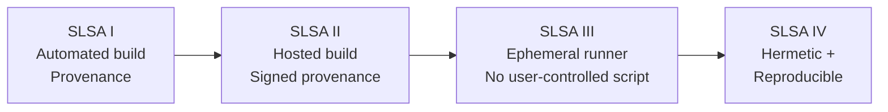

# Supply Chain Security (SLSA Basics)

> [!summary] Goal
> Ensure what you deploy is built from what you reviewed, by a trusted builder, with provenance and controlled dependencies. Understand SLSA levels (I-IV), software attestations (in-toto, Sigstore, cosign), and dependency management.

## Table of Contents

1. [Supply Chain Threats](#supply-chain-threats)
2. [SLSA Levels](#slsa-levels)
3. [Provenance, Attestation, and Signing](#provenance-attestation-and-signing)
4. [Dependency Management](#dependency-management)

---

## Supply Chain Threats

> [!info] Supply chain attack
> An attack that compromises the software at any point between development and deployment. The most common targets are build systems, dependencies, and registries.

| Threat | Example | Impact | Prevention |
|:-------|:--------|:-------|:-----------|
| **Dependency confusion** | Installing a public package with the same name as a private one | Code execution in build | Pin registry source (`npm-scope`), verify checksums |
| **Compromised dependency** | Malicious version of a popular package (event-stream, ua-parser-js) | Data theft, backdoor | Lockfiles, Dependabot alerts, SCA scanning |
| **Build hijack** | Attacker modifies CI pipeline to inject malicious code | Poisoned artifact | Immutable build defs, ephemeral runners, SLSA L3+ |
| **Registry compromise** | Attacker pushes malicious version to registry (CodeCov, SolarWinds) | Widespread infection | Artifact signing, verify provenance before deploy |
| **Developer account takeover** | Attacker gains maintainer access via leaked token | Merge malicious code | 2FA, signed commits, branch protection |
| **Typosquatting** | `requets` instead of `requests` (Python), `crossenv` vs `cross-env` (npm) | Credential theft | Install with lockfiles, review new deps |

---

## SLSA Levels

> [!info] SLSA (Supply-chain Levels for Software Artifacts)
> SLSA is a security framework with four levels (I-IV). Each level adds requirements that make it harder to tamper with artifacts without detection. Level I is the baseline (automation + provenance). Level IV is hermetic + reproducible.

| Level | Requirements | Effect |
|:-----:|:-------------|:-------|
| **I** | Build automation + provenance generation | Artifacts are built by CI, provenance records builder identity |
| **II** | Hosted build service + signed provenance | Provenance is authenticated (builder signs it) |
| **III** | Isolated build (ephemeral runner) + no user-controlled script in build | Harder for attackers to poison build output |
| **IV** | Hermetic (all inputs declared) + reproducible | Two independent builds produce identical artifact; tampering is detectable |



---

## Provenance, Attestation, and Signing

> [!info] Provenance
> Provenance records how an artifact was built: source revision, build command, builder identity, inputs, and outputs. Attestation is the signed provenance document. In-toto is the format standard; Sigstore (cosign) is the signing tool.

```bash
# Generate SLSA provenance in GitHub Actions:
- uses: slsa-framework/slsa-github-generator/.github/workflows/generator_container_slsa3.yml@v1.7.0

# Sign with cosign (keyless — recommended):
cosign sign my-registry/my-app@sha256:abc123

# Verify before deploy:
cosign verify my-registry/my-app@sha256:abc123 \
  --certificate-identity-regexp ".*@mycompany\\.com"
```

### Attestation types

| Type | Format | Tool | What it proves |
|:-----|:-------|:-----|:---------------|
| **SLSA provenance** | in-toto + DSSE | slsa-github-generator | Build process integrity |
| **Container signature** | Cosign | cosign | Image integrity |
| **Commit signature** | GPG / SSH | `git commit -S` | Developer identity |
| **SBOM** | SPDX / CycloneDX | Syft, Trivy | Software composition |

---

## Dependency Management

> [!info] Dependency management
> Controlling third-party dependencies is the highest-impact supply chain defense. Lockfiles pin exact versions. Checksum verification ensures integrity. Dependency scanning (Dependabot, Renovate, Snyk) alerts on known vulnerabilities.

```text
Best practices:
  - Use lockfiles (package-lock.json, yarn.lock, go.sum, Cargo.lock, Gemfile.lock).
  - Pin exact versions in lockfiles (not ranges).
  - Enable Dependabot or Renovate for automated updates + PRs.
  - Scan dependencies with Snyk, Trivy, or GitHub Dependabot alerts.
  - Vendor dependencies when upstream registry trust is a concern.
  - Review new dependencies before adding (license compatibility, maintenance status).
```

### Dependency confusion prevention

```jsonc
// .npmrc — scoped registry prevents confusion:
@my-org:registry=https://npm.pkg.github.com
// Required: use @my-org scope for all private packages.
```

```yaml
# pip.conf — index-url with trusted-host:
[global]
index-url = https://pypi.org/simple
extra-index-url = https://private-pypi.mycompany.com/simple
trusted-host = private-pypi.mycompany.com
```

---

## Cross-Links

- [[CICD/02_Core/02_Secrets_Management]] for build-time secrets
- [[CICD/GitHub/01_Foundations/02_Reviews_Checks_and_Branch_Protection]] for branch protection
- [[CICD/GitHubActions/02_Core/01_Secrets_Environments_and_OIDC]] for OIDC auth
- [[CICD/Docker/01_Foundations/05_Docker_Signing_Notary_and_Security]] for image signing
