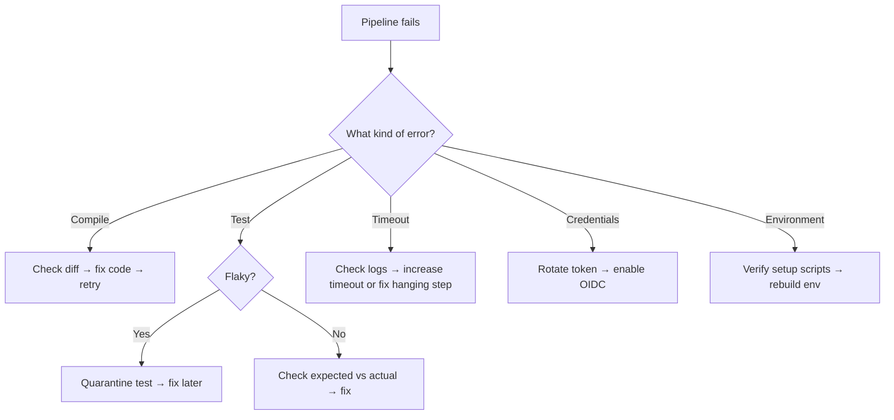

# Playbook: Triage a Failing Pipeline

> [!summary] Goal
> Quickly identify whether the failure is code, environment, credentials, flakiness, or infra. Classify failure type, re-run with context, and choose the right fast mitigation.

## 1. Classify the Failure

| Symptom | Most likely cause | Check | Action |
|:--------|:------------------|:------|:-------|
| Compile error | Code merge broke build | First error in log, check diff since last green | Fix code |
| Test failure (deterministic) | Code change broke a test | Run test locally, check expected vs actual | Fix test or code |
| Flaky test | Timing, ordering, network, random data | Re-run 3×; if passes intermittently, quarantine | Add to flaky list, fix test |
| Pipeline timeout | Build hanging on network or DB lock | Check logs for last activity before timeout | Increase timeout or fix hanging step |
| Credentials expired | Access key, token, or cert expired | `aws sts get-caller-identity`, `curl -I` | Rotate credentials, enable OIDC |
| Registry down | Artifact registry (ECR, Docker Hub) unreachable | `docker pull` from build node | Use pull-through cache or mirror |
| Test environment not ready | DB migration not run, cache empty | Check environment setup step | Fix setup script |

## 2. Triage Workflow

## 3. Fast Mitigations

| Mitigation | When | How |
|:-----------|:-----|:----|
| **Rollback commit** | Last green is known, current diff is suspicious | `git revert HEAD`, push, re-run |
| **Quarantine flaky test** | Test failure is non-deterministic | Add `@Flaky` annotation or move to separate suite |
| **Re-run with retry** | Infrastructure timeout or transient network issue | Click "Re-run" in CI UI |
| **Pin dependency** | Upstream package version broke something | Add lockfile entry or `==` version pin |
| **Disable broken test temporarily** | Need unblocked CI while fix is developed | `@Disabled` with a ticket link |

---

## Cross-Links

- [[CICD/01_Foundations/01_Pipelines_Basics]] for pipeline stage flow
- [[CICD/02_Core/02_Secrets_Management]] for credential troubleshooting
- [[CICD/04_Playbooks/02_Rollback_and_Stabilize_Production]] for production rollback
