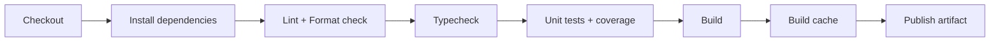

# Project: Build a CI Pipeline for a React App

> [!summary] Goal
> Produce a reliable CI pipeline for a React app: lint → typecheck → unit tests → build → cache dependencies → publish artifact. Include complete GitHub Actions workflow, ESLint/Prettier/TypeScript config, test strategies (Vitest with coverage thresholds), and dependency caching.

## Pipeline Stages



### GitHub Actions Workflow

```yaml
# .github/workflows/ci.yml
name: React CI
on:
  push:
    branches: [main]
  pull_request:
    branches: [main]

jobs:
  ci:
    runs-on: ubuntu-latest
    steps:
      - uses: actions/checkout@v4

      - uses: actions/setup-node@v4
        with:
          node-version: "20"

      - uses: pnpm/action-setup@v2
        with:
          version: 8

      - name: Cache pnpm store
        uses: actions/cache@v4
        with:
          path: ~/.pnpm-store
          key: pnpm-${{ hashFiles('pnpm-lock.yaml') }}
          restore-keys: pnpm-

      - run: pnpm install --frozen-lockfile

      - run: pnpm lint                         # ESLint
      - run: pnpm format:check                 # Prettier (CI mode)

      - run: pnpm typecheck                    # TypeScript

      - run: pnpm test -- --coverage           # Vitest with coverage
      #   Thresholds: branches 80, functions 80, lines 80, statements 80

      - run: pnpm build                        # Vite/webpack build

      - name: Publish artifact
        uses: actions/upload-artifact@v4
        with:
          name: build-output
          path: dist/
```

### Configuration

```jsonc
// vitest.config.ts
export default defineConfig({
  test: {
    coverage: {
      provider: "v8",
      thresholds: {
        branches: 80,
        functions: 80,
        lines: 80,
        statements: 80,
      },
    },
  },
});
```

---

## Cross-Links

- [[CICD/01_Foundations/01_Pipelines_Basics]] for pipeline fundamentals
- [[CICD/GitHubActions/01_Foundations/01_Workflow_Syntax_and_Triggers]] for workflow syntax
- [[React/05_Projects/01_Vite_RR_TS_RTK_RTKQ_Starter_App]] for React project structure
- [[JavaScript/01_Foundations/05_Testing_Benchmarks_and_Profiling]] for Test configuration
