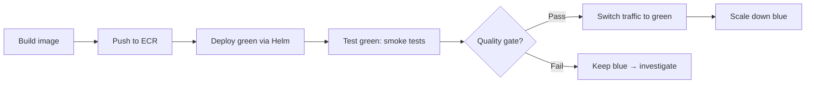

# Project: Build a CD Pipeline (Blue/Green)

> [!summary] Goal
> Build a CD pipeline that deploys a containerized app to Kubernetes using Blue/Green strategy: build → push to registry → deploy blue/green → traffic switch → smoke test → rollback on failure. Includes GitHub Actions workflow, Helm chart structure, and smoke test implementation.

## Pipeline Stages



### GitHub Actions Workflow

```yaml
# .github/workflows/cd.yml
name: CD Blue-Green
on:
  push:
    branches: [main]
    paths: ["app/**", "helm/**"]

permissions:
  id-token: write
  contents: read

env:
  ECR_REGISTRY: ${{ secrets.ECR_REGISTRY }}
  IMAGE_TAG: git-${{ github.sha }}
  CLUSTER_NAME: my-cluster

jobs:
  deploy:
    runs-on: ubuntu-latest
    steps:
      - uses: actions/checkout@v4

      - uses: aws-actions/configure-aws-credentials@v4
        with:
          role-to-assume: arn:aws:iam::ACCOUNT:role/deploy-role
          aws-region: us-east-1

      - name: Login to ECR
        run: aws ecr get-login-password | docker login --password-stdin $ECR_REGISTRY

      - name: Build and push
        run: |
          docker build -t $ECR_REGISTRY/app:$IMAGE_TAG .
          docker push $ECR_REGISTRY/app:$IMAGE_TAG

      - name: Deploy green
        run: |
          helm upgrade --install app-green ./helm \
            --set image.tag=$IMAGE_TAG \
            --set serviceName=app-green \
            --namespace myapp \
            --create-namespace

      - name: Smoke test
        run: |
          GREEN_URL=$(kubectl get svc app-green -n myapp -o jsonpath='{.status.loadBalancer.ingress[0].hostname}')
          for i in 1 2 3 4 5; do
            curl -sf "http://$GREEN_URL/health" && break || sleep 2
          done

      - name: Switch traffic
        run: |
          kubectl patch service app -n myapp \
            -p '{"spec":{"selector":{"app":"app-green"}}}'
          echo "Traffic switched to green"

      - name: Scale down blue
        run: |
          kubectl delete service app-blue -n myapp --ignore-not-found
          helm delete app-blue -n myapp --ignore-not-found
```

### Helm chart structure

```text
helm/
├── Chart.yaml
├── values.yaml
└── templates/
    ├── deployment.yaml
    ├── service.yaml
    └── ingress.yaml
```

```yaml
# helm/values.yaml — key values:
image:
  repository: my-registry/app
  tag: latest
replicaCount: 3
service:
  port: 80
  targetPort: 8080
```

---

## Cross-Links

- [[CICD/02_Core/01_Deployment_Strategies]] for Blue/Green fundamentals
- [[CICD/Kubernetes/02_Core/01_Deployments_Rollouts_and_Strategies]] for K8s blue/green
- [[CICD/Kubernetes/03_Advanced/02_Helm_Package_Management]] for Helm structure
- [[CICD/GitHubActions/01_Foundations/01_Workflow_Syntax_and_Triggers]] for workflow setup
