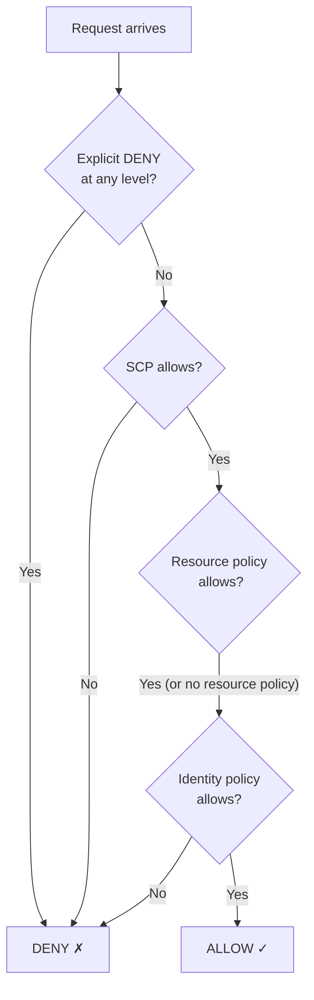

# IAM — Users, Roles, Policies, and Least Privilege

> [!summary] Goal
> Master AWS IAM: identities (users, groups, roles), policy documents (JSON structure, evaluation logic, conditions), OIDC federation for CI/CD, permission boundaries, SCPs, and cross-account access patterns.

## Table of Contents

1. [IAM Identities](#iam-identities)
2. [Policy Documents](#policy-documents)
3. [Policy Evaluation Logic](#policy-evaluation-logic)
4. [IAM Roles and Trust Policies](#iam-roles-and-trust-policies)
5. [OIDC Federation for CI/CD](#oidc-federation-for-ci-cd)
6. [Permission Boundaries and SCPs](#permission-boundaries-and-scps)
7. [Cross-Account Access](#cross-account-access)
8. [Best Practices and Tools](#best-practices-and-tools)

---

## IAM Identities

> [!info] IAM identity
> An IAM identity is an AWS resource that represents a person or service that can make API calls. Three types: **user** (long-lived, for humans), **group** (collection of users with shared permissions), **role** (assumable by trusted entities, for services, federated users, cross-account). Never use root user for daily operations — enable MFA on root and store credentials securely.

| Identity | Use case | Credentials | Best for |
|----------|:--------:|:-----------:|:---------|
| **User** | Human operators | Access key + secret, password, MFA | Individuals with CLI/AWS console access |
| **Group** | Permission management | None (groups have no credentials) | Organizing users with common permissions |
| **Role** | Services, apps, federated users | Temporary (STS, max 12h) | EC2, Lambda, CI/CD, cross-account |

### Root user vs IAM users

```text
Root user capabilities that CANNOT be revoked:
  - Account/billing management
  - Close AWS account
  - Change support plan
  - Enable/disable IAM Identity Center
  - Register as a seller in AWS Marketplace

All other actions should be done through IAM users or roles with MFA.
```

---

## Policy Documents

> [!info] IAM policy
> A JSON document that defines permissions. Contains one or more statements, each with Effect (Allow or Deny), Action (list of service:action), Resource (ARN), and optional Condition.

```json
{
    "Version": "2012-10-17",
    "Statement": [
        {
            "Effect": "Allow",
            "Action": "s3:GetObject",
            "Resource": "arn:aws:s3:::my-bucket/*",
            "Condition": {
                "IpAddress": { "aws:SourceIp": "10.0.0.0/16" }
            }
        }
    ]
}
```

### Policy types

| Type | Scope | Max size | Use case |
|:----:|:-----:|:--------:|----------|
| **AWS managed** | Account-wide | Varies | Common use cases (ReadOnlyAccess, PowerUserAccess) |
| **Customer managed** | Account-wide | 6KB | Reusable across multiple roles/users |
| **Inline** | Single role/user | 3KB per service | One-off policies, last resort |

### ARN anatomy

```text
arn:partition:service:region:account-id:resource-type/resource-id
arn:aws:s3:::my-bucket/*              → S3 bucket and objects
arn:aws:ec2:us-east-1:123456:instance/* → All EC2 instances in account/region
arn:aws:iam::123456:role/MyRole       → IAM role
arn:aws:iam::123456:user/MyUser       → IAM user
```

### Condition keys

```text
aws:SourceIp          — Source IP address
aws:SourceVpc         — Source VPC ID
aws:SourceVpce        — Source VPC Endpoint ID
aws:RequestedRegion   — AWS region for the request
aws:MultiFactorAuthPresent — Whether MFA was used
aws:PrincipalTag      — Tag on the principal
iam:PassedToService   — Service being passed a role to
s3:x-amz-server-side-encryption — Require SSE
```

---

## Policy Evaluation Logic

> [!info] Policy evaluation
> AWS evaluates policies in this order: **explicit Deny** → **Organizations SCP** → **Resource-based policies** → **IAM permissions boundary** → **IAM identity-based policy**. An explicit Deny ALWAYS overrides any Allow. Default is implicit Deny (no permission unless explicitly allowed).



---

## IAM Roles and Trust Policies

> [!info] Trust policy
> A trust policy defines WHO can assume a role. It's attached to the role and specifies trusted principals (AWS accounts, services, federated users). The role's permission policy defines WHAT the assumed entity can do.

```json
{
    "Version": "2012-10-17",
    "Statement": [
        {
            "Effect": "Allow",
            "Principal": {
                "AWS": "arn:aws:iam::123456789012:role/OtherRole",
                "Service": "ec2.amazonaws.com"
            },
            "Action": "sts:AssumeRole",
            "Condition": {
                "StringEquals": { "aws:SourceAccount": "123456789012" }
            }
        }
    ]
}
```

### Common service roles

```text
Service                      Role type
─────────────────────────────────────────────
EC2                          		   	      Instance profile (applied to EC2)
Lambda                       				  Execution role (applied to function)
ECS Task                     			      Task execution role (pull images) + task role (permissions)
CloudFormation               			  Service role (for stack operations)
CodePipeline                 			  Pipeline service role
RDS                          			  RDS to access S3/Secrets Manager
```

---

## OIDC Federation for CI/CD

> [!info] OIDC federation
> OpenID Connect (OIDC) allows GitHub Actions, GitLab CI, or any OIDC-compatible identity provider to assume an IAM role WITHOUT storing long-lived AWS credentials as secrets. The provider verifies the JWT token; AWS exchanges it for temporary STS credentials.

```terraform
# GitHub Actions OIDC provider
resource "aws_iam_openid_connect_provider" "github" {
  url             = "https://token.actions.githubusercontent.com"
  client_id_list  = ["sts.amazonaws.com"]
  thumbprint_list = ["6938fd4d98bab03faadb97b34396831e3780aea1"]
}

# Role with trust policy for GitHub Actions
resource "aws_iam_role" "github_actions" {
  name = "github-actions-deploy"
  assume_role_policy = jsonencode({
    Version = "2012-10-17"
    Statement = [{
      Effect = "Allow"
      Principal = {
        Federated = aws_iam_openid_connect_provider.github.arn
      }
      Action = "sts:AssumeRoleWithWebIdentity"
      Condition = {
        StringEquals = {
          "token.actions.githubusercontent.com:aud" = "sts.amazonaws.com"
          "token.actions.githubusercontent.com:sub" = "repo/my-org/my-repo:ref:refs/heads/main"
        }
      }
    }]
  })
}
```

### CI/CD workflow file

```yaml
# .github/workflows/deploy.yml
permissions:
  id-token: write
  contents: read
jobs:
  deploy:
    runs-on: ubuntu-latest
    steps:
      - uses: actions/checkout@v4
      - uses: aws-actions/configure-aws-credentials@v4
        with:
          role-to-assume: arn:aws:iam::123456789012:role/github-actions-deploy
          aws-region: us-east-1
      - run: aws ecr get-login-password | docker login --password-stdin
```

---

## Permission Boundaries and SCPs

### Permission boundaries

```json
// A permission boundary sets the maximum permissions a role/user can have.
// Even if the identity policy grants more, the boundary caps it.
{
    "Version": "2012-10-17",
    "Statement": [{
        "Effect": "Allow",
        "Action": [
            "ec2:*",
            "s3:*",
            "iam:PassRole"
        ],
        "Resource": "*"
    }]
}
// Attach to a role with: SetPermissionsBoundary
// Use for: delegating permissions to developers while preventing privilege escalation
```

### SCPs (Service Control Policies)

```text
SCPs are managed at the AWS Organizations level:
  - They apply to ALL accounts in an OU (or a single account).
  - They DON'T grant permissions — they only DENY or ALLOW (within boundaries).
  - SCPs affect ALL IAM users/roles in the target accounts (including root).
  - Use SCPs for: restrict regions, block root actions, prevent disabling GuardDuty.

Example SCP: prevent creating non-encrypted EBS volumes:
{
    "Effect": "Deny",
    "Action": "ec2:CreateVolume",
    "Resource": "*",
    "Condition": {
        "StringNotEquals": {
            "ec2:Encrypted": "true"
        }
    }
}
```

---

## Cross-Account Access

```json
// Account A (trusted): role that Account B can assume
{
    "Effect": "Allow",
    "Principal": { "AWS": "arn:aws:iam::222222222222:root" },
    "Action": "sts:AssumeRole"
}

// Account B (trusting): grant RoleA permission to assume in Account A
// `aws sts assume-role --role-arn arn:aws:iam::111111111111:role/CrossAccountRole --role-session-name Deploy`
```

---

## Best Practices and Tools

```text
Policy            Why
────────────────────────────────────────────────────────────
Use roles, not users       Roles use temporary credentials (STS)
Enable MFA on root         Root is omniscient
Use managed policies       Reusable, versioned, less work
SCP to block root          Deny root account actions at OU level
Last access tracking       Find unused permissions in IAM Access Analyzer
Credential report          Review user credentials monthly
Conditions everywhere      Narrow permissions with IP/VPC/Tag/Time conditions
PassRole scoping           Restrict which roles can be passed (iam:PassedToService)
```

---

## Cross-Links

- [[CICD/AWS/01_Foundations/02_EC2_Instances_Storage_and_Networking]] for EC2 instance profiles
- [[CICD/AWS/02_Core/06_KMS_and_Secrets_Manager]] for KMS key policies
- [[CICD/AWS/03_Advanced/05_Security_Encryption_and_Compliance]] for SCPs and GuardDuty
- [[CICD/GitHubActions/02_Core/01_Secrets_Environments_and_OIDC]] for GitHub Actions OIDC
