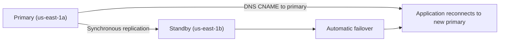

# RDS and Aurora — Databases

> [!summary] Goal
> Master AWS RDS and Aurora: instance/ engine selection, Multi-AZ for HA, read replicas for scale, automated backups, encryption, IAM authentication, RDS Proxy, and performance insights.

## Table of Contents

1. [DB Engines and Instance Selection](#db-engines-and-instance-selection)
2. [Multi-AZ and High Availability](#multi-az-and-high-availability)
3. [Read Replicas](#read-replicas)
4. [Backup and Restore](#backup-and-restore)
5. [RDS Proxy](#rds-proxy)
6. [Aurora — Architecture and Features](#aurora-architecture-and-features)

---

## DB Engines and Instance Selection

> [!info] RDS engines
> RDS supports six engines: **MySQL**, **PostgreSQL**, **MariaDB**, **Oracle**, **SQL Server**, and **Aurora** (MySQL/PostgreSQL compatible). Each has different licensing, features, and pricing. Aurora is AWS's cloud-native engine with significantly better performance and availability.

| Engine | Read replicas | Multi-AZ | Storage auto-scaling | License cost |
|:-------|:-------------:|:--------:|:--------------------:|:------------:|
| **MySQL** | 15 | Yes | Yes | No |
| **PostgreSQL** | 15 | Yes | Yes | No |
| **MariaDB** | 15 | Yes | Yes | No |
| **Oracle** | 1 | Yes | No | Yes (BYOL or license) |
| **SQL Server** | 15 | Yes | No | Yes (BYOL or license) |
| **Aurora** | 15 | Built-in (replicas) | 128TB auto | No (Aurora) |

### Instance class selection

```text
Standard classes (db.m7g, db.r7g) — Graviton3, best price-performance.
Memory-optimized (db.r7g, db.x2iedn) — large in-memory workloads, SAP HANA.
Burstable (db.t4g, db.t3) — dev/test, small web apps (CPU credits, like EC2 T instances).

Storage:
  - gp2/gp3: general-purpose SSD (3 IOPS/GB for gp2, baseline 3000 for gp3).
  - io1/io2: provisioned IOPS (high performance, consistent latency).
  - Aurora: shared cluster volume (6 copies across 3 AZ, auto-growing up to 128TB).
```

---

## Multi-AZ and High Availability

> [!info] Multi-AZ
> Multi-AZ RDS provisions a synchronous standby replica in a different AZ. If the primary fails, RDS automatically fails over to the standby (session drops, app should reconnect). The standby is NOT available for reads — it's only for failover.



```text
Failover triggers:
  - AZ outage.
  - Primary instance failure.
  - Manual reboot with failover.
  - DB instance type change.
  - OS patching.

Failover time: typically 60-120 seconds (DNS propagation + recovery).
RDS Proxy can reduce failover time to ~1 second for Lambda functions.
```

---

## Read Replicas

> [!info] Read replicas
> Read replicas are asynchronous copies of the primary DB. They can serve read traffic (scale reads) and be promoted to primary (for DR). Each engine has a different max. Up to 5 direct replication links; chains allowed.

```text
Read replica uses:
  - Offload read-heavy traffic (reporting, analytics) from primary.
  - Cross-region DR (replica in another region).
  - Promote to primary if regional disaster occurs.

Cross-region replication: charged for data transfer out.
Monitoring: `ReplicaLag` metric (in seconds). High lag = primary overload or replica undersized.
```

---

## Backup and Restore

### Automated backups

```text
Enabled by default (retention 1–35 days).
  - Daily snapshot (during backup window).
  - Transaction logs every 5 minutes (PITR — point-in-time recovery, down to the second).
  - Stored in S3 (encrypted at rest, free at 100% of DB storage).
  - Manual snapshots persist until deleted (charged at S3 rates).

PITR: restore to any second within retention, creates a NEW DB instance.
```

### Manual snapshots

```text
Manual snapshots:
  - Persistent (never expire unless you delete).
  - Cross-region copy: for DR, dev/test in another region.
  - Share with other accounts: export to S3 (in Parquet format for Athena/Redshift analysis).
  - Restore: create new DB instance from snapshot (not the same instance — this is for cloning/DR).

Export to S3 feature: export snapshot data to S3 in Parquet format for analytics.
```

---

## RDS Proxy

> [!info] RDS Proxy
> RDS Proxy is a fully managed, highly available database proxy that pools and shares connections, reducing failover time from 60s to ~1s. Essential for serverless workloads (Lambda) where connection overhead is significant.

```text
RDS Proxy benefits:
  - Connection pooling: reuse connections across invocations (Lambda doesn't pool DB connections natively).
  - IAM authentication: Lambda can use IAM role instead of DB user/password.
  - Reduced failover: proxy keeps connections alive across failover (queries may retry).
  - Rate limiting: prevents DB overload from too many connections.

When to use:
  - Lambda → RDS (MUST use Proxy in most cases — cold start + connection limit).
  - High connection count applications (thousands of concurrent connections).
  - HA/failover-critical applications.
```

---

## Aurora — Architecture and Features

> [!info] Aurora
> Aurora is AWS's cloud-native relational database. It separates compute (DB instances) from storage (shared cluster volume). The cluster volume is replicated across 3 AZs (6 copies). It's compatible with MySQL 8.0 and PostgreSQL 15.

```text
Aurora key features:
  - Storage up to 128TB, auto-scaling.
  - 6 copies across 3 AZs (can survive 2 copies loss without impact, 3 copies loss without data loss).
  - Writer endpoint (primary) + reader endpoint (load-balanced across replicas).
  - Up to 15 read replicas (fast Aurora Replicas: ~10ms lag).
  - Backtrack: rewind cluster to a specific point in time (no restore needed).
  - Fast Cloning: create new databases from snapshots (storage the same until written).

Aurora Serverless v2:
  - Auto-scale compute capacity (in fractional units: 0.5 ACU to 128 ACU).
  - Pay per ACU (Aurora Capacity Unit) per second.
  - Can scale to zero (no compute cost when idle, but storage still costs).
  - Supports Multi-AZ and read replicas (unlike v1).

Global Database:
  - One primary region (writer), up to 5 secondary regions (read-only).
  - ~1 second replication lag between regions.
  - Use for: disaster recovery, cross-region reads.
  - Failover in < 1 minute (promote secondary to primary).
```

---

## Cross-Links

- [[CICD/AWS/02_Core/02_EKS_Clusters_Node_Groups_and_Pods]] for running DB sidecars
- [[CICD/AWS/01_Foundations/07_Lambda_Functions_Events_and_Best_Practices]] for Lambda + RDS Proxy
- [[CICD/AWS/03_Advanced/02_Cost_Management_and_Optimization]] for RDS Reserved Instances
- [[CICD/AWS/04_Playbooks/02_Debug_ECS_EKS_Deployments]] for DB connection issues in deployments
