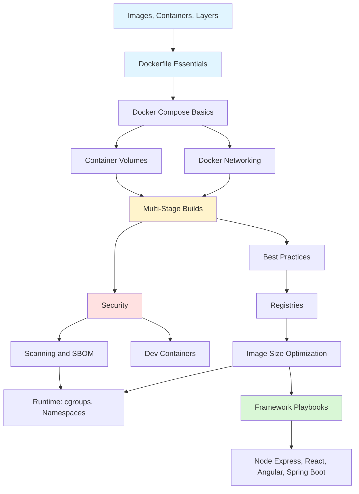

# Docker

> [!summary] Scope
> Container fundamentals through production deployment: images, containers, layers, Dockerfile instructions, Compose, volumes, networking, multi-stage builds, security, registries, security scanning, dev containers, and framework-specific containerization guides.

## Learning Path

## Topic Map

### Foundations (5 files)

#### [[CICD/Docker/01_Foundations/01_Images_Containers_and_Layers]]
- Image vs container, layer stacking and caching, union filesystem
- Container lifecycle state machine (created → running → stopped → removed)
- 15+ Docker CLI commands with argument variations (build, run, ps, exec, logs, push, pull, tag, inspect)
- Image digests (`image@sha256:...`) vs tags

#### [[CICD/Docker/01_Foundations/02_Dockerfile_Essentials]]
- All 15 Dockerfile instructions with examples (`FROM`, `WORKDIR`, `COPY`/`ADD`, `RUN`, `CMD`/`ENTRYPOINT`, `ENV`/`ARG`, `EXPOSE`, `USER`, `HEALTHCHECK`, `LABEL`, `VOLUME`, `SHELL`, `ONBUILD`, `STOPSIGNAL`)
- Differences tables: `COPY` vs `ADD`, `CMD` vs `ENTRYPOINT` (shell vs exec form), `ENV` vs `ARG`
- `.dockerignore` syntax, multi-platform builds with BuildKit
- Pitfalls: using `latest`, secrets in image, not chaining cleanup

#### [[CICD/Docker/01_Foundations/03_Docker_Networking_Basics]]
- All 6 network drivers (bridge, host, overlay, none, macvlan, ipvlan) with decision tree
- Bridge network: default vs user-defined (DNS by container name), port publishing patterns
- Container DNS and embedded resolver (`127.0.0.11`)
- Custom networks: create, connect, disconnect, inspect

#### [[CICD/Docker/01_Foundations/04_Docker_Compose_Basics]]
- Compose file structure: services, volumes, networks, profiles
- All Compose CLI commands (up, down, logs, exec, ps, build, pull, config)
- Service definition reference: `image`, `build`, `ports`, `environment`, `volumes`, `depends_on`, `healthcheck`, `profiles`
- Compose watch for hot-reload, Compose vs `docker run` comparison table
- Profiles for dev vs production service separation

#### [[CICD/Docker/01_Foundations/05_Container_Volumes_and_Storage]]
- Bind mounts (`-v` vs `--mount`), named volumes, anonymous volumes, tmpfs
- Volume types comparison table (8 rows: host location, Docker-managed, backup, performance, persistence)
- Volume drivers: local, NFS, EBS, Azure File
- Backup and restore with `docker run --rm -v` + tar pattern

### Core (4 files)

#### [[CICD/Docker/02_Core/01_MultiStage_Builds_and_Caching]]
- Multi-stage: basic pattern, BuildKit features, cache mounts
- Language-specific examples: Node.js (Alpine runtime), Spring Boot (layered JAR extraction + 4-tier cache), Go (scratch), Python (Alpine)
- Build cache optimization: instruction ordering by change frequency, cache invalidation causes table

#### [[CICD/Docker/02_Core/02_Security_Basics_Users_Capabilities]]
- Non-root user (`USER`, `addgroup`/`adduser`, `--user`)
- Linux capabilities: default set, `--cap-drop=ALL`, `--cap-add=NET_BIND_SERVICE`
- Read-only root filesystem (`--read-only` + `--tmpfs`), seccomp, AppArmor, `no-new-privileges`
- Danger of `--privileged` and Docker socket mounting
- Security checklist (10 items)

#### [[CICD/Docker/02_Core/03_Dockerfile_Best_Practices_and_AntiPatterns]]
- Cache-friendly ordering, layer minimization, pinning base images
- `.dockerignore` best practices, `npm ci` vs `npm install` comparison, BuildKit features (cache mounts, bind mounts, secrets)
- Anti-patterns reference table (10 rows: problem, why bad, fix)

#### [[CICD/Docker/02_Core/04_Container_Registries_and_Publishing]]
- Registry types: Docker Hub, GHCR, ECR, GCR, ACR, Harbor, Nexus
- Authentication methods per registry, credential storage (`~/.docker/config.json`)
- Tagging strategies (Git SHA, SemVer, environment), tag vs digest comparison
- Docker Hub rate limits, pull-through mirror configuration

### Advanced (4 files)

#### [[CICD/Docker/03_Advanced/01_Debug_Image_Size_and_Build_Perf]]
- Base image size comparison: ubuntu (200MB) → slim → alpine (7MB) → distroless (12MB) → scratch (0MB)
- Distroless and scratch Dockerfiles, layer analysis with `docker history`
- `dive` tool for visual layer inspection, build performance optimization table

#### [[CICD/Docker/03_Advanced/02_Container_Runtime_Cgroups_Namespaces_Basics]]
- 7 Linux namespaces (pid, net, mnt, uts, ipc, user, cgroup) with isolation diagram
- cgroup v1 vs v2, resource limits (`--cpus`, `--memory`, `--memory-swap`), Compose `deploy.resources`
- OCI runtime stack: Docker → containerd → runc, alternative runtimes (crun, gVisor, Kata)
- `docker stats`, `docker events`, OOM detection

#### [[CICD/Docker/03_Advanced/03_Docker_Security_Scanning_and_SBOM]]
- Trivy: severity filtering, output formats (table, JSON, SARIF, CycloneDX), CI integration
- Docker Scout: quickview, recommendations, compare, CVEs
- Syft for SBOM generation (SPDX, CycloneDX), Cosign image signing (key-based + keyless OIDC)
- Scanning tools comparison table (Trivy vs Scout vs Grype vs Snyk)

#### [[CICD/Docker/03_Advanced/04_DevContainers_and_Development_Environments]]
- `devcontainer.json` properties: `image`, `build`, `features`, `extensions`, `settings`, `forwardPorts`, `postCreateCommand`
- Features: node, python, docker-in-docker, git, terraform, azure-cli, gh CLI
- GitHub Codespaces integration, Dev container vs production Dockerfile comparison
- Multi-service dev container with Compose (app + PostgreSQL + Redis)

### Playbooks (6 files)

#### [[CICD/Docker/04_Playbooks/01_Troubleshoot_Container_Networking]]
- Systematic debugging workflow decision tree
- Common scenarios table (10 rows: symptom, cause, fix)
- Debugging with `nicolaka/netshoot` container (curl, dig, nslookup, tcpdump)

#### [[CICD/Docker/04_Playbooks/02_Containerize_a_Node_Express_App]]
- Production multi-stage Dockerfile with non-root user and healthcheck
- Compose: API + PostgreSQL + Redis with health check dependencies
- `.dockerignore` for Node.js

#### [[CICD/Docker/04_Playbooks/03_Containerize_a_React_App]]
- Multi-stage: build in `node:20-alpine`, serve from `nginx:alpine` (~25MB final)
- Nginx config: SPA fallback, gzip, caching, security headers, optional API proxy
- Runtime env var injection via entrypoint script (same image for all environments)

#### [[CICD/Docker/04_Playbooks/04_Containerize_an_Angular_App]]
- Multi-stage: build + Nginx for CSR, or SSR with Node runtime
- Nginx config for Angular SPA, runtime env injection, API proxy
- SSR Dockerfile with Angular Universal (Node runtime)
- Base href handling for subpath deployment

#### [[CICD/Docker/04_Playbooks/05_Containerize_a_Spring_Boot_App]]
- Maven and Gradle multi-stage Dockerfiles with layered JAR extraction (4 tiers)
- JVM container-aware flags (`UseContainerSupport`, `MaxRAMPercentage`, `ExitOnOutOfMemoryError`)
- Actuator health endpoint + `HEALTHCHECK`, distroless alternative
- Compose: Spring Boot + PostgreSQL + Redis

#### [[CICD/Docker/04_Playbooks/06_Containerize_a_Full_Stack_App_with_Compose]]
- Full architecture: Nginx → React + API + PostgreSQL + Redis
- Production vs development Compose files with profiles
- Nginx reverse proxy configuration (frontend + API + WebSocket)
- `.env` file, database migration setup, startup commands

---

## Recommended Paths

| Path | Files | Target |
|------|-------|--------|
| **Quick Start** | F01, F02, F04 | First container in minutes |
| **Production Build** | F01-F05, C01, C03, C04 | Production-ready images |
| **Security** | C02, A03, A02 | Secure containers + scanning |
| **Framework Guides** | P02-P06 | Node/React/Angular/Spring Boot |
| **Developer Experience** | A04, F05 | Dev containers, volumes |

## Cross-Links

- [[CICD/GitHubActions/00_MOC/00_GitHubActions_MOC]] for Docker build/push in CI/CD
- [[CICD/Kubernetes/00_MOC/00_Kubernetes_MOC]] for container orchestration
- [[CICD/Terraform/00_MOC/00_Terraform_MOC]] for infrastructure provisioning

---

## References

- [Docker Documentation](https://docs.docker.com/)
- [Dockerfile Reference](https://docs.docker.com/engine/reference/builder/)
- [Docker Compose File Reference](https://docs.docker.com/compose/compose-file/)
- [Docker Best Practices](https://docs.docker.com/develop/develop-images/dockerfile_best-practices/)
- [Docker Security](https://docs.docker.com/engine/security/)
