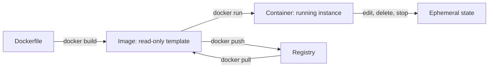
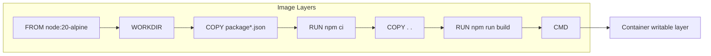
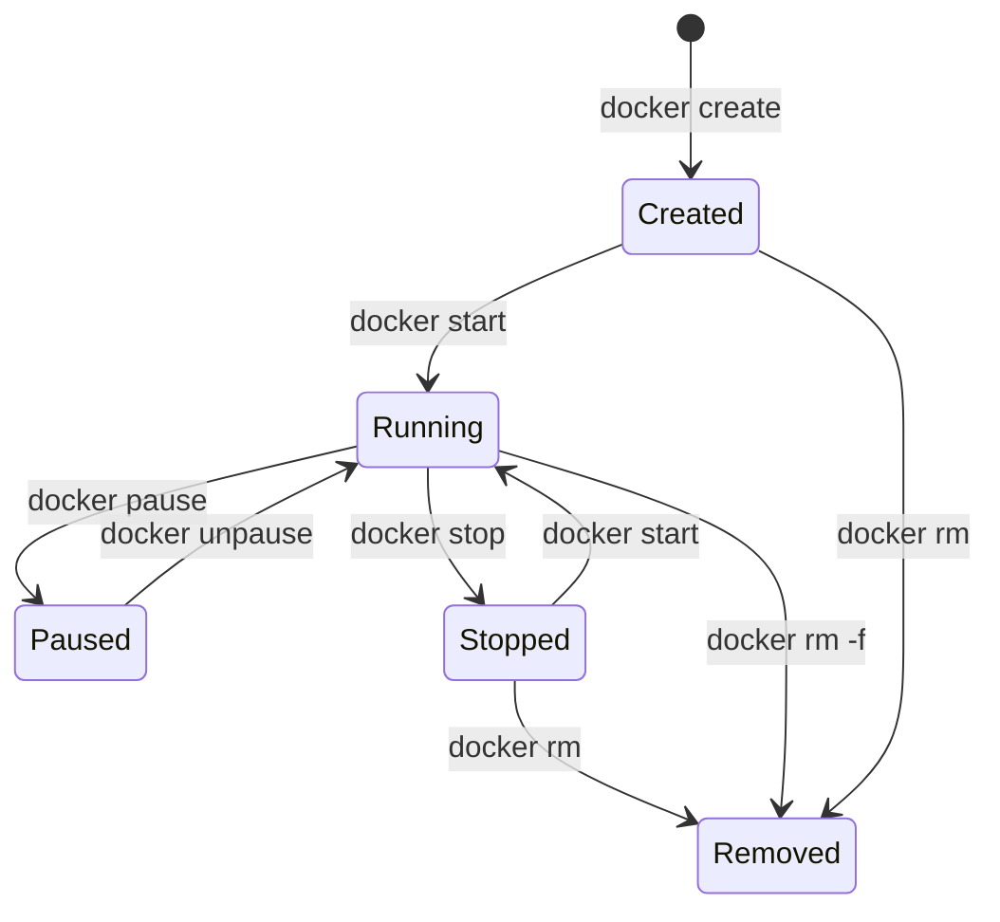

# Images, Containers, and Layers

> [!summary] Goal
> Understand what Docker actually builds and runs: images as read-only layers, containers as running instances, and the CLI commands that manage both.

## Table of Contents

1. [Why This Matters](#why-this-matters)
2. [Image vs Container](#image-vs-container)
3. [Image Layers Deep Dive](#image-layers-deep-dive)
4. [Container Lifecycle](#container-lifecycle)
5. [Docker CLI Commands Reference](#docker-cli-commands-reference)
6. [Image Digests](#image-digests)
7. [Inspecting Images and Containers](#inspecting-images-and-containers)
8. [Pitfalls](#pitfalls)

---

## Why This Matters

Everything in Docker builds on the image-container relationship. Understanding layers explains why builds are fast or slow, and why images are large or small.



> [!tip] Definition
> **Image**: a read-only template composed of stacked layers. Each layer corresponds to one instruction in the Dockerfile.
> **Container**: a runnable instance of an image. It adds a thin writable layer on top of the image layers.

---

## Image vs Container

| Aspect | Image | Container |
|--------|-------|-----------|
| Persistence | Permanent (until deleted) | Ephemeral (stops, can be removed) |
| Mutability | Read-only | Writable layer on top |
| Layers | Multiple stacked layers | Image layers + thin writable layer |
| Lifecycle | Exists in registry or locally | Created → Running → Stopped → Removed |
| Size | Sum of all layers | Image size + writable layer (runtime data) |

---

## Image Layers Deep Dive

Every Dockerfile instruction creates a new layer:

```dockerfile
FROM node:20-alpine          # Layer 1: base OS + Node
WORKDIR /app                 # Layer 2: metadata
COPY package*.json ./        # Layer 3: lockfiles
RUN npm ci                   # Layer 4: dependencies
COPY . .                     # Layer 5: source code
RUN npm run build            # Layer 6: compiled output
CMD ["node", "dist/main.js"] # Layer 7: metadata
```



### Layer sharing

Two images using the same base image share those layers — each uses the same cached layer on disk:

```bash
# If both use node:20-alpine, the base layer is downloaded once
# Subsequent layers are cached until the instruction or its inputs change
docker pull node:20-alpine
docker pull node:20-alpine-slim   # shares base layers
```

---

## Container Lifecycle



```bash
docker create --name my-app nginx:alpine  # Created — not running
docker start my-app                        # Running
docker stop my-app                         # Stopped (SIGTERM, wait, SIGKILL)
docker rm my-app                           # Removed

# Shortcut:
docker run --rm -d --name my-app nginx:alpine  # Create + Start + Auto-remove on stop
```

---

## Docker CLI Commands Reference

### Build commands

```bash
docker build -t my-app:latest .                     # Build image from Dockerfile
docker build -t my-app:v1.2 --build-arg NODE_ENV=production .  # Build with args
docker buildx build --platform linux/amd64,linux/arm64 -t my-app .  # Multi-arch
```

### Run commands

```bash
docker run -d --name my-app nginx:alpine            # Detached mode
docker run --rm -it node:20-alpine sh                # Interactive + auto-remove
docker run -p 8080:80 -v $(pwd):/app -w /app node npm run dev  # Dev with mount
docker run --memory=512m --cpus=1 my-app            # Resource limits
```

### Manage containers

```bash
docker ps                            # Running containers
docker ps -a                         # All containers (including stopped)
docker logs -f --tail 100 my-app     # Tail last 100 lines
docker exec -it my-app sh            # Run command inside running container
docker stats my-app                  # Live resource usage
docker top my-app                    # Running processes
docker port my-app                   # Published port mappings
docker inspect my-app                # Full container metadata (JSON)
docker stop my-app                   # Graceful stop (SIGTERM + wait)
docker kill my-app                   # Force stop (SIGKILL)
docker restart my-app                # Stop + start
docker rm my-app                     # Remove stopped container
docker rm -f my-app                  # Force remove running container
docker container prune               # Remove all stopped containers
```

### Manage images

```bash
docker images                        # List local images
docker images --digests              # Show digest (SHA)
docker history my-app                # Show layer history and sizes
docker rmi my-app                    # Remove image
docker image prune                   # Remove dangling images
```

### Registry commands

```bash
docker login                         # Log in to Docker Hub
docker login ghcr.io                 # Log in to GHCR
docker tag my-app:latest ghcr.io/org/my-app:v1.2  # Tag for registry
docker push ghcr.io/org/my-app:v1.2              # Push to registry
docker pull ghcr.io/org/my-app:v1.2              # Pull from registry
docker logout                        # Log out
```

---

## Image Digests

Every image has a content-addressable digest (`sha256:...`). Unlike tags, digests are **immutable**:

```bash
docker images --digests
# REPOSITORY    TAG       DIGEST
# my-app        latest    sha256:a1b2c3...

# Pull by digest — always get the same content
docker pull my-app@sha256:a1b2c3...

# Tag by digest
docker tag my-app@sha256:a1b2c3... my-app:v1.2
```

| Reference | Mutable | Use when |
|-----------|---------|----------|
| `my-app:latest` | Yes (can be retagged) | Local dev, convenience |
| `my-app:v1.2.3` | Usually no (releases) | CI/CD, deployments |
| `my-app@sha256:a1b2c3` | **Never** | Production pinning, auditability |

---

## Inspecting Images and Containers

```bash
# Full JSON metadata
docker inspect my-app
docker inspect my-app --format '{{.Config.Cmd}}'          # CMD
docker inspect my-app --format '{{.Config.ExposedPorts}}' # Ports
docker inspect my-app --format '{{.GraphDriver.Data}}'    # Layer IDs

# Image history
docker history my-app
# IMAGE          CREATED       CREATED BY                  SIZE
# abc123         2 min ago    CMD ["node"...]              0B
# def456         2 min ago    RUN npm run build            45MB
```

---

## Pitfalls

### Not cleaning up stopped containers

```bash
docker ps -a  # Shows dozens of stopped containers
```

**Fix**: Use `--rm` flag with `docker run` for temporary containers. Run `docker container prune` regularly.

### Building with `latest` tag

`docker build -t my-app .` defaults to `latest`, but you can't tell which version it actually is.

**Fix**: Always tag builds with commit SHA or SemVer: `docker build -t my-app:$CI_COMMIT_SHA .`

### Assuming container is a VM

Containers share the host kernel. A Linux container won't run on a Windows host without a VM.

**Fix**: Use Docker Desktop (includes Linux VM on Windows/macOS) or match host architecture.

---

> [!question]- Interview Questions
>
> **Q: What is the difference between a Docker image and a container?**
> A: An image is a read-only template with stacked layers. A container is a running instance of an image with a thin writable layer on top.
>
> **Q: How does Docker cache layers?**
> A: Each Dockerfile instruction creates a layer. If the instruction and its inputs haven't changed, Docker reuses the cached layer. Cache is invalidated when the instruction changes or files copied by `COPY`/`ADD` differ.
>
> **Q: What is an image digest and why use it?**
> A: A SHA-256 hash of the image manifest, uniquely identifying the content. Use digests in production to guarantee the exact image version, avoiding tag mutability issues.

---

## Cross-Links

- [[CICD/Docker/01_Foundations/02_Dockerfile_Essentials]] for building images
- [[CICD/Docker/01_Foundations/04_Docker_Compose_Basics]] for multi-container apps
- [[CICD/Docker/02_Core/04_Container_Registries_and_Publishing]] for pushing images

---

## References

- [Docker CLI Reference](https://docs.docker.com/engine/reference/commandline/cli/)
- [About Images, Containers, and Storage Drivers](https://docs.docker.com/storage/storagedriver/)
- [Docker run Reference](https://docs.docker.com/engine/reference/run/)
