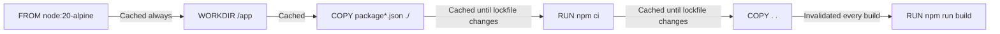
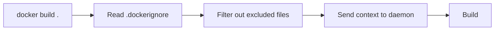

# Dockerfile Essentials

> [!summary] Goal
> Build small, cache-friendly, secure images: master every Dockerfile instruction, understand order and layer impact, and follow production best practices.

## Table of Contents

1. [Why Dockerfile Order Matters](#why-dockerfile-order-matters)
2. [FROM — Base Image](#from-base-image)
3. [WORKDIR — Working Directory](#workdir-working-directory)
4. [COPY vs ADD](#copy-vs-add)
5. [RUN — Execute Commands](#run-execute-commands)
6. [CMD vs ENTRYPOINT](#cmd-vs-entrypoint)
7. [ENV vs ARG](#env-vs-arg)
8. [EXPOSE — Document Ports](#expose-document-ports)
9. [USER — Non-Root User](#user-non-root-user)
10. [HEALTHCHECK — Container Health](#healthcheck-container-health)
11. [LABEL — Metadata](#label-metadata)
12. [VOLUME — Persistent Data](#volume-persistent-data)
13. [SHELL — Custom Shell](#shell-custom-shell)
14. [ONBUILD — Triggers for Child Builds](#onbuild-triggers-for-child-builds)
15. [STOPSIGNAL — Graceful Shutdown](#stopsignal-graceful-shutdown)
16. [.dockerignore](#dockerignore)
17. [Multi-Platform Builds](#multi-platform-builds)
18. [Pitfalls](#pitfalls)

---

## Why Dockerfile Order Matters

Each instruction creates a **layer**. Docker caches each layer and reuses it if nothing changed. Put instructions that change **least often** first.



> [!tip] Definition
> **Layer**: each Dockerfile instruction produces a new read-only layer. Docker caches layers and reuses them on subsequent builds when the instruction text and input files are identical.

---

## FROM — Base Image

```dockerfile
FROM node:20-alpine
FROM node:20-alpine@sha256:a1b2c3...
FROM --platform=$BUILDPLATFORM node:20-alpine AS builder
```

| Variant | Size | Use case |
|---------|------|----------|
| `ubuntu:24.04` | ~200MB | Full OS, apt packages |
| `slim` (e.g., `node:20-slim`) | ~80MB | Minimal glibc-based |
| `alpine` (e.g., `node:20-alpine`) | ~7MB | musl libc, small, common |
| `distroless` (e.g., `gcr.io/distroless/nodejs`) | ~12MB | Only runtime, no shell |
| `scratch` | 0MB | Empty base — for static binaries |

**Pin a specific version** — never use `FROM node` (equivalent to `node:latest`).

---

## WORKDIR — Working Directory

```dockerfile
WORKDIR /app
```

Sets the working directory for all subsequent instructions (`RUN`, `COPY`, `CMD`, `ENTRYPOINT`). Creates the directory if it doesn't exist. Prefer `WORKDIR` over `RUN mkdir -p && cd`.

---

## COPY vs ADD

```dockerfile
COPY package*.json ./
COPY --chown=node:node --from=build /app/dist ./dist
ADD https://example.com/file.tar.gz /tmp/
```

| Aspect | COPY | ADD |
|--------|------|-----|
| Local files | ✅ Yes | ✅ Yes |
| URL download | ❌ | ✅ (but use `RUN curl` instead) |
| Auto-extract tar | ❌ | ✅ (can cause unexpected results) |
| Cache-friendly | ✅ More predictable | ❌ |
| **Recommendation** | ✅ **Always prefer** | ❌ Avoid for most use cases |

**Rule**: Use `COPY` unless you have a specific reason to use `ADD`.

---

## RUN — Execute Commands

```dockerfile
RUN npm ci
RUN apt-get update && apt-get install -y --no-install-recommends curl
RUN --mount=type=cache,target=/root/.npm npm ci   # BuildKit cache mount
```

### RUN chaining

Combine related commands with `&&` to avoid unnecessary layers:

```dockerfile
# BAD — three layers
RUN apt-get update
RUN apt-get install -y curl
RUN rm -rf /var/lib/apt/lists/*

# GOOD — one layer
RUN apt-get update && \
    apt-get install -y --no-install-recommends curl && \
    rm -rf /var/lib/apt/lists/*
```

### BuildKit cache mounts

```dockerfile
# Cache npm packages between builds
RUN --mount=type=cache,target=/root/.npm npm ci
# Cache apt packages
RUN --mount=type=cache,target=/var/cache/apt apt-get update && \
    apt-get install -y curl
```

---

## CMD vs ENTRYPOINT

```dockerfile
CMD ["node", "dist/main.js"]
ENTRYPOINT ["node"]
CMD ["dist/main.js"]       # Default arguments to ENTRYPOINT
```

| Aspect | CMD | ENTRYPOINT |
|--------|-----|------------|
| Overridable by `docker run args` | ✅ Yes (fully replaced) | ✅ Yes (appended as arguments) |
| Default for container | Provides defaults | Defines the executable |
| Form | Shell: `CMD node app.js` — Exec: `CMD ["node", "app.js"]` | Same two forms |
| Best use | Default arguments, flags | Main executable |

```bash
# Shell form — runs via /bin/sh -c (PID 1 is sh)
CMD node app.js

# Exec form — runs directly (PID 1 is node) — PREFERRED
CMD ["node", "app.js"]
```

**Always use exec form** (`["cmd", "arg"]`) — shell form doesn't handle signals properly.

---

## ENV vs ARG

```dockerfile
ARG NODE_ENV=production       # Build-time only
ENV NODE_ENV=${NODE_ENV}      # Run-time available
ENV PORT=3000                 # Hardcoded env var
```

| Aspect | ARG | ENV |
|--------|-----|-----|
| Available at build time | ✅ | ✅ |
| Available at run time | ❌ | ✅ |
| Set via `--build-arg` | ✅ | ❌ (use ARG + ENV pattern) |
| Override in `docker run -e` | ❌ | ✅ |
| Persisted in image | ❌ | ✅ |

### Passing build args to runtime

```dockerfile
ARG APP_VERSION              # build-time only
ENV APP_VERSION=$APP_VERSION # promoted to run-time
```

```bash
docker build --build-arg APP_VERSION=v1.2.3 -t my-app .
docker run my-app          # APP_VERSION=v1.2.3 available
```

---

## EXPOSE — Document Ports

```dockerfile
EXPOSE 3000
EXPOSE 5432/tcp
EXPOSE 5432/udp
```

`EXPOSE` is **documentation only** — it doesn't publish the port. Use `-p` at runtime for actual publishing. `EXPOSE` tells users of the image which ports the application listens on.

---

## USER — Non-Root User

```dockerfile
RUN addgroup -g 1001 -S nodejs && \
    adduser -S nodejs -u 1001 -G nodejs
USER nodejs
```

Never run containers as root. Create a non-root user and switch to it before `CMD`.

---

## HEALTHCHECK — Container Health

```dockerfile
HEALTHCHECK --interval=30s --timeout=3s --start-period=5s --retries=3 \
  CMD curl -f http://localhost:3000/health || exit 1
```

| Option | Default | Description |
|--------|---------|-------------|
| `--interval` | 30s | How often to check |
| `--timeout` | 30s | Single check timeout |
| `--start-period` | 0s | Grace period before first check |
| `--retries` | 3 | Consecutive failures before unhealthy |

Docker checks health and reports it via `docker ps` (Status column) and `docker inspect`.

---

## LABEL — Metadata

```dockerfile
LABEL version="1.2.3"
LABEL maintainer="devops@example.com"
LABEL org.opencontainers.image.source="https://github.com/org/repo"
```

Labels are key-value metadata, useful for organization, automation, and OCI annotations.

---

## VOLUME — Persistent Data

```dockerfile
VOLUME /data
VOLUME ["/var/lib/mysql", "/etc/config"]
```

Declares that the specified path should be a mount point. If no volume is mounted at runtime, Docker creates an anonymous volume.

---

## SHELL — Custom Shell

```dockerfile
SHELL ["/bin/bash", "-c"]         # Default for Linux
SHELL ["powershell", "-Command"]  # Windows container
```

Changes the default shell used by shell-form `RUN`, `CMD`, and `ENTRYPOINT`.

---

## ONBUILD — Triggers for Child Builds

```dockerfile
ONBUILD COPY package*.json ./
ONBUILD RUN npm ci
```

Triggers execute when the image is used as a base (`FROM my-base-image`). Common for language base images.

---

## STOPSIGNAL — Graceful Shutdown

```dockerfile
STOPSIGNAL SIGTERM
STOPSIGNAL SIGQUIT
```

Default is `SIGTERM`. Override when your application needs a different signal for graceful shutdown.

---

## .dockerignore

Prevents sending unnecessary files to the Docker daemon during build:

```dockerfile
# .dockerignore
node_modules
.git
.gitignore
*.md
coverage
.env
dist
.DS_Store
```



---

## Multi-Platform Builds

```dockerfile
FROM --platform=$BUILDPLATFORM node:20-alpine AS build
```

```bash
docker buildx build \
  --platform linux/amd64,linux/arm64 \
  -t my-app .
```

---

## Pitfalls

### Using `latest` as base image

```dockerfile
FROM node          # Same as node:latest — changes unpredictably
```

**Fix**: `FROM node:20-alpine` or `FROM node:20-alpine@sha256:...`

### Installing unnecessary packages

Every `apt-get install` adds MB to the image.

**Fix**: Use `--no-install-recommends`. Consider Alpine base. Don't install build tools in runtime stage.

### Hardcoded secrets in image

```dockerfile
ARG DB_PASSWORD
ENV DB_PASSWORD=$DB_PASSWORD  # Persisted in the image!
```

**Fix**: Use build secrets: `RUN --mount=type=secret,id=db_password cat /run/secrets/db_password`.

### Not cleaning up in the same RUN

```bash
RUN apt-get update && apt-get install -y curl
RUN rm -rf /var/lib/apt/lists/*   # This layer doesn't recover the space from the previous!
```

**Fix**: Chain update, install, and cleanup in a single `RUN`.

---

> [!question]- Interview Questions
>
> **Q: What is the difference between CMD and ENTRYPOINT?**
> A: `CMD` provides default arguments that are fully replaced by `docker run` args. `ENTRYPOINT` defines the executable; `docker run` args become arguments to it. Combine them: `ENTRYPOINT ["node"]` + `CMD ["app.js"]`.
>
> **Q: What is the difference between COPY and ADD?**
> A: `COPY` copies local files into the image. `ADD` can also download URLs and auto-extract tar archives. Prefer `COPY` — it's more predictable.
>
> **Q: How do you prevent a secret from persisting in the image?**
> A: Use BuildKit `--mount=type=secret` or multi-stage builds where the secret is consumed in a build stage that isn't copied to the final image.
>
> **Q: What does HEALTHCHECK do?**
> A: It tells Docker to periodically run a command inside the container. If it exits non-zero consecutively (retries), the container status becomes `unhealthy`. Orchestrators can restart unhealthy containers.

---

## Cross-Links

- [[CICD/Docker/01_Foundations/01_Images_Containers_and_Layers]] for layer caching
- [[CICD/Docker/02_Core/01_MultiStage_Builds_and_Caching]] for advanced build patterns
- [[CICD/Docker/02_Core/02_Security_Basics_Users_Capabilities]] for USER and security

---

## References

- [Dockerfile Reference](https://docs.docker.com/engine/reference/builder/)
- [Best Practices for Writing Dockerfiles](https://docs.docker.com/develop/develop-images/dockerfile_best-practices/)
- [Multi-platform builds](https://docs.docker.com/build/building/multi-platform/)
