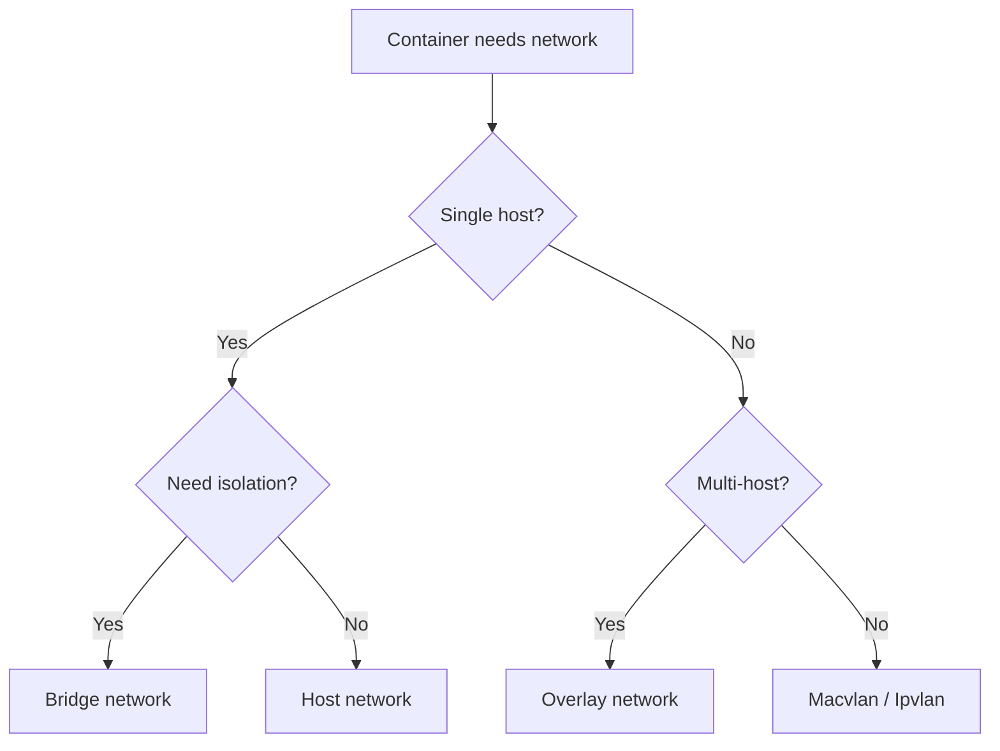
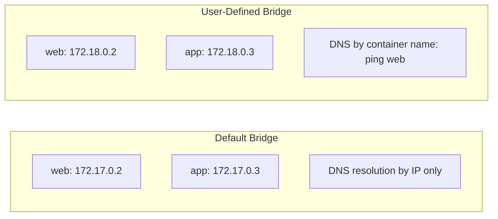
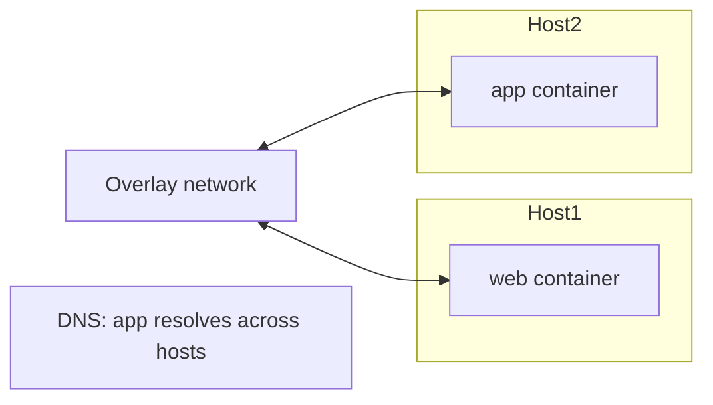

# Docker Networking Basics

> [!summary] Goal
> Understand how containers communicate: choose the right network driver, publish ports correctly, and use Docker's embedded DNS for service discovery.

## Table of Contents

1. [Why Networking Matters](#why-networking-matters)
2. [Network Drivers Overview](#network-drivers-overview)
3. [Bridge Network (Default)](#bridge-network)
4. [Host Network](#host-network)
5. [Overlay Network](#overlay-network)
6. [None, Macvlan, and Ipvlan Networks](#none-macvlan-and-ipvlan-networks)
7. [Port Publishing](#port-publishing)
8. [Container DNS and Service Discovery](#container-dns-and-service-discovery)
9. [Custom Networks](#custom-networks)
10. [Pitfalls](#pitfalls)

---

## Why Networking Matters

Containers need to communicate with each other, the host, and external services. Docker provides several network drivers with different isolation and performance characteristics.



---

## Network Drivers Overview

| Driver | Isolation | Scope | Use case |
|--------|-----------|-------|----------|
| **bridge** (default) | Containers on same bridge can communicate | Single host | Default for most apps |
| **host** | No isolation — uses host network stack | Single host | Performance-critical, no port mapping needed |
| **overlay** | Encapsulated, multi-host | Multi-host (Swarm) | Swarm services, cross-host communication |
| **none** | No network | Single host | Security-sensitive, air-gapped containers |
| **macvlan** | MAC address per container | Single host | Legacy apps that need direct network access |
| **ipvlan** | IP per container (same MAC) | Single host | High-performance, large IP pools |

---

## Bridge Network (Default)

When Docker starts, it creates a default bridge network called `bridge`. Containers attached to it can communicate by IP but NOT by container name:

```bash
docker run -d --name web nginx:alpine
docker run -d --name app node:20-alpine

# app can reach web by IP (hardcoded — brittle)
# app CANNOT reach web by hostname 'web' on default bridge
```

### User-defined bridge — better

```bash
docker network create my-network

docker run -d --name web --network my-network nginx:alpine
docker run -d --name app --network my-network node:20-alpine

# app CAN reach web by hostname 'web'
ping web
```



---

## Host Network

The container shares the host's network stack — no isolation, no port mapping needed:

```bash
docker run --network host -d nginx:alpine
# nginx listens on host's port 80 directly
```

| Aspect | Bridge | Host |
|--------|--------|------|
| Port mapping | Required (`-p 8080:80`) | Not needed (uses host's ports) |
| Network isolation | Complete (own network namespace) | None (shares host's) |
| Performance | Slightly slower (NAT) | Native speed |
| Port conflicts | Can map to any host port | Conflicts if port is already used |
| Use case | General purpose | Performance-sensitive, network-heavy workloads |

---

## Overlay Network

Used in Docker Swarm to connect containers across multiple hosts:

```bash
docker network create -d overlay --attachable my-overlay

docker service create --network my-overlay --name web nginx:alpine
docker service create --network my-overlay --name app node:20-alpine
```



---

## None, Macvlan, and Ipvlan Networks

### None — no network

```bash
docker run --network none --rm alpine sh
# Only loopback interface — no eth0
```

### Macvlan — assign MAC addresses from host network

```bash
docker network create -d macvlan \
  --subnet=192.168.1.0/24 \
  --gateway=192.168.1.1 \
  -o parent=eth0 \
  my-macvlan
```

### Ipvlan — same MAC, different IPs

```bash
docker network create -d ipvlan \
  --subnet=10.0.0.0/24 \
  -o parent=eth0 \
  -o ipvlan_mode=l2 \
  my-ipvlan
```

---

## Port Publishing

```bash
# Map container port to random host port
docker run -p 80 nginx

# Map container port to specific host port
docker run -p 8080:80 nginx

# Map to specific host IP
docker run -p 127.0.0.1:8080:80 nginx

# Map UDP
docker run -p 53:53/udp dns-server

# Map range
docker run -p 3000-3005:3000-3005 my-app

# Expose without publishing (documentation only)
docker run --expose 3000 my-app
```

```bash
# Check published ports
docker port my-app
# 80/tcp -> 0.0.0.0:8080
```

---

## Container DNS and Service Discovery

Docker's embedded DNS server (127.0.0.11) resolves container names on user-defined networks:

```bash
docker network create app-net

docker run -d --network app-net --name db postgres:16
docker run -d --network app-net --name api my-api

# api container can resolve 'db' to its IP
# Works across restart — IP is flexible
```

### `/etc/hosts` vs DNS

| Aspect | `/etc/hosts` | Docker DNS |
|--------|-------------|------------|
| Resolution | Static (hardcoded) | Dynamic (updates on container restart) |
| Scope | Per-container | Per-network |
| Maintenance | Manual | Automatic |

---

## Custom Networks

```bash
# Create
docker network create --driver bridge --subnet 172.20.0.0/16 my-net

# List networks
docker network ls

# Inspect
docker network inspect my-net

# Connect running container to network
docker network connect my-net my-container

# Disconnect
docker network disconnect my-net my-container

# Remove
docker network rm my-net
```

### Default network drivers

```bash
docker network ls
# NETWORK ID   NAME      DRIVER   SCOPE
# abc...       bridge    bridge   local
# def...       host      host     local
# ghi...       none      null     local
```

---

## Pitfalls

### Port conflict

```bash
docker run -p 8080:80 nginx  # Works
docker run -p 8080:80 nginx  # Error: port 8080 already in use
```

**Fix**: Use different host ports, or let Docker assign random ports (`-p 80`).

### Default bridge lacks DNS

Containers on the default `bridge` cannot resolve each other by name.

**Fix**: Create a user-defined bridge network.

### Host network mode and port conflicts

With `--network host`, the container uses the host's ports directly. Two containers on host network can't use the same port.

**Fix**: Use bridge network with explicit port mappings, or bind to different ports.

---

> [!question]- Interview Questions
>
> **Q: What is the difference between bridge and host network?**
> A: Bridge provides isolated networking with port mapping. Host shares the host's network stack — no isolation but native performance. Bridge is the default; host is for performance-critical workloads.
>
> **Q: Why use a user-defined bridge instead of the default bridge?**
> A: User-defined bridges provide automatic DNS resolution by container name. The default bridge only supports IP-based communication.
>
> **Q: What is the overlay network used for?**
> A: Connecting containers across multiple hosts in Docker Swarm. Traffic is encapsulated and routable across the swarm.

---

## Cross-Links

- [[CICD/Docker/04_Playbooks/01_Troubleshoot_Container_Networking]] for debugging network issues
- [[CICD/Docker/01_Foundations/04_Docker_Compose_Basics]] for network configuration in Compose
- [[CICD/Docker/01_Foundations/05_Container_Volumes_and_Storage]] for data persistence alongside networking

---

## References

- [Docker Network Drivers](https://docs.docker.com/network/)
- [Docker Bridge Network](https://docs.docker.com/network/bridge/)
- [Docker Overlay Network](https://docs.docker.com/network/overlay/)
- [Docker DNS](https://docs.docker.com/config/containers/container-networking/#dns-services)
