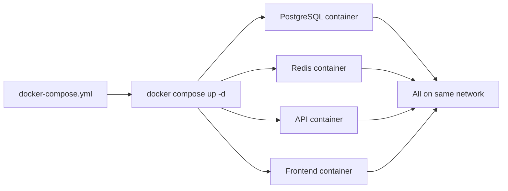
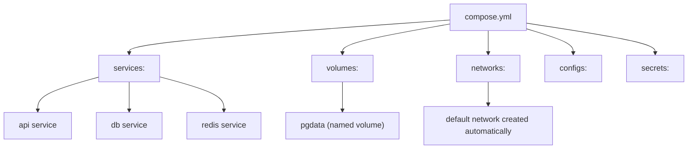
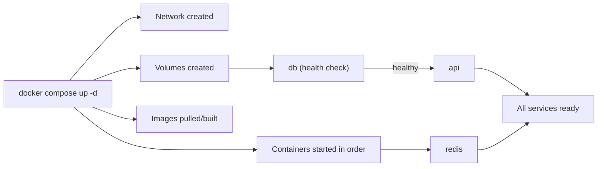
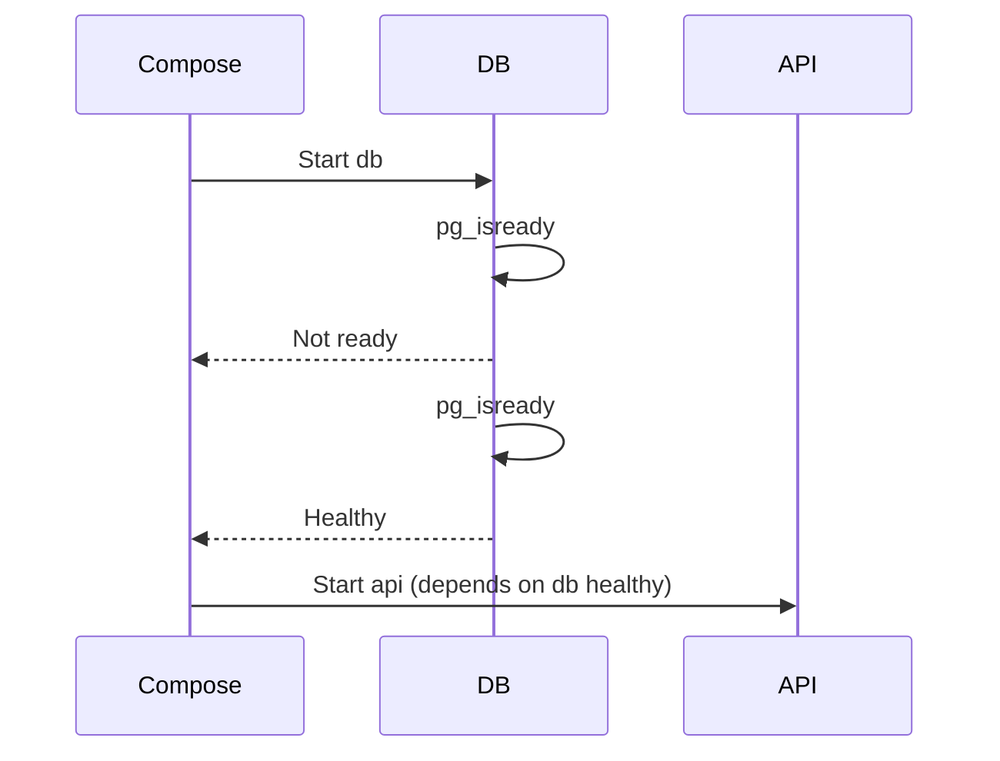

# Docker Compose Basics

> [!summary] Goal
> Define and run multi-container applications with a single YAML file: understand Compose file structure, CLI commands, service dependencies, and how to configure dev vs production environments.

## Table of Contents

1. [Why Compose Matters](#why-compose-matters)
2. [Compose File Structure](#compose-file-structure)
3. [Service Definition](#service-definition)
4. [Compose CLI Commands](#compose-cli-commands)
5. [Profiles](#profiles)
6. [`depends_on` and Health Checks](#dependson-and-health-checks)
7. [Compose Watch for Hot-Reload](#compose-watch-for-hot-reload)
8. [Compose vs `docker run`](#compose-vs-docker-run)
9. [Pitfalls](#pitfalls)

---

## Why Compose Matters

Manually running `docker run` for each service in a multi-container app is error-prone and hard to reproduce. Compose defines everything in a single YAML file.



> [!tip] Definition
> **Docker Compose**: a tool for defining and running multi-container Docker applications using a YAML file. One command starts every service.

---

## Compose File Structure

```yaml
# docker-compose.yml (modern v2 format — no version key needed)
name: myapp

services:
  api:
    build: ./api
    ports:
      - "3000:3000"
    environment:
      - DATABASE_URL=postgres://user:pass@db:5432/mydb
    depends_on:
      db:
        condition: service_healthy

  db:
    image: postgres:16-alpine
    environment:
      POSTGRES_USER: user
      POSTGRES_PASSWORD: pass
      POSTGRES_DB: mydb
    volumes:
      - pgdata:/var/lib/postgresql/data
    healthcheck:
      test: ["CMD-SHELL", "pg_isready"]
      interval: 5s
    ports:
      - "5432:5432"

  redis:
    image: redis:7-alpine
    ports:
      - "6379:6379"

volumes:
  pgdata:
```



---

## Service Definition

| Key | Description | Example |
|-----|-------------|---------|
| `image` | Image from registry | `postgres:16-alpine` |
| `build` | Build from Dockerfile | `./api` or `.` |
| `ports` | Port mappings | `"8080:80"`, `"3000:3000"` |
| `environment` | Env vars | `NODE_ENV=production` or list |
| `volumes` | Mount paths or volumes | `./src:/app/src`, `pgdata:/data` |
| `depends_on` | Startup ordering | `db`, `redis` |
| `restart` | Restart policy | `always`, `unless-stopped`, `on-failure` |
| `healthcheck` | Container health | `test: curl -f http://localhost/` |
| `profiles` | Conditional services | `dev`, `prod` |
| `networks` | Attach to specific networks | `frontend`, `backend` |
| `command` | Override CMD | `node server.js` |
| `user` | Run as non-root | `1000:1000` |

---

## Compose CLI Commands

```bash
# Start all services (detached)
docker compose up -d

# Build images before starting
docker compose up -d --build

# Stop all services
docker compose down

# Stop and remove volumes
docker compose down -v

# View logs
docker compose logs -f api          # Follow API logs
docker compose logs --tail=100 db   # Last 100 lines for DB

# Execute command in a service
docker compose exec api sh

# List services and their status
docker compose ps

# Build images
docker compose build

# Build specific service
docker compose build api

# Pull latest images
docker compose pull

# View configuration
docker compose config
```



---

## Profiles

Profiles control which services start based on the environment:

```yaml
services:
  api:
    image: my-api
    profiles: ["prod", "dev"]   # starts in both

  db:
    image: postgres:16-alpine    # no profile — always starts

  adminer:
    image: adminer
    profiles: ["dev"]            # only in dev

  mailhog:
    image: mailhog/mailhog
    profiles: ["dev"]            # only in dev
```

```bash
# Start with dev profile
docker compose --profile dev up -d
# Starts: api, db, adminer, mailhog

# Start without profile (production)
docker compose up -d
# Starts: api, db
```

---

## `depends_on` and Health Checks

Without health checks, `depends_on` only waits for the container to start, not for it to be ready:

```yaml
# BAD — api starts as soon as db container starts, not when db is ready
depends_on:
  - db

# GOOD — api starts only when db is healthy
depends_on:
  db:
    condition: service_healthy
```

Full example with health checks:

```yaml
services:
  db:
    image: postgres:16-alpine
    healthcheck:
      test: ["CMD-SHELL", "pg_isready -U postgres"]
      interval: 5s
      timeout: 5s
      retries: 5

  api:
    build: ./api
    depends_on:
      db:
        condition: service_healthy
```



---

## Compose Watch for Hot-Reload

`docker compose watch` automatically updates containers when files change:

```yaml
services:
  api:
    build: ./api
    develop:
      watch:
        - path: ./api/src
          action: sync
          target: /app/src
        - path: ./api/package.json
          action: rebuild
```

```bash
docker compose watch
```

| Action | Description |
|--------|-------------|
| `sync` | Copy changed files into the running container |
| `rebuild` | Rebuild the image and restart the container |
| `sync+restart` | Sync files then restart (for config changes) |

---

## Compose vs `docker run`

| Aspect | `docker run` | Docker Compose |
|--------|-------------|----------------|
| Services managed | One at a time | Multiple together |
| Network | Default or manual | Auto-created shared network |
| Volumes | Manual `-v` flags | Declared in YAML |
| Startup order | Manual handling | `depends_on` + health checks |
| Reproducibility | Script-based | Single YAML file |
| Dev vs prod | Different scripts | Profiles |
| Port management | Manual `-p` | Declared in YAML |

---

## Pitfalls

### No health check on `depends_on`

Without `condition: service_healthy`, `depends_on` only waits for the container to start, not for the service to be ready.

**Fix**: Add health checks to dependent services and use `condition: service_healthy`.

### Forgetting `profiles` for dev-only services

Running `docker compose up -d` in production starts all services including adminer and mailhog — a security risk.

**Fix**: Assign dev-only services to a `dev` profile.

### Volume permission issues

Bind-mounted host files may have different permissions than the container expects.

**Fix**: Use `user:` in the service definition, or match UID/GID between host and container.

---

> [!question]- Interview Questions
>
> **Q: What is Docker Compose used for?**
> A: Defining and running multi-container Docker applications with a YAML file. One `docker compose up -d` starts all services together.
>
> **Q: What is the difference between `depends_on` and health checks?**
> A: `depends_on` waits for the container to start. Health checks (`condition: service_healthy`) wait for the service inside to be ready to accept connections.
>
> **Q: What are Compose profiles?**
> A: Profiles control which services start. Dev-only services like adminer are assigned to the `dev` profile and excluded from production.

---

## Cross-Links

- [[CICD/Docker/01_Foundations/05_Container_Volumes_and_Storage]] for volume configuration
- [[CICD/Docker/01_Foundations/03_Docker_Networking_Basics]] for network configuration
- [[CICD/Docker/02_Core/03_Dockerfile_Best_Practices_and_AntiPatterns]] for build optimization in Compose

---

## References

- [Docker Compose Overview](https://docs.docker.com/compose/)
- [Compose File Reference](https://docs.docker.com/compose/compose-file/)
- [Compose CLI Reference](https://docs.docker.com/compose/reference/)
