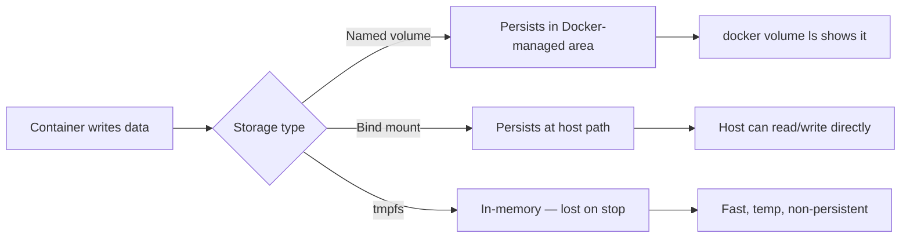

# Container Volumes and Storage

> [!summary] Goal
> Manage data in containers: choose between bind mounts, named volumes, and tmpfs; back up and restore volume data; and understand permissions.

## Table of Contents

1. [Why Storage Matters](#why-storage-matters)
2. [Bind Mounts](#bind-mounts)
3. [Named Volumes](#named-volumes)
4. [tmpfs Mounts](#tmpfs-mounts)
5. [Volume Types Comparison](#volume-types-comparison)
6. [Volume Drivers](#volume-drivers)
7. [Backup and Restore](#backup-and-restore)
8. [Permissions and Ownership](#permissions-and-ownership)
9. [Pitfalls](#pitfalls)

---

## Why Storage Matters

Containers are ephemeral by design — when a container stops and is removed, its filesystem is gone. Volumes persist data independently of container lifetime.



---

## Bind Mounts

Mount any host directory or file into the container:

```bash
# Syntax
docker run -v /host/path:/container/path image
docker run --mount type=bind,src=/host/path,target=/container/path image

# Practical examples
docker run -v $(pwd):/app -w /app node npm run dev    # Development
docker run -v /data/logs:/app/logs my-app              # Logs
docker run -v /etc/localtime:/etc/localtime:ro alpine  # Read-only
```

| Aspect | `-v` (old style) | `--mount` (new style) |
|--------|-----------------|----------------------|
| Readability | Can be ambiguous | Explicit key=value |
| Supports all options | Most | **All** (type, src, target, readonly, bind-propagation) |
| Recommendation | Quick usage | Scripts, production |

---

## Named Volumes

Docker-managed volumes stored in `/var/lib/docker/volumes/`:

```bash
# Create a named volume
docker volume create my-data

# List volumes
docker volume ls

# Inspect
docker volume inspect my-data

# Use with container
docker run -v my-data:/data my-app
docker run --mount type=volume,src=my-data,target=/data my-app

# Remove
docker volume rm my-data
docker volume prune    # Remove unused volumes
```

### Anonymous volumes

Created with `-v /container/path` (no name — gets a random hash):

```bash
docker run -v /data alpine  # Creates anonymous volume
```

---

## tmpfs Mounts

In-memory storage — fast, temporary, lost when container stops:

```bash
docker run --tmpfs /app/tmp my-app
docker run --mount type=tmpfs,target=/app/tmp,tmpfs-size=100m my-app
```

| Aspect | tmpfs | Volume |
|--------|-------|--------|
| Persistence | None (lost on stop) | Persists until deleted |
| Speed | Memory speed | Disk speed |
| Use case | Temporary files, cache, secrets | Database, uploads, configuration |

---

## Volume Types Comparison

| Aspect | Bind mount | Named volume | tmpfs |
|--------|-----------|--------------|-------|
| Host location | Any path | `/var/lib/docker/volumes/` | Memory |
| Managed by Docker | No | Yes | Yes |
| Backup | Direct file copy | `docker run --rm -v vol:/data alpine tar` | Not applicable |
| Performance | Native (host fs) | Native (host fs) | Fastest (RAM) |
| Persist after container removal | ✅ Yes | ✅ Yes | ❌ No |
| Shareable between containers | ✅ | ✅ | ❌ |
| Populate from image | No | Yes (on first use, if volume empty) | No |

---

## Volume Drivers

Use remote storage backends:

```bash
# Local (default)
docker volume create --driver local my-volume

# NFS
docker volume create --driver local \
  --opt type=nfs \
  --opt o=addr=192.168.1.100,rw \
  --opt device=:/path/to/share \
  nfs-volume

# Third-party drivers
# REX-Ray, Portworx, Amazon EBS, Azure File, GCP Filestore
```

---

## Backup and Restore

### Backup a named volume

```bash
# Run a temporary container that mounts the volume and creates a tar
docker run --rm -v my-data:/source -v $(pwd):/backup alpine \
  tar czf /backup/my-data-backup.tar.gz -C /source .
```

### Restore a named volume

```bash
docker run --rm -v my-data:/target -v $(pwd):/backup alpine \
  tar xzf /backup/my-data-backup.tar.gz -C /target
```

### Backup a database (live example)

```bash
docker exec db pg_dump -U postgres > backup.sql     # PostgreSQL
docker exec db mongodump --archive > backup.archive  # MongoDB
```

---

## Permissions and Ownership

```bash
# Run container as a non-root user
docker run --user 1000:1000 -v $(pwd):/data alpine touch /data/test

# Bind mount with specific UID/GID
docker run --user $(id -u):$(id -g) -v $(pwd):/data alpine touch /data/test
```

| Issue | Cause | Fix |
|-------|-------|-----|
| Permission denied on bind mount | Container user (root) vs host user mismatch | Match UID with `--user` |
| Bind mount files owned by root | Container writes as root | Create files inside with correct UID |
| Volume has wrong permissions | Image copies files at build time | `RUN chown` in Dockerfile |

---

## Pitfalls

### Using anonymous volumes unintentionally

```yaml
# Every `docker compose up` creates a NEW anonymous volume!
services:
  db:
    image: postgres
    volumes:
      - /var/lib/postgresql/data   # No name = anonymous
```

**Fix**: Use named volumes: `- pgdata:/var/lib/postgresql/data` and declare `pgdata:` under `volumes:`.

### Bind mount overwriting container files

```bash
docker run -v /host/empty-dir:/app my-app   # /app contents hidden!
```

**Fix**: Named volumes copy image contents on first use. Bind mounts do not.

### tmpfs size limits

By default, tmpfs has no size limit and can consume all host memory.

**Fix**: Always set `tmpfs-size` to limit usage.

---

> [!question]- Interview Questions
>
> **Q: What is the difference between a bind mount and a named volume?**
> A: A bind mount maps a host path into the container. A named volume is managed by Docker and stored in `/var/lib/docker/volumes/`. Volumes are portable, backable, and preferred for production.
>
> **Q: When would you use tmpfs?**
> A: For temporary data that doesn't need to persist: caches, session files, scratch space. Data is lost when the container stops.
>
> **Q: How do you back up a Docker volume?**
> A: Run a temporary container that mounts the volume and creates a tar archive: `docker run --rm -v my-data:/source -v $(pwd):/backup alpine tar czf /backup/backup.tar.gz -C /source .`

---

## Cross-Links

- [[CICD/Docker/01_Foundations/04_Docker_Compose_Basics]] for volume declarations in Compose
- [[CICD/Docker/02_Core/02_Security_Basics_Users_Capabilities]] for volume permission security
- [[CICD/Docker/01_Foundations/02_Dockerfile_Essentials]] for VOLUME instruction

---

## References

- [Manage Data in Docker](https://docs.docker.com/storage/)
- [Volumes](https://docs.docker.com/storage/volumes/)
- [Bind Mounts](https://docs.docker.com/storage/bind-mounts/)
- [tmpfs Mounts](https://docs.docker.com/storage/tmpfs/)
