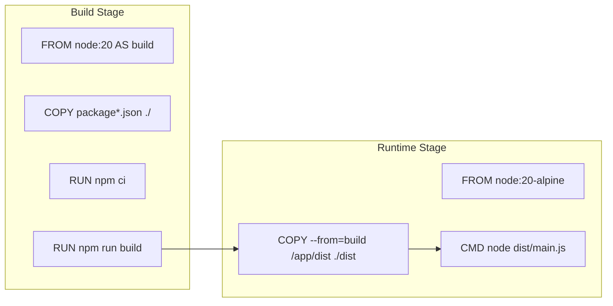
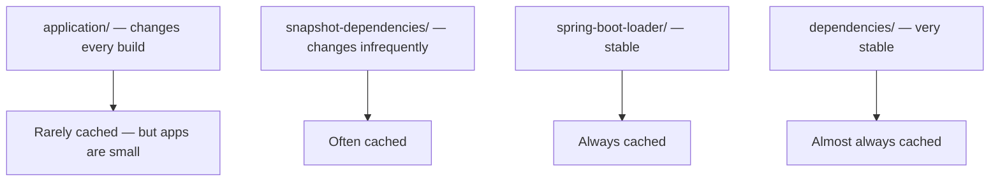
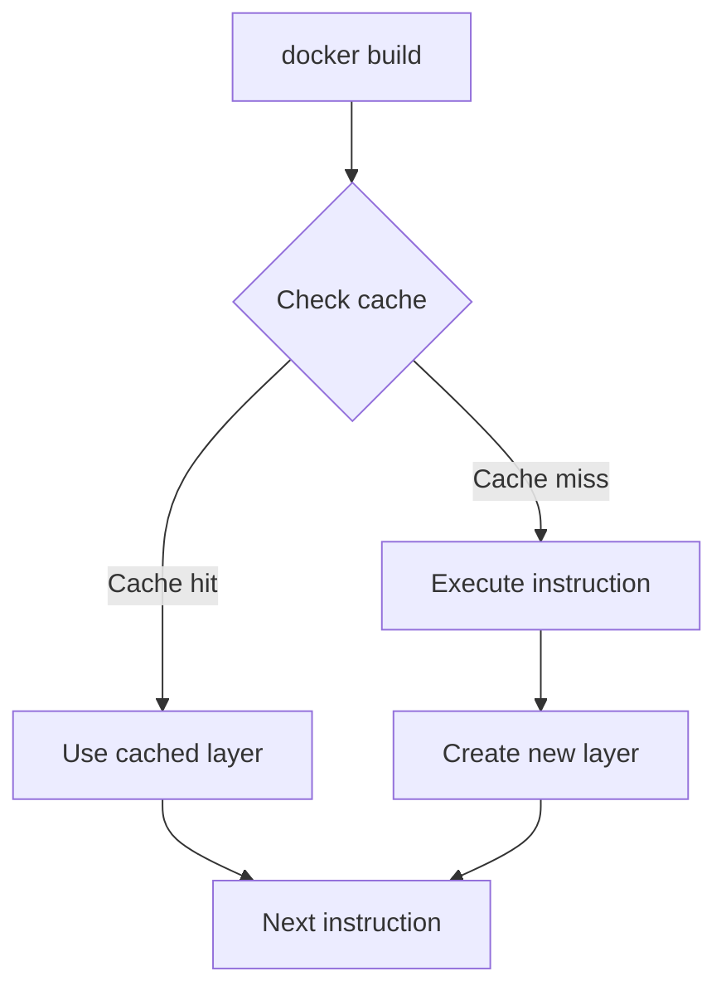

# Multi-Stage Builds and Caching

> [!summary] Goal
> Keep runtime images small and builds fast: separate build stage from runtime stage, leverage BuildKit caching, and optimize layer ordering for every language.

## Table of Contents

1. [Why Multi-Stage Builds Matter](#why-multi-stage-builds-matter)
2. [Basic Multi-Stage Pattern](#basic-multi-stage-pattern)
3. [Node.js Multi-Stage Build](#node-js-multi-stage-build)
4. [Spring Boot Multi-Stage with Layered JAR](#spring-boot-multi-stage-with-layered-jar)
5. [Go Multi-Stage to Scratch](#go-multi-stage-to-scratch)
6. [Python Multi-Stage Build](#python-multi-stage-build)
7. [BuildKit Cache Mounts](#buildkit-cache-mounts)
8. [Build Cache Optimization](#build-cache-optimization)
9. [Pitfalls](#pitfalls)

---

## Why Multi-Stage Builds Matter

A single Dockerfile would contain build tools (compilers, package managers) in the final image — wasting 100-500MB+.



> [!tip] Definition
> **Multi-stage build**: using multiple `FROM` statements in one Dockerfile. Earlier stages contain build tools. The final stage copies only the output, discarding everything else.

---

## Basic Multi-Stage Pattern

```dockerfile
# === BUILD STAGE ===
FROM node:20 AS builder
WORKDIR /app
COPY package*.json ./
RUN npm ci
COPY . .
RUN npm run build

# === RUNTIME STAGE ===
FROM node:20-alpine AS runner
WORKDIR /app
COPY --from=builder /app/dist ./dist
COPY --from=builder /app/node_modules ./node_modules
EXPOSE 3000
CMD ["node", "dist/main.js"]
```

Image size comparison:
| Approach | Size |
|----------|------|
| Single stage (`node:20` + build deps) | ~1.2 GB |
| Multi-stage (`node:20-alpine` runtime) | ~180 MB |
| Multi-stage with distroless | ~120 MB |

---

## Node.js Multi-Stage Build

```dockerfile
# Build stage
FROM node:20-alpine AS build
WORKDIR /app
RUN --mount=type=cache,target=/root/.npm npm ci
COPY package*.json .npmrc ./
RUN npm ci --only=production
COPY . .
RUN npm run build

# Runtime stage
FROM node:20-alpine AS run
WORKDIR /app
RUN addgroup -g 1001 -S nodejs && \
    adduser -S nodejs -u 1001 -G nodejs

# Copy only production dependencies + build output
COPY --from=build /app/dist ./dist
COPY --from=build /app/node_modules ./node_modules

USER nodejs
EXPOSE 3000
HEALTHCHECK --interval=30s --timeout=3s \
  CMD wget --no-verbose --tries=1 --spider http://localhost:3000/health || exit 1
CMD ["node", "dist/main.js"]
```

---

## Spring Boot Multi-Stage with Layered JAR

Spring Boot 2.3+ supports layered JARs for optimal Docker caching:

```dockerfile
# Build stage
FROM eclipse-temurin:21-jdk-alpine AS build
WORKDIR /app
COPY mvnw pom.xml ./
COPY .mvn .mvn
RUN --mount=type=cache,target=/root/.m2 ./mvnw dependency:go-offline -DskipTests
COPY src src
RUN --mount=type=cache,target=/root/.m2 ./mvnw package -DskipTests

# Extract layers for better caching
RUN java -Djarmode=layertools -jar target/*.jar extract --destination /extract

# Runtime stage
FROM eclipse-temurin:21-jre-alpine AS run
WORKDIR /app

# Create non-root user
RUN addgroup -S spring && adduser -S spring -G spring

# Copy layers in dependency order — largest/slowest-changing first
COPY --from=build /extract/dependencies/ ./
COPY --from=build /extract/spring-boot-loader/ ./
COPY --from=build /extract/snapshot-dependencies/ ./
COPY --from=build /extract/application/ ./

USER spring
EXPOSE 8080
HEALTHCHECK --interval=30s --timeout=3s \
  CMD curl -f http://localhost:8080/actuator/health || exit 1
ENTRYPOINT ["java", "-jar", "app.jar"]
```



---

## Go Multi-Stage to Scratch

Go compiles to a static binary with zero dependencies:

```dockerfile
# Build stage
FROM golang:1.22-alpine AS build
WORKDIR /app
COPY go.mod go.sum ./
RUN go mod download
COPY . .
RUN CGO_ENABLED=0 go build -ldflags="-s -w" -o /app/server .

# Runtime stage — scratch (0 bytes base!)
FROM scratch AS run
WORKDIR /app
COPY --from=build /app/server .
EXPOSE 8080
CMD ["./server"]
```

Final image size: **~8-15 MB** (versus ~800 MB with `golang:1.22`).

---

## Python Multi-Stage Build

```dockerfile
# Build stage
FROM python:3.12-alpine AS build
WORKDIR /app
RUN --mount=type=cache,target=/root/.cache/pip pip install --upgrade pip
COPY requirements.txt .
RUN --mount=type=cache,target=/root/.cache/pip \
    pip install --prefix=/install -r requirements.txt

# Runtime stage
FROM python:3.12-alpine AS run
WORKDIR /app
RUN addgroup -S appuser && adduser -S appuser -G appuser
COPY --from=build /install /usr/local
COPY . .
USER appuser
EXPOSE 8000
CMD ["uvicorn", "main:app", "--host", "0.0.0.0"]
```

---

## BuildKit Cache Mounts

Enable BuildKit with `DOCKER_BUILDKIT=1` (default in Docker Desktop):

```dockerfile
# Cache npm packages between builds
RUN --mount=type=cache,target=/root/.npm \
    --mount=type=bind,source=package.json,target=package.json \
    --mount=type=bind,source=package-lock.json,target=package-lock.json \
    npm ci

# Cache apt packages
RUN --mount=type=cache,target=/var/cache/apt,sharing=locked \
    apt-get update && apt-get install -y curl
```

```bash
# Enable BuildKit
export DOCKER_BUILDKIT=1
export COMPOSE_DOCKER_CLI_BUILD=1

# Build with cache from registry or previous build
docker build --cache-from my-app:cache --cache-to my-app:cache -t my-app .
```



---

## Build Cache Optimization

### Order instructions by change frequency

```dockerfile
# 1. Base image — changes rarely
FROM node:20-alpine

# 2. Metadata — almost never changes
WORKDIR /app

# 3. Dependency definitions — changes with requirements
COPY package*.json ./

# 4. Install dependencies — cached until lockfile changes
RUN npm ci

# 5. Source code — changes every build
COPY . .

# 6. Build step — changes with source
RUN npm run build
```

### Cache invalidation causes

| Instruction | Invalidated by |
|-------------|---------------|
| `COPY file` | File content (hash) |
| `RUN command` | Command text changes |
| `ARG value` | `--build-arg` value changes |
| `FROM image` | Image tag/SHA changes |

---

## Pitfalls

### Copying entire `node_modules` between stages

```dockerfile
COPY --from=build /app/node_modules ./node_modules  # Includes devDependencies
```

**Fix**: Use `npm ci --only=production` or copy from a production-only install.

### Not extracting Spring Boot layers

Without layer extraction, ANY code change invalidates the entire JAR cache.

**Fix**: Use `java -Djarmode=layertools -jar app.jar extract` before copying layers separately.

### Using `COPY . .` before installing dependencies

```dockerfile
COPY . .                    # Invalidates cache for subsequent steps
RUN npm ci                  # Re-runs every time
```

**Fix**: Copy dependency files first, install, then copy source.

---

> [!question]- Interview Questions
>
> **Q: What is a multi-stage build?**
> A: Using multiple `FROM` statements in one Dockerfile. Earlier stages contain build tools; the final stage copies only the output, keeping the final image small.
>
> **Q: How do BuildKit cache mounts work?**
> A: `RUN --mount=type=cache,target=/path` mounts a persistent cache directory that survives between builds. Commonly used for package manager caches (npm, maven, pip, apt).
>
> **Q: How does Spring Boot's layered JAR improve Docker caching?**
> A: Extracts the JAR into four layers (dependencies, spring-boot-loader, snapshot-dependencies, application). Each layer is cached independently — application code changes only invalidate the last layer.

---

## Cross-Links

- [[CICD/Docker/01_Foundations/02_Dockerfile_Essentials]] for Dockerfile instructions
- [[CICD/Docker/02_Core/03_Dockerfile_Best_Practices_and_AntiPatterns]] for build optimization
- [[CICD/Docker/03_Advanced/01_Debug_Image_Size_and_Build_Perf]] for image size debugging

---

## References

- [Multi-stage Builds](https://docs.docker.com/build/building/multi-stage/)
- [BuildKit](https://docs.docker.com/build/buildkit/)
- [Spring Boot Layered JARs](https://spring.io/guides/topicals/spring-boot-docker/)
