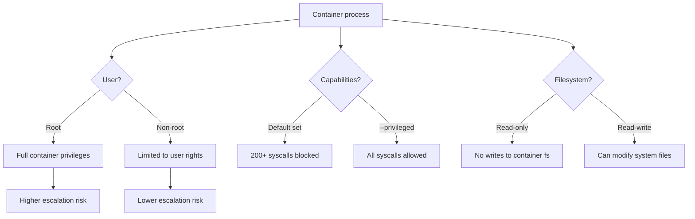
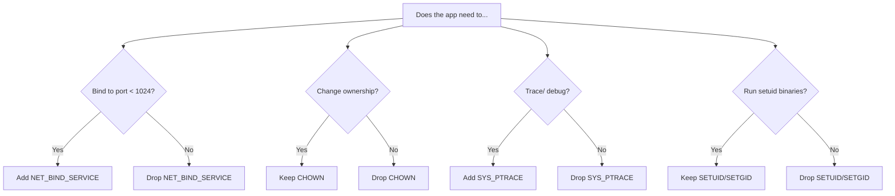

# Security Basics: Users, Capabilities, and Runtime Hardening

> [!summary] Goal
> Reduce container blast radius: run as non-root, drop unnecessary Linux capabilities, restrict the filesystem, and never mount the Docker socket.

## Table of Contents

1. [Why Container Security Matters](#why-container-security-matters)
2. [Non-Root User in Dockerfile](#non-root-user-in-dockerfile)
3. [Running with `--user`](#running-with-user)
4. [Linux Capabilities](#linux-capabilities)
5. [Read-Only Root Filesystem](#read-only-root-filesystem)
6. [Seccomp and AppArmor](#seccomp-and-apparmor)
7. [The Danger of `--privileged`](#the-danger-of-privileged)
8. [Docker Socket Mounting](#docker-socket-mounting)
9. [Image Signing with Cosign](#image-signing-with-cosign)
10. [Security Checklist](#security-checklist)
11. [Pitfalls](#pitfalls)

---

## Why Container Security Matters

Containers share the host kernel. A compromised container can escalate to the host if not properly constrained.



---

## Non-Root User in Dockerfile

```dockerfile
FROM node:20-alpine

# Create user and group
RUN addgroup -g 1001 -S nodejs && \
    adduser -S nodejs -u 1001 -G nodejs

# Switch to non-root user
USER nodejs

COPY --chown=nodejs:nodejs . .
CMD ["node", "app.js"]
```

### Equivalent for Debian-based images

```dockerfile
RUN groupadd -r appuser && useradd -r -g appuser appuser
USER appuser
```

---

## Running with `--user`

```bash
# Override user at runtime (even if Dockerfile uses root)
docker run --user 1000:1000 my-app

# Use current host user
docker run --user $(id -u):$(id -g) my-app

# Use existing user from /etc/passwd
docker run --user www-data my-app
```

---

## Linux Capabilities

By default, Docker drops all capabilities except those needed. But you can drop more:

```bash
# See default capabilities
docker run --rm alpine grep Cap /proc/1/status

# Drop ALL capabilities, then add only what's needed
docker run --cap-drop=ALL --cap-add=NET_BIND_SERVICE my-app

# Common capabilities
# NET_BIND_SERVICE — bind to ports < 1024
# CHOWN — change file ownership
# SETUID/SETGID — set user/group IDs
# SYS_PTRACE — trace processes (needed for debuggers)
```

### Capability decision tree



### Production recommendation

```bash
docker run \
  --cap-drop=ALL \
  --cap-add=NET_BIND_SERVICE \
  --cap-add=CHOWN \
  my-app
```

---

## Read-Only Root Filesystem

Prevents writing to the container filesystem — data must go to volumes:

```bash
docker run --read-only --tmpfs /tmp --tmpfs /var/run my-app
```

| Option | Effect |
|--------|--------|
| `--read-only` | Container filesystem is read-only |
| `--tmpfs /tmp` | Writable temp directory in memory |
| `--tmpfs /var/run` | Runtime data in memory |

---

## Seccomp and AppArmor

### Seccomp (system call filtering)

```bash
# Default seccomp profile (blocks ~44 syscalls)
docker run --security-opt seccomp=default.json nginx

# Custom profile (allow specific syscalls)
docker run --security-opt seccomp=custom-profile.json my-app
```

### AppArmor (MAC)

```bash
# Default Docker AppArmor profile
docker run --security-opt apparmor=docker-default nginx

# Custom profile
docker run --security-opt apparmor=my-custom-profile nginx
```

### `no-new-privileges`

```bash
docker run --security-opt=no-new-privileges:true my-app
```

Prevents privilege escalation via setuid binaries.

---

## The Danger of `--privileged`

```bash
docker run --privileged my-app  # ALL capabilities + host device access
```

| `--privileged` gives | Risk |
|----------------------|------|
| All capabilities | Full kernel access |
| Host device access | Modify system devices |
| Root inside container | Escape to host possible |

**Never use `--privileged` in production.** Find the specific capability instead:

```bash
# Instead of --privileged for Docker-in-Docker:
docker run --group-add 999 docker:cli

# Instead of --privileged for network tools:
docker run --cap-add=NET_ADMIN --cap-add=SYS_ADMIN my-app
```

---

## Docker Socket Mounting

```bash
# DANGEROUS: Gives container full Docker host control
docker run -v /var/run/docker.sock:/var/run/docker.sock docker:cli
```

| Risk | Impact |
|------|--------|
| Container can create new containers | Crypto mining, data exfiltration |
| Container can access host filesystem | `docker run -v /:/host alpine` |
| No audit trail | Operations appear as host user |

**Alternatives**: Docker-in-Docker (`docker:cli` image), Podman socket activation, or expose only the API endpoint you need.

---

## Image Signing with Cosign

```bash
# Sign an image
cosign sign ghcr.io/org/my-app:v1.2.3

# Verify
cosign verify ghcr.io/org/my-app:v1.2.3
```

---

## Security Checklist

- [ ] Container runs as non-root user (`USER` in Dockerfile)
- [ ] All capabilities dropped except those required (`--cap-drop=ALL`)
- [ ] Filesystem is read-only (`--read-only`)
- [ ] Writable directories use `--tmpfs` or volumes
- [ ] Docker socket is NOT mounted inside container
- [ ] Images are from trusted registries (not random Docker Hub)
- [ ] Base image is pinned by digest (`image@sha256:...`)
- [ ] `--privileged` is never used
- [ ] Secrets passed via env vars, not in image
- [ ] Images are signed with Cosign

---

## Pitfalls

### Running as root in container

```bash
docker run alpine apk add curl   # Runs as root — can escape
```

**Fix**: Add `USER appuser` in Dockerfile or use `--user 1000:1000`.

### Adding unnecessary capabilities

```bash
docker run --cap-add=SYS_ADMIN my-app  # Near-privileged!
```

**Fix**: Drop all, then add only the specific capability needed.

### `--privileged` for convenience

Running `--privileged` because "it works" bypasses all security.

**Fix**: Identify the specific capability or device mount needed.

---

> [!question]- Interview Questions
>
> **Q: Why should containers run as non-root?**
> A: If a container running as root is compromised, the attacker has root privileges within the container, making it easier to escape to the host.
>
> **Q: What are Linux capabilities?**
> A: Granular permissions for privileged operations (binding ports <1024, changing ownership, tracing processes). Docker drops unnecessary capabilities by default.
>
> **Q: What is the risk of mounting the Docker socket?**
> A: The container can control the Docker daemon — create containers, access host filesystems, and potentially escape to the host.

---

## Cross-Links

- [[CICD/Docker/01_Foundations/02_Dockerfile_Essentials]] for USER instruction
- [[CICD/Docker/02_Core/03_Dockerfile_Best_Practices_and_AntiPatterns]] for security anti-patterns
- [[CICD/Docker/03_Advanced/03_Docker_Security_Scanning_and_SBOM]] for vulnerability scanning

---

## References

- [Docker Security](https://docs.docker.com/engine/security/)
- [Linux Capabilities](https://man7.org/linux/man-pages/man7/capabilities.7.html)
- [Seccomp Security Profiles](https://docs.docker.com/engine/security/seccomp/)
- [AppArmor](https://docs.docker.com/engine/security/apparmor/)
