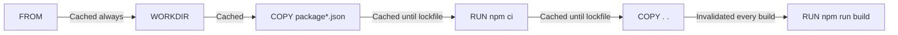

# Dockerfile Best Practices and Anti-Patterns

> [!summary] Goal
> Build production-quality Dockerfiles: follow proven patterns, avoid common mistakes, and optimize for cache, size, and security.

## Table of Contents

1. [Cache-Friendly Ordering](#cache-friendly-ordering)
2. [Minimize Layers](#minimize-layers)
3. [Pin Base Images](#pin-base-images)
4. [Use Specific Tag Aliases](#use-specific-tag-aliases)
5. [Use `.dockerignore` Effectively](#use-dockerignore-effectively)
6. [Separate Build and Runtime](#separate-build-and-runtime)
7. [Prefer `COPY` Over `ADD`](#prefer-copy-over-add)
8. [Clean Up in the Same Layer](#clean-up-in-the-same-layer)
9. [Use BuildKit Features](#use-buildkit-features)
10. [Anti-Patterns Reference](#anti-patterns-reference)
11. [Pitfalls](#pitfalls)

---

## Cache-Friendly Ordering

Docker caches layers and reuses them on subsequent builds. Order instructions by change frequency:

```dockerfile
# ✅ GOOD — optimized cache ordering
FROM node:20-alpine                # Always cached
WORKDIR /app                        # Always cached
COPY package*.json ./              # Cached until lockfile changes
RUN npm ci                         # Cached until lockfile changes
COPY . .                           # Invalidated every build
RUN npm run build                   # Re-runs only when src changes
CMD ["node", "dist/main.js"]       # Always cached
```



---

## Minimize Layers

Each `RUN`, `COPY`, and `ADD` creates a layer. Combine related commands:

```dockerfile
# ❌ BAD — 6 layers
RUN apt-get update
RUN apt-get install -y curl
RUN apt-get install -y jq
RUN rm -rf /var/lib/apt/lists/*
COPY package.json ./
COPY package-lock.json ./

# ✅ GOOD — 3 layers
RUN apt-get update && \
    apt-get install -y --no-install-recommends curl jq && \
    rm -rf /var/lib/apt/lists/*
COPY package*.json ./
```

---

## Pin Base Images

```dockerfile
# ❌ BAD — mutable, may break anytime
FROM node
FROM node:latest
FROM node:20

# ✅ GOOD — pinned to specific version
FROM node:20-alpine

# ✅ BEST — pinned by digest (immutable)
FROM node:20-alpine@sha256:a1b2c3d4e5f6...
```

**Why**: `node:latest` changes. `node:20` gets patch updates. `node:20-alpine@sha256:...` is immutable.

---

## Use `.dockerignore` Effectively

Prevents sending unnecessary files to the Docker daemon:

```dockerfile
# .dockerignore
node_modules
.git
.gitignore
*.md
coverage
.env
dist
.DS_Store
.docker
```

```bash
docker build -t my-app .     # Sends only ~100KB instead of 500MB
```

---

## Separate Build and Runtime

Keep build tools out of the final image using multi-stage:

```dockerfile
# ❌ BAD — single stage with all tools
FROM node:20
WORKDIR /app
COPY . .
RUN npm ci && npm run build
CMD ["node", "dist/main.js"]
# Image size: ~1.2 GB

# ✅ GOOD — multi-stage, runtime only
FROM node:20-alpine AS builder
COPY . .
RUN npm ci && npm run build

FROM node:20-alpine
COPY --from=builder /app/dist ./dist
COPY --from=builder /app/node_modules ./node_modules
CMD ["node", "dist/main.js"]
# Image size: ~180 MB
```

---

## Use BuildKit Features

```dockerfile
# Enable BuildKit (DOCKER_BUILDKIT=1)

# Cache mounts — persist between builds
RUN --mount=type=cache,target=/root/.npm npm ci

# Bind mounts — files available only during build
RUN --mount=type=bind,source=package.json,target=package.json npm ci

# Secrets — never persisted in image
RUN --mount=type=secret,id=db_password cat /run/secrets/db_password
```

---

## Anti-Patterns Reference

| Anti-pattern | Why it's bad | Fix |
|-------------|-------------|-----|
| `FROM node` | Unpinned, changes unexpectedly | `FROM node:20-alpine@sha256:...` |
| `COPY . .` before `RUN npm ci` | Invalidates layer cache on every build | Copy lockfile first, install, then source |
| `RUN apt-get upgrade` | Changes base image, unpredictable | Build from up-to-date base image |
| `ADD url` | Harder to cache, less transparent | Use `RUN curl -L url` with `--mount=type=cache` |
| `--no-install-recommends` missing | Installs unnecessary packages | Always add `--no-install-recommends` |
| `npm install` instead of `npm ci` | Ignores lockfile, potentially different deps | Always use `npm ci` |
| Several `ENV` lines | Increases layers, harder to read | Combine: `ENV a=1 b=2 c=3` |
| `CMD node app.js` (shell form) | `PID1` is `sh`, not `node` — signal issues | `CMD ["node", "app.js"]` (exec form) |
| Using `latest` tag in production | Can't tell which version is deployed | Use SemVer or commit SHA |
| Not cleaning apt lists per layer | Removed space isn't recovered | `rm -rf /var/lib/apt/lists/*` in same `RUN` |

---

## Pitfalls

### `npm install` vs `npm ci`

```dockerfile
# ❌ npm install ignores lockfile, may install different versions
RUN npm install

# ✅ npm ci uses lockfile exactly
RUN npm ci
```

### Not pinning by digest for production

```dockerfile
FROM node:20-alpine  # This can change with new Alpine patch
```

**Fix**: `FROM node:20-alpine@sha256:a1b2c3...` for production builds.

### `RUN` with `&&` vs separate `RUN` layers

Separate `RUN` layers for apt-get update/install/cleanup waste space because each is a separate layer.

**Fix**: Always chain update, install, and cleanup in one `RUN`.

---

> [!question]- Interview Questions
>
> **Q: How do you optimize Docker layer caching?**
> A: Order instructions from least to most frequently changing. Copy lockfiles before source. Install dependencies before copying code.
>
> **Q: What is the difference between `npm install` and `npm ci` in a Dockerfile?**
> A: `npm ci` uses `package-lock.json` exactly, fails if it's out of date, and is faster. `npm install` may modify the lockfile. Always prefer `npm ci`.
>
> **Q: Why pin base images by digest?**
> A: Tags are mutable and can silently change. A digest guarantees the exact same base image content, ensuring reproducible builds.

---

## Cross-Links

- [[CICD/Docker/01_Foundations/02_Dockerfile_Essentials]] for instruction reference
- [[CICD/Docker/02_Core/01_MultiStage_Builds_and_Caching]] for build stage separation
- [[CICD/Docker/02_Core/02_Security_Basics_Users_Capabilities]] for security best practices

---

## References

- [Dockerfile Best Practices](https://docs.docker.com/develop/develop-images/dockerfile_best-practices/)
- [BuildKit](https://docs.docker.com/build/buildkit/)
