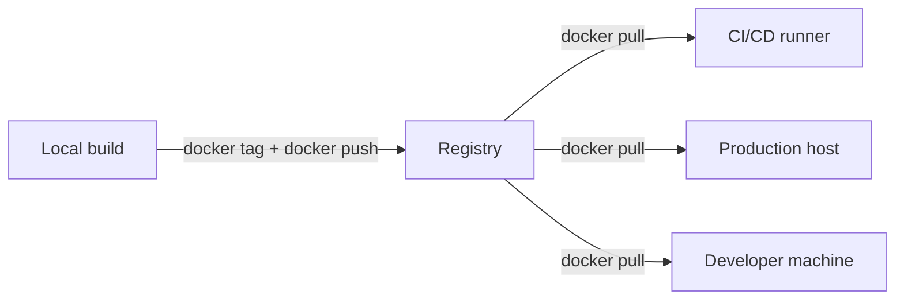
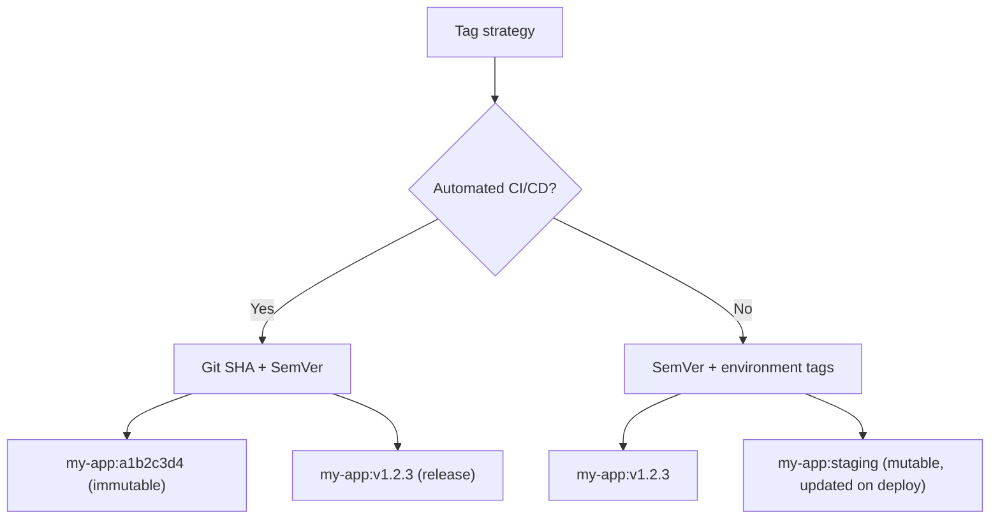
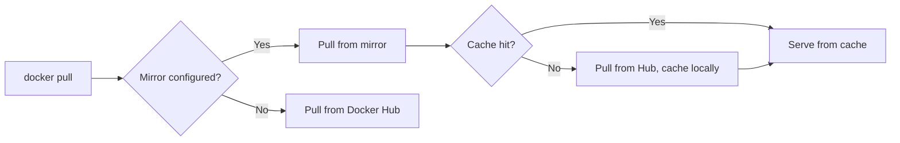

# Container Registries and Publishing

> [!summary] Goal
> Publish and consume container images: authenticate to registries, tag images correctly, understand rate limits, and choose the right registry for your needs.

## Table of Contents

1. [Why Registries Matter](#why-registries-matter)
2. [Registry Types](#registry-types)
3. [Authentication](#authentication)
4. [Tagging Strategies](#tagging-strategies)
5. [Pushing and Pulling](#pushing-and-pulling)
6. [Tag vs Digest](#tag-vs-digest)
7. [Rate Limits and Mirroring](#rate-limits-and-mirroring)
8. [Retention Policies](#retention-policies)
9. [Pitfalls](#pitfalls)

---

## Why Registries Matter

A **container registry** stores and distributes Docker images. Every `docker pull` and `docker push` talks to a registry.



---

## Registry Types

| Registry | Public? | Features | Best for |
|----------|---------|----------|----------|
| **Docker Hub** | Yes | Official images, autobuilds, teams | Public images, small teams |
| **GitHub Container Registry (GHCR)** | Yes | Tight GitHub integration, OIDC auth, packages | GitHub-native workflows |
| **Amazon ECR** | Private | IAM integration, VPC endpoints, image scanning | AWS deployments |
| **Google Artifact Registry (GCR)** | Private | IAM, vulnerability scanning, multi-region | GCP deployments |
| **Azure Container Registry (ACR)** | Private | AAD auth, geo-replication, helm support | Azure deployments |
| **Harbor** | Self-hosted | Vulnerability scanning, replication, RBAC | Enterprise self-hosted |
| **Nexus / Artifactory** | Self-hosted | Generic artifact repo, proxy/cache | Enterprise multi-artifact |

---

## Authentication

```bash
# Docker Hub
docker login
docker login -u username

# GitHub Container Registry
docker login ghcr.io -u $GITHUB_ACTOR --password-stdin < $GITHUB_TOKEN

# Amazon ECR
aws ecr get-login-password --region us-east-1 | docker login --username AWS --password-stdin $ACCOUNT.dkr.ecr.us-east-1.amazonaws.com

# GCP Artifact Registry
gcloud auth configure-docker us-central1-docker.pkg.dev
```

### Credential storage

Credentials are stored in `~/.docker/config.json`:

```json
{
  "auths": {
    "ghcr.io": {},
    "https://index.docker.io/v1/": {}
  },
  "credsStore": "osxkeychain"
}
```

Use `credsStore` to store credentials in the OS keychain instead of base64-encoded in the file.

---

## Tagging Strategies

```bash
# By Git SHA (recommended for CI/CD)
docker build -t my-app:$CI_COMMIT_SHA .
docker tag my-app:$CI_COMMIT_SHA registry.io/org/my-app:$CI_COMMIT_SHA

# By SemVer
docker build -t my-app:v1.2.3 .
docker tag my-app:v1.2.3 registry.io/org/my-app:v1.2.3

# By environment
docker tag my-app:$CI_COMMIT_SHA registry.io/org/my-app:staging
docker tag my-app:$CI_COMMIT_SHA registry.io/org/my-app:prod
```



| Strategy | Mutability | Use case |
|----------|------------|----------|
| `$CI_COMMIT_SHA` | Immutable | Traceable to source, CI/CD |
| `v1.2.3` (SemVer) | Immutable per release | Releases |
| `latest` | Mutable | Local dev only |
| `staging`, `prod` | Mutable | Environment promotion |

---

## Pushing and Pulling

```bash
# Login
docker login registry.example.com

# Tag an image for a specific registry
docker tag my-app:latest registry.example.com/org/my-app:v1.2.3

# Push
docker push registry.example.com/org/my-app:v1.2.3

# Pull
docker pull registry.example.com/org/my-app:v1.2.3

# Pull by digest
docker pull my-app@sha256:a1b2c3...

# Multi-architecture push
docker buildx build --platform linux/amd64,linux/arm64 \
  -t registry.example.com/org/my-app:latest \
  --push .
```

---

## Tag vs Digest

| Aspect | Tag | Digest |
|--------|-----|--------|
| Mutability | Can be reassigned | Never changes |
| Human-readable | ✅ Yes | ❌ No (`sha256:a1b2...`) |
| Traceability | Depends on tagging convention | Always exact |
| Security | Can point to different content | Content-addressable |

```bash
# Tag can change:
docker tag my-app:latest my-app:v1.2.3   # latest now points to v1.2.3
docker tag my-app:old-version my-app:latest  # latest now points to old!

# Digest never changes:
docker image ls --digests
# my-app:latest   sha256:a1b2c3...
```

---

## Rate Limits and Mirroring

### Docker Hub rate limits

| Account | Pulls per 6 hours |
|---------|-------------------|
| Anonymous | 100 |
| Free | 200 |
| Pro/Team | Unlimited |
| Enterprise | Unlimited |

### Pull through cache / mirror

```json
{
  "registry-mirrors": ["https://mirror.gcr.io"]
}
```



---

## Retention Policies

Automatically clean up old images:

### GitHub Container Registry

Settings → Packages → Package settings → Set retention policies (by tag, age, count).

### Amazon ECR

```bash
aws ecr put-lifecycle-policy --repository-name my-app --policy-text '
{
  "rules": [{
    "rulePriority": 1,
    "selection": {
      "tagStatus": "untagged",
      "countNumber": 14,
      "countType": "sinceImagePushed"
    },
    "action": { "type": "expire" }
  }]
}'
```

---

## Pitfalls

### Pushing with wrong tag

```bash
docker push my-app  # same as docker push my-app:latest — unclear!
```

**Fix**: Always tag explicitly: `docker tag my-app registry.io/org/my-app:v1.2.3`.

### Mutating `latest` tag in CI

```bash
docker tag my-app:$SHA my-app:latest && docker push my-app:latest
# Now latest == $SHA — until the next build
```

**Fix**: Deploy by SHA or SemVer. Use `latest` only as a convenience alias for the latest stable release.

### Credentials in CI logs

```bash
echo "$DOCKER_PASSWORD" | docker login -u "$DOCKER_USERNAME" --password-stdin
# Password is visible in CI logs if echo is not handled
```

**Fix**: Use `--password-stdin` (as shown) — avoids password in process list. Never pass password as CLI argument.

---

> [!question]- Interview Questions
>
> **Q: What is the difference between a tag and a digest?**
> A: A tag is a human-readable label that can be reassigned to different images. A digest is a SHA-256 hash of the image manifest — immutable and content-addressable.
>
> **Q: What is the recommended tagging strategy for CI/CD?**
> A: Tag every build with the Git commit SHA (immutable, traceable). Tag releases with SemVer. Use environment tags (`staging`, `prod`) for promotion.
>
> **Q: What are Docker Hub rate limits?**
> A: Anonymous users: 100 pulls per 6 hours. Free accounts: 200 pulls per 6 hours. Pro/Enterprise: unlimited.

---

## Cross-Links

- [[CICD/Docker/01_Foundations/02_Dockerfile_Essentials]] for FROM instruction
- [[CICD/GitHubActions/01_Foundations/05_Common_Actions_and_the_Marketplace]] for Docker push in Actions
- [[CICD/Docker/02_Core/03_Dockerfile_Best_Practices_and_AntiPatterns]] for image optimization

---

## References

- [Docker Hub Quickstart](https://docs.docker.com/docker-hub/)
- [GitHub Container Registry](https://docs.github.com/en/packages/working-with-a-github-packages-registry/working-with-the-container-registry)
- [Amazon ECR](https://docs.aws.amazon.com/AmazonECR/latest/userguide/what-is-ecr.html)
- [Docker Registry](https://docs.docker.com/registry/)
