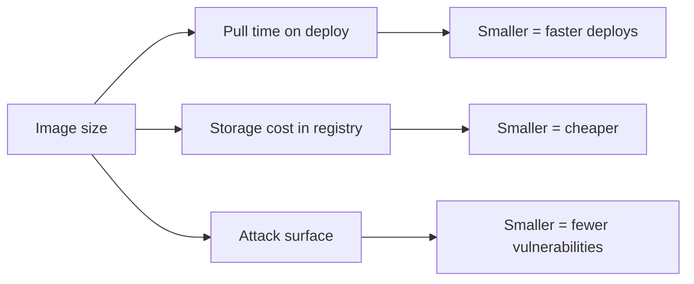
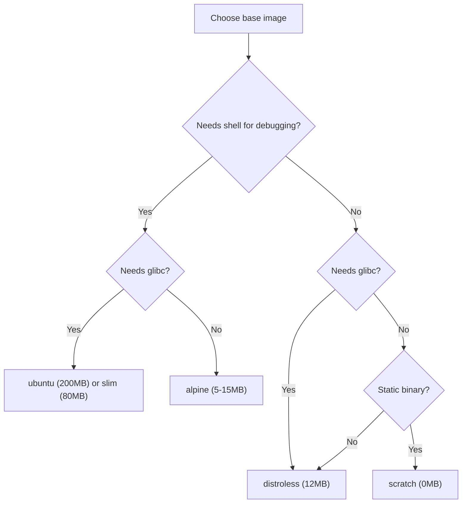
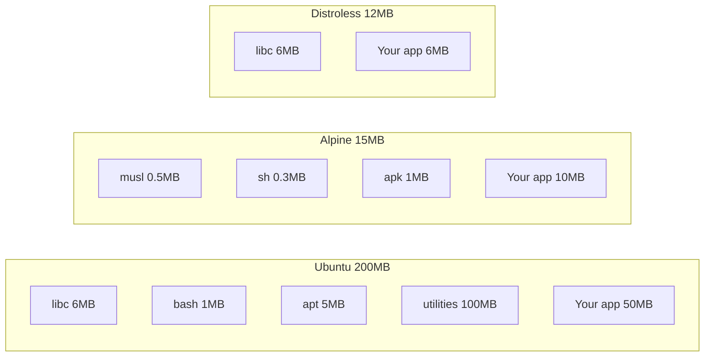
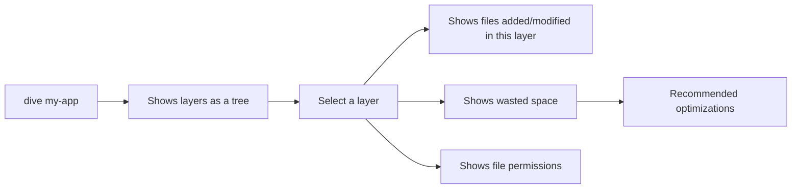

# Debug Image Size and Build Performance

> [!summary] Goal
> Make images smaller and builds faster: compare base image sizes, use multi-stage and distroless, analyze layer sizes, and optimize build performance.

## Table of Contents

1. [Why Image Size Matters](#why-image-size-matters)
2. [Base Image Size Comparison](#base-image-size-comparison)
3. [Using Distroless and Scratch](#using-distroless-and-scratch)
4. [Analyzing Layers with `docker history`](#analyzing-layers-with-docker-history)
5. [Analyzing Layers with `dive`](#analyzing-layers-with-dive)
6. [Optimizing Build Performance](#optimizing-build-performance)
7. [Pitfalls](#pitfalls)

---

## Why Image Size Matters

Smaller images mean faster pulls, lower storage costs, and smaller attack surface.



---

## Base Image Size Comparison

| Base image | Size | Libc | Shell | When to use |
|------------|------|------|-------|-------------|
| `ubuntu:24.04` | ~200 MB | glibc | ✅ bash | Full OS, apt packages needed |
| `debian:bookworm-slim` | ~80 MB | glibc | ✅ bash | Slim Debian with common libs |
| `node:20` | ~350 MB | glibc | ✅ bash | Full Node.js with build tools |
| `node:20-slim` | ~80 MB | glibc | ✅ bash | Minimal Node.js |
| `node:20-alpine` | ~7 MB | musl | ✅ sh | Small Node.js (most common) |
| `python:3.12-alpine` | ~15 MB | musl | ✅ sh | Small Python |
| `gcr.io/distroless/nodejs20` | ~12 MB | glibc | ❌ None | Maximum security, no shell |
| `gcr.io/distroless/java21` | ~12 MB | glibc | ❌ None | Java runtime only |
| `scratch` | 0 MB | none | ❌ None | Static binaries (Go, Rust) |



---

## Using Distroless and Scratch

### Distroless — runtime only, no package manager, no shell

```dockerfile
# Build stage
FROM node:20-alpine AS build
WORKDIR /app
COPY package*.json ./
RUN npm ci --only=production
COPY . .
RUN npm run build

# Runtime — distroless (no shell, no apt, no npm)
FROM gcr.io/distroless/nodejs20-debian12
WORKDIR /app
COPY --from=build /app/dist ./dist
COPY --from=build /app/node_modules ./node_modules
EXPOSE 3000
CMD ["dist/main.js"]
```

### Scratch — completely empty, for static binaries

```dockerfile
# Build stage
FROM golang:1.22-alpine AS build
RUN CGO_ENABLED=0 go build -o server .

# Runtime — nothing at all
FROM scratch
COPY --from=build /go/server /server
EXPOSE 8080
CMD ["/server"]
```

### Distroless vs Alpine vs Ubuntu



---

## Analyzing Layers with `docker history`

```bash
docker history my-app
# IMAGE          CREATED       CREATED BY                            SIZE
# abc123def      2 min ago     CMD ["node" "dist/main.js"]           0B
# bcd234ef      2 min ago     EXPOSE 3000                           0B
# cde345fg      2 min ago     RUN /bin/sh -c npm run build           45MB
# def456fg      3 min ago     COPY . .                               2.1MB
# efg567gh      3 min ago     RUN /bin/sh -c npm ci --production     180MB
# fgh678hi      3 min ago     COPY package*.json .                   50kB
# ghi789ij      3 min ago     WORKDIR /app                           0B
# hij890jk      4 min ago     FROM node:20-alpine                    7MB
```

```bash
# Formatted output
docker history --no-trunc --format '{{.Size}}\t{{.CreatedBy}}' my-app
```

---

## Analyzing Layers with `dive`

`dive` is a CLI tool for exploring Docker image layers:

```bash
# Install
brew install dive

# Analyze image
dive my-app:latest
```



### What dive tells you

- Which layers add the most size
- Whether files are deleted in later layers (wasted space)
- Whether permissions can be reduced

---

## Optimizing Build Performance

```bash
# Enable BuildKit (default since Docker Desktop 4.x)
export DOCKER_BUILDKIT=1
export COMPOSE_DOCKER_CLI_BUILD=1
```

| Technique | Impact | How |
|-----------|--------|-----|
| BuildKit cache mounts | ⚡ Significant | `RUN --mount=type=cache,target=/root/.npm npm ci` |
| Cache from registry | ⚡ Significant | `docker build --cache-from registry/image:cache` |
| `.dockerignore` | 🟢 Moderate | Excludes unnecessary files from build context |
| Order by change frequency | 🟢 Moderate | Lockfile → dependencies → source → build |
| Combine `RUN` commands | 🟢 Moderate | One layer instead of several for related commands |

### Benchmarking build performance

```bash
time docker build -t my-app .            # Measure build time
docker build --no-cache -t my-app .      # Compare with full rebuild
```

---

## Pitfalls

### Not removing apt lists in the same layer

```bash
RUN apt-get update && apt-get install -y curl
# The apt lists are in this layer — ~20MB
RUN rm -rf /var/lib/apt/lists/*
# Removing in a DIFFERENT layer doesn't recover the space!
```

**Fix**: Cleanup in the same `RUN`.

### Using `ubuntu` when `alpine` or `distroless` would work

A Node.js app from `ubuntu:24.04` is ~200MB. From `node:20-alpine`: ~7MB base.

**Fix**: Start with the smallest base that meets your libc and tool requirements.

### Not analyzing wasted space

Adding files in one layer and deleting them in a later layer wastes space in the final image.

**Fix**: Use `dive` to identify wasted space. Don't copy files you'll delete later.

---

> [!question]- Interview Questions
>
> **Q: What is the smallest base image you can use?**
> A: `scratch` (0 bytes) — only works for statically compiled binaries (Go, Rust). `distroless` (~12MB) is the smallest for interpreted languages.
>
> **Q: How do `docker history` and `dive` help with image optimization?**
> A: `docker history` shows layer sizes so you can identify which layers add the most. `dive` provides a visual file-tree view showing files added per layer and wasted space.
>
> **Q: What is the most impactful build performance optimization?**
> A: BuildKit cache mounts — `RUN --mount=type=cache,target=/root/.npm npm ci` — caches packages between builds, eliminating re-downloads.

---

## Cross-Links

- [[CICD/Docker/02_Core/01_MultiStage_Builds_and_Caching]] for BuildKit cache mounts
- [[CICD/Docker/02_Core/03_Dockerfile_Best_Practices_and_AntiPatterns]] for ordering and layer minimization
- [[CICD/Docker/02_Core/04_Container_Registries_and_Publishing]] for image push optimization

---

## References

- [dive](https://github.com/wagoodman/dive)
- [Distroless Images](https://github.com/GoogleContainerTools/distroless)
- [BuildKit](https://docs.docker.com/build/buildkit/)
